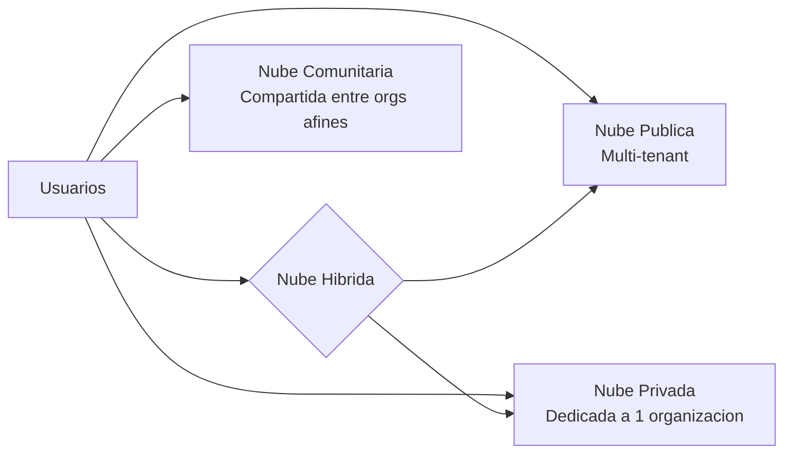
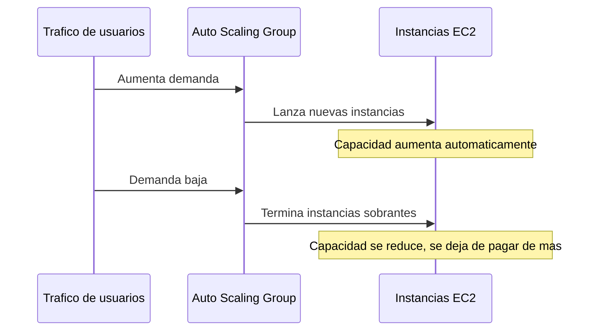
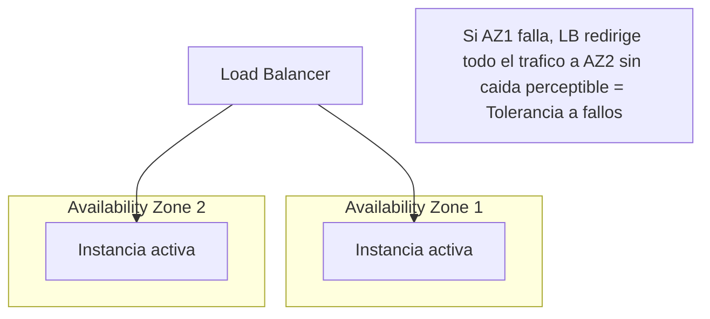

# AWS Certified Cloud Practitioner (CLF-C02)

**PARTE 1 — Introducción al Cloud Computing**

*Capítulo base del curso completo. Léelo antes de tocar la consola de AWS: aquí se sientan los conceptos que después vas a ver aplicados en cada servicio.*

## 1. Objetivos del capítulo

### ¿Qué aprenderé?

- Qué es el cloud computing y cómo llegamos hasta él (historia y virtualización).
- Los cuatro modelos de servicio: IaaS, PaaS, SaaS y FaaS, y cuándo se usa cada uno.
- Los modelos de despliegue: pública, privada, híbrida y comunitaria.
- Los beneficios de negocio del cloud (los 6 que AWS menciona explícitamente en el examen).
- Los conceptos de escalabilidad, elasticidad, alta disponibilidad, tolerancia a fallos y recuperación ante desastres — y cómo diferenciarlos, porque el examen los confunde a propósito.

### ¿Por qué es importante?

Todo el resto del curso (EC2, S3, VPC, IAM...) son implementaciones concretas de estos conceptos. Si entiendes bien qué es 'elasticidad' aquí, vas a entender por qué existe Auto Scaling sin memorizarlo. Este capítulo es la base conceptual sobre la que se apoya absolutamente todo lo demás.

### ¿Cómo aparece en el examen?

El dominio 'Cloud Concepts' representa aproximadamente el 24% del examen CLF-C02 (el porcentaje exacto puede variar ligeramente entre versiones del blueprint oficial; verifica siempre el AWS Certified Cloud Practitioner Exam Guide vigente). Las preguntas rara vez piden una definición directa ('¿qué es SaaS?'); casi siempre presentan un escenario de negocio y piden identificar el concepto correcto. Por eso este capítulo usa casos, no solo definiciones.

## 2. Teoría

### 2.1 Historia breve del Cloud Computing

Antes de la nube, cada empresa que quería tener presencia en internet o correr software interno debía comprar sus propios servidores físicos, instalarlos en un cuarto con aire acondicionado (o pagar a un data center), contratar personal para mantenerlos, y planificar con meses de anticipación cuánta capacidad iba a necesitar. Si calculabas mal, o te quedabas corto (el sitio se caía en un pico de tráfico) o te sobraba capacidad carísima sin usar.

En 2006, Amazon —que ya había construido una infraestructura masiva y elástica para soportar los picos de tráfico de su tienda online (por ejemplo, el Black Friday)— se dio cuenta de que esa misma infraestructura, cuando no estaba al 100% de uso interno, podía alquilarse a terceros. Así nació Amazon Web Services (AWS), comenzando con Amazon S3 (almacenamiento) y EC2 (cómputo). Fue el inicio comercial serio del cloud computing tal como lo conocemos.

> **Analogía:** Antes de la nube, cada casa tenía que construir su propia planta eléctrica para tener luz. El cloud computing es como conectarse a la red eléctrica pública: pagas por lo que consumes, no te preocupas por mantener la planta, y puedes consumir más o menos según necesites.

### 2.2 Virtualización: la tecnología que lo hizo posible

La virtualización es la técnica que permite dividir un servidor físico potente en varias 'máquinas virtuales' (VMs) independientes, cada una con su propio sistema operativo, como si fueran servidores separados. Esto lo logra un software llamado hipervisor (por ejemplo, el Nitro Hypervisor de AWS), que se sienta entre el hardware físico y las máquinas virtuales, asignando y aislando recursos de CPU, memoria, disco y red para cada una.

Sin virtualización, un proveedor de nube tendría que darte un servidor físico completo cada vez que quisieras 'una instancia', lo cual sería carísimo e ineficiente. Con virtualización, un mismo servidor físico puede alojar decenas de clientes distintos, cada uno creyendo que tiene 'su propio servidor', sin poder ver ni acceder a los datos de los demás (aislamiento).

> **Ventaja clave:** La virtualización es lo que permite el modelo multi-tenant (múltiples clientes compartiendo hardware físico de forma segura y aislada), y es la base económica que hace posible el pago por uso.

### 2.3 Modelos de servicio: IaaS, PaaS, SaaS y FaaS

Estos cuatro modelos describen 'cuánto administra el proveedor de la nube' vs 'cuánto administras tú'. Es una de las preguntas más recurrentes del examen, así que vale la pena entenderla con una analogía antes de ver las definiciones técnicas.

> **Analogía de la pizza:** IaaS es como comprar los ingredientes crudos y usar tu propio horno (tú controlas todo, pero también haces todo el trabajo). PaaS es como comprar una pizza congelada y hornearla tú mismo (el trabajo difícil ya está hecho, tú solo la 'terminas'). SaaS es pedir la pizza a domicilio (llega lista, no haces nada). On-premises tradicional sería literalmente tener tu propia granja, molino y horno de leña.

#### IaaS — Infrastructure as a Service

El proveedor entrega la infraestructura básica: servidores virtuales, almacenamiento, redes. Tú instalas y administras el sistema operativo, el runtime, y todo el software encima. Ejemplo en AWS: EC2. Ejemplo real: una empresa que migra sus servidores Windows Server a EC2 tal cual los tenía on-premises, manteniendo el mismo control que tenía antes.

#### PaaS — Platform as a Service

El proveedor administra la infraestructura Y la plataforma de ejecución (sistema operativo, parches, runtime de lenguaje). Tú solo subes tu código. Ejemplo en AWS: Elastic Beanstalk. Ejemplo real: un equipo de desarrollo que sube su aplicación Java a Beanstalk sin preocuparse de qué versión de Linux corre por debajo.

#### SaaS — Software as a Service

El proveedor entrega una aplicación completa, funcional, accesible normalmente desde el navegador. No administras nada de infraestructura ni de código. Ejemplos: Gmail, Salesforce, Microsoft 365, Amazon Chime, Amazon Connect (visto como SaaS desde la perspectiva del usuario final).

#### FaaS — Function as a Service (Serverless)

Subes solo una función (un bloque de código) que se ejecuta en respuesta a un evento (por ejemplo, un archivo subido a S3, una petición HTTP). No hay servidor visible para ti, ni siquiera de forma indirecta: el proveedor lo crea, ejecuta tu código y lo destruye automáticamente. Pagas por invocación y tiempo de ejecución, no por tiempo del servidor encendido. Ejemplo en AWS: Lambda.

| Modelo | ¿Quién administra el SO? | ¿Quién administra el código? | Ejemplo AWS | Caso de uso típico |
| --- | --- | --- | --- | --- |
| IaaS | Cliente | Cliente | EC2 | Migrar servidores tal cual (lift-and-shift) |
| PaaS | Proveedor | Cliente | Elastic Beanstalk | Desplegar apps rápido sin gestionar servidores |
| SaaS | Proveedor | Proveedor | Amazon Chime | Usar software ya terminado |
| FaaS | Proveedor | Cliente (solo función) | Lambda | Procesar eventos puntuales sin servidor fijo |

### 2.4 Modelos de despliegue

Además de 'cuánto administra el proveedor', existe otra dimensión: 'dónde vive la infraestructura y quién la comparte'.

- Nube pública: infraestructura compartida (multi-tenant) entre múltiples clientes, propiedad y operada por el proveedor (AWS, Azure, GCP). Es el modelo más común y el que domina el examen CLF-C02.
- Nube privada: infraestructura dedicada exclusivamente a una organización, ya sea en su propio data center o gestionada por un tercero. Ofrece más control pero pierde parte de la eficiencia de costos del modelo compartido.
- Nube híbrida: combinación de infraestructura on-premises/privada con nube pública, comunicadas entre sí (ej. VPN o Direct Connect). Común en migraciones graduales o por requisitos regulatorios.
- Nube comunitaria: infraestructura compartida entre varias organizaciones con necesidades comunes (ej. varias agencias gubernamentales con los mismos requisitos de cumplimiento). Aparece poco en el examen pero puede mencionarse como distractor.

### 2.5 Beneficios del Cloud Computing (los 6 pilares de AWS)

AWS enumera de forma consistente estos beneficios en su material oficial, y el examen los cita casi literalmente en varias preguntas:

1. Trade capital expense for variable expense (CAPEX → OPEX): en vez de invertir grandes sumas por adelantado en hardware, pagas solo por lo que usas, como gasto operativo.
2. Beneficiarse de economías de escala masivas: al agregar el uso de miles de clientes, AWS obtiene mejores precios que cualquier empresa individual, y traslada parte de ese ahorro en reducciones de precio recurrentes.
3. Dejar de adivinar la capacidad necesaria: no tienes que sobredimensionar 'por si acaso' ni quedarte corto; escalas según la demanda real.
4. Aumentar la velocidad y agilidad: nuevos recursos de TI están disponibles en minutos, no en semanas, acelerando la experimentación e innovación.
5. Dejar de gastar dinero en mantener data centers: te enfocas en lo que diferencia a tu negocio en vez de en tareas operativas sin valor añadido ('undifferentiated heavy lifting').
6. Ir global en minutos: desplegar tu aplicación en múltiples regiones del mundo para dar baja latencia a usuarios en distintos continentes, algo que on-premises tomaría años y millones de dólares.

### 2.6 Escalabilidad, elasticidad, alta disponibilidad, tolerancia a fallos y DR

Estos cinco términos aparecen juntos constantemente en el examen y suelen confundirse entre sí. Vale la pena fijarlos bien desde ahora:

#### Escalabilidad (Scalability)

Es la capacidad de un sistema de crecer (o reducirse) para manejar más (o menos) carga de trabajo. Puede ser:

- Vertical (scale up): darle más recursos a UN mismo servidor (más CPU, más RAM). Tiene un límite físico y normalmente requiere downtime.
- Horizontal (scale out): añadir MÁS servidores que trabajan en paralelo. Es el enfoque preferido en la nube porque, en teoría, no tiene límite superior y no requiere downtime si está bien diseñado.

#### Elasticidad (Elasticity)

Es escalabilidad + automatismo + reversibilidad. Un sistema elástico no solo puede crecer, sino que lo hace automáticamente según la demanda, y también se reduce automáticamente cuando la demanda baja, para no pagar de más. Ejemplo en AWS: Auto Scaling Groups.

> **Truco para el examen:** Si la pregunta menciona 'automáticamente' y 'según la demanda', casi siempre la respuesta es elasticidad, no solo escalabilidad.

#### Alta disponibilidad (High Availability)

Es diseñar el sistema para minimizar el tiempo de inactividad (downtime), típicamente distribuyendo componentes en múltiples Availability Zones o instancias, de forma que el fallo de una no tumbe el servicio completo. Puede implicar una interrupción breve mientras el tráfico se redirige.

#### Tolerancia a fallos (Fault Tolerance)

Es un nivel más exigente que la alta disponibilidad: el sistema sigue funcionando SIN que el usuario perciba ninguna interrupción, incluso si un componente falla. Requiere redundancia activa (no solo standby) y suele ser más costoso de implementar.

#### Recuperación ante desastres (Disaster Recovery, DR)

Es la estrategia y el conjunto de procesos para restaurar las operaciones después de un evento catastrófico (fallo de una región entera, desastre natural, error humano masivo). A diferencia de HA/fault tolerance, que operan en el día a día, DR se activa ante eventos excepcionales y normalmente involucra una región de AWS distinta a la principal.

| Concepto | Pregunta que responde | ¿Es automático? | ¿Tolera downtime? |
| --- | --- | --- | --- |
| Escalabilidad | ¿Puede el sistema crecer? | No necesariamente | N/A |
| Elasticidad | ¿Crece y decrece solo según demanda? | Sí | N/A |
| Alta disponibilidad | ¿Sigue funcionando si un componente falla? | Sí (con diseño previo) | Downtime mínimo, breve |
| Tolerancia a fallos | ¿El usuario NOTA el fallo? | Sí | Cero downtime perceptible |
| Disaster Recovery | ¿Qué pasa si TODO falla (región completa)? | Depende del plan | Downtime planeado y medido (RTO/RPO) |

## 3. Ejemplos

### Ejemplo empresarial

Una aerolínea tiene un sistema de reservas on-premises desde hace 15 años. Migra el sistema de check-in a EC2 (IaaS) para mantener control total del software legado, pero construye su nueva app móvil de reservas usando Lambda y API Gateway (FaaS), porque el tráfico varía muchísimo entre temporada alta y baja, y no quiere pagar por servidores ociosos en temporada baja.

### Ejemplo de startup

Una startup de dos personas construye su MVP (producto mínimo viable) completo sobre Amazon Lightsail y Elastic Beanstalk (PaaS), porque no tienen equipo de operaciones y necesitan lanzar rápido. Cuando crecen y necesitan más control fino, migran gradualmente componentes críticos a EC2 puro (IaaS).

### Ejemplo personal

Un desarrollador independiente usa Gmail para su correo (SaaS), guarda sus fotos personales en un servicio de backup en la nube (también SaaS desde su perspectiva), pero para su blog personal despliega un servidor EC2 barato (IaaS) porque quiere aprender a administrar Linux.

### Caso real de elasticidad

Durante el Amazon Prime Day, la infraestructura de Amazon.com escala automáticamente para soportar picos de tráfico varias veces superiores al promedio, y luego regresa a su capacidad normal en las horas siguientes, sin que nadie tenga que aprovisionar manualmente esos servidores extra con antelación exacta.

## 4. Diagramas

Los siguientes diagramas están en formato Mermaid. Puedes pegarlos en cualquier visor de Mermaid (por ejemplo mermaid.live) para verlos renderizados, o en Notion/GitHub, que los soportan de forma nativa.

### 4.1 Modelos de servicio — responsabilidad compartida

```mermaid
flowchart TB
    subgraph OnPrem[On-Premises]
        A1[Aplicaciones] --- A2[Datos] --- A3[Runtime] --- A4[Middleware] --- A5[SO] --- A6[Virtualizacion] --- A7[Servidores] --- A8[Almacenamiento] --- A9[Red]
    end
    subgraph IaaS
        B1[Aplicaciones - TU] --- B2[Datos - TU] --- B3[Runtime - TU] --- B4[Middleware - TU] --- B5[SO - TU]
        B6[Virtualizacion - AWS] --- B7[Servidores - AWS] --- B8[Almacenamiento - AWS] --- B9[Red - AWS]
    end
    subgraph PaaS
        C1[Aplicaciones - TU] --- C2[Datos - TU]
        C3[Runtime - AWS] --- C4[Middleware - AWS] --- C5[SO - AWS] --- C6[Resto - AWS]
    end
    subgraph SaaS
        D1[Todo - AWS o Proveedor]
    end
```

### 4.2 Modelos de despliegue

### 4.3 Elasticidad en acción

### 4.4 Alta disponibilidad vs tolerancia a fallos

## 5. Laboratorios

### Laboratorio 1: Crear tu cuenta AWS Free Tier y proteger el usuario root

Costo aproximado: $0 si te mantienes dentro de Free Tier y sigues los pasos de limpieza al final. Requiere tarjeta de crédito/débito para verificación (AWS puede hacer un cargo de verificación reembolsable).

7. Ve a aws.amazon.com y haz clic en 'Create an AWS Account'.
8. Ingresa tu correo electrónico y elige un nombre para la cuenta (ej. 'mi-aprendizaje-aws').
9. Verifica tu correo con el código que AWS te envía.
10. Crea una contraseña segura para el usuario root (guárdala en un gestor de contraseñas, no la reutilices de otro sitio).
11. Completa tus datos de contacto y selecciona 'Personal' como tipo de cuenta (a menos que sea para una empresa real).
12. Ingresa los datos de tu tarjeta para verificación de identidad.
13. Verifica tu número de teléfono mediante SMS o llamada.
14. Selecciona el plan de soporte 'Basic Support - Free'.
15. Una vez dentro de la consola, ve a IAM → Security Credentials → Assign MFA device, y activa MFA en el usuario root usando una app como Google Authenticator o Authy. Este paso NO es opcional: el usuario root tiene control total de la cuenta y es el objetivo número uno de ataques.
> **Cómo evitar costos:** No lances ningún recurso todavía en este laboratorio. Solo estás creando y asegurando la cuenta. AWS Free Tier incluye 12 meses de ciertos servicios gratis (como 750 horas/mes de EC2 t2.micro o t3.micro) más una capa 'siempre gratis' para otros servicios (como Lambda).

### Laboratorio 2: Explorar el AWS Pricing Calculator (sin crear nada)

Costo: $0 — es solo una herramienta de simulación, no crea recursos reales.

16. Ve a calculator.aws.
17. Haz clic en 'Create estimate'.
18. Busca 'Amazon EC2' y añade un servicio de ejemplo (elige una instancia t3.micro, región us-east-1, 730 horas/mes).
19. Observa cómo cambia el costo estimado si cambias el tipo de instancia a uno más grande.
20. Añade también 'Amazon S3' con 10 GB de almacenamiento estándar y observa el costo.
21. Guarda o exporta el estimado (opcional) para comparar más adelante con lo que verás en Cost Explorer una vez tengas recursos reales.
*Este laboratorio no requiere que tengas una cuenta de AWS activa todavía; el Pricing Calculator es público.*

## 6. Errores comunes

- Confundir IaaS con PaaS en el examen: recuerda la regla simple — si el examen menciona que el cliente 'administra el sistema operativo', es IaaS; si dice que el cliente 'solo sube código', es PaaS.
- Pensar que elasticidad y escalabilidad son sinónimos exactos: escalabilidad es la capacidad de crecer; elasticidad es hacerlo automáticamente y también reducirse cuando ya no se necesita.
- Confundir alta disponibilidad con tolerancia a fallos: HA puede tener una breve interrupción; tolerancia a fallos no debería tener ninguna interrupción perceptible.
- Usar el usuario root para el día a día en lugar de crear un usuario IAM (esto se corrige en la Parte 3, pero el hábito de proteger el root empieza desde el laboratorio 1 de este capítulo).
- No activar MFA en el usuario root desde el primer día — es el error de seguridad número uno de principiantes y AWS lo pregunta directa o indirectamente en el examen.
- Olvidar que 'nube comunitaria' existe como opción — algunos estudiantes descartan esta opción de memoria en el examen sin leerla, y a veces es la respuesta correcta o el distractor más cercano.

## 7. Comparaciones

### IaaS vs PaaS vs SaaS vs FaaS

Ver tabla completa en la sección 2.3. La forma más rápida de decidir en el examen: pregúntate '¿qué administra el CLIENTE?'. Si administra SO + runtime + código → IaaS. Si administra solo el código pero no el runtime ni el SO → PaaS. Si no administra nada, solo usa la app → SaaS. Si administra solo una función que corre por eventos, sin servidor visible → FaaS.

### Nube pública vs privada vs híbrida

Pública = compartida, más barata, menos control directo. Privada = dedicada, más control, más cara de mantener. Híbrida = combinación, típica en migraciones graduales o por regulación. En el examen, si el escenario menciona 'algunos datos deben quedarse en el data center por regulación, pero queremos escalar el resto en AWS', la respuesta casi siempre es híbrida.

## 8. Preguntas tipo examen

20 preguntas de opción múltiple, mismo estilo y dificultad que el examen oficial CLF-C02. Cada una incluye la explicación de por qué la respuesta correcta lo es, y por qué las demás no.

**Pregunta 1.** Una startup quiere lanzar una aplicación web sin comprar ni administrar servidores físicos, pagando solo por lo que consume. ¿Qué modelo de cloud computing describe mejor esta necesidad?

A) On-premises con virtualización

B) IaaS tradicional con servidores reservados por años

**C)** **Cloud computing público bajo modelo pay-as-you-go**

D) Un data center privado gestionado por un tercero

**Respuesta correcta: C.** 

*El cloud computing público con pago por uso (pay-as-you-go) elimina la necesidad de comprar hardware y permite pagar solo por los recursos consumidos. On-premises implica comprar servidores propios; un data center privado gestionado sigue siendo infraestructura dedicada con compromisos fijos.*

**Pregunta 2.** Una empresa contrata Gmail para el correo corporativo de sus empleados sin instalar ni mantener ningún servidor. ¿Qué modelo de servicio en la nube representa esto?

A) IaaS

B) PaaS

**C)** **SaaS**

D) FaaS

**Respuesta correcta: C.** 

*SaaS (Software as a Service) entrega una aplicación completa y lista para usar; el cliente no gestiona infraestructura, plataforma ni código. Gmail es el ejemplo clásico de SaaS.*

**Pregunta 3.** Un equipo de desarrollo quiere desplegar su código sin preocuparse por el sistema operativo, parches ni el servidor subyacente, pero sí controla la lógica de la aplicación. ¿Qué modelo encaja mejor?

A) IaaS

**B)** **PaaS**

C) SaaS

D) On-premises

**Respuesta correcta: B.** 

*PaaS (Platform as a Service) provee la plataforma de ejecución (runtime, OS, middleware) y deja al desarrollador enfocarse solo en el código de la aplicación. Ejemplos: AWS Elastic Beanstalk, Heroku.*

**Pregunta 4.** ¿Qué modelo de servicio da al cliente el mayor control sobre el sistema operativo y el software instalado, a cambio de mayor responsabilidad de administración?

A) SaaS

B) PaaS

**C)** **IaaS**

D) FaaS

**Respuesta correcta: C.** 

*IaaS (Infrastructure as a Service) entrega recursos de cómputo, red y almacenamiento en bruto (como EC2); el cliente instala y administra el sistema operativo y todo el software encima.*

**Pregunta 5.** Una empresa ejecuta una función que procesa imágenes solo cuando un usuario sube un archivo, sin mantener ningún servidor corriendo el resto del tiempo. ¿Qué modelo es este?

A) IaaS

B) PaaS

C) SaaS

**D)** **FaaS (serverless)**

**Respuesta correcta: D.** 

*FaaS (Function as a Service), como AWS Lambda, ejecuta código solo en respuesta a eventos y cobra por invocación/tiempo de ejecución, sin servidores que administrar de forma continua.*

**Pregunta 6.** ¿Cuál de las siguientes NO es una característica esencial del cloud computing según la definición estándar (NIST)?

A) Autoservicio bajo demanda

B) Acceso amplio a la red

**C)** **Propiedad exclusiva del hardware por parte del cliente**

D) Elasticidad rápida

**Respuesta correcta: C.** 

*La propiedad del hardware permanece en el proveedor de la nube, no en el cliente. Las características esenciales incluyen autoservicio bajo demanda, acceso amplio a la red, pool de recursos compartidos, elasticidad rápida y servicio medido.*

**Pregunta 7.** Una empresa mantiene datos sensibles en su propio data center pero usa AWS para picos de demanda en época navideña. ¿Qué modelo de despliegue es este?

A) Nube pública

B) Nube privada

**C)** **Nube híbrida**

D) Nube comunitaria

**Respuesta correcta: C.** 

*La nube híbrida combina infraestructura on-premises (privada) con recursos de nube pública, típicamente usada para escalar picos de demanda (cloud bursting) manteniendo datos sensibles internamente.*

**Pregunta 8.** ¿Qué técnica permite ejecutar múltiples máquinas virtuales aisladas sobre un mismo servidor físico?

A) Contenedorización

**B)** **Virtualización**

C) Elasticidad

D) Federación de identidades

**Respuesta correcta: B.** 

*La virtualización usa un hipervisor para dividir un servidor físico en múltiples máquinas virtuales aisladas, cada una con su propio sistema operativo. Es la base tecnológica que hizo posible el cloud computing moderno.*

**Pregunta 9.** Una aplicación en AWS aumenta automáticamente el número de instancias EC2 durante un pico de tráfico y las reduce cuando el tráfico baja. ¿Qué concepto de la nube ilustra esto?

A) Alta disponibilidad

**B)** **Elasticidad**

C) Tolerancia a fallos

D) Recuperación ante desastres

**Respuesta correcta: B.** 

*Elasticidad es la capacidad de escalar recursos automáticamente hacia arriba o hacia abajo según la demanda real, pagando solo por lo que se usa en cada momento.*

**Pregunta 10.** ¿Cuál es la diferencia principal entre escalabilidad y elasticidad?

A) Son sinónimos exactos

**B)** **Escalabilidad es la capacidad del sistema de crecer para soportar más carga; elasticidad es hacerlo automáticamente y de forma reversible según demanda**

C) Elasticidad solo aplica a bases de datos

D) Escalabilidad solo se logra con hardware físico

**Respuesta correcta: B.** 

*La escalabilidad es la propiedad arquitectónica de poder crecer (vertical u horizontalmente). La elasticidad añade la dimensión de automatismo y reversibilidad: el sistema crece y decrece solo, sin intervención manual.*

**Pregunta 11.** Una aplicación crítica está desplegada en dos Availability Zones distintas dentro de la misma región para que si una falla, la otra siga sirviendo tráfico. Esto es un ejemplo de:

A) Recuperación ante desastres

**B)** **Alta disponibilidad**

C) Escalabilidad vertical

D) FaaS

**Respuesta correcta: B.** 

*La alta disponibilidad (High Availability) busca minimizar el tiempo de inactividad distribuyendo la carga entre múltiples zonas o instancias, de forma que el fallo de un componente no derribe todo el sistema.*

**Pregunta 12.** ¿Qué diferencia a la tolerancia a fallos de la alta disponibilidad?

A) No hay diferencia

**B)** **La tolerancia a fallos busca que el sistema siga funcionando SIN degradación perceptible ante el fallo de un componente; la alta disponibilidad minimiza el downtime pero puede tolerar una breve degradación**

C) La tolerancia a fallos solo aplica a redes

D) La alta disponibilidad requiere múltiples regiones obligatoriamente

**Respuesta correcta: B.** 

*La tolerancia a fallos (fault tolerance) es un nivel más estricto: el sistema absorbe el fallo sin que el usuario note interrupción. La alta disponibilidad reduce el downtime pero puede implicar segundos de reconexión.*

**Pregunta 13.** Una empresa replica su infraestructura crítica en una región de AWS distinta a la principal, con capacidad de activarla en minutos si la región principal falla por completo. Esto describe:

A) Elasticidad

**B)** **Recuperación ante desastres (Disaster Recovery)**

C) Virtualización

D) PaaS

**Respuesta correcta: B.** 

*La recuperación ante desastres (DR) es la estrategia y los procesos para restaurar operaciones tras un evento catastrófico (fallo de región completa, desastre natural, etc.), típicamente usando una región secundaria.*

**Pregunta 14.** ¿Cuál de los siguientes es un beneficio típico del cloud computing frente a infraestructura on-premises?

A) Eliminación total de cualquier responsabilidad de seguridad para el cliente

**B)** **Conversión de CAPEX (gasto de capital) en OPEX (gasto operativo)**

C) Garantía de cero downtime en todos los casos

D) Imposibilidad de sufrir sobrecostos

**Respuesta correcta: B.** 

*Uno de los beneficios más citados por AWS es transformar gasto de capital (comprar servidores por adelantado) en gasto operativo (pagar por uso), mejorando el flujo de caja y reduciendo el riesgo de sobreaprovisionar.*

**Pregunta 15.** Una empresa pequeña sin equipo de TI grande decide migrar a la nube principalmente porque no quiere encargarse de reemplazar hardware ni parchear sistemas operativos de forma manual. ¿Qué beneficio del cloud busca principalmente?

A) Velocidad de despliegue global

**B)** **Reducción de la carga operativa (menos 'undifferentiated heavy lifting')**

C) Elasticidad de red

D) Federación de identidades

**Respuesta correcta: B.** 

*AWS llama a esto 'undifferentiated heavy lifting': tareas operativas necesarias pero que no aportan ventaja competitiva (mantenimiento de hardware, parches). La nube libera al cliente de esa carga.*

**Pregunta 16.** ¿Qué modelo de despliegue de nube es utilizado exclusivamente por una sola organización, ya sea gestionado internamente o por un tercero?

A) Nube pública

**B)** **Nube privada**

C) Nube híbrida

D) Multi-cloud

**Respuesta correcta: B.** 

*La nube privada está dedicada a una sola organización, a diferencia de la nube pública donde la infraestructura es compartida (multi-tenant) entre múltiples clientes.*

**Pregunta 17.** En el examen CLF-C02, una pregunta describe una empresa que necesita capacidad de cómputo solo durante 3 horas al día para procesar reportes nocturnos, y quiere minimizar costos. ¿Qué característica del cloud es más relevante para resolver este caso?

A) Alta disponibilidad

**B)** **Elasticidad y modelo de pago por uso**

C) Tolerancia a fallos

D) Nube comunitaria

**Respuesta correcta: B.** 

*Poder encender recursos solo cuando se necesitan y pagar únicamente por ese tiempo es la esencia de la elasticidad combinada con el modelo pay-as-you-go, ideal para cargas de trabajo intermitentes.*

**Pregunta 18.** ¿Cuál de estas opciones describe mejor la 'agilidad' como beneficio del cloud computing?

**A)** **La capacidad de aprovisionar recursos de TI en minutos en lugar de semanas o meses**

B) La velocidad de la red interna de AWS

C) La cantidad de regiones disponibles

D) El número de Availability Zones por región

**Respuesta correcta: A.** 

*Agilidad se refiere a la rapidez con la que se pueden aprovisionar nuevos recursos: en la nube, lanzar un servidor toma minutos, mientras que comprar e instalar hardware físico puede tomar semanas.*

**Pregunta 19.** Una empresa global despliega su aplicación en varias regiones de AWS para que los usuarios de cada continente tengan baja latencia. ¿Qué beneficio del cloud está aprovechando principalmente?

A) Elasticidad

**B)** **Alcance global (Go Global in Minutes)**

C) Tolerancia a fallos exclusivamente

D) PaaS

**Respuesta correcta: B.** 

*La infraestructura global de AWS permite desplegar aplicaciones cerca de los usuarios finales en minutos, reduciendo la latencia sin necesidad de construir data centers propios en cada continente.*

**Pregunta 20.** Un examinador pregunta cuál es la MEJOR razón para que una empresa adopte un modelo de nube híbrida en lugar de ir 100% a la nube pública de inmediato. ¿Cuál es la respuesta más alineada con el enfoque de AWS?

A) Porque la nube pública siempre es más cara

**B)** **Porque permite una migración gradual manteniendo cargas de trabajo con requisitos regulatorios o de latencia específicos on-premises mientras se migra el resto**

C) Porque AWS no ofrece suficiente capacidad

D) Porque la nube híbrida elimina la necesidad de IAM

**Respuesta correcta: B.** 

*AWS reconoce que muchas organizaciones migran de forma gradual: la nube híbrida permite mover cargas de trabajo de forma incremental mientras se conservan sistemas legados o con restricciones regulatorias localmente.*

## 9. Resumen

### Resumen ejecutivo

El cloud computing reemplaza la compra de hardware físico por el consumo de recursos bajo demanda, pagando solo por lo que se usa. La virtualización es la tecnología que lo hace posible. Existen cuatro modelos de servicio (IaaS, PaaS, SaaS, FaaS) que se diferencian por cuánto administra el cliente vs el proveedor, y cuatro modelos de despliegue (pública, privada, híbrida, comunitaria) que se diferencian por quién comparte la infraestructura. Los beneficios clave incluyen convertir CAPEX en OPEX, economías de escala, agilidad y alcance global. Finalmente, escalabilidad, elasticidad, alta disponibilidad, tolerancia a fallos y recuperación ante desastres son cinco conceptos relacionados pero distintos que describen cómo un sistema responde al crecimiento y a los fallos.

### Conceptos clave (memorizar)

- **IaaS = tú administras SO y arriba. PaaS = tú administras solo código. SaaS = no administras nada. FaaS = administras solo una función.**
- **Elasticidad = escalabilidad + automatismo + reversibilidad.**
- **Tolerancia a fallos > Alta disponibilidad en exigencia (cero downtime perceptible vs downtime mínimo).**
- **CAPEX → OPEX es el beneficio de negocio más citado por AWS.**
- **DR se activa ante desastres (región completa caída); HA/fault tolerance operan en el día a día.**

### Lo que normalmente pregunta AWS

Escenarios de negocio donde debes identificar el modelo de servicio o despliegue correcto, o distinguir entre elasticidad/escalabilidad/HA/fault tolerance/DR a partir de una descripción, sin que el examen use nunca el término técnico directamente.

## Recursos externos para este capítulo

### Documentación oficial

- AWS Overview of Amazon Web Services (whitepaper) — aws.amazon.com/whitepapers
- AWS Cloud Practitioner Essentials — AWS Skill Builder (curso gratuito oficial)
- AWS Well-Architected — Cloud Concepts (aws.amazon.com/architecture)
- AWS Free Tier — aws.amazon.com/free
- AWS Pricing Calculator — calculator.aws

### Videos recomendados

- AWS Skill Builder: 'AWS Cloud Practitioner Essentials' (oficial, inglés/español según región).
- Andrew Brown / freeCodeCamp: curso completo CLF-C02 en YouTube (inglés, muy usado por principiantes hispanohablantes con subtítulos).
- Stephane Maarek: curso de Udemy CLF-C02 (inglés, referencia de la industria, muy actualizado).

### Libros

- 'AWS Certified Cloud Practitioner Study Guide' (Sybex) — nivel principiante-intermedio, buena referencia de examen.

### Laboratorios adicionales

- AWS Skill Builder Labs — laboratorios guiados gratuitos y de pago dentro de la plataforma oficial.
- AWS Cloud Quest: Cloud Practitioner — plataforma gamificada oficial de AWS.