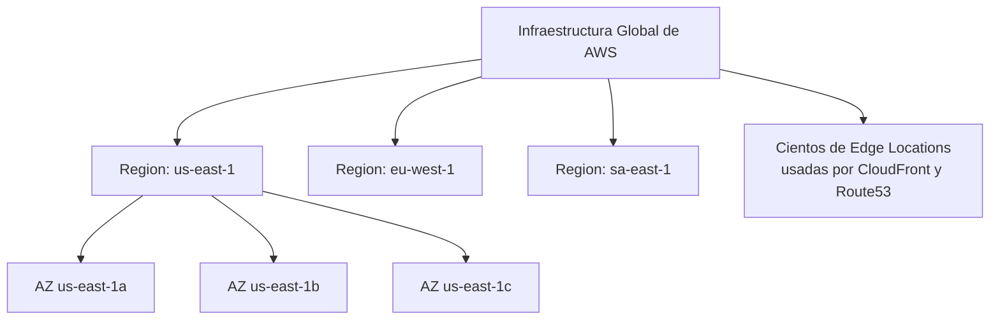
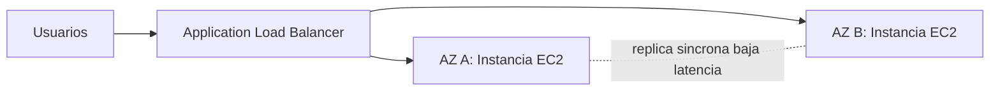
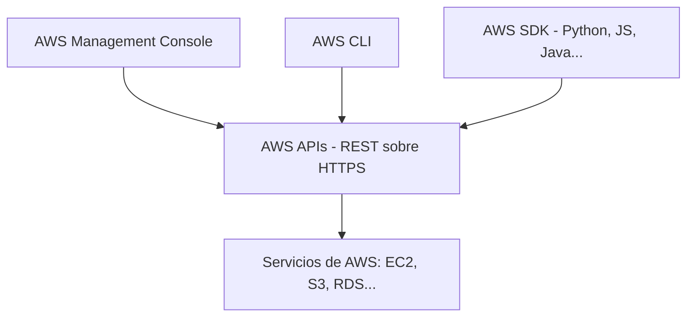
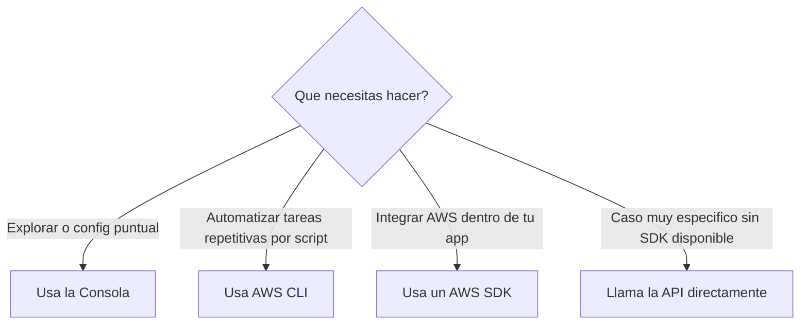

# AWS Certified Cloud Practitioner (CLF-C02)

**PARTE 2 — Introducción a AWS**

*En este capítulo pasamos del concepto general de 'la nube' al proveedor específico: cómo está construida físicamente la infraestructura de AWS alrededor del mundo, y las distintas formas en que puedes interactuar con ella.*

## 1. Objetivos del capítulo

### ¿Qué aprenderé?

- La historia y evolución de AWS como proveedor de nube.
- Cómo se organiza la infraestructura física global de AWS: Regiones, Availability Zones y Edge Locations.
- Cómo elegir la Región correcta para una carga de trabajo según latencia, cumplimiento, servicios disponibles y costo.
- Las cuatro formas de interactuar con AWS: Consola, CLI, SDK y APIs — y cuándo usar cada una.

### ¿Por qué es importante?

Casi cualquier servicio de AWS que estudies después (EC2, S3, RDS, VPC...) se despliega DENTRO de una Región y, casi siempre, dentro de una o varias Availability Zones específicas. Si no entiendes esta jerarquía geográfica, te vas a confundir constantemente al diseñar arquitecturas de alta disponibilidad, y el examen lo explota con frecuencia.

### ¿Cómo aparece en el examen?

Este contenido forma parte del dominio 'Cloud Concepts' y también aparece transversalmente en preguntas de otros dominios cuando el escenario menciona explícitamente una Región o una AZ. Es común encontrar preguntas que mencionan 'us-east-1' o 'dos AZ distintas' como parte del escenario, esperando que reconozcas la implicación de diseño (alta disponibilidad, cumplimiento, latencia) sin que se pregunte directamente por la definición.

## 2. Teoría

### 2.1 Breve historia de AWS

AWS se lanzó públicamente en 2006, comenzando con Amazon S3 (almacenamiento de objetos) y Amazon EC2 (cómputo bajo demanda). Desde entonces ha crecido hasta ofrecer varios cientos de servicios distintos, desde cómputo y almacenamiento básicos hasta inteligencia artificial, quantum computing y servicios espaciales. AWS es consistentemente reconocido como el proveedor de nube pública con mayor cuota de mercado a nivel mundial, seguido por Microsoft Azure y Google Cloud Platform.

Para el examen no necesitas memorizar fechas exactas de lanzamiento de cada servicio, pero sí es útil saber que EC2 y S3 fueron los servicios fundacionales, y que la filosofía de AWS desde el inicio ha sido 'construir los bloques básicos (primitives) y dejar que los clientes los combinen', en vez de ofrecer soluciones cerradas.

### 2.2 La infraestructura global de AWS: la jerarquía completa

La infraestructura física de AWS se organiza en tres niveles, de mayor a menor tamaño geográfico: Regiones → Availability Zones → Edge Locations (estas últimas no están 'dentro' de las AZ, sino distribuidas de forma independiente y mucho más numerosa).

#### Regiones (Regions)

Una Región es un área geográfica separada y completamente independiente del resto (por ejemplo, us-east-1 en Norte de Virginia, eu-west-1 en Irlanda, sa-east-1 en São Paulo). Cada Región es un clúster completo de data centers, con su propia infraestructura de energía, redes y refrigeración, diseñada para no depender de ninguna otra Región. Esto es clave para el cumplimiento normativo: los datos no cruzan de una Región a otra a menos que el cliente lo configure explícitamente (por ejemplo, con replicación entre regiones de S3).

> **Dato clave para el examen:** No todos los servicios de AWS están disponibles en todas las Regiones. Los servicios más nuevos suelen lanzarse primero en unas pocas Regiones (típicamente us-east-1) y expandirse después. Siempre verifica la 'AWS Region Table' oficial si la disponibilidad regional es relevante para un caso real.

#### Availability Zones (AZ)

Cada Región está compuesta por múltiples Availability Zones — normalmente 3 o más. Cada AZ es, en la práctica, uno o más data centers discretos con alimentación eléctrica, refrigeración y conectividad de red física y lógicamente separadas de las demás AZ de la misma Región, pero conectadas entre sí mediante enlaces de fibra privados de muy baja latencia (menos de 2 milisegundos típicamente). Esto permite replicar datos de forma síncrona entre AZ sin penalizar mucho el rendimiento, algo que sería inviable entre Regiones distintas por la distancia.

Las AZ dentro de una Región se identifican con una letra al final del código de Región (ej. us-east-1a, us-east-1b, us-east-1c). Un detalle importante: el mapeo de estas letras a los data centers físicos reales puede variar entre distintas cuentas de AWS, precisamente para distribuir la carga entre AZ de forma más pareja a nivel de toda la plataforma.

#### Edge Locations y Local Zones

Las Edge Locations son puntos de presencia mucho más pequeños y mucho más numerosos que las Regiones, distribuidos en cientos de ciudades del mundo. No están diseñadas para correr cargas de cómputo generales (no puedes lanzar un EC2 'en' una Edge Location); su propósito es cachear contenido y reducir la latencia de red, y son usadas principalmente por Amazon CloudFront (CDN) y Amazon Route 53 (DNS).

AWS Local Zones son un concepto más reciente: extienden un subconjunto de servicios de AWS (cómputo, almacenamiento) más cerca de grandes áreas metropolitanas específicas que no tienen una Región completa cerca, para casos de uso que requieren latencia de un solo dígito de milisegundos, como renderizado en vivo, simulación en tiempo real o gaming.

| Nivel | Tamaño / cantidad | ¿Se pueden correr instancias EC2? | Propósito principal |
| --- | --- | --- | --- |
| Región | Decenas en el mundo | Sí | Aislamiento geográfico completo, cumplimiento normativo |
| Availability Zone | Varias por Región (típ. 3+) | Sí | Alta disponibilidad dentro de una Región |
| Edge Location | Cientos en el mundo | No (uso indirecto vía CloudFront/Route53) | Cacheo de contenido, baja latencia de entrega |
| Local Zone | Decenas, en ciudades específicas | Sí (subconjunto de servicios) | Latencia ultra baja cerca de grandes ciudades |

### 2.3 Cómo elegir la Región correcta

AWS resume la decisión de en qué Región desplegar una carga de trabajo en cuatro criterios principales:

1. Cumplimiento y soberanía de datos (Compliance): algunas industrias o países exigen por ley que ciertos datos permanezcan dentro de una jurisdicción específica.
2. Proximidad / latencia: elegir la Región más cercana a la mayoría de tus usuarios reduce el tiempo de respuesta percibido.
3. Disponibilidad de servicios y características: no todas las Regiones tienen todos los servicios o todas las funcionalidades más nuevas disponibles al mismo tiempo.
4. Precio: el costo de los mismos recursos (ej. una instancia EC2 idéntica) puede variar entre Regiones debido a diferencias en costos operativos locales.

### 2.4 Formas de interactuar con AWS

Todo en AWS, en su nivel más fundamental, funciona a través de llamadas a APIs REST sobre HTTPS, autenticadas con firmas criptográficas (AWS Signature Version 4). Sobre esa base existen tres capas de acceso pensadas para distintos tipos de usuario y caso de uso:

#### AWS Management Console

La interfaz web gráfica. Ideal para aprender, explorar servicios nuevos, hacer configuraciones puntuales o poco frecuentes, y para usuarios sin experiencia en línea de comandos. Es también donde se ve más claramente el estado y la relación entre recursos, gracias a su interfaz visual.

#### AWS CLI (Command Line Interface)

Una herramienta que se instala en tu terminal y permite ejecutar comandos como 'aws s3 ls' o 'aws ec2 run-instances' para interactuar con cualquier servicio de AWS. Es la herramienta preferida para automatización simple, scripts de administración y tareas repetitivas que no ameritan escribir una aplicación completa.

#### AWS SDK (Software Development Kit)

Bibliotecas de código específicas para distintos lenguajes de programación (Python/Boto3, JavaScript, Java, .NET, Go, etc.) que permiten llamar a los servicios de AWS directamente desde dentro de una aplicación. Es la elección correcta cuando necesitas que tu propio software interactúe con AWS de forma nativa, no solo ejecutar comandos manuales.

#### APIs de AWS

La capa más fundamental: peticiones HTTPS directas a los endpoints de servicio de AWS. Consola, CLI y SDK son, en el fondo, clientes que hacen estas mismas llamadas por ti. Rara vez llamarás a las APIs 'a mano' salvo en integraciones muy específicas, pero entender que existen ayuda a comprender por qué todas las demás herramientas se comportan de forma consistente entre sí.

| Herramienta | ¿Quién la usa típicamente? | Mejor para... | Requiere instalación |
| --- | --- | --- | --- |
| Consola | Principiantes, administradores, exploración visual | Tareas puntuales, aprendizaje, revisar el estado de recursos | No (navegador) |
| CLI | Administradores de sistemas, DevOps | Scripts, automatización simple, tareas repetitivas | Sí |
| SDK | Desarrolladores de software | Integrar AWS dentro de una aplicación propia | Sí (librería del lenguaje) |
| API | Sistemas avanzados, integraciones a medida | Casos donde ningún SDK existente encaja | No, pero requiere firmar peticiones manualmente |

## 3. Ejemplos

### Ejemplo empresarial

Un banco europeo despliega toda su infraestructura crítica en la Región eu-central-1 (Frankfurt) para cumplir con regulaciones de residencia de datos de la Unión Europea, y replica dentro de esa misma Región entre tres Availability Zones distintas para lograr alta disponibilidad sin violar el requisito de que los datos no salgan del territorio de la UE.

### Ejemplo de startup

Una startup que apenas está lanzando su producto elige us-east-1 (Norte de Virginia) porque suele ser la Región con más servicios disponibles primero y, frecuentemente, más económica, aunque sus fundadores estén en otro continente — priorizan velocidad de lanzamiento y variedad de servicios sobre latencia mínima en esta etapa inicial.

### Ejemplo personal

Un desarrollador que está aprendiendo AWS usa la Management Console durante sus primeras semanas para 'ver' cómo se relacionan los recursos visualmente (una VPC, sus subnets, sus instancias EC2), y solo después de sentirse cómodo empieza a automatizar esas mismas tareas con AWS CLI dentro de scripts bash.

### Caso real de Edge Locations

Una plataforma de e-commerce global usa Amazon CloudFront para servir imágenes de productos desde la Edge Location más cercana a cada comprador (por ejemplo, un comprador en México recibe el contenido desde una Edge Location en México o cerca, no desde el servidor origen que podría estar en Virginia), reduciendo drásticamente los tiempos de carga de página.

## 4. Diagramas

Diagramas en formato Mermaid — pégalos en mermaid.live o cualquier visor compatible para verlos renderizados.

### 4.1 Jerarquía de la infraestructura global de AWS



### 4.2 Alta disponibilidad usando múltiples AZ



### 4.3 Las cuatro formas de acceder a AWS



### 4.4 Flujo de decisión: qué herramienta usar



## 5. Laboratorios

### Laboratorio 1: Explorar Regiones y Availability Zones desde la consola

Costo: $0 — solo exploración, no se crea ningún recurso facturable.

5. Inicia sesión en la AWS Management Console con tu usuario IAM (si aún usas root, revisa primero el laboratorio de la Parte 1).
6. En la esquina superior derecha, haz clic en el selector de Región y observa la lista completa de Regiones disponibles para tu cuenta.
7. Cambia a 'US East (N. Virginia) us-east-1'.
8. Ve al servicio EC2 y, en el dashboard, busca la sección 'Availability Zones' o revisa el selector de subred al intentar lanzar una instancia (sin lanzarla) para ver cuántas AZ tiene esa Región (ej. us-east-1a, us-east-1b, us-east-1c...).
9. Cambia ahora a otra Región, por ejemplo 'South America (São Paulo) sa-east-1', y repite el paso anterior. Compara cuántas AZ tiene esta Región frente a us-east-1.
10. Ve a 'AWS Region Table' (búscalo en el navegador: 'AWS global infrastructure regions') y verifica qué servicios NO están disponibles en la Región sa-east-1 comparado con us-east-1.
> **Nota:** No lances ninguna instancia EC2 todavía en este laboratorio — solo estamos observando la infraestructura disponible, sin generar cargos.

### Laboratorio 2: Instalar y configurar AWS CLI

Costo: $0 — instalar y configurar el CLI no genera cargos; los cargos vendrían de los recursos que crees después con él.

11. Descarga el instalador de AWS CLI v2 desde la documentación oficial (aws.amazon.com/cli) para tu sistema operativo (Windows, macOS o Linux).
12. Instala siguiendo el asistente (en macOS/Linux también puedes usar el paquete .pkg o los comandos curl+installer indicados en la documentación oficial).
13. Verifica la instalación ejecutando en tu terminal: aws --version
14. En la consola de AWS, ve a IAM → Users → tu usuario → Security credentials → Create access key. Elige el caso de uso 'Command Line Interface (CLI)' y confirma que entiendes que debes guardar esa clave de forma segura (no la subas nunca a un repositorio de código).
15. En tu terminal, ejecuta: aws configure
16. Ingresa el Access Key ID, el Secret Access Key, la Región por defecto (ej. us-east-1) y el formato de salida (ej. json).
17. Prueba que funciona ejecutando: aws sts get-caller-identity — deberías ver tu Account ID, tu ARN de usuario y tu User ID.
18. Prueba un comando de solo lectura: aws s3 ls (puede aparecer vacío si aún no tienes buckets, eso es normal).
```bash
aws configure
AWS Access Key ID [None]: AKIA...
AWS Secret Access Key [None]: ****************
Default region name [None]: us-east-1
Default output format [None]: json
```

> **Cómo evitar costos:** Este laboratorio no crea ningún recurso facturable. Solo asegúrate de eliminar la access key desde IAM si dejas de usarla, como buena práctica de seguridad (no de costos).

## 6. Errores comunes

- Confundir Región con Availability Zone: una Región contiene varias AZ, no son el mismo nivel de la jerarquía.
- Asumir que todos los servicios de AWS están disponibles en todas las Regiones por igual — siempre hay que verificar la disponibilidad regional para servicios nuevos o poco comunes.
- Pensar que las Edge Locations sirven para lanzar instancias EC2 — no es así; son para cacheo de contenido vía CloudFront/Route53, no cómputo general.
- Diseñar una arquitectura 'de alta disponibilidad' usando una sola Availability Zone — sin al menos dos AZ, no hay verdadera redundancia ante fallos físicos.
- Subir el Access Key y Secret Access Key del CLI a un repositorio público de código (GitHub) — es uno de los errores de seguridad más comunes y costosos en el mundo real; siempre usa variables de entorno, AWS Secrets Manager, o roles IAM en vez de hardcodear credenciales.
- Usar siempre la consola incluso para tareas repetitivas que deberían automatizarse con CLI o SDK, perdiendo tiempo y consistencia.

## 7. Comparaciones

### Región vs Availability Zone vs Edge Location

Ver la tabla de la sección 2.2. La forma más rápida de recordarlo: Región = país/área geográfica grande y aislada; AZ = data center(s) dentro de esa Región, para redundancia local; Edge Location = punto de entrega de contenido cercano al usuario, mucho más numeroso pero mucho más limitado en funcionalidad.

### Consola vs CLI vs SDK vs API

Consola = interfaz visual para humanos. CLI = comandos de terminal para automatización simple. SDK = librería de código para integrar AWS dentro de software propio. API = la capa fundamental sobre la que se construyen las tres anteriores. En el examen, si el escenario menciona 'sin intervención manual' o 'como parte de un pipeline', la respuesta casi siempre es CLI o SDK, nunca la consola.

## 8. Preguntas tipo examen

20 preguntas de opción múltiple, mismo estilo y dificultad que el examen oficial CLF-C02.

**Pregunta 1.** Una empresa necesita cumplir con una regulación que exige que los datos de sus clientes europeos nunca salgan de la Unión Europea. ¿Qué concepto de la infraestructura global de AWS le permite garantizar esto?

A) Availability Zones

B) Edge Locations

**C)** **Regiones**

D) Placement Groups

**Respuesta correcta: C.** 

*Los datos permanecen dentro de la Región que elijas, a menos que uses explícitamente un servicio que replica entre regiones. Elegir una región dentro de la UE (ej. eu-west-1, Irlanda) garantiza que los datos no salgan de ese ámbito geográfico, salvo acción explícita del cliente.*

**Pregunta 2.** ¿Qué es una Availability Zone (AZ)?

A) Un país donde AWS tiene presencia

**B)** **Uno o más data centers físicamente separados dentro de una Región, con energía, refrigeración y conectividad independientes**

C) Un servidor de caché cerca del usuario final

D) El nombre técnico de una cuenta de AWS

**Respuesta correcta: B.** 

*Una AZ es uno o más data centers discretos, con energía, refrigeración y red redundantes e independientes de otras AZ, pero conectados mediante enlaces de baja latencia dentro de la misma Región. Esto permite construir arquitecturas de alta disponibilidad.*

**Pregunta 3.** ¿Por qué AWS recomienda desplegar aplicaciones críticas en al menos dos Availability Zones distintas?

A) Porque es obligatorio por ley en todos los países

B) Para reducir el costo total de la infraestructura

**C)** **Para que, si una AZ completa falla (por ejemplo, un corte eléctrico), la aplicación siga disponible desde la otra AZ**

D) Porque una sola AZ no puede alojar más de una instancia EC2

**Respuesta correcta: C.** 

*El aislamiento físico entre AZ significa que un fallo (eléctrico, de refrigeración, de red) en una AZ no debería afectar a las demás. Distribuir la carga entre AZ es la base de la alta disponibilidad en AWS.*

**Pregunta 4.** ¿Qué son las Edge Locations de AWS?

A) Centros de datos completos donde se pueden lanzar instancias EC2

**B)** **Sitios más pequeños y numerosos, distribuidos globalmente, usados para entregar contenido con baja latencia (ej. CloudFront)**

C) Un sinónimo de Región

D) El nombre de las oficinas comerciales de AWS

**Respuesta correcta: B.** 

*Las Edge Locations son puntos de presencia (mucho más numerosos que las Regiones o AZ) usados principalmente por CloudFront (CDN) y Route 53 para acercar el contenido y reducir la latencia hacia el usuario final, sin necesidad de correr cargas de trabajo completas ahí.*

**Pregunta 5.** Una empresa de streaming de video quiere que sus usuarios en todo el mundo experimenten baja latencia al cargar el contenido. ¿Qué componente de la infraestructura global de AWS es más relevante para este objetivo?

A) Regiones adicionales exclusivamente

B) Availability Zones adicionales exclusivamente

**C)** **Edge Locations a través de Amazon CloudFront**

D) AWS Direct Connect

**Respuesta correcta: C.** 

*CloudFront usa la extensa red de Edge Locations de AWS para cachear y servir contenido desde el punto más cercano al usuario, reduciendo drásticamente la latencia percibida sin necesidad de replicar toda la infraestructura en cada continente.*

**Pregunta 6.** ¿Cuál de las siguientes afirmaciones sobre las Regiones de AWS es correcta?

A) Todas las Regiones tienen exactamente el mismo conjunto de servicios disponibles

**B)** **Cada Región está compuesta por múltiples Availability Zones aisladas entre sí**

C) Una Región y una Availability Zone son el mismo concepto

D) Las Regiones solo existen en Estados Unidos

**Respuesta correcta: B.** 

*Cada Región de AWS está diseñada como un área geográfica independiente compuesta por múltiples AZ (generalmente 3 o más), aisladas entre sí pero interconectadas. No todos los servicios están disponibles en todas las regiones (dato importante para el examen).*

**Pregunta 7.** Un arquitecto debe elegir en qué Región desplegar una nueva aplicación. ¿Cuál de los siguientes NO es un criterio típico mencionado por AWS para esta decisión?

A) Cumplimiento normativo y soberanía de datos

B) Latencia hacia los usuarios finales

C) Disponibilidad de servicios específicos en esa Región

**D)** **El color del logotipo regional de AWS**

**Respuesta correcta: D.** 

*AWS menciona cuatro criterios principales al elegir Región: cumplimiento/soberanía de datos, latencia, disponibilidad de servicios y costo (los precios varían ligeramente entre regiones). El 'color del logotipo' no es un criterio real, es un distractor absurdo.*

**Pregunta 8.** ¿Qué herramienta de AWS permite interactuar con los servicios escribiendo comandos en una terminal, ideal para automatización y scripts?

A) AWS Management Console

**B)** **AWS CLI (Command Line Interface)**

C) AWS Marketplace

D) Amazon Chime

**Respuesta correcta: B.** 

*La AWS CLI permite ejecutar comandos como 'aws s3 ls' o 'aws ec2 describe-instances' desde la terminal, lo cual es ideal para automatizar tareas repetitivas y para usar en pipelines de CI/CD.*

**Pregunta 9.** Un desarrollador quiere integrar llamadas a servicios de AWS directamente dentro del código de su aplicación Python, sin usar la consola ni la terminal. ¿Qué debería usar?

A) AWS Management Console

B) AWS CLI

**C)** **Un AWS SDK (por ejemplo, Boto3 para Python)**

D) AWS Snowball

**Respuesta correcta: C.** 

*Los AWS SDKs (Software Development Kits) permiten interactuar con los servicios de AWS directamente desde el código en distintos lenguajes de programación. Boto3 es el SDK oficial de AWS para Python.*

**Pregunta 10.** ¿Cuál es la forma más básica y de más bajo nivel de interactuar con los servicios de AWS, sobre la cual se construyen tanto la consola como el CLI y los SDK?

A) AWS Marketplace

**B)** **Las APIs de AWS (llamadas HTTPS con firma)**

C) AWS Organizations

D) Amazon Connect

**Respuesta correcta: B.** 

*Todo en AWS, en el fondo, son llamadas a APIs REST sobre HTTPS, autenticadas mediante firmas criptográficas (Signature Version 4). La consola, el CLI y los SDK son solo capas de abstracción amigables construidas encima de esas APIs.*

**Pregunta 11.** Una empresa nueva en AWS quiere que su equipo, sin experiencia técnica en línea de comandos, pueda lanzar y configurar recursos de forma visual. ¿Qué herramienta es la más adecuada para empezar?

A) AWS CLI

**B)** **AWS Management Console**

C) AWS SDK para Java

D) API Gateway

**Respuesta correcta: B.** 

*La AWS Management Console es la interfaz web gráfica de AWS, ideal para usuarios que están aprendiendo o que prefieren una experiencia visual antes de automatizar con CLI o SDK.*

**Pregunta 12.** ¿Qué comando de AWS CLI usarías para listar los buckets de S3 en tu cuenta?

A) aws ec2 describe-instances

**B)** **aws s3 ls**

C) aws iam list-users

D) aws lambda list-functions

**Respuesta correcta: B.** 

*'aws s3 ls' es el comando estándar del CLI para listar los buckets de Amazon S3 asociados a las credenciales configuradas.*

**Pregunta 13.** Una empresa con oficinas en Japón, Alemania y Brasil quiere ofrecer baja latencia a sus usuarios en cada una de esas regiones geográficas, además de cumplir requisitos de residencia de datos locales en cada país. ¿Qué estrategia de infraestructura global es más adecuada?

A) Desplegar todo en una única Región de Estados Unidos

**B)** **Desplegar la aplicación en múltiples Regiones de AWS cercanas a cada mercado (ej. ap-northeast-1, eu-central-1, sa-east-1)**

C) Usar únicamente Edge Locations sin ninguna Región adicional

D) Usar solo una Availability Zone adicional en la misma Región

**Respuesta correcta: B.** 

*Cuando se requiere cómputo y almacenamiento completo (no solo cacheo de contenido estático) cerca de cada mercado, y además existen requisitos de residencia de datos por país, la solución es desplegar en Regiones adicionales específicas de cada zona geográfica.*

**Pregunta 14.** ¿Qué diferencia principal existe entre una Región y una Availability Zone?

A) Son sinónimos, AWS los usa indistintamente

**B)** **Una Región es un área geográfica que contiene múltiples Availability Zones aisladas físicamente entre sí**

C) Una Availability Zone contiene múltiples Regiones

D) Las Availability Zones solo existen fuera de Estados Unidos

**Respuesta correcta: B.** 

*La Región es el contenedor geográfico más grande (ej. 'us-east-1, Norte de Virginia'); dentro de cada Región existen varias AZ, que son los data centers físicamente aislados entre sí que dan redundancia dentro de esa Región.*

**Pregunta 15.** Un equipo de DevOps necesita automatizar el despliegue de 50 instancias EC2 idénticas como parte de un pipeline de integración continua, sin intervención manual. ¿Qué método de acceso a AWS es el más apropiado?

A) AWS Management Console exclusivamente

**B)** **AWS CLI o AWS SDK dentro de un script automatizado**

C) Llamar a un representante de soporte de AWS

D) AWS Artifact

**Respuesta correcta: B.** 

*Para automatización sin intervención humana (scripts, pipelines CI/CD), el CLI o los SDK son la elección correcta, ya que pueden ejecutarse de forma programática. La consola requiere interacción manual.*

**Pregunta 16.** ¿Cuál de las siguientes NO es una razón típica para que AWS lance una nueva Región en un país?

A) Reducir la latencia para usuarios de esa zona geográfica

B) Cumplir con requisitos de soberanía y residencia de datos locales

C) Dar servicio a clientes gubernamentales o regulados de ese país

**D)** **Aumentar el número de acciones de la empresa en la bolsa de ese país**

**Respuesta correcta: D.** 

*AWS lanza Regiones basándose en demanda de mercado, requisitos regulatorios/soberanía de datos, y necesidades de latencia — no por motivos bursátiles, que no es un criterio real de infraestructura.*

**Pregunta 17.** ¿Qué característica NO corresponde a las Edge Locations?

A) Son más numerosas que las Regiones

B) Se usan para cachear contenido y reducir latencia con CloudFront

**C)** **Permiten lanzar instancias EC2 completas de forma directa como en una Región**

D) También son usadas por Route 53 para resolución DNS de baja latencia

**Respuesta correcta: C.** 

*Las Edge Locations no están pensadas para correr cargas de trabajo de cómputo completas como EC2; son puntos de presencia optimizados para distribución de contenido (CDN) y DNS, no data centers de cómputo general.*

**Pregunta 18.** Un arquitecto está diseñando la primera arquitectura de una startup y debe decidir cuántas Availability Zones usar como mínimo para tener alta disponibilidad real. ¿Cuál es la recomendación estándar de AWS?

A) Una sola AZ es suficiente en cualquier caso

**B)** **Al menos dos AZ distintas dentro de la misma Región**

C) Es obligatorio usar todas las AZ de la Región

D) Ninguna AZ, solo Edge Locations

**Respuesta correcta: B.** 

*AWS recomienda desplegar en al menos dos AZ para lograr redundancia real: si una falla, la otra sigue sirviendo tráfico. Usar todas las AZ disponibles no es obligatorio y depende del diseño específico.*

**Pregunta 19.** ¿Qué es AWS Local Zones?

A) Un sinónimo de Región

**B)** **Una extensión de infraestructura de AWS más cercana a grandes centros de población/industria, para cargas de trabajo que requieren latencia de un solo dígito de milisegundos**

C) El nombre técnico del usuario root

D) Una herramienta de facturación

**Respuesta correcta: B.** 

*AWS Local Zones colocan cómputo, almacenamiento y otros servicios selectos más cerca de grandes áreas metropolitanas para casos de uso que exigen latencia extremadamente baja (ej. renderizado en tiempo real, gaming), sin necesidad de esperar a que se abra una Región completa ahí.*

**Pregunta 20.** Un examinador presenta un escenario donde una empresa necesita elegir entre usar la consola, el CLI o un SDK para una tarea puntual de configurar manualmente, por primera vez, una VPC nueva mientras aprende sus opciones visualmente. ¿Cuál es la mejor elección?

A) AWS SDK

B) AWS CLI

**C)** **AWS Management Console**

D) AWS Direct Connect

**Respuesta correcta: C.** 

*Para exploración inicial, aprendizaje y configuración manual poco frecuente donde el usuario quiere ver todas las opciones disponibles visualmente, la consola es la herramienta más adecuada. CLI y SDK brillan en automatización y tareas repetitivas.*

## 9. Resumen

### Resumen ejecutivo

AWS organiza su infraestructura física global en tres niveles: Regiones (áreas geográficas completamente aisladas entre sí, relevantes para cumplimiento normativo), Availability Zones (data centers redundantes dentro de cada Región, base de la alta disponibilidad) y Edge Locations (puntos de presencia numerosos usados para cacheo de contenido vía CloudFront y Route 53). Elegir la Región correcta depende de cumplimiento, latencia, disponibilidad de servicios y costo. Para interactuar con AWS existen cuatro capas: la Consola (visual), el CLI (terminal, automatización simple), los SDK (integración en código) y las APIs (la capa fundamental sobre la que se construyen las otras tres).

### Conceptos clave (memorizar)

- **Región > Availability Zone > (Edge Location es independiente, no está 'dentro' de una AZ).**
- **Mínimo 2 AZ para alta disponibilidad real.**
- **Edge Locations no corren EC2; son para CloudFront/Route53.**
- **Los 4 criterios para elegir Región: cumplimiento, latencia, servicios disponibles, costo.**
- **Consola = manual/visual. CLI/SDK = automatización. Nunca subas tus access keys a un repositorio público.**

### Lo que normalmente pregunta AWS

Escenarios que mencionan una Región o AZ específica esperando que identifiques la implicación de diseño (cumplimiento, HA, latencia), y escenarios de automatización donde debes elegir entre Consola, CLI o SDK según el contexto (manual vs automatizado, puntual vs repetitivo).

## Recursos externos para este capítulo

### Documentación oficial

- AWS Global Infrastructure — aws.amazon.com/about-aws/global-infrastructure
- AWS Region Table (disponibilidad de servicios por Región) — aws.amazon.com/about-aws/global-infrastructure/regional-product-services
- AWS CLI User Guide — docs.aws.amazon.com/cli
- Boto3 (SDK de Python) Documentation — boto3.amazonaws.com/v1/documentation/api/latest/index.html
- AWS Local Zones — aws.amazon.com/about-aws/global-infrastructure/localzones

### Videos recomendados

- AWS Skill Builder: módulo de infraestructura global dentro de 'Cloud Practitioner Essentials'.
- AWS re:Invent: charlas sobre la infraestructura global de AWS (buscar 'AWS re:Invent Global Infrastructure').
- Stephane Maarek / Adrian Cantrill: secciones de sus cursos dedicadas a Regiones, AZ y herramientas de acceso.

### Laboratorios adicionales

- AWS Skill Builder Labs: laboratorio guiado de 'Introduction to AWS CLI'.
- AWS Well-Architected Labs: ejercicios relacionados con arquitecturas multi-AZ.