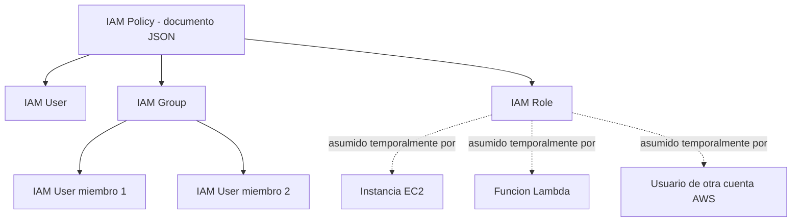
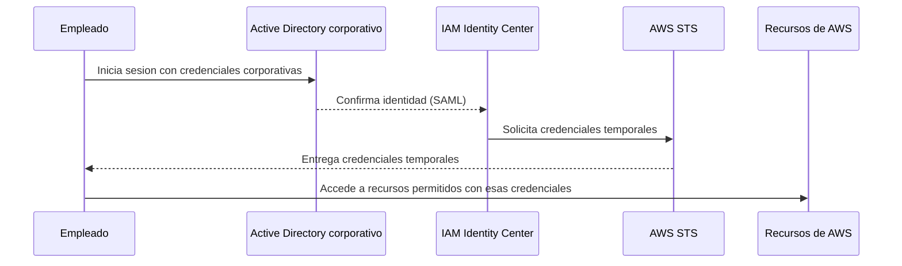
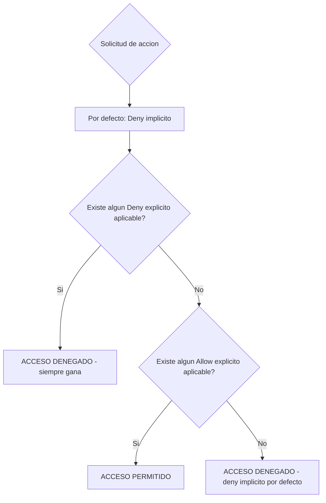
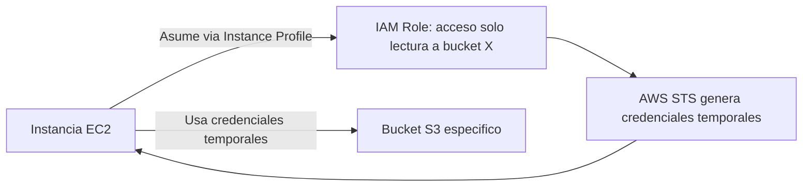

# AWS Certified Cloud Practitioner (CLF-C02)

**PARTE 3 — IAM (Identity and Access Management)**

*Este es, junto con el modelo de responsabilidad compartida, el capítulo más importante del examen en términos de seguridad. Casi cualquier otra parte del curso asume que ya entiendes cómo funciona IAM.*

## 1. Objetivos del capítulo

### ¿Qué aprenderé?

- Qué es IAM y por qué es el servicio de seguridad fundamental de toda cuenta de AWS.
- La diferencia entre IAM Users, Groups y Roles, y cuándo usar cada uno.
- Cómo se estructura una IAM Policy en JSON y cómo se evalúan los permisos.
- El principio de mínimo privilegio y cómo aplicarlo en la práctica.
- Qué es MFA y por qué es obligatorio protegerlo, especialmente en el usuario root.
- Qué es AWS IAM Identity Center y qué es la federación de identidades.

### ¿Por qué es importante?

IAM no es 'un servicio más' de AWS: es el sistema de control de acceso que protege TODOS los demás servicios. Un error de configuración en IAM (por ejemplo, una policy demasiado permisiva o una access key filtrada) es la causa más común de incidentes de seguridad reales en la nube. Entender IAM correctamente también es la base de casi toda arquitectura que verás en certificaciones posteriores (Solutions Architect, Security Specialty).

### ¿Cómo aparece en el examen?

IAM forma parte del dominio 'Security and Compliance', uno de los más grandes del examen CLF-C02. Es común encontrar preguntas que describen un escenario de acceso (una aplicación necesita hablar con otro servicio, un empleado necesita cierto nivel de acceso, una empresa externa necesita acceso temporal) y piden identificar si la solución correcta es un User, un Role, un Group, o federación — sin usar necesariamente esas palabras exactas en el enunciado.

## 2. Teoría

### 2.1 ¿Qué es IAM?

AWS Identity and Access Management (IAM) es el servicio que controla QUIÉN puede hacer QUÉ dentro de tu cuenta de AWS. Es un servicio global (no está atado a una Región específica) y es gratuito: no se paga por crear usuarios, grupos, roles o policies.

IAM responde a dos preguntas para cada intento de acceso a un recurso de AWS: autenticación ('¿quién eres, y puedes probarlo?') y autorización ('¿tienes permiso para hacer esto específicamente?'). Ambas capas deben aprobar la solicitud para que la acción se ejecute.

> **Analogía:** IAM es como el sistema de control de acceso de un edificio de oficinas: una recepción verifica tu identidad (autenticación, como mostrar tu credencial), y luego tu tarjeta de acceso solo abre las puertas para las que tienes permiso (autorización), no todas las puertas del edificio.

### 2.2 IAM Users (usuarios)

Un IAM User representa una identidad individual y persistente dentro de tu cuenta — típicamente una persona real (un empleado) o, en desuso cada vez mayor, una aplicación. Cada IAM User puede tener: una contraseña para acceder a la Management Console, y/o un par de access keys (Access Key ID + Secret Access Key) para acceder de forma programática vía CLI, SDK o API.

Los IAM Users tienen credenciales de larga duración: siguen siendo válidas hasta que alguien las rota o elimina manualmente. Esto los hace más riesgosos que las credenciales temporales de un Role si se filtran, por lo que AWS recomienda cada vez más usar Roles y acceso federado en vez de crear Users tradicionales cuando sea posible.

### 2.3 IAM Groups (grupos)

Un IAM Group es simplemente una colección de IAM Users. No es una identidad en sí misma (no puede iniciar sesión ni tener credenciales) — es una forma de organizar usuarios y asignarles policies de forma colectiva. Si adjuntas una policy a un grupo, automáticamente aplica a todos los usuarios miembros de ese grupo.

> **Buena práctica:** En vez de asignar policies directamente a usuarios individuales (lo cual se vuelve inmanejable con el tiempo), la práctica recomendada es crear grupos por función (ej. 'Desarrolladores', 'Finanzas', 'Administradores'), adjuntar las policies al grupo, y simplemente añadir o quitar usuarios de esos grupos según cambien sus responsabilidades.

### 2.4 IAM Roles (roles)

Un IAM Role es una identidad de AWS que NO tiene credenciales permanentes propias. En vez de 'pertenecer' a una persona específica, un Role se 'asume' temporalmente por quien lo necesite — puede ser un IAM User, una aplicación corriendo en EC2, un servicio de AWS (como Lambda), o incluso una identidad de otra cuenta de AWS distinta.

Cuando algo asume un Role, AWS Security Token Service (STS) genera credenciales temporales (con expiración configurable, normalmente entre 15 minutos y 12 horas) que se usan durante ese periodo y luego dejan de ser válidas automáticamente. Esto es mucho más seguro que una access key permanente, porque limita drásticamente la ventana de exposición si esas credenciales se filtran.

Un IAM Role se compone de dos partes: la permissions policy (qué puede hacer una vez asumido) y la trust policy (quién tiene permitido asumirlo). Casos de uso típicos: dar permisos a una instancia EC2 para acceder a S3 sin guardar credenciales en el código (Instance Profile), permitir que Lambda escriba logs en CloudWatch, o permitir acceso cruzado entre distintas cuentas de AWS (cross-account access).

| Característica | IAM User | IAM Role |
| --- | --- | --- |
| Credenciales | Permanentes (contraseña / access keys) | Temporales, generadas al asumirse, con expiración |
| ¿A quién representa? | Una identidad fija (persona o app específica) | Cualquiera que lo asuma (usuario, servicio, otra cuenta) |
| Riesgo si se filtra | Alto — válido hasta rotación manual | Bajo — expira automáticamente en minutos/horas |
| Caso de uso típico | Acceso humano cotidiano a la consola (cada vez menos recomendado sin MFA/SSO) | Aplicaciones (EC2, Lambda), acceso entre cuentas, federación |

### 2.5 IAM Policies

Una policy es un documento JSON que define permisos. Su estructura básica incluye:

- Version: la versión del lenguaje de policy (normalmente '2012-10-17').
- Statement: una o más declaraciones de permiso, cada una con:
-   Effect: 'Allow' o 'Deny'.
-   Action: qué acciones de la API se permiten/deniegan (ej. 's3:GetObject').
-   Resource: sobre qué recurso(s) específico(s) aplica, identificado por su ARN.
-   Condition (opcional): condiciones adicionales, como restringir el acceso a una IP específica o a cierto horario.
```json
{
  "Version": "2012-10-17",
  "Statement": [
    {
      "Effect": "Allow",
      "Action": ["s3:GetObject", "s3:ListBucket"],
      "Resource": [
        "arn:aws:s3:::mi-bucket-datasets",
        "arn:aws:s3:::mi-bucket-datasets/*"
      ]
    }
  ]
}
```

Existen tres tipos de policies según quién las gestiona:

- AWS managed policies: creadas y mantenidas por AWS para casos de uso comunes (ej. 'AmazonS3ReadOnlyAccess'). Se actualizan automáticamente cuando AWS lanza nuevas funcionalidades relevantes.
- Customer managed policies: creadas y mantenidas por el propio cliente, reutilizables entre varias identidades.
- Inline policies: embebidas directamente dentro de un User, Group o Role específico; no se pueden reutilizar en otra identidad, y se eliminan si se elimina la identidad a la que pertenecen.

### 2.6 Evaluación de permisos: la regla del DENY explícito

Cuando una identidad tiene múltiples policies aplicadas (directamente, vía grupo, o vía Role), AWS evalúa todas ellas juntas siguiendo una lógica estricta: por defecto, TODO está denegado (deny implícito). Si al menos una policy contiene un 'Allow' explícito para la acción solicitada, y ninguna otra policy contiene un 'Deny' explícito para esa misma acción, el acceso se permite. Pero si CUALQUIER policy aplicable contiene un 'Deny' explícito, esa denegación prevalece siempre, sin importar cuántos 'Allow' existan en otras policies.

> **Regla de oro del examen:** Deny explícito > Allow explícito > Deny implícito (por defecto). Esta jerarquía aparece de forma directa o indirecta en múltiples preguntas del examen.

### 2.7 Principio de mínimo privilegio

Este principio establece que cada identidad (usuario, rol, aplicación) debe recibir únicamente los permisos estrictamente necesarios para cumplir su función — ni más, ni menos. En la práctica, esto significa empezar con cero permisos y añadir solo lo que se necesita, en vez de empezar con acceso total y quitar lo que 'parece' innecesario.

AWS ofrece herramientas para ayudar a aplicar este principio, como IAM Access Analyzer (identifica permisos no utilizados o accesos no deseados hacia recursos externos) y los reportes de 'último acceso' (Access Advisor), que muestran qué servicios ha usado realmente una identidad en los últimos meses.

### 2.8 MFA (Multi-Factor Authentication)

MFA añade un segundo factor de autenticación además de la contraseña: típicamente un código temporal generado por una app (Google Authenticator, Authy), una llave de seguridad física (como una YubiKey compatible con FIDO2/WebAuthn), o un dispositivo MFA hardware dedicado. Incluso si un atacante obtiene la contraseña de una cuenta, no podrá iniciar sesión sin ese segundo factor.

> **Prioridad número uno:** AWS recomienda activar MFA en el usuario root desde el primer minuto de creación de la cuenta, antes de hacer cualquier otra cosa. El usuario root tiene control total e irrestricto, incluida la posibilidad de cerrar la cuenta completa.

### 2.9 AWS IAM Identity Center y Federación

AWS IAM Identity Center (anteriormente llamado AWS Single Sign-On / AWS SSO) es el servicio recomendado por AWS para gestionar el acceso humano a una o varias cuentas de AWS de forma centralizada, mediante un único inicio de sesión. Permite conectar un directorio de identidades existente (Microsoft Active Directory, Okta, Google Workspace, Azure AD, etc.) para que los empleados usen sus credenciales corporativas habituales al acceder a AWS, sin necesidad de crear un IAM User independiente por cada persona en cada cuenta.

La federación de identidades, en un sentido más amplio, es el mecanismo general que permite que un sistema de identidad externo (fuera de IAM) sea confiable para AWS, típicamente usando estándares como SAML 2.0 o OpenID Connect (OIDC). Cuando un usuario federado se autentica, AWS le entrega credenciales temporales (vía un IAM Role, no un IAM User), siguiendo exactamente el mismo mecanismo de seguridad que ya vimos para los Roles.

Un caso de uso muy común de federación con OIDC es dar acceso temporal a usuarios que ya iniciaron sesión con proveedores externos como Google, Facebook o Amazon (login social) a recursos limitados de AWS, típicamente mediante Amazon Cognito para aplicaciones móviles o web.

## 3. Ejemplos

### Ejemplo empresarial

Un banco con 3,000 empleados usa AWS IAM Identity Center conectado a su Active Directory corporativo. Cuando un empleado del área de riesgo inicia sesión con su usuario corporativo habitual, automáticamente obtiene acceso de solo lectura a los dashboards de QuickSight relevantes en la cuenta de AWS de análisis de riesgo, sin que TI haya tenido que crear un IAM User manualmente para cada persona.

### Ejemplo de startup

Una startup de 5 personas crea un IAM Group llamado 'Backend' con una customer managed policy que da acceso a DynamoDB, Lambda y CloudWatch Logs, y añade a los 3 desarrolladores backend a ese grupo. Cuando contratan a un cuarto desarrollador, simplemente lo añaden al grupo sin reconfigurar nada más.

### Ejemplo personal

Un desarrollador independiente que aprende AWS crea, desde el primer día, un IAM User propio con MFA activado para su trabajo diario, en vez de usar el usuario root, y guarda sus access keys en un gestor de secretos local en vez de dejarlas escritas en un archivo de texto en su escritorio.

### Caso real de IAM Role

Una aplicación Lambda que procesa imágenes subidas a S3 tiene un IAM Role asociado con permisos exactos para leer de un bucket de entrada, escribir en un bucket de salida, y escribir logs en CloudWatch — nada más. Si el código de esa Lambda tuviera una vulnerabilidad explotada por un atacante, el daño posible estaría limitado exactamente a esos tres permisos, gracias al principio de mínimo privilegio aplicado al Role.

## 4. Diagramas

Diagramas en formato Mermaid — pégalos en mermaid.live o cualquier visor compatible para verlos renderizados.

### 4.1 Relación entre Users, Groups, Roles y Policies



### 4.2 Flujo de autenticación federada



### 4.3 Evaluación de una IAM Policy: la regla del Deny explícito



### 4.4 IAM Role asumido por una instancia EC2 (Instance Profile)



## 5. Laboratorios

### Laboratorio 1: Crear un IAM Group, un IAM User y activar MFA

Costo: $0 — IAM es gratuito, no se generan cargos por crear usuarios, grupos, roles o policies.

1. En la consola de AWS, ve al servicio IAM.
2. Ve a 'User groups' → 'Create group'. Nómbralo 'Desarrolladores'.
3. En la sección de permisos, busca y selecciona la AWS managed policy 'ReadOnlyAccess' (para este laboratorio de práctica, evitamos dar permisos amplios de escritura).
4. Crea el grupo.
5. Ve a 'Users' → 'Create user'. Nómbralo con tu nombre o un alias (ej. 'ana-dev').
6. Marca la opción para permitir acceso a la Management Console y establece una contraseña personalizada.
7. En el paso de permisos, selecciona 'Add user to group' y elige el grupo 'Desarrolladores' que creaste.
8. Completa la creación del usuario.
9. Cierra sesión como root (o como tu usuario administrador) e inicia sesión con el nuevo usuario para comprobar que solo tiene acceso de lectura.
10. Con el nuevo usuario, ve a IAM → Users → tu usuario → Security credentials → Assign MFA device, y actívalo con una app authenticator.
> **Cómo evitar costos:** Este laboratorio no crea ningún recurso facturable — todo lo relacionado con IAM (usuarios, grupos, roles, policies) es gratuito en cualquier cantidad razonable.

### Laboratorio 2: Crear un IAM Role para una instancia EC2 (Instance Profile)

Costo aproximado: los primeros 750 horas/mes de una instancia t2.micro o t3.micro están cubiertas por el Free Tier durante los primeros 12 meses; fuera de Free Tier, una t3.micro cuesta aproximadamente $0.0104/hora en us-east-1 (verifica el precio vigente en el Pricing Calculator).

11. Primero, crea un bucket S3 de prueba (ver laboratorio de la Parte 5, o simplemente crea uno vacío desde la consola de S3 con un nombre único).
12. Ve a IAM → Roles → Create role.
13. Selecciona 'AWS service' como tipo de entidad de confianza, y 'EC2' como caso de uso.
14. En permisos, adjunta la policy 'AmazonS3ReadOnlyAccess' (o, idealmente, crea una customer managed policy más restringida solo a tu bucket específico, siguiendo el principio de mínimo privilegio).
15. Nombra el rol, por ejemplo 'EC2-S3-ReadOnly-Role', y créalo.
16. Ve a EC2 → Launch instance. Elige una AMI Free Tier eligible (Amazon Linux) y el tipo t2.micro o t3.micro.
17. En la sección 'Advanced details', busca 'IAM instance profile' y selecciona el rol que acabas de crear.
18. Lanza la instancia y, una vez iniciada, conéctate por Session Manager o SSH.
19. Dentro de la instancia, ejecuta 'aws s3 ls' — debería funcionar SIN que hayas configurado ninguna access key manualmente, porque la instancia obtiene credenciales temporales automáticamente a través del rol.
> **Cómo eliminar los recursos:** Termina la instancia EC2 desde la consola (EC2 → Instances → Terminate instance). El IAM Role no genera costo, pero puedes eliminarlo también desde IAM → Roles si ya no lo necesitas. Elimina también el bucket S3 de prueba si no lo vas a reutilizar.

## 6. Errores comunes

- Usar el usuario root para el trabajo diario en vez de crear un IAM User o usar IAM Identity Center.
- Guardar access keys directamente en el código fuente o subirlas a un repositorio de Git — usa siempre IAM Roles cuando el recurso corre dentro de AWS (EC2, Lambda), o gestores de secretos cuando sea estrictamente necesario usar credenciales.
- Otorgar la policy 'AdministratorAccess' a todos los usuarios 'para no tener problemas' — esto viola directamente el principio de mínimo privilegio y amplifica el impacto de cualquier cuenta comprometida.
- Olvidar que un DENY explícito siempre gana sobre cualquier ALLOW, incluso si ese ALLOW viene de una policy de administrador completo.
- Confundir un IAM Group (colección de usuarios, no una identidad) con un IAM Role (una identidad asumible con credenciales temporales) — son conceptos completamente distintos aunque ambos 'agrupen' permisos de alguna forma.
- No activar MFA en el usuario root, dejándolo protegido solo por una contraseña.
- Crear un IAM User nuevo para cada aplicación que corre en EC2 o Lambda, en vez de usar un IAM Role — genera credenciales permanentes innecesarias que hay que rotar manualmente.

## 7. Comparaciones

### IAM User vs IAM Role

Ver tabla completa en la sección 2.4. La pregunta clave para decidir en el examen: '¿esta identidad necesita existir de forma permanente y ser usada por UNA persona/aplicación específica de forma continua?' → User. '¿Esta identidad se va a asumir temporalmente, por distintos actores, o por un servicio de AWS?' → Role.

### IAM Group vs IAM Role

Un Group es solo una forma de organizar Users para asignar policies en bloque; no se puede 'asumir' ni tiene credenciales propias. Un Role sí se asume y sí genera credenciales temporales. No son alternativas entre sí, resuelven problemas distintos.

### AWS managed policy vs Customer managed policy vs Inline policy

AWS managed = mantenida por AWS, ideal para empezar rápido con casos comunes. Customer managed = creada por ti, reutilizable entre identidades, más control. Inline = embebida en una sola identidad, sin reutilización, se borra junto con la identidad — útil solo para casos muy puntuales y no recomendada como práctica general.

## 8. Preguntas tipo examen

20 preguntas de opción múltiple, mismo estilo y dificultad que el examen oficial CLF-C02.

**Pregunta 1.** Una empresa tiene 40 empleados que necesitan acceso similar a AWS (todos en el equipo de desarrollo necesitan los mismos permisos sobre S3 y EC2). ¿Cuál es la forma más eficiente de gestionar estos permisos?

A) Crear 40 policies individuales, una por usuario

**B)** **Crear un IAM Group con la policy necesaria y añadir los 40 usuarios a ese grupo**

C) Compartir las credenciales del usuario root entre los 40 empleados

D) Crear 40 IAM Roles, uno por usuario

**Respuesta correcta: B.** 

*Los IAM Groups permiten asignar un conjunto de policies una sola vez y aplicarlas a todos los usuarios miembros. Es la forma estándar y escalable de gestionar permisos para conjuntos de usuarios con necesidades similares, en vez de repetir configuración por usuario.*

**Pregunta 2.** ¿Cuál es la diferencia fundamental entre un IAM User y un IAM Role?

A) No hay diferencia, son sinónimos

**B)** **Un IAM User tiene credenciales permanentes asociadas a una identidad específica; un IAM Role no tiene credenciales propias y es asumido temporalmente por quien lo necesite**

C) Un IAM Role solo puede ser usado por el usuario root

D) Un IAM User solo puede acceder a S3

**Respuesta correcta: B.** 

*Un IAM User representa una identidad (persona o aplicación) con credenciales de larga duración (contraseña o access keys). Un IAM Role no tiene credenciales propias asociadas: se 'asume' temporalmente, generando credenciales de corta duración, y puede ser asumido por usuarios, servicios de AWS u otras cuentas.*

**Pregunta 3.** Una aplicación EC2 necesita leer archivos de un bucket S3. Según las mejores prácticas de AWS, ¿cómo debería otorgarse este acceso?

A) Creando un IAM User con access keys y guardando esas keys en el código de la aplicación

**B)** **Asignando un IAM Role a la instancia EC2 con permisos de solo lectura sobre ese bucket específico**

C) Haciendo el bucket S3 completamente público

D) Usando las credenciales del usuario root en la aplicación

**Respuesta correcta: B.** 

*La mejor práctica es usar un IAM Role asociado a la instancia EC2 (Instance Profile), que otorga credenciales temporales automáticamente rotadas, sin necesidad de almacenar ninguna credencial de larga duración dentro del código. Guardar access keys en el código es una mala práctica que expone la cuenta a riesgos de seguridad.*

**Pregunta 4.** ¿Qué es una IAM Policy?

A) Un tipo de instancia EC2

**B)** **Un documento JSON que define qué acciones están permitidas o denegadas sobre qué recursos**

C) El nombre de un grupo de usuarios

D) Un servicio de facturación de AWS

**Respuesta correcta: B.** 

*Una IAM Policy es un documento en formato JSON que especifica permisos: qué acciones (Action) se permiten o deniegan (Effect) sobre qué recursos (Resource), y bajo qué condiciones (Condition) opcionales.*

**Pregunta 5.** ¿Qué elemento de una IAM Policy determina si el permiso se PERMITE o se DENIEGA explícitamente?

A) Resource

B) Action

**C)** **Effect**

D) Version

**Respuesta correcta: C.** 

*El elemento 'Effect' de una policy JSON puede tomar el valor 'Allow' o 'Deny', determinando si las acciones especificadas se permiten o se deniegan explícitamente sobre los recursos indicados.*

**Pregunta 6.** Si un usuario IAM tiene una policy que le PERMITE acceso completo a S3, pero otra policy adjunta le DENIEGA explícitamente el acceso a un bucket específico, ¿qué ocurre?

A) Prevalece siempre el permiso más reciente que se haya adjuntado

**B)** **Un DENY explícito siempre prevalece sobre un ALLOW, sin importar el orden en que se evalúen las policies**

C) AWS pide confirmación manual al usuario

D) El acceso se permite porque hay al menos una policy que lo permite

**Respuesta correcta: B.** 

*En la evaluación de políticas de IAM, un DENY explícito siempre tiene prioridad sobre cualquier ALLOW, sin importar cuántas otras policies otorguen el permiso. Esta es una de las reglas más preguntadas en el examen.*

**Pregunta 7.** ¿Qué es el 'principio de mínimo privilegio' en el contexto de IAM?

A) Otorgar a cada usuario acceso administrador completo por defecto para evitar problemas operativos

**B)** **Otorgar a cada identidad únicamente los permisos estrictamente necesarios para realizar su tarea, ni uno más**

C) Usar siempre el usuario root para todas las operaciones

D) Nunca usar IAM Roles, solo IAM Users

**Respuesta correcta: B.** 

*El principio de mínimo privilegio (least privilege) establece que cada usuario, rol o aplicación debe tener solo los permisos mínimos necesarios para cumplir su función, reduciendo la superficie de ataque en caso de credenciales comprometidas.*

**Pregunta 8.** ¿Qué es MFA (Multi-Factor Authentication) y por qué AWS lo recomienda enfáticamente para el usuario root?

A) Es un segundo nombre de usuario que se debe recordar

**B)** **Es una capa adicional de seguridad que requiere un segundo factor (ej. código de una app o dispositivo físico) además de la contraseña, dificultando el acceso no autorizado aunque la contraseña sea robada**

C) Es un tipo de IAM Role especial

D) Es el nombre técnico de una VPC segura

**Respuesta correcta: B.** 

*MFA añade un segundo factor de verificación (algo que tienes, como un dispositivo o app generadora de códigos) además de la contraseña (algo que sabes). Esto reduce drásticamente el riesgo de que una cuenta comprometida por robo de contraseña sea accedida por un atacante.*

**Pregunta 9.** Una empresa mediana con cientos de empleados usa Microsoft Active Directory internamente y quiere que sus empleados puedan acceder a AWS usando sus credenciales corporativas existentes, sin crear un IAM User separado para cada uno. ¿Qué solución de AWS es la más adecuada?

A) Crear 500 IAM Users manualmente

**B)** **Usar Federación de identidades (Identity Federation), por ejemplo mediante AWS IAM Identity Center o SAML 2.0**

C) Compartir las credenciales del usuario root

D) Deshabilitar IAM completamente

**Respuesta correcta: B.** 

*La federación de identidades permite que los usuarios se autentiquen contra un directorio de identidades existente (Active Directory, Okta, Google Workspace, etc.) y obtengan acceso temporal a AWS sin necesidad de un IAM User dedicado por cada persona, usando estándares como SAML 2.0 o el propio AWS IAM Identity Center.*

**Pregunta 10.** ¿Qué es AWS IAM Identity Center (anteriormente conocido como AWS SSO)?

A) Un tipo de instancia EC2 optimizada para IAM

**B)** **Un servicio que centraliza el acceso de los usuarios a múltiples cuentas de AWS y aplicaciones empresariales mediante inicio de sesión único (SSO)**

C) Una policy predeterminada de solo lectura

D) Un servicio exclusivo para IAM Roles de servicios de AWS

**Respuesta correcta: B.** 

*AWS IAM Identity Center permite gestionar de forma centralizada el acceso de los usuarios a múltiples cuentas dentro de una organización de AWS, así como a aplicaciones empresariales, mediante un único inicio de sesión (Single Sign-On), integrándose también con directorios externos.*

**Pregunta 11.** Un desarrollador externo de otra empresa necesita acceso temporal a ciertos recursos específicos de tu cuenta de AWS por un proyecto de 3 meses. Según las mejores prácticas, ¿qué deberías usar?

A) Crear un IAM User permanente con contraseña compartida por email

**B)** **Crear un IAM Role que ese desarrollador pueda asumir (cross-account role), con permisos limitados y de duración limitada**

C) Darle las credenciales del usuario root de tu cuenta

D) Deshabilitar IAM MFA para facilitarle el acceso

**Respuesta correcta: B.** 

*Para colaboración entre cuentas o accesos temporales, la práctica recomendada es crear un IAM Role de acceso entre cuentas (cross-account role) con permisos limitados, que el desarrollador externo puede asumir temporalmente sin necesidad de credenciales permanentes en tu cuenta.*

**Pregunta 12.** ¿Cuál de las siguientes afirmaciones sobre el usuario root de una cuenta de AWS es correcta?

A) El usuario root debería usarse para las tareas diarias del equipo

**B)** **El usuario root tiene control total e irrestricto sobre la cuenta y debería protegerse con MFA y usarse solo para tareas que estrictamente lo requieran**

C) El usuario root no puede eliminarse ni renombrarse, pero tampoco tiene permisos especiales

D) El usuario root es lo mismo que un IAM Role

**Respuesta correcta: B.** 

*El usuario root se crea automáticamente al abrir la cuenta y tiene acceso completo e irrestricto a todos los recursos y configuraciones, incluida la posibilidad de cerrar la cuenta. AWS recomienda protegerlo con MFA, no generar access keys para él, y usarlo únicamente para las pocas tareas que realmente lo requieren (como cambiar el plan de soporte o cerrar la cuenta).*

**Pregunta 13.** ¿Qué elemento identifica de forma única un recurso específico de AWS dentro de una IAM Policy (por ejemplo, un bucket S3 concreto)?

A) El Access Key ID

**B)** **El ARN (Amazon Resource Name)**

C) El Account ID únicamente

D) El nombre de la Región

**Respuesta correcta: B.** 

*El ARN (Amazon Resource Name) es el identificador único y estandarizado de cualquier recurso en AWS, con un formato consistente (ej. arn:aws:s3:::nombre-bucket), y es lo que se usa en el elemento 'Resource' de una policy para especificar sobre qué recurso exacto aplican los permisos.*

**Pregunta 14.** Un IAM Role tiene dos componentes principales de configuración. ¿Cuáles son?

**A)** **Una policy de permisos (qué puede hacer) y una policy de confianza (quién puede asumir el rol)**

B) Solo un nombre de usuario y una contraseña

C) Solo una dirección de correo electrónico

D) Un Access Key ID y un Secret Access Key permanentes

**Respuesta correcta: A.** 

*Un IAM Role se compone de una permissions policy (qué acciones puede realizar el rol una vez asumido) y una trust policy (qué identidades — usuarios, cuentas, servicios — tienen permitido asumir ese rol). Un Role, a diferencia de un User, no tiene credenciales permanentes.*

**Pregunta 15.** ¿Qué tipo de policy de IAM viene predefinida y mantenida por AWS, lista para usarse sin tener que escribirla desde cero (ej. 'AmazonS3ReadOnlyAccess')?

A) Customer managed policy

B) Inline policy

**C)** **AWS managed policy**

D) Resource-based policy

**Respuesta correcta: C.** 

*Las AWS managed policies son policies predefinidas y mantenidas por AWS para casos de uso comunes, listas para adjuntar directamente a usuarios, grupos o roles. Se diferencian de las 'customer managed policies' (creadas y mantenidas por el propio cliente) y de las 'inline policies' (embebidas directamente en una sola identidad, sin reutilización).*

**Pregunta 16.** Una startup con un solo desarrollador está usando el usuario root para todo su trabajo diario en AWS, incluyendo lanzar instancias EC2 y configurar S3. ¿Cuál es el riesgo principal y la recomendación correcta?

A) No hay ningún riesgo, root es igual de seguro que cualquier IAM User

**B)** **El riesgo es que si las credenciales root se comprometen, el atacante tiene control total de la cuenta; se recomienda crear un IAM User con permisos administrativos para el trabajo diario y reservar root solo para tareas excepcionales**

C) El riesgo es que root no puede lanzar instancias EC2

D) Se recomienda deshabilitar IAM completamente para simplificar

**Respuesta correcta: B.** 

*Usar root para el día a día multiplica el impacto de cualquier compromiso de credenciales. La recomendación estándar de AWS es crear un IAM User (o mejor, acceder vía IAM Identity Center) con los permisos administrativos necesarios, proteger root con MFA, y no generar access keys para root.*

**Pregunta 17.** ¿Qué ocurre con las credenciales generadas cuando una aplicación asume un IAM Role?

A) Son permanentes y nunca expiran

**B)** **Son temporales, con una duración configurable, y se rotan automáticamente sin intervención manual**

C) Son idénticas a las credenciales del usuario root

D) Deben guardarse manualmente en un archivo de texto por el desarrollador

**Respuesta correcta: B.** 

*Al asumir un IAM Role, AWS Security Token Service (STS) genera credenciales temporales con una duración limitada y configurable (desde minutos hasta horas). Esto reduce el riesgo de exposición prolongada en caso de fuga, a diferencia de las access keys permanentes de un IAM User.*

**Pregunta 18.** Una empresa quiere que los desarrolladores de su equipo de Machine Learning solo puedan ver y usar servicios relacionados con ML (SageMaker, S3 de sus buckets de datasets), sin poder tocar EC2, RDS ni facturación. ¿Qué concepto de IAM aplica directamente este control?

A) Elasticidad

**B)** **El principio de mínimo privilegio, implementado mediante policies específicas adjuntas a un grupo de ML**

C) Availability Zones

D) Edge Locations

**Respuesta correcta: B.** 

*Este es un ejemplo directo del principio de mínimo privilegio: se otorgan exactamente los permisos necesarios (SageMaker y los buckets de datasets relevantes) y nada más, típicamente organizando a esos usuarios en un IAM Group con las policies adecuadas.*

**Pregunta 19.** ¿Cuál de las siguientes es una mejor práctica de seguridad recomendada por AWS respecto a las IAM Policies?

A) Usar siempre la policy 'AdministratorAccess' para todos los usuarios para simplificar la gestión

**B)** **Revisar y auditar periódicamente los permisos otorgados, eliminando accesos no utilizados, y preferir permisos granulares sobre accesos amplios**

C) Nunca usar AWS managed policies, siempre escribir todo desde cero

D) Compartir una sola IAM Policy con permisos completos entre todos los equipos

**Respuesta correcta: B.** 

*AWS recomienda auditar regularmente los permisos (por ejemplo, usando IAM Access Analyzer o el reporte de último acceso), eliminar permisos no utilizados, y preferir el otorgamiento granular de permisos en línea con el principio de mínimo privilegio, en vez de otorgar acceso amplio 'por si acaso'.*

## 9. Resumen

### Resumen ejecutivo

IAM controla quién puede hacer qué en tu cuenta de AWS, mediante cuatro elementos centrales: Users (identidades permanentes), Groups (colecciones de Users para asignar permisos en bloque), Roles (identidades sin credenciales propias, asumidas temporalmente) y Policies (documentos JSON que definen permisos con Effect, Action, Resource y Condition opcional). Un DENY explícito siempre prevalece sobre cualquier ALLOW. El principio de mínimo privilegio debe guiar toda asignación de permisos. MFA es obligatorio para proteger especialmente el usuario root. Para acceso humano a gran escala, AWS recomienda IAM Identity Center y federación en vez de crear IAM Users individuales.

### Conceptos clave (memorizar)

- **User = credenciales permanentes, una identidad fija. Role = credenciales temporales, asumido por cualquiera autorizado.**
- **Group = colección de Users, no es una identidad, no tiene credenciales.**
- **Deny explícito > Allow explícito > Deny implícito (regla de evaluación de policies).**
- **Mínimo privilegio: otorgar solo lo estrictamente necesario, empezando desde cero permisos.**
- **MFA obligatorio para root desde el día uno.**
- **IAM Identity Center / federación = acceso centralizado para muchos usuarios sin crear un IAM User por persona.**

### Lo que normalmente pregunta AWS

Escenarios donde una aplicación en EC2/Lambda necesita acceder a otro servicio (la respuesta casi siempre es un IAM Role, nunca access keys embebidas), escenarios de evaluación de permisos con múltiples policies en conflicto (regla del Deny explícito), y escenarios de acceso masivo de empleados (Groups o IAM Identity Center/federación en vez de Users individuales).

## Recursos externos para este capítulo

### Documentación oficial

- IAM User Guide — docs.aws.amazon.com/IAM
- IAM Best Practices — documentación oficial de AWS sobre mejores prácticas de seguridad en IAM
- AWS IAM Identity Center User Guide — docs.aws.amazon.com/singlesignon
- Security Best Practices in IAM whitepaper
- IAM Policy Evaluation Logic — docs.aws.amazon.com (sección 'reference_policies_evaluation-logic')

### Videos recomendados

- AWS Skill Builder: módulo dedicado a IAM dentro de 'Cloud Practitioner Essentials'.
- Stephane Maarek: sección de IAM de su curso CLF-C02 (muy detallada, referencia estándar de la industria).
- Adrian Cantrill: 'IAM deep dive', más orientado a nivel Associate pero útil para consolidar.

### Laboratorios adicionales

- AWS Skill Builder Labs: 'Introduction to AWS Identity and Access Management (IAM)'.
- AWS Well-Architected Labs: sección de seguridad, ejercicios de IAM Access Analyzer.