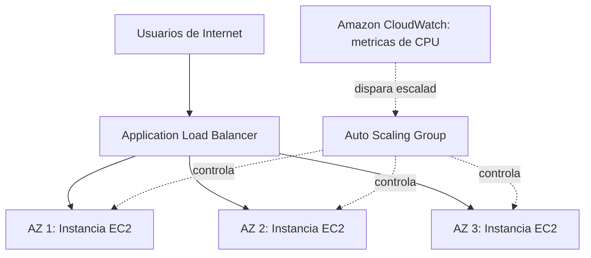
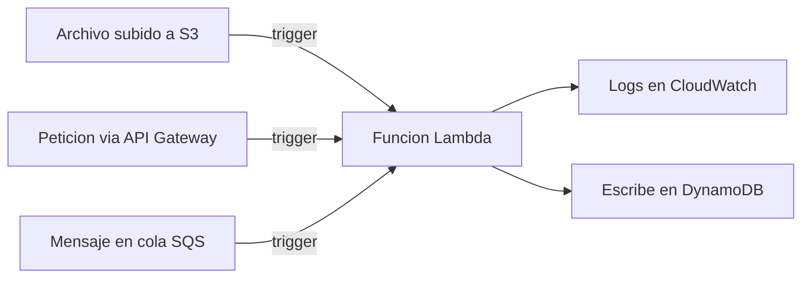
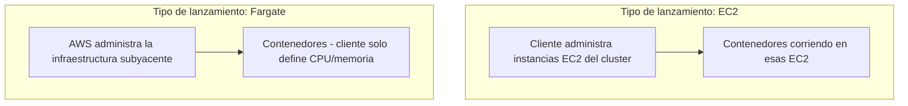
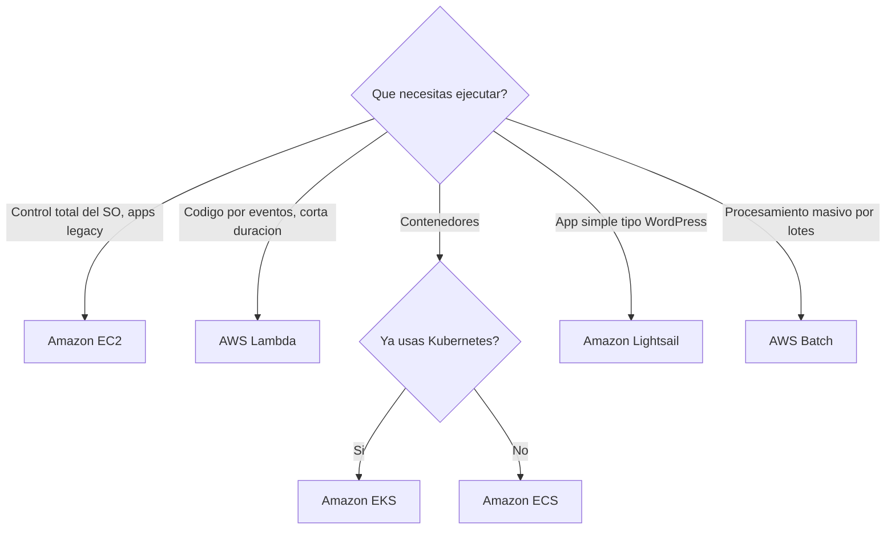

# AWS Certified Cloud Practitioner (CLF-C02)

**PARTE 4 — Servicios de Cómputo**

*Este capítulo cubre el 'motor' de AWS: cómo ejecutar código y aplicaciones, desde el control total de EC2 hasta el serverless completo de Lambda, pasando por contenedores y procesamiento por lotes.*

## 1. Objetivos del capítulo

### ¿Qué aprenderé?

- Qué es Amazon EC2, qué es una AMI, y cómo se organizan los tipos de instancia.
- Cómo funcionan los Security Groups como firewall virtual de instancia.
- Cómo funcionan Auto Scaling y Elastic Load Balancer juntos para dar elasticidad y alta disponibilidad.
- Qué es AWS Lambda y cuándo conviene usar serverless en vez de servidores tradicionales.
- La diferencia entre ECS, EKS y Fargate para trabajar con contenedores.
- Cuándo usar Amazon Lightsail y AWS Batch frente a las opciones anteriores.

### ¿Por qué es importante?

El cómputo es, junto con el almacenamiento, el pilar más fundamental de cualquier arquitectura en la nube. El examen espera que sepas elegir el servicio de cómputo correcto según el escenario (control necesario, duración de la carga de trabajo, tolerancia a interrupciones, experiencia previa del equipo), no que memorices características técnicas aisladas de cada uno.

### ¿Cómo aparece en el examen?

Este contenido forma parte principalmente del dominio 'Cloud Technology and Services'. Es habitual encontrar preguntas de tipo 'una empresa necesita X característica — ¿qué servicio de cómputo elegir entre estas cuatro opciones?', donde las cuatro opciones son servicios de cómputo reales de AWS y solo uno encaja con los requisitos exactos del escenario.

## 2. Teoría

### 2.1 Amazon EC2 (Elastic Compute Cloud)

EC2 es el servicio de cómputo IaaS fundamental de AWS: entrega máquinas virtuales (instancias) sobre las que tú controlas el sistema operativo y todo lo que instales encima. Es el servicio que da más flexibilidad y control, a cambio de mayor responsabilidad de administración (parches, seguridad del SO, escalado manual si no se combina con Auto Scaling).

Cada instancia EC2 se lanza a partir de una AMI (Amazon Machine Image) — una plantilla que define el sistema operativo y el software preinstalado — y se elige un tipo de instancia que determina la capacidad de CPU, memoria, almacenamiento y red disponible.

#### Tipos de instancia EC2 (familias)

| Familia | Letra típica | Optimizada para | Ejemplo de uso |
| --- | --- | --- | --- |
| General Purpose | t, m | Balance entre CPU, memoria y red | Aplicaciones web típicas, entornos de desarrollo |
| Compute Optimized | c | Alto rendimiento de CPU | Procesamiento por lotes, modelado científico, servidores de juegos |
| Memory Optimized | r, x | Grandes cantidades de RAM | Bases de datos en memoria, análisis de big data |
| Storage Optimized | i, d | Alto rendimiento de I/O de disco local | Bases de datos NoSQL de alta transacción, data warehousing |

#### Modelos de precio de EC2 (adelanto — se profundiza en la Parte 11)

- On-Demand: pagas por hora/segundo sin compromiso, máxima flexibilidad, mayor costo unitario.
- Reserved Instances: comprometes uso por 1 o 3 años a cambio de un descuento significativo.
- Spot Instances: usas capacidad no utilizada de AWS con grandes descuentos, pero AWS puede interrumpir la instancia con poco aviso — ideal para cargas tolerantes a interrupciones.
- Savings Plans: compromiso de gasto constante ($/hora) a cambio de descuento, más flexible que Reserved Instances en cuanto al tipo de instancia usado.

### 2.2 AMI (Amazon Machine Image)

Una AMI define exactamente qué obtendrás al lanzar una instancia: el sistema operativo base, cualquier software preinstalado, y la configuración de arranque. Existen cuatro orígenes principales de AMI: AMIs proporcionadas por AWS (ej. Amazon Linux, Ubuntu oficial), AMIs de la comunidad, AMIs del AWS Marketplace (a menudo con software comercial preinstalado, con costo adicional), y AMIs personalizadas (custom AMIs) creadas por ti a partir de una instancia ya configurada, útiles para replicar exactamente un entorno o acelerar el lanzamiento de instancias futuras.

### 2.3 Security Groups

Un Security Group funciona como un firewall virtual asociado directamente a una o más instancias (técnicamente, a su interfaz de red — ENI). Sus características principales:

- Es stateful: si permites tráfico entrante en un puerto, el tráfico de respuesta saliente se permite automáticamente, sin necesidad de una regla adicional.
- Solo admite reglas de tipo 'Allow' — todo lo que no está explícitamente permitido está denegado por defecto; no existen reglas 'Deny' en un Security Group.
- Se puede asociar más de un Security Group a una misma instancia, y las reglas de todos ellos se combinan de forma aditiva (unión de permisos).
> **Ejemplo práctico:** Un Security Group típico para un servidor web permitiría tráfico entrante en el puerto 443 (HTTPS) desde cualquier IP (0.0.0.0/0), y en el puerto 22 (SSH) solo desde la IP específica del equipo de administración, nunca desde 'cualquier IP' en un entorno de producción.

### 2.4 Auto Scaling y Elastic Load Balancer

Estos dos servicios se usan casi siempre juntos para lograr elasticidad y alta disponibilidad al mismo tiempo:

#### Amazon EC2 Auto Scaling

Un Auto Scaling Group (ASG) mantiene un número de instancias EC2 dentro de un rango definido (mínimo, deseado, máximo), lanzando nuevas instancias automáticamente cuando la demanda aumenta (según políticas de escalado basadas en métricas como uso de CPU) y terminándolas cuando la demanda baja. También reemplaza automáticamente instancias que fallan sus verificaciones de salud, aportando resiliencia además de elasticidad.

#### Elastic Load Balancer (ELB)

Distribuye el tráfico entrante entre múltiples instancias (normalmente repartidas en varias Availability Zones), realizando verificaciones de salud (health checks) periódicas y dejando de enviar tráfico a instancias que no responden correctamente. AWS ofrece varios tipos: Application Load Balancer (ALB, para tráfico HTTP/HTTPS con enrutamiento avanzado basado en contenido), Network Load Balancer (NLB, para tráfico TCP/UDP de altísimo rendimiento y baja latencia) y Gateway Load Balancer (para inspección de tráfico de terceros).

> **Cómo se combinan:** Auto Scaling Group + ELB es la arquitectura de referencia más citada en el examen para 'aplicación web escalable y altamente disponible': el ELB reparte tráfico entre las instancias del ASG, repartidas en múltiples AZ, mientras el ASG ajusta cuántas instancias existen según la demanda.

### 2.5 AWS Lambda

Lambda ejecuta código (una 'función') en respuesta a eventos, sin que tengas que aprovisionar, parchear ni administrar ningún servidor. Los eventos que pueden disparar (trigger) una función Lambda incluyen: una petición HTTP vía API Gateway, un archivo subido a S3, un mensaje en una cola SQS, un cambio en una tabla DynamoDB, un horario programado (como un cron job), entre muchos otros.

El modelo de precio de Lambda es pago por invocación y por el tiempo de ejecución (medido en milisegundos) multiplicado por la memoria asignada a la función. Si la función no se invoca, no genera costo de cómputo alguno. Lambda tiene un límite máximo de tiempo de ejecución por invocación (actualmente 15 minutos), por lo que no es adecuado para procesos de muy larga duración.

### 2.6 Contenedores: ECS, EKS y Fargate

Los contenedores empaquetan una aplicación junto con todas sus dependencias en una unidad ligera y portable, más eficiente que una máquina virtual completa porque comparten el kernel del sistema operativo anfitrión. AWS ofrece dos orquestadores de contenedores y una forma serverless de ejecutarlos:

#### Amazon ECS (Elastic Container Service)

El orquestador de contenedores propietario de AWS, más simple de configurar y operar si no se necesita compatibilidad específica con el ecosistema de Kubernetes.

#### Amazon EKS (Elastic Kubernetes Service)

Una versión administrada de Kubernetes, el estándar open source de orquestación de contenedores más popular a nivel mundial. Ideal cuando el equipo ya tiene experiencia con Kubernetes, necesita portabilidad entre distintos proveedores de nube, o requiere el amplio ecosistema de herramientas de Kubernetes.

#### AWS Fargate

Un motor de cómputo serverless para contenedores, compatible tanto con ECS como con EKS. Con Fargate, no aprovisionas ni administras las instancias EC2 subyacentes del clúster: solo defines cuánta CPU y memoria necesita cada contenedor, y AWS gestiona automáticamente dónde y cómo ejecutarlo.

| Servicio | ¿Qué es? | ¿Administra servidores el cliente? | Cuándo usarlo |
| --- | --- | --- | --- |
| ECS | Orquestador de contenedores propio de AWS | Depende del tipo de lanzamiento (EC2 o Fargate) | Simplicidad, ya usando el ecosistema AWS |
| EKS | Kubernetes administrado | Depende del tipo de lanzamiento (EC2 o Fargate) | Ya se usa Kubernetes, se necesita portabilidad |
| Fargate | Motor serverless para contenedores (usado con ECS o EKS) | No | No querer administrar servidores del clúster |

### 2.7 Amazon Lightsail

Lightsail es la forma más simplificada de AWS para desplegar aplicaciones sencillas: sitios web, blogs, tiendas online básicas, servidores de desarrollo. Ofrece precios mensuales fijos y predecibles que incluyen cómputo, almacenamiento y transferencia de datos, junto con una configuración de red y seguridad simplificada (sin necesidad de configurar manualmente una VPC completa). Es la puerta de entrada recomendada para quienes vienen de un hosting tradicional y quieren algo simple, antes de escalar eventualmente a EC2 si lo necesitan.

### 2.8 AWS Batch

AWS Batch está diseñado para ejecutar trabajos de procesamiento por lotes (batch computing) a cualquier escala, sin que el usuario tenga que instalar ni administrar software de gestión de colas de trabajos ni clústeres de cómputo. AWS Batch planifica los trabajos, determina el tipo y cantidad de instancias óptimas (pudiendo usar instancias Spot para reducir costos automáticamente), y las aprovisiona y desaprovisiona según la cola de trabajos pendientes. Es común en casos como renderizado, procesamiento genómico, simulaciones financieras o transformación masiva de datos.

## 3. Ejemplos

### Ejemplo empresarial

Una aerolínea despliega su sistema de check-in sobre EC2 con Auto Scaling y un Application Load Balancer repartidos en tres AZ, garantizando que el sistema siga funcionando incluso si una zona completa falla, y escalando automáticamente durante los picos de la mañana.

### Ejemplo de startup

Una startup de fintech usa Lambda junto con API Gateway para construir toda su API backend, pagando solo por las peticiones reales que reciben (que al inicio son pocas), evitando pagar por servidores EC2 ociosos mientras el producto todavía no tiene tracción de usuarios.

### Ejemplo personal

Un desarrollador que quiere alojar su portafolio personal y un pequeño blog usa Amazon Lightsail por su precio fijo mensual predecible y su configuración simplificada, evitando tener que aprender a configurar una VPC completa solo para un proyecto personal pequeño.

### Caso real de contenedores

Un equipo de ingeniería que ya opera microservicios en Kubernetes on-premises migra su plataforma a Amazon EKS con Fargate, manteniendo sus mismos manifiestos de Kubernetes casi sin cambios, pero dejando de tener que parchear y escalar manualmente los nodos del clúster.

## 4. Diagramas

Diagramas en formato Mermaid — pégalos en mermaid.live o cualquier visor compatible para verlos renderizados.

### 4.1 Arquitectura de referencia: ASG + ELB en múltiples AZ



### 4.2 AWS Lambda dirigido por eventos



### 4.3 ECS/EKS con Fargate vs con EC2



### 4.4 Árbol de decisión: qué servicio de cómputo elegir



## 5. Laboratorios

### Laboratorio 1: Lanzar una instancia EC2 con un Security Group personalizado

Costo aproximado: cubierto por Free Tier (750 horas/mes de t2.micro o t3.micro durante los primeros 12 meses); fuera de Free Tier, aproximadamente $0.0104/hora en us-east-1 para una t3.micro.

1. En la consola, ve a EC2 → Launch instance.
2. Nombra la instancia (ej. 'mi-primer-servidor').
3. Elige una AMI Free Tier eligible, como 'Amazon Linux 2023'.
4. Elige el tipo de instancia t2.micro o t3.micro (Free Tier eligible).
5. Crea un nuevo par de claves (key pair) si no tienes uno, y descárgalo de forma segura (lo necesitarás para SSH si no usas Session Manager).
6. En 'Network settings', crea un nuevo Security Group que permita: SSH (puerto 22) solo desde 'My IP' (tu IP actual, no 0.0.0.0/0), y HTTP (puerto 80) desde 'Anywhere' (0.0.0.0/0) si vas a instalar un servidor web de prueba.
7. Lanza la instancia.
8. Una vez que el estado sea 'Running', conéctate vía 'Connect' → 'Session Manager' (recomendado, no requiere abrir el puerto SSH) o vía SSH tradicional con tu key pair.
9. Dentro de la instancia, instala un servidor web simple para probar (ej. 'sudo yum install -y httpd && sudo systemctl start httpd') y visita la IP pública de la instancia desde tu navegador.
> **Cómo eliminar los recursos:** Ve a EC2 → Instances → selecciona tu instancia → Instance State → Terminate instance. Esto detiene el cobro por cómputo. Si creaste un Elastic IP asociado, libéralo también (las Elastic IP no asociadas a una instancia en ejecución generan cargo).

### Laboratorio 2: Crear una función Lambda simple disparada por S3

Costo: prácticamente $0 — Lambda incluye una capa siempre gratuita de 1 millón de invocaciones mensuales y 400,000 GB-segundos de cómputo por mes.

10. Crea un bucket S3 de prueba desde la consola de S3 (nombre único, configuración por defecto).
11. Ve a Lambda → Create function.
12. Elige 'Author from scratch', nombra la función (ej. 'procesar-nueva-imagen'), y elige el runtime Python 3.12 (o el más reciente disponible).
13. En el editor de código integrado, reemplaza el código de ejemplo por una función simple que solo imprima el nombre del archivo recibido en el evento:
```
import json

def lambda_handler(event, context):
    for record in event['Records']:
        bucket = record['s3']['bucket']['name']
        key = record['s3']['object']['key']
        print(f'Nuevo archivo subido: {key} en el bucket {bucket}')
    return {'statusCode': 200}
```

14. Guarda (Deploy) la función.
15. Ve a 'Configuration' → 'Triggers' → 'Add trigger', selecciona S3, elige tu bucket de prueba, y el tipo de evento 'PUT' (creación de objeto).
16. Ve a tu bucket S3 y sube cualquier archivo de prueba.
17. Vuelve a Lambda → tu función → pestaña 'Monitor' → 'View CloudWatch logs' y verifica que el log muestra el nombre del archivo que acabas de subir.
> **Cómo eliminar los recursos:** Elimina la función Lambda desde la consola, y elimina también el bucket S3 de prueba (primero vacíalo de objetos) para evitar cualquier cargo residual de almacenamiento.

## 6. Errores comunes

- Abrir el puerto 22 (SSH) a 0.0.0.0/0 (cualquier IP) en un Security Group — siempre debe restringirse a IPs específicas conocidas, nunca dejarse abierto al mundo.
- Elegir EC2 para una carga de trabajo esporádica y de corta duración, pagando por tiempo ocioso, cuando Lambda sería más económico y simple.
- Elegir Lambda para procesos de larga duración que exceden su límite máximo de tiempo de ejecución (15 minutos) — en ese caso, considerar Fargate, Batch o EC2.
- Confundir un Security Group (stateful, solo Allow, a nivel de instancia) con una Network ACL (stateless, Allow y Deny, a nivel de subred) — se profundiza en la Parte 7.
- Olvidar terminar instancias EC2 de prueba después de un laboratorio, generando cargos innecesarios acumulados.
- Pensar que Fargate es un orquestador de contenedores en sí mismo — Fargate es el motor de cómputo serverless que se usa JUNTO con ECS o EKS, no los reemplaza.
- Elegir EKS 'porque suena más profesional' sin que el equipo tenga experiencia real con Kubernetes, cuando ECS resolvería el mismo problema con menor complejidad operativa.

## 7. Comparaciones

### EC2 vs Lambda

EC2 = control total del SO, ideal para cargas constantes/largas o software con requisitos especiales, pagas mientras esté encendida. Lambda = sin servidores que administrar, ideal para cargas esporádicas dirigidas por eventos, pagas solo por invocación y tiempo de ejecución, con límite máximo de 15 minutos por invocación.

### ECS vs EKS

ECS = orquestador propio de AWS, más simple de operar, curva de aprendizaje menor si no vienes de Kubernetes. EKS = Kubernetes administrado, ideal si ya tienes experiencia/tooling de Kubernetes o necesitas portabilidad multi-nube.

### ECS/EKS con EC2 vs con Fargate

Con EC2 como tipo de lanzamiento, tú administras (parcheas, escalas) los servidores del clúster. Con Fargate, AWS administra esa infraestructura subyacente y tú solo defines los recursos (CPU/memoria) que necesita cada contenedor — es la opción 'serverless' para contenedores.

### Amazon Lightsail vs EC2

Lightsail = simplicidad, precio fijo mensual, configuración de red simplificada, ideal para proyectos pequeños/principiantes. EC2 = control granular completo sobre red (VPC), seguridad, tipo de instancia y escalado, ideal cuando la aplicación crece o tiene requisitos más complejos.

## 8. Preguntas tipo examen

20 preguntas de opción múltiple, mismo estilo y dificultad que el examen oficial CLF-C02.

**Pregunta 1.** Una empresa necesita ejecutar una aplicación con control total sobre el sistema operativo, incluyendo software legado que requiere configuraciones muy específicas. ¿Qué servicio de cómputo de AWS es el más adecuado?

A) AWS Lambda

**B)** **Amazon EC2**

C) AWS Fargate

D) Amazon Lightsail exclusivamente

**Respuesta correcta: B.** 

*EC2 (Elastic Compute Cloud) entrega máquinas virtuales con control total del sistema operativo, ideal para software legado o configuraciones muy específicas que no encajan en un modelo serverless o de contenedores administrados.*

**Pregunta 2.** ¿Qué es una AMI (Amazon Machine Image)?

A) Un tipo de instancia EC2 de alto rendimiento

**B)** **Una plantilla que contiene la configuración necesaria para lanzar una instancia EC2 (sistema operativo, software preinstalado, configuraciones)**

C) Un servicio de monitoreo de instancias EC2

D) El nombre del hipervisor de AWS

**Respuesta correcta: B.** 

*Una AMI es la plantilla (imagen) que define qué sistema operativo, qué software preinstalado, y qué configuraciones tendrá una instancia EC2 al lanzarse. Puedes usar AMIs proporcionadas por AWS, por la comunidad, del AWS Marketplace, o crear las tuyas propias (custom AMIs).*

**Pregunta 3.** ¿Qué función cumple un Security Group en AWS?

A) Es un firewall a nivel de subred que opera con reglas allow y deny

**B)** **Es un firewall virtual a nivel de instancia que controla el tráfico entrante y saliente, y solo permite reglas de tipo 'Allow'**

C) Es un servicio de balanceo de carga

D) Es un tipo de rol de IAM

**Respuesta correcta: B.** 

*Un Security Group actúa como firewall virtual a nivel de instancia (ENI). Es stateful (si permites tráfico entrante, la respuesta saliente se permite automáticamente) y solo admite reglas de tipo 'Allow' — no puede denegar explícitamente, todo lo que no está permitido está denegado por defecto.*

**Pregunta 4.** Una aplicación web experimenta picos de tráfico impredecibles durante el día. La empresa quiere que el número de instancias EC2 aumente y disminuya automáticamente según la demanda real. ¿Qué servicio resuelve esto?

A) AWS Lambda exclusivamente

**B)** **Amazon EC2 Auto Scaling**

C) Amazon Lightsail

D) AWS Batch

**Respuesta correcta: B.** 

*Amazon EC2 Auto Scaling ajusta automáticamente el número de instancias en un Auto Scaling Group según métricas de demanda (CPU, tráfico de red, o métricas personalizadas), añadiendo instancias en picos y retirándolas cuando la demanda baja, optimizando tanto disponibilidad como costo.*

**Pregunta 5.** ¿Qué componente de AWS distribuye el tráfico entrante entre múltiples instancias EC2 en diferentes Availability Zones para mejorar la disponibilidad?

A) Amazon Route 53 exclusivamente

**B)** **Elastic Load Balancer (ELB)**

C) AWS Direct Connect

D) Amazon CloudFront exclusivamente

**Respuesta correcta: B.** 

*Un Elastic Load Balancer distribuye automáticamente el tráfico entrante entre múltiples instancias saludables en una o más Availability Zones, mejorando tanto la disponibilidad (si una instancia falla, el ELB deja de enviarle tráfico) como la capacidad de manejar carga.*

**Pregunta 6.** Una empresa necesita ejecutar código solo cuando ocurre un evento específico (por ejemplo, un archivo subido a S3), sin mantener ningún servidor corriendo el resto del tiempo. ¿Qué servicio es el más adecuado?

A) Amazon EC2

**B)** **AWS Lambda**

C) Amazon Lightsail

D) AWS Batch

**Respuesta correcta: B.** 

*AWS Lambda ejecuta código en respuesta a eventos (triggers) sin necesidad de aprovisionar ni administrar servidores. Solo se paga por el tiempo de ejecución y la memoria usada durante cada invocación, ideal para cargas de trabajo esporádicas o dirigidas por eventos.*

**Pregunta 7.** ¿Cuál es la diferencia principal entre Amazon ECS y Amazon EKS?

A) No hay diferencia, son el mismo servicio con distinto nombre

**B)** **ECS es el orquestador de contenedores propio de AWS; EKS es un servicio administrado de Kubernetes, el estándar open source de orquestación**

C) ECS solo funciona con Fargate; EKS solo funciona con EC2

D) EKS es exclusivamente para bases de datos

**Respuesta correcta: B.** 

*Amazon ECS (Elastic Container Service) es el orquestador de contenedores propietario de AWS, más simple de empezar a usar. Amazon EKS (Elastic Kubernetes Service) es la versión administrada de Kubernetes, el estándar open source más popular de orquestación de contenedores, útil cuando ya se tiene experiencia con Kubernetes o se requiere portabilidad entre proveedores.*

**Pregunta 8.** ¿Qué es AWS Fargate?

A) Un tipo de instancia EC2 optimizada para cómputo

**B)** **Un motor de cómputo serverless para contenedores, usado con ECS o EKS, que elimina la necesidad de administrar servidores o clústeres de EC2 subyacentes**

C) Un servicio de almacenamiento de imágenes de contenedores

D) Un servicio de bases de datos NoSQL

**Respuesta correcta: B.** 

*AWS Fargate permite ejecutar contenedores (con ECS o EKS) sin tener que aprovisionar, dimensionar ni administrar los servidores EC2 subyacentes del clúster. Pagas por los recursos de CPU y memoria que tu contenedor realmente consume, similar en filosofía a Lambda pero para contenedores.*

**Pregunta 9.** Una pequeña empresa quiere desplegar un sitio web WordPress de forma simple, sin tener que configurar VPC, subnets, ni Security Groups manualmente, con precios predecibles mensuales. ¿Qué servicio de AWS es el más adecuado?

A) Amazon EKS

B) AWS Batch

**C)** **Amazon Lightsail**

D) AWS Outposts

**Respuesta correcta: C.** 

*Amazon Lightsail está diseñado para simplificar el despliegue de aplicaciones sencillas (como WordPress) con precios fijos mensuales predecibles y una configuración simplificada de red y seguridad, ideal para principiantes o proyectos pequeños que no necesitan la complejidad completa de EC2/VPC.*

**Pregunta 10.** Un laboratorio de investigación necesita procesar miles de trabajos de cómputo por lotes (batch) de forma eficiente, sin gestionar manualmente la cola de trabajos ni la asignación de recursos de cómputo. ¿Qué servicio es el más adecuado?

**A)** **AWS Batch**

B) Amazon Lightsail

C) AWS Lambda exclusivamente para todos los trabajos sin importar duración

D) Amazon Route 53

**Respuesta correcta: A.** 

*AWS Batch planifica, programa y ejecuta automáticamente cargas de trabajo por lotes (batch), gestionando la cola de trabajos y aprovisionando dinámicamente los recursos de cómputo óptimos (incluyendo instancias Spot para reducir costos), sin que el usuario tenga que gestionar manualmente esa infraestructura.*

**Pregunta 11.** ¿Cuál de las siguientes opciones describe mejor cuándo usar EC2 en lugar de Lambda?

A) Cuando la carga de trabajo es esporádica y de corta duración

**B)** **Cuando se necesita control total del sistema operativo, o cargas de trabajo de larga duración y predecibles que no encajan en el límite de tiempo de ejecución de Lambda**

C) Lambda siempre es mejor opción que EC2 en cualquier escenario

D) EC2 no puede ejecutar aplicaciones web

**Respuesta correcta: B.** 

*EC2 es preferible cuando se necesita control total del sistema operativo, software con requisitos especiales, o cargas de trabajo de larga duración y constantes donde el modelo de pago por invocación de Lambda no resulta más económico ni práctico (Lambda tiene además un límite máximo de tiempo de ejecución por invocación).*

**Pregunta 12.** ¿Qué son los 'tipos de instancia' de EC2 (como t3.micro, m5.large, c5.xlarge)?

A) Nombres de las Availability Zones donde se puede lanzar la instancia

**B)** **Combinaciones predefinidas de capacidad de CPU, memoria, almacenamiento y red, optimizadas para distintos casos de uso (general purpose, compute optimized, memory optimized, etc.)**

C) El nombre del sistema operativo instalado

D) El nivel de soporte técnico contratado

**Respuesta correcta: B.** 

*Los tipos de instancia agrupan combinaciones predefinidas de CPU, memoria, almacenamiento y capacidad de red, organizadas en familias según el caso de uso: general purpose (t, m), compute optimized (c), memory optimized (r, x), storage optimized (i, d), entre otras.*

**Pregunta 13.** Una aplicación en contenedores necesita ejecutarse en AWS, y el equipo NO quiere administrar ningún servidor EC2 subyacente ni preocuparse por parchear el sistema operativo del clúster. ¿Qué combinación de servicios es la más adecuada?

A) ECS o EKS ejecutándose sobre EC2 tradicional

**B)** **ECS o EKS ejecutándose sobre AWS Fargate**

C) Solamente Lambda, sin usar contenedores

D) AWS Batch exclusivamente

**Respuesta correcta: B.** 

*Al combinar ECS o EKS con AWS Fargate como tipo de lanzamiento, el equipo obtiene los beneficios de la orquestación de contenedores sin tener que administrar ni parchear los servidores EC2 subyacentes — Fargate es serverless para contenedores.*

**Pregunta 14.** ¿Qué diferencia a un Security Group de una Network ACL (NACL) en cuanto al tipo de reglas que admite?

A) Ambos solo admiten reglas Allow

**B)** **El Security Group solo admite reglas Allow (stateful); la NACL admite reglas Allow y Deny (stateless), y opera a nivel de subred**

C) La NACL solo admite reglas Allow; el Security Group admite Allow y Deny

D) No hay diferencia entre ambos

**Respuesta correcta: B.** 

*El Security Group opera a nivel de instancia, es stateful y solo admite reglas Allow. La Network ACL opera a nivel de subred, es stateless (hay que definir reglas explícitas tanto para tráfico entrante como saliente) y admite tanto Allow como Deny. Este contraste se profundiza en la Parte 7 (Networking).*

**Pregunta 15.** Una startup quiere reducir el costo de sus cargas de trabajo de procesamiento por lotes que pueden interrumpirse y reanudarse sin problema. ¿Qué tipo de instancia EC2 le conviene combinar con AWS Batch para maximizar el ahorro?

A) Instancias On-Demand exclusivamente

B) Instancias Reservadas a 3 años

**C)** **Instancias Spot**

D) Instancias dedicadas (Dedicated Hosts)

**Respuesta correcta: C.** 

*Las instancias Spot ofrecen descuentos significativos (hasta 90% frente a On-Demand) a cambio de que AWS pueda interrumpirlas con poco aviso cuando necesita la capacidad de vuelta. Son ideales para cargas de trabajo tolerantes a interrupciones, como muchos trabajos batch, y AWS Batch puede usarlas automáticamente para optimizar costos.*

**Pregunta 16.** ¿Qué es un Auto Scaling Group (ASG)?

A) Un tipo de balanceador de carga

**B)** **Una colección lógica de instancias EC2 que se gestionan de forma conjunta, con reglas de escalado automático definidas (mínimo, máximo, deseado)**

C) Un servicio de almacenamiento elástico

D) Un tipo de Security Group especial

**Respuesta correcta: B.** 

*Un Auto Scaling Group define un conjunto de instancias EC2 gestionadas conjuntamente, con una capacidad mínima, máxima y deseada, y políticas de escalado que determinan cuándo añadir o quitar instancias según métricas como CPU o número de peticiones.*

**Pregunta 17.** Un ELB detecta que una de las tres instancias EC2 detrás de él está fallando las verificaciones de salud (health checks). ¿Qué hace el ELB en ese caso?

**A)** **Detiene el envío de tráfico a esa instancia específica hasta que vuelva a pasar las verificaciones de salud, y sigue distribuyendo el tráfico entre las instancias saludables restantes**

B) Apaga automáticamente toda la aplicación

C) Envía más tráfico a esa instancia para forzar su recuperación

D) Elimina permanentemente esa instancia sin posibilidad de recuperación

**Respuesta correcta: A.** 

*Los health checks del Elastic Load Balancer verifican periódicamente el estado de cada instancia registrada. Si una instancia falla las verificaciones, el ELB deja de enrutarle tráfico automáticamente (sin eliminarla), y sigue sirviendo con las instancias que sí están saludables, mejorando la disponibilidad general de la aplicación.*

**Pregunta 18.** ¿Cuál de los siguientes servicios de cómputo de AWS tiene un modelo de precios basado principalmente en 'pago por invocación y tiempo de ejecución', sin cobrar nada mientras el código no se ejecuta?

A) Amazon EC2 On-Demand

B) Amazon Lightsail

**C)** **AWS Lambda**

D) Amazon EKS con nodos EC2

**Respuesta correcta: C.** 

*AWS Lambda cobra por el número de invocaciones y la duración/memoria consumida durante cada ejecución. Si la función no se invoca, no genera ningún costo de cómputo, a diferencia de EC2 (que cobra mientras la instancia esté encendida, independientemente de si procesa tráfico).*

**Pregunta 19.** Un equipo de DevOps con amplia experiencia previa en Kubernetes on-premises está migrando sus cargas de trabajo en contenedores a AWS y quiere mantener la mayor compatibilidad posible con sus manifiestos y herramientas de Kubernetes existentes. ¿Qué servicio de AWS es el más adecuado?

A) Amazon ECS

**B)** **Amazon EKS**

C) AWS Lambda

D) Amazon Lightsail Containers exclusivamente

**Respuesta correcta: B.** 

*Amazon EKS es la versión administrada de Kubernetes de AWS, totalmente compatible con manifiestos y herramientas estándar de Kubernetes, lo que facilita la migración de equipos que ya tienen experiencia y tooling construido alrededor de Kubernetes.*

**Pregunta 20.** Una empresa de comercio electrónico despliega su aplicación web en instancias EC2 dentro de un Auto Scaling Group repartido en tres Availability Zones, detrás de un Application Load Balancer. ¿Qué combinación de conceptos de arquitectura está aplicando principalmente?

A) Solo elasticidad, sin alta disponibilidad

**B)** **Elasticidad (Auto Scaling) y alta disponibilidad (múltiples AZ + Load Balancer)**

C) Solo tolerancia a fallos, sin elasticidad

D) Ninguno de estos conceptos aplica a esta arquitectura

**Respuesta correcta: B.** 

*El Auto Scaling Group aporta elasticidad (ajusta capacidad según demanda), y la combinación de múltiples Availability Zones con un Load Balancer distribuyendo tráfico entre ellas aporta alta disponibilidad (si una AZ falla, las otras siguen sirviendo). Esta es una de las arquitecturas de referencia más citadas en el examen.*

## 9. Resumen

### Resumen ejecutivo

AWS ofrece un espectro de servicios de cómputo según cuánto control quieras retener: EC2 (control total del SO, IaaS), contenedores con ECS/EKS (empaquetado portable, con opción serverless vía Fargate), Lambda (serverless completo, dirigido por eventos, sin servidores en absoluto), Lightsail (simplicidad máxima para proyectos pequeños) y Batch (procesamiento por lotes a escala sin gestión manual de colas). Security Groups protegen las instancias a nivel de firewall stateful, mientras que Auto Scaling y Elastic Load Balancer trabajan juntos para dar elasticidad y alta disponibilidad a arquitecturas basadas en EC2.

### Conceptos clave (memorizar)

- **EC2 = control total; Lambda = cero servidores, pago por invocación, límite de 15 min.**
- **Security Group = stateful, solo Allow, a nivel de instancia.**
- **ASG + ELB en múltiples AZ = arquitectura de referencia para elasticidad + alta disponibilidad.**
- **ECS = orquestador propio de AWS; EKS = Kubernetes administrado; Fargate = motor serverless usado con ambos.**
- **Lightsail = simplicidad y precio fijo; Batch = procesamiento masivo por lotes sin gestión manual de colas.**

### Lo que normalmente pregunta AWS

Escenarios donde debes elegir el servicio de cómputo correcto según duración de la carga, necesidad de control del SO, tolerancia a interrupciones, y experiencia previa del equipo (especialmente para decidir entre ECS y EKS, o entre EC2 y Fargate para contenedores).

## Recursos externos para este capítulo

### Documentación oficial

- Amazon EC2 User Guide — docs.aws.amazon.com/ec2
- Amazon EC2 Instance Types — aws.amazon.com/ec2/instance-types
- AWS Lambda Developer Guide — docs.aws.amazon.com/lambda
- Amazon ECS / EKS / Fargate — aws.amazon.com/containers
- Amazon Lightsail — aws.amazon.com/lightsail
- AWS Batch User Guide — docs.aws.amazon.com/batch

### Videos recomendados

- AWS Skill Builder: módulo de Compute dentro de 'Cloud Practitioner Essentials'.
- Stephane Maarek: secciones de EC2, Auto Scaling, ELB, Lambda y contenedores de su curso CLF-C02.
- Adrian Cantrill: 'EC2 deep dive' y 'Containers on AWS' para profundizar más allá del nivel CLF-C02.

### Laboratorios adicionales

- AWS Skill Builder Labs: 'Introduction to Amazon EC2' y 'Introduction to AWS Lambda'.
- AWS Workshops: workshops oficiales de contenedores en ECS/EKS (buscar 'ECS Workshop' / 'EKS Workshop' en aws.amazon.com/workshops).