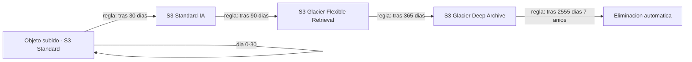
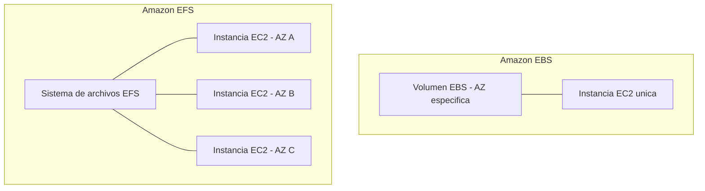
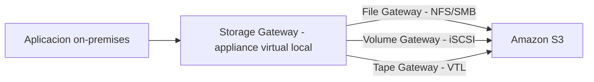
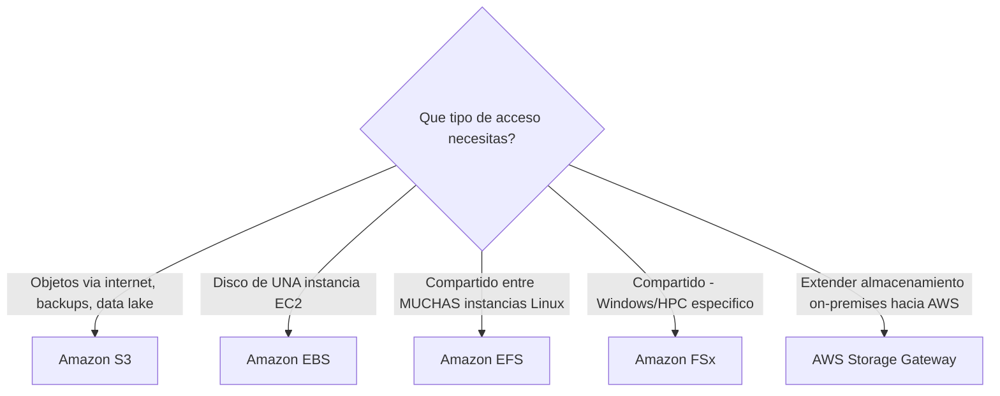

# AWS Certified Cloud Practitioner (CLF-C02)

**PARTE 5 — Almacenamiento**

*En este capítulo vemos dónde 'viven' los datos en AWS: desde objetos accesibles por internet (S3) hasta discos virtuales de altísimo rendimiento (EBS) y sistemas de archivos compartidos (EFS/FSx).*

## 1. Objetivos del capítulo

### ¿Qué aprenderé?

- Qué es Amazon S3, cómo funciona el versionado y las reglas de ciclo de vida (lifecycle).
- Las distintas clases de almacenamiento de S3 y cuándo usar cada una, incluyendo Glacier.
- Qué es Amazon EBS y cuándo usarlo frente a otras opciones de almacenamiento.
- Qué es Amazon EFS y en qué se diferencia fundamentalmente de EBS.
- Qué es Amazon FSx y cuándo se necesita frente a EFS.
- Qué es AWS Storage Gateway y cómo conecta entornos on-premises con AWS.

### ¿Por qué es importante?

El almacenamiento, junto con el cómputo, es uno de los dos pilares más preguntados del examen. A diferencia del cómputo (donde la pregunta suele ser 'qué tan administrado quiero que sea'), en almacenamiento la pregunta clave casi siempre es 'qué tipo de acceso necesito' (objeto vía internet, bloque para un servidor, o archivo compartido entre varios).

### ¿Cómo aparece en el examen?

Es habitual encontrar preguntas centradas en elegir la clase de almacenamiento de S3 correcta según el patrón de acceso descrito (frecuente, infrecuente, archivado, desconocido), y preguntas que piden distinguir cuándo usar EBS vs EFS vs S3 según si el almacenamiento se comparte entre instancias o no.

## 2. Teoría

### 2.1 Los tres tipos fundamentales de almacenamiento en la nube

Antes de entrar en los servicios específicos de AWS, es útil entender que existen tres categorías fundamentales de almacenamiento, y AWS tiene servicios dedicados a cada una:

- Almacenamiento de objetos (Object storage): los datos se guardan como 'objetos' completos (un archivo + metadatos), identificados por una clave única, accesibles vía API/HTTP. No tiene jerarquía de carpetas real (aunque se simula con prefijos). Ejemplo: Amazon S3.
- Almacenamiento en bloque (Block storage): los datos se dividen en bloques de tamaño fijo, como un disco duro tradicional. Se adjunta típicamente a un solo servidor a la vez. Ejemplo: Amazon EBS.
- Almacenamiento en archivos (File storage): un sistema de archivos jerárquico tradicional (carpetas y subcarpetas), accesible mediante protocolos de red como NFS o SMB, montable por múltiples servidores simultáneamente. Ejemplo: Amazon EFS, Amazon FSx.

### 2.2 Amazon S3 (Simple Storage Service)

S3 es el servicio de almacenamiento de objetos de AWS: prácticamente ilimitado en capacidad, con una durabilidad diseñada del 99.999999999% (11 nueves) gracias a la replicación automática entre múltiples Availability Zones dentro de la Región. Los datos se organizan en buckets (contenedores con nombre único global) y cada objeto dentro de un bucket se identifica por una clave (key).

S3 es ampliamente usado para: alojar sitios web estáticos, almacenar backups, servir como origen de contenido para CloudFront, almacenar data lakes para análisis de big data, y como destino de logs de otros servicios de AWS.

#### Versionado (Versioning)

Cuando se activa el versionado en un bucket, S3 conserva todas las versiones de un objeto cada vez que se sube uno nuevo con la misma clave o se 'elimina' (una eliminación con versionado activo en realidad solo añade un 'marcador de eliminación', sin borrar las versiones anteriores). Esto protege contra sobrescrituras y eliminaciones accidentales, permitiendo restaurar cualquier versión anterior. Una vez activado, el versionado no puede desactivarse completamente, solo suspenderse.

#### Reglas de ciclo de vida (Lifecycle Policies)

Permiten automatizar la transición de objetos entre clases de almacenamiento, o su eliminación, según reglas basadas en tiempo (por ejemplo, 'mover a S3 Standard-IA después de 30 días, a Glacier después de 90 días, y eliminar después de 365 días'). Esto optimiza costos sin requerir intervención manual continua.

#### Clases de almacenamiento de S3

| Clase | Disponibilidad / AZ | Tiempo de recuperación | Caso de uso típico |
| --- | --- | --- | --- |
| S3 Standard | Múltiples AZ | Milisegundos (inmediato) | Datos de acceso frecuente |
| S3 Intelligent-Tiering | Múltiples AZ | Milisegundos (inmediato) | Patrón de acceso desconocido o cambiante |
| S3 Standard-IA | Múltiples AZ | Milisegundos (inmediato) | Acceso infrecuente pero que requiere inmediatez |
| S3 One Zone-IA | Una sola AZ | Milisegundos (inmediato) | Acceso infrecuente, datos recreables, menor costo |
| S3 Glacier Instant Retrieval | Múltiples AZ | Milisegundos (inmediato) | Archivado con necesidad de acceso instantáneo ocasional |
| S3 Glacier Flexible Retrieval | Múltiples AZ | Minutos a horas | Archivado, backups a largo plazo |
| S3 Glacier Deep Archive | Múltiples AZ | Horas (hasta 12h) | Archivado a largo plazo, cumplimiento regulatorio, costo mínimo |

#### S3 Object Lock

Permite bloquear un objeto (o una versión específica) para que no pueda ser sobrescrito ni eliminado durante un periodo determinado, o de forma indefinida, cumpliendo requisitos regulatorios tipo WORM (Write Once, Read Many). Requiere versionado activo.

### 2.3 Amazon EBS (Elastic Block Store)

EBS proporciona volúmenes de almacenamiento en bloque persistente que se adjuntan a instancias EC2, comportándose como discos duros virtuales. A diferencia de S3, un volumen EBS típicamente se adjunta a una sola instancia EC2 a la vez (con la excepción de volúmenes configurados con Multi-Attach, un caso especial), y vive dentro de una Availability Zone específica — no se puede adjuntar directamente a una instancia en otra AZ.

EBS ofrece distintos tipos de volumen: SSD de propósito general (gp3, gp2), SSD de IOPS provisionadas (io2, io1) para cargas con requisitos de rendimiento muy exigentes (como bases de datos transaccionales), y HDD (st1, sc1) para cargas de trabajo secuenciales de gran volumen o almacenamiento frío de bajo costo.

EBS Snapshots permiten crear copias de respaldo puntuales de un volumen, almacenadas de forma incremental en S3 (aunque no se accede a ellas directamente como objetos S3), útiles para backups y para crear nuevos volúmenes idénticos rápidamente.

### 2.4 Amazon EFS (Elastic File System)

EFS es un sistema de archivos totalmente administrado y compatible con el protocolo NFS (Network File System), diseñado para ser montado simultáneamente por miles de instancias EC2 (u otros recursos, como contenedores) desde múltiples Availability Zones al mismo tiempo, con lectura y escritura concurrente. Escala automáticamente su capacidad según los datos almacenados, sin necesidad de aprovisionar un tamaño fijo por adelantado como ocurre con EBS.

> **Diferencia clave:** EBS = 'disco duro' de UNA instancia (salvo Multi-Attach). EFS = sistema de archivos compartido por MUCHAS instancias a la vez, incluso en distintas AZ.

### 2.5 Amazon FSx

Mientras que EFS está basado en NFS (el estándar de Linux/Unix), Amazon FSx ofrece sistemas de archivos administrados compatibles con motores específicos que EFS no cubre:

- FSx for Windows File Server: compatible con el protocolo SMB y con integración nativa a Active Directory, ideal para cargas de trabajo Windows que requieren un file server tradicional.
- FSx for Lustre: sistema de archivos de altísimo rendimiento diseñado para computación de alto rendimiento (HPC), machine learning y procesamiento de medios, con integración directa a S3 para procesar datasets grandes.
- FSx for NetApp ONTAP y FSx for OpenZFS: para clientes que ya usan estas tecnologías on-premises y quieren la misma funcionalidad y compatibilidad en AWS durante una migración.

### 2.6 AWS Storage Gateway

Storage Gateway conecta aplicaciones on-premises con almacenamiento en la nube de AWS de forma transparente, mediante un appliance virtual (o hardware dedicado) que se instala en el entorno local y presenta interfaces de almacenamiento estándar que las aplicaciones existentes ya entienden, sin necesidad de reescribir software:

- File Gateway: presenta un sistema de archivos vía NFS o SMB, almacenando los archivos como objetos en S3.
- Volume Gateway: presenta volúmenes en bloque vía iSCSI, en modo 'cached' (datos completos en S3, caché local de lo más usado) o 'stored' (datos completos localmente, respaldo asíncrono en AWS).
- Tape Gateway: emula una biblioteca de cintas virtual (VTL) compatible con software de backup existente, almacenando los datos en AWS en vez de cintas físicas reales, útil para reemplazar infraestructura de backup en cinta tradicional.

## 3. Ejemplos

### Ejemplo empresarial

Una cadena de retail almacena las fotos de producto de su catálogo en S3 Standard (acceso frecuente durante campañas activas), configura una regla de lifecycle para mover automáticamente las fotos de campañas terminadas a S3 Glacier después de 180 días, y usa S3 Object Lock para conservar de forma inmutable los registros de auditoría financiera durante 7 años.

### Ejemplo de startup

Una startup de video bajo demanda usa Amazon FSx for Lustre para el procesamiento intensivo de renderizado y transcodificación de video en paralelo entre decenas de instancias EC2, y mueve los archivos finales terminados a S3 Standard para distribución vía CloudFront.

### Ejemplo personal

Un desarrollador que corre una base de datos MySQL en una instancia EC2 personal usa un volumen EBS gp3 como almacenamiento principal de la base de datos, y programa snapshots diarios automáticos como estrategia simple de backup.

### Caso real de Storage Gateway

Un hospital con un sistema de archivado de imágenes médicas (PACS) on-premises usa AWS Storage Gateway (File Gateway) para extender su almacenamiento local hacia S3 de forma transparente, sin modificar el software del PACS, liberando espacio en sus servidores locales mientras mantiene acceso rápido a los estudios más recientes gracias a la caché local del gateway.

## 4. Diagramas

Diagramas en formato Mermaid — pégalos en mermaid.live o cualquier visor compatible para verlos renderizados.

### 4.1 Ciclo de vida de un objeto en S3 (Lifecycle)

### 4.2 EBS vs EFS: adjunto único vs compartido

### 4.3 AWS Storage Gateway conectando on-premises con AWS

### 4.4 Árbol de decisión: qué tipo de almacenamiento elegir

## 5. Laboratorios

### Laboratorio 1: Crear un bucket S3, activar versionado y configurar lifecycle

Costo aproximado: la capa gratuita de S3 incluye 5 GB de almacenamiento Standard durante 12 meses; este laboratorio usa archivos pequeños de prueba, por lo que el costo esperado es $0.

1. Ve a la consola de S3 → Create bucket.
2. Elige un nombre único globalmente (ej. 'mi-bucket-curso-clf-c02-tunombre') y la Región us-east-1.
3. En 'Bucket Versioning', selecciona 'Enable'.
4. Deja el resto de opciones por defecto y crea el bucket.
5. Entra al bucket y sube un archivo de texto de prueba (ej. 'notas.txt').
6. Edita el archivo localmente, cambia el contenido, y vuelve a subirlo con el mismo nombre.
7. En la consola del bucket, activa el toggle 'Show versions' — deberías ver ambas versiones del archivo, cada una con su Version ID.
8. Ve a la pestaña 'Management' → 'Create lifecycle rule'.
9. Nombra la regla (ej. 'mover-a-IA-despues-30-dias'), aplícala a todos los objetos del bucket, y configura una transición a 'Standard-IA' después de 30 días (para efectos del laboratorio, solo estamos configurando la regla, no esperando a que se ejecute).
> **Cómo eliminar los recursos:** Para eliminar el bucket, primero debes eliminar TODAS las versiones de TODOS los objetos (con versionado activo, un 'delete' normal solo agrega un marcador). Usa 'Empty bucket' desde la consola, que elimina todas las versiones, y luego elimina el bucket.

### Laboratorio 2: Crear y adjuntar un volumen EBS adicional a una instancia EC2

Costo aproximado: un volumen EBS gp3 de 8 GB cuesta aproximadamente $0.08/mes en us-east-1 (los primeros 30 GB de almacenamiento gp2/gp3 están cubiertos por Free Tier durante los primeros 12 meses).

10. Si no tienes una instancia EC2 corriendo, lanza una siguiendo el laboratorio de la Parte 4 (t2.micro/t3.micro, Free Tier eligible).
11. Ve a EC2 → Volumes → Create volume.
12. Elige el tipo 'gp3', tamaño 8 GB, y la MISMA Availability Zone donde está tu instancia (esto es obligatorio: un volumen EBS solo puede adjuntarse a instancias de su misma AZ).
13. Crea el volumen.
14. Selecciona el volumen recién creado → Actions → Attach volume, y elige tu instancia EC2.
15. Conéctate a la instancia (Session Manager o SSH) y ejecuta 'lsblk' para confirmar que el nuevo disco aparece (ej. como /dev/xvdf).
16. Formatea y monta el volumen (ej. 'sudo mkfs -t xfs /dev/xvdf && sudo mkdir /data && sudo mount /dev/xvdf /data') para dejarlo listo para usarse.
> **Cómo eliminar los recursos:** Desmonta el volumen, ve a EC2 → Volumes → selecciona el volumen → Actions → Detach volume, y después Actions → Delete volume. Ten en cuenta que al terminar una instancia, el volumen raíz normalmente se elimina automáticamente, pero un volumen adicional adjuntado manualmente puede NO eliminarse solo — revisa siempre la lista de Volumes tras terminar una instancia.

## 6. Errores comunes

- Pensar que un objeto 'eliminado' en un bucket con versionado activo desaparece por completo — en realidad solo se agrega un marcador de eliminación (delete marker), y las versiones anteriores siguen existiendo (y siguen generando costo) hasta que se eliminen explícitamente.
- Intentar adjuntar un volumen EBS a una instancia EC2 en una Availability Zone distinta — un volumen EBS vive en una AZ específica y solo puede adjuntarse a instancias de esa misma AZ.
- Elegir S3 Glacier Deep Archive para datos que se necesitan recuperar rápidamente — su tiempo de recuperación puede ser de varias horas, no es apto para acceso urgente.
- Confundir EFS con EBS: EFS se comparte entre muchas instancias en distintas AZ; EBS, salvo el caso especial de Multi-Attach, se adjunta a una sola instancia.
- Olvidar vaciar por completo un bucket con versionado (todas las versiones y delete markers) antes de intentar eliminarlo — S3 no permite eliminar un bucket que aún contiene objetos o versiones.
- Usar S3 Standard para datos que casi nunca se acceden, pagando de más, cuando una clase IA o Glacier reduciría significativamente el costo.

## 7. Comparaciones

### EBS vs EFS vs S3

| Característica | Amazon EBS | Amazon EFS | Amazon S3 |
| --- | --- | --- | --- |
| Tipo | Bloque | Archivo (NFS) | Objeto |
| Se comparte entre instancias | No (salvo Multi-Attach) | Sí, incluso entre AZ | Sí, vía API/HTTP |
| Ámbito geográfico | Una Availability Zone | Múltiples AZ de una Región | Toda la Región (o global con replicación) |
| Caso de uso típico | Disco de un servidor, bases de datos | Contenido compartido, home directories | Backups, sitios estáticos, data lakes |

### S3 Standard vs S3 IA vs Glacier

Standard = acceso frecuente, sin cargo por recuperación. IA (Infrequent Access) = menor costo de almacenamiento, cargo por recuperación, pero acceso instantáneo. Glacier (en sus variantes) = el menor costo de almacenamiento, pero con tiempos de recuperación que van de minutos (Instant Retrieval) a horas (Deep Archive).

## 8. Preguntas tipo examen

20 preguntas de opción múltiple, mismo estilo y dificultad que el examen oficial CLF-C02.

**Pregunta 1.** Una empresa necesita almacenar millones de imágenes de usuarios, accesibles vía internet, con alta durabilidad y sin límite práctico de capacidad. ¿Qué servicio de almacenamiento de AWS es el más adecuado?

A) Amazon EBS

**B)** **Amazon S3**

C) Amazon EFS

D) AWS Storage Gateway

**Respuesta correcta: B.** 

*Amazon S3 (Simple Storage Service) es almacenamiento de objetos diseñado para durabilidad extremadamente alta (99.999999999%, 11 nueves), escalabilidad prácticamente ilimitada, y acceso directo vía internet mediante URLs, ideal para este caso de uso.*

**Pregunta 2.** ¿Qué es el versionado (versioning) en Amazon S3?

A) Una función que borra automáticamente archivos antiguos

**B)** **Una función que mantiene múltiples variantes de un mismo objeto en el mismo bucket, permitiendo recuperar o restaurar versiones anteriores**

C) El número de versión del motor de S3

D) Un tipo de clase de almacenamiento

**Respuesta correcta: B.** 

*El versionado permite que S3 conserve todas las versiones de un objeto (cada vez que se sube uno nuevo con la misma clave, o se elimina), lo cual protege contra sobrescrituras y eliminaciones accidentales, permitiendo restaurar una versión anterior en cualquier momento.*

**Pregunta 3.** Una empresa quiere reducir automáticamente el costo de almacenamiento de archivos que se acceden frecuentemente durante los primeros 30 días, pero rara vez después. ¿Qué función de S3 resuelve esto sin intervención manual?

A) S3 Object Lock

**B)** **S3 Lifecycle Policies (reglas de ciclo de vida)**

C) S3 Versioning

D) S3 Transfer Acceleration

**Respuesta correcta: B.** 

*Las reglas de ciclo de vida (Lifecycle Policies) de S3 permiten transicionar automáticamente objetos entre clases de almacenamiento (por ejemplo, de S3 Standard a S3 Standard-IA después de 30 días, y a S3 Glacier después de 90 días) o eliminarlos, según reglas basadas en tiempo, sin intervención manual.*

**Pregunta 4.** ¿Cuál de las siguientes clases de almacenamiento de S3 está diseñada específicamente para archivado a muy largo plazo, con el costo por GB más bajo, pero con tiempos de recuperación que pueden tardar de minutos a horas?

A) S3 Standard

B) S3 Intelligent-Tiering

**C)** **S3 Glacier Deep Archive**

D) S3 One Zone-IA

**Respuesta correcta: C.** 

*S3 Glacier Deep Archive es la clase de almacenamiento más económica de S3, pensada para datos que rara vez (o nunca) se necesitan recuperar, como archivado regulatorio a largo plazo. A cambio de ese bajo costo, la recuperación puede tardar horas, no está pensada para acceso rápido.*

**Pregunta 5.** ¿Qué tipo de almacenamiento de AWS se comporta como un disco duro virtual, se adjunta a UNA sola instancia EC2 a la vez (en la mayoría de los casos), y es ideal para el volumen raíz de un sistema operativo o bases de datos?

A) Amazon S3

**B)** **Amazon EBS (Elastic Block Store)**

C) Amazon EFS

D) AWS Snowball

**Respuesta correcta: B.** 

*Amazon EBS proporciona almacenamiento en bloque persistente que se adjunta a una instancia EC2 como si fuera un disco duro virtual, ideal para el volumen raíz del sistema operativo o para bases de datos que requieren baja latencia de I/O consistente.*

**Pregunta 6.** Una aplicación necesita que múltiples instancias EC2, en distintas Availability Zones, accedan y modifiquen simultáneamente el mismo sistema de archivos compartido. ¿Qué servicio de almacenamiento es el más adecuado?

A) Amazon EBS

**B)** **Amazon EFS (Elastic File System)**

C) Amazon S3 Glacier

D) Amazon Lightsail

**Respuesta correcta: B.** 

*Amazon EFS es un sistema de archivos totalmente administrado, compatible con el protocolo NFS, que puede ser montado simultáneamente por múltiples instancias EC2 en distintas Availability Zones, a diferencia de EBS que típicamente se adjunta a una sola instancia a la vez.*

**Pregunta 7.** ¿Qué es Amazon FSx?

A) Un servicio de almacenamiento de objetos económico

**B)** **Un servicio de sistemas de archivos totalmente administrados, optimizado para motores específicos como Windows File Server, Lustre, NetApp ONTAP o OpenZFS**

C) Un tipo de instancia EC2

D) Un servicio exclusivo de backup

**Respuesta correcta: B.** 

*Amazon FSx ofrece sistemas de archivos administrados con la compatibilidad exacta y el rendimiento de motores de archivos específicos: FSx for Windows File Server (compatible con SMB y Active Directory), FSx for Lustre (alto rendimiento para HPC y machine learning), entre otros, cubriendo necesidades que EFS (basado en NFS) no cubre.*

**Pregunta 8.** Una empresa con un data center on-premises quiere extender su almacenamiento local hacia la nube de forma transparente para sus aplicaciones existentes, sin reescribir su software. ¿Qué servicio de AWS es el más adecuado?

**A)** **AWS Storage Gateway**

B) Amazon S3 exclusivamente

C) Amazon EBS exclusivamente

D) AWS Direct Connect exclusivamente

**Respuesta correcta: A.** 

*AWS Storage Gateway conecta entornos on-premises con el almacenamiento en la nube de AWS, presentando interfaces estándar (NFS/SMB para File Gateway, iSCSI para Volume Gateway, VTL para Tape Gateway) que las aplicaciones existentes pueden usar sin modificaciones, mientras los datos se almacenan de forma transparente en AWS.*

**Pregunta 9.** ¿Cuál es la diferencia principal entre Amazon EBS y Amazon EFS en cuanto a cómo se comparte el almacenamiento?

A) No hay diferencia, ambos son idénticos

**B)** **EBS típicamente se adjunta a una sola instancia EC2 a la vez; EFS puede ser montado simultáneamente por múltiples instancias en distintas AZ**

C) EFS solo funciona con Windows; EBS solo con Linux

D) EBS es más barato que EFS en todos los casos de uso

**Respuesta correcta: B.** 

*EBS es almacenamiento en bloque diseñado para adjuntarse típicamente a una sola instancia EC2 (salvo el caso especial de Multi-Attach en volúmenes io1/io2). EFS es un sistema de archivos compartido de red (NFS) diseñado desde el inicio para ser montado por múltiples instancias simultáneamente.*

**Pregunta 10.** Una empresa financiera debe conservar registros de transacciones por 7 años debido a regulaciones, con acceso extremadamente infrecuente pero garantizando que los archivos no puedan ser modificados ni eliminados antes de ese plazo. ¿Qué combinación de funciones de S3 resuelve este requisito?

A) S3 Standard sin ninguna configuración adicional

**B)** **S3 Glacier o Glacier Deep Archive combinado con S3 Object Lock en modo de cumplimiento (Compliance mode)**

C) Solo versionado, sin clase de almacenamiento especial

D) Amazon EBS con snapshots diarios

**Respuesta correcta: B.** 

*S3 Object Lock permite bloquear objetos para que no puedan eliminarse ni sobrescribirse durante un periodo definido (o indefinidamente), cumpliendo requisitos regulatorios tipo WORM (Write Once Read Many). Combinado con una clase de almacenamiento de archivado como Glacier o Glacier Deep Archive, se optimiza también el costo para datos de acceso infrecuente a largo plazo.*

**Pregunta 11.** ¿Qué ocurre con las versiones anteriores de un objeto en S3 si NO se activa el versionado y subes un nuevo archivo con el mismo nombre (key)?

A) Se conservan automáticamente todas las versiones anteriores

**B)** **El objeto anterior se sobrescribe permanentemente y no se puede recuperar**

C) AWS pide confirmación antes de sobrescribir

D) El archivo nuevo se rechaza automáticamente

**Respuesta correcta: B.** 

*Sin versionado activado, subir un objeto con el mismo nombre de clave sobrescribe el objeto anterior de forma permanente, sin posibilidad de recuperación. Esta es una de las razones principales por las que se recomienda activar versionado en buckets con datos importantes.*

**Pregunta 12.** Una startup necesita almacenamiento de bajo costo para datos que se acceden con poca frecuencia pero que deben estar disponibles de inmediato (milisegundos) cuando se necesiten, sin tiempos de espera de recuperación. ¿Qué clase de S3 encaja mejor?

A) S3 Glacier Deep Archive

**B)** **S3 Standard-Infrequent Access (S3 Standard-IA)**

C) S3 Glacier Flexible Retrieval

D) Amazon EBS Cold HDD

**Respuesta correcta: B.** 

*S3 Standard-IA está diseñado exactamente para este caso: menor costo de almacenamiento que S3 Standard a cambio de un cargo por recuperación, pero manteniendo acceso instantáneo (milisegundos) cuando se necesita el dato, a diferencia de las clases Glacier que tienen tiempos de recuperación de minutos a horas.*

**Pregunta 13.** ¿Qué hace la clase de almacenamiento S3 Intelligent-Tiering?

A) Requiere que el usuario mueva manualmente los objetos entre niveles de acceso

**B)** **Mueve automáticamente los objetos entre niveles de acceso frecuente e infrecuente (y opcionalmente archivado) según los patrones de acceso reales, sin penalización por recuperación ni gestión manual**

C) Es la clase de almacenamiento más cara de todo S3

D) Solo está disponible para archivos menores a 1 MB

**Respuesta correcta: B.** 

*S3 Intelligent-Tiering monitorea los patrones de acceso de cada objeto y lo mueve automáticamente entre niveles de costo (frecuente, infrecuente, y opcionalmente archivado) sin cargos de recuperación ni intervención manual, ideal cuando no se conoce de antemano el patrón de acceso de los datos.*

**Pregunta 14.** Una empresa necesita transferir 100 TB de datos desde su data center on-premises hacia AWS, y su conexión a internet es demasiado lenta para hacerlo en un tiempo razonable. ¿Qué servicio de la familia Snow debería considerar?

A) AWS Storage Gateway

**B)** **AWS Snowball (dispositivo físico de transferencia masiva de datos)**

C) Amazon S3 Transfer Acceleration exclusivamente

D) Amazon EFS

**Respuesta correcta: B.** 

*AWS Snowball es un dispositivo físico que AWS envía al cliente para cargar grandes volúmenes de datos localmente y luego enviarlo de vuelta a AWS para su ingesta, evitando el cuello de botella de una conexión de internet lenta para transferencias masivas (se profundiza en la Parte 13).*

**Pregunta 15.** ¿Cuál de las siguientes afirmaciones sobre la durabilidad de Amazon S3 Standard es correcta?

**A)** **S3 Standard está diseñado para una durabilidad del 99.999999999% (11 nueves) replicando datos automáticamente entre múltiples Availability Zones**

B) S3 Standard almacena los datos en una sola Availability Zone únicamente

C) La durabilidad de S3 depende de que el cliente configure manualmente la replicación

D) S3 no ofrece ninguna garantía de durabilidad

**Respuesta correcta: A.** 

*Amazon S3 Standard está diseñado para una durabilidad del 99.999999999% (conocida como '11 nueves'), lograda mediante la replicación automática de los datos entre múltiples Availability Zones dentro de la Región, sin que el cliente tenga que configurar nada adicional para lograrlo.*

**Pregunta 16.** Una empresa de medios necesita almacenamiento de alto rendimiento y baja latencia compartido entre cientos de instancias EC2 que procesan renderizado de video en paralelo, similar a un sistema de archivos HPC tradicional. ¿Qué servicio es el más adecuado?

A) Amazon S3 Standard

**B)** **Amazon FSx for Lustre**

C) AWS Storage Gateway (Tape Gateway)

D) Amazon EBS Cold HDD

**Respuesta correcta: B.** 

*Amazon FSx for Lustre está diseñado específicamente para cargas de trabajo de computación de alto rendimiento (HPC), machine learning y procesamiento de medios que requieren almacenamiento compartido de muy alto throughput y baja latencia entre muchas instancias simultáneas.*

**Pregunta 17.** ¿Qué tipo de Storage Gateway presentaría un dispositivo de almacenamiento en bloque (similar a iSCSI) para que servidores on-premises lo usen como si fuera un disco local, mientras los datos se replican a AWS?

A) File Gateway

**B)** **Volume Gateway**

C) Tape Gateway

D) Amazon EFS

**Respuesta correcta: B.** 

*AWS Storage Gateway Volume Gateway presenta volúmenes de almacenamiento en bloque mediante el protocolo iSCSI hacia servidores on-premises, con dos modos: 'cached volumes' (los datos completos viven en S3, con una caché local de los más usados) y 'stored volumes' (los datos completos viven localmente, con backups asíncronos hacia AWS).*

**Pregunta 18.** ¿Cuál de las siguientes opciones NO es un beneficio típico de usar reglas de ciclo de vida (Lifecycle) en S3?

A) Reducir automáticamente costos de almacenamiento moviendo datos antiguos a clases más económicas

B) Eliminar automáticamente objetos después de un periodo definido

**C)** **Aumentar automáticamente la durabilidad de los objetos por encima del 99.999999999%**

D) Automatizar la transición entre clases de almacenamiento sin intervención manual

**Respuesta correcta: C.** 

*La durabilidad de S3 Standard ya es del 99.999999999% (11 nueves) de forma inherente al servicio; las reglas de ciclo de vida no la 'aumentan', solo gestionan costos y transición automática de clases de almacenamiento o eliminación de objetos según reglas de tiempo.*

**Pregunta 19.** Un equipo de desarrollo necesita el volumen raíz para el sistema operativo de una nueva instancia EC2 que ejecutará una base de datos con requerimientos de baja latencia consistente. ¿Qué tipo de almacenamiento deben usar?

A) Amazon S3

**B)** **Amazon EBS (por ejemplo, un volumen tipo gp3 o io2)**

C) Amazon EFS

D) AWS Snowball

**Respuesta correcta: B.** 

*El volumen raíz de una instancia EC2, así como el almacenamiento de bases de datos que requieren baja latencia consistente de I/O, se implementa con Amazon EBS, que ofrece distintos tipos de volumen (gp3 de propósito general, io2 de alto rendimiento, entre otros) según los requisitos de rendimiento.*

**Pregunta 20.** Una empresa quiere compartir un mismo conjunto de archivos de configuración entre 50 instancias EC2 Linux que corren en tres Availability Zones distintas, con la posibilidad de que todas lean y escriban simultáneamente. ¿Qué servicio de almacenamiento cumple este requisito de la forma más directa?

A) Amazon EBS con Multi-Attach en un solo volumen

**B)** **Amazon EFS montado simultáneamente en las 50 instancias vía NFS**

C) Amazon S3 Glacier Deep Archive

D) AWS Snowball

**Respuesta correcta: B.** 

*Amazon EFS está diseñado exactamente para este escenario: un sistema de archivos compartido vía NFS, accesible simultáneamente por múltiples instancias EC2 Linux en distintas Availability Zones, con lectura y escritura concurrente, sin las limitaciones de adjuntar un mismo volumen EBS a decenas de instancias.*

## 9. Resumen

### Resumen ejecutivo

AWS ofrece tres tipos fundamentales de almacenamiento: objetos (S3, ilimitado, accesible vía internet, con clases de costo desde Standard hasta Glacier Deep Archive, versionado y lifecycle para automatizar costos), bloque (EBS, discos virtuales atados a una AZ y típicamente a una sola instancia) y archivo (EFS para NFS compartido entre AZ, FSx para motores específicos como Windows/Lustre). AWS Storage Gateway extiende el almacenamiento de AWS hacia entornos on-premises mediante interfaces estándar (NFS/SMB, iSCSI, VTL).

### Conceptos clave (memorizar)

- **S3 = objetos, ilimitado, 11 nueves de durabilidad, accesible vía HTTP.**
- **EBS = bloque, una AZ, típicamente una sola instancia — es 'el disco duro' de un servidor.**
- **EFS = archivo NFS, compartido entre múltiples AZ e instancias simultáneamente.**
- **Lifecycle automatiza transición de clases o eliminación; Versioning protege contra sobrescritura/eliminación accidental.**
- **Glacier = archivado, más barato, recuperación de minutos a horas — no usar para acceso urgente.**
- **Storage Gateway conecta on-premises con AWS sin reescribir aplicaciones (File/Volume/Tape Gateway).**

### Lo que normalmente pregunta AWS

Escenarios que describen un patrón de acceso a datos (frecuente, infrecuente con necesidad de inmediatez, archivado a largo plazo) esperando que elijas la clase de S3 correcta, y escenarios que describen si el almacenamiento debe compartirse entre instancias o no, para distinguir entre EBS, EFS y S3.

## Recursos externos para este capítulo

### Documentación oficial

- Amazon S3 User Guide — docs.aws.amazon.com/s3
- Amazon S3 Storage Classes — aws.amazon.com/s3/storage-classes
- Amazon EBS User Guide — docs.aws.amazon.com/ebs
- Amazon EFS User Guide — docs.aws.amazon.com/efs
- Amazon FSx — aws.amazon.com/fsx
- AWS Storage Gateway User Guide — docs.aws.amazon.com/storagegateway

### Videos recomendados

- AWS Skill Builder: módulo de Storage dentro de 'Cloud Practitioner Essentials'.
- Stephane Maarek: sección de S3 deep dive de su curso CLF-C02, muy detallada sobre clases de almacenamiento.
- Digital Cloud Training: comparativas EBS vs EFS vs S3.

### Laboratorios adicionales

- AWS Skill Builder Labs: 'Introduction to Amazon S3' y 'Working with Amazon EBS'.
- AWS Well-Architected Labs: ejercicios de optimización de costos de almacenamiento con lifecycle policies.