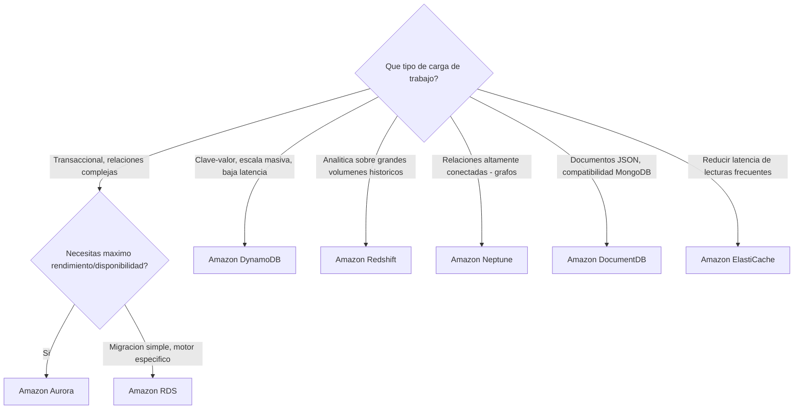
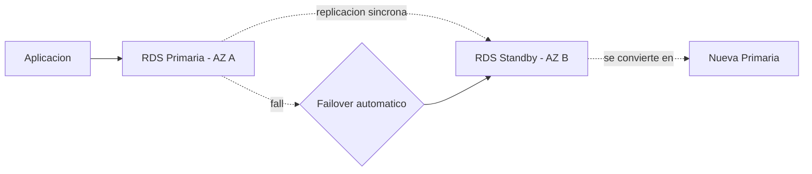
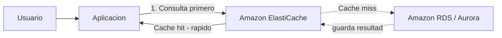
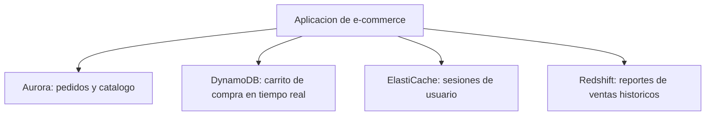

# AWS Certified Cloud Practitioner (CLF-C02)

**PARTE 6 — Bases de Datos**

*AWS no ofrece 'una' base de datos, sino una familia de servicios especializados según el modelo de datos y el patrón de acceso. Este capítulo enseña a elegir el correcto, no a memorizar cada uno de forma aislada.*

## 1. Objetivos del capítulo

### ¿Qué aprenderé?

- La diferencia fundamental entre bases de datos relacionales (SQL) y no relacionales (NoSQL).
- Qué es Amazon RDS, sus motores soportados, y qué es Multi-AZ vs Read Replicas.
- Qué es Amazon Aurora y por qué existe además de RDS estándar.
- Qué es Amazon DynamoDB y cuándo elegir NoSQL sobre SQL.
- Para qué sirven ElastiCache, Redshift, Neptune y DocumentDB, cada uno con su especialidad.

### ¿Por qué es importante?

Uno de los errores más comunes de quienes empiezan en la nube es intentar usar 'una sola base de datos para todo'. AWS ofrece servicios especializados porque cada tipo de carga de trabajo (transaccional, analítica, caché, grafos, documentos) tiene necesidades de rendimiento y modelado muy distintas. El examen evalúa precisamente esa capacidad de elegir el servicio correcto según el escenario.

### ¿Cómo aparece en el examen?

Las preguntas de bases de datos casi siempre presentan un escenario de negocio (tipo de datos, patrón de acceso, volumen) y piden identificar cuál de 4 servicios de base de datos distintos encaja mejor — es uno de los dominios donde memorizar 'para qué sirve cada uno' de forma clara paga más dividendos que en casi cualquier otro tema del examen.

## 2. Teoría

### 2.1 SQL (relacional) vs NoSQL (no relacional): la decisión fundamental

Antes de ver cada servicio, es clave entender la diferencia de fondo. Las bases de datos relacionales organizan los datos en tablas con un esquema fijo (columnas predefinidas) y permiten relacionar tablas entre sí mediante JOINs, usando el lenguaje SQL. Son ideales cuando los datos tienen relaciones complejas y estructuradas, y cuando se necesita flexibilidad de consulta (no se sabe de antemano exactamente qué se va a preguntar).

Las bases de datos NoSQL abandonan el esquema fijo y las relaciones complejas a cambio de escalabilidad horizontal más simple y rendimiento predecible a cualquier escala, normalmente accediendo a los datos por una clave conocida de antemano (en vez de consultas relacionales flexibles). Dentro de NoSQL existen distintos modelos: clave-valor/documento (DynamoDB, DocumentDB), grafos (Neptune), entre otros.

> **Pregunta clave para decidir:** ¿Necesito relaciones complejas y consultas flexibles no anticipadas? → probablemente SQL (RDS/Aurora). ¿Necesito acceso ultrarrápido por una clave conocida, a cualquier escala, con un esquema simple? → probablemente NoSQL (DynamoDB).

### 2.2 Amazon RDS (Relational Database Service)

RDS es un servicio administrado de bases de datos relacionales que soporta varios motores: MySQL, PostgreSQL, MariaDB, Oracle, SQL Server, y Amazon Aurora (que veremos aparte). AWS se encarga de tareas operativas como aprovisionamiento de hardware, instalación del motor, parches, backups automáticos y replicación, dejando al cliente enfocarse en el modelado de datos y las consultas.

#### RDS Multi-AZ vs Read Replicas

Estas dos funcionalidades de RDS se confunden con frecuencia porque ambas involucran 'copias' de la base de datos, pero resuelven problemas distintos:

| Característica | Multi-AZ | Read Replicas |
| --- | --- | --- |
| Propósito principal | Alta disponibilidad / disaster recovery | Escalar el rendimiento de lecturas |
| ¿Se puede leer de la réplica directamente? | No (es standby, solo se activa en failover) | Sí, está diseñada para recibir tráfico de lectura activo |
| Failover automático | Sí, automático ante fallo de la primaria | No automático (requiere promoción manual) |
| Ubicación | Otra Availability Zone (misma Región) | Misma Región o incluso otra Región distinta |

### 2.3 Amazon Aurora

Aurora es un motor de base de datos relacional diseñado por AWS desde cero para la nube, compatible con las APIs de MySQL y PostgreSQL (lo que significa que herramientas, drivers y consultas existentes de esos motores funcionan sin cambios), pero con una arquitectura de almacenamiento distribuido y auto-reparable propia de AWS que ofrece mayor rendimiento y disponibilidad que ejecutar esos mismos motores en RDS estándar. Aurora replica automáticamente el almacenamiento entre múltiples Availability Zones, y ofrece Aurora Serverless como variante que ajusta capacidad automáticamente según la demanda.

### 2.4 Amazon DynamoDB

DynamoDB es la base de datos NoSQL clave-valor/documento totalmente administrada de AWS. Está diseñada para ofrecer latencia consistente de un solo dígito de milisegundos sin importar la escala (desde unas pocas peticiones por segundo hasta millones), sin que el cliente tenga que aprovisionar ni gestionar servidores. Ofrece dos modos de capacidad: Provisioned (defines de antemano las unidades de lectura/escritura, con opción de Auto Scaling) y On-Demand (pagas por solicitud real, ideal para cargas impredecibles).

DynamoDB es la elección natural para casos de uso como: carritos de compra, estado de sesión, catálogos de acceso simple por ID, y cualquier aplicación que necesite escalar masivamente sin la complejidad operativa de gestionar servidores de base de datos.

### 2.5 Amazon ElastiCache

ElastiCache es un servicio de caché en memoria totalmente administrado, compatible con dos motores: Redis y Memcached. Se usa típicamente delante de una base de datos principal (RDS, Aurora, DynamoDB) para almacenar temporalmente los resultados de consultas frecuentes, reduciendo la carga sobre la base de datos y la latencia percibida por el usuario, ya que leer de memoria es órdenes de magnitud más rápido que leer de disco.

### 2.6 Amazon Redshift

Redshift es el servicio de data warehousing (almacén de datos analítico) de AWS, optimizado para cargas de trabajo OLAP (Online Analytical Processing): consultas complejas sobre grandes volúmenes de datos históricos, típicamente usadas para business intelligence y reportes. Usa almacenamiento columnar y procesamiento paralelo masivo (MPP) para ejecutar consultas analíticas sobre petabytes de datos de forma eficiente — algo muy distinto al patrón transaccional (OLTP) de RDS/Aurora/DynamoDB.

### 2.7 Amazon Neptune

Neptune es el servicio de base de datos de grafos totalmente administrado de AWS, optimizado para almacenar y navegar relaciones altamente conectadas entre entidades: redes sociales, sistemas de recomendación, detección de fraude, o gráficos de conocimiento. Modelar este tipo de relaciones en una base relacional tradicional requeriría JOINs extremadamente costosos a medida que crece la profundidad de las conexiones; Neptune está diseñado específicamente para que ese tipo de consultas sea eficiente.

### 2.8 Amazon DocumentDB

DocumentDB es el servicio de base de datos de documentos totalmente administrado de AWS, diseñado con compatibilidad con la API de MongoDB. Permite a equipos que ya usan (o quieren usar) un modelo de datos de documentos JSON/BSON migrar o construir aplicaciones con cambios mínimos de código frente a usar MongoDB directamente, aprovechando la administración totalmente gestionada de AWS (backups, parches, escalado).

| Servicio | Tipo de dato | Caso de uso principal |
| --- | --- | --- |
| RDS | Relacional (SQL) | Migraciones lift-and-shift, apps con relaciones complejas |
| Aurora | Relacional (SQL, compatible MySQL/PostgreSQL) | Igual que RDS pero con más rendimiento/disponibilidad |
| DynamoDB | NoSQL clave-valor / documento | Escala masiva, latencia mínima, acceso por clave |
| ElastiCache | Caché en memoria (Redis/Memcached) | Reducir latencia y carga de lecturas frecuentes |
| Redshift | Data warehouse (columnar, OLAP) | Analítica y BI sobre grandes volúmenes históricos |
| Neptune | Grafos | Relaciones altamente conectadas (social, fraude, recomendación) |
| DocumentDB | Documentos (compatible MongoDB) | Apps que ya usan o quieren modelo de documentos JSON |

## 3. Ejemplos

### Ejemplo empresarial

Un banco usa Aurora (compatible PostgreSQL) para su núcleo transaccional de cuentas bancarias (necesita fuerte consistencia y relaciones complejas), ElastiCache para cachear los saldos consultados con más frecuencia, y Redshift para los reportes mensuales de riesgo que analizan años de histórico de transacciones.

### Ejemplo de startup

Una startup de delivery de comida usa DynamoDB para almacenar el estado en tiempo real de cada pedido (accedido siempre por ID de pedido, con necesidad de latencia mínima durante picos de hora de almuerzo), evitando la complejidad de gestionar servidores de base de datos mientras el equipo es pequeño.

### Ejemplo personal

Un desarrollador que construye una aplicación personal de recetas de cocina usa RDS con PostgreSQL porque necesita relacionar recetas, ingredientes, categorías y valoraciones de usuarios de forma flexible, y el volumen de datos es pequeño, por lo que la simplicidad relacional pesa más que la escala masiva de NoSQL.

### Caso real de Neptune

Una plataforma de streaming musical usa Amazon Neptune para modelar las relaciones entre usuarios, artistas seguidos, playlists compartidas y patrones de escucha, permitiendo generar recomendaciones de 'usuarios con gustos similares a los tuyos' de forma mucho más eficiente que si tuviera que calcularlo con JOINs relacionales profundos.

## 4. Diagramas

Diagramas en formato Mermaid — pégalos en mermaid.live o cualquier visor compatible para verlos renderizados.

### 4.1 Árbol de decisión: qué base de datos elegir

### 4.2 RDS Multi-AZ: failover automático

### 4.3 ElastiCache como capa de caché

### 4.4 Arquitectura políglota: distintas bases para distintas necesidades

## 5. Laboratorios

### Laboratorio 1: Lanzar una base de datos RDS Free Tier (MySQL)

Costo: cubierto por Free Tier durante los primeros 12 meses (750 horas/mes de db.t2.micro/db.t3.micro, 20 GB de almacenamiento). Fuera de Free Tier, una db.t3.micro cuesta aproximadamente $0.017/hora en us-east-1.

1. Ve a la consola de RDS → Create database.
2. Elige 'Standard create' y el motor 'MySQL'.
3. En 'Templates', selecciona 'Free tier'.
4. Define un identificador (ej. 'mi-primera-rds'), usuario maestro y contraseña (guárdala de forma segura).
5. Verifica que el tipo de instancia sea db.t3.micro o db.t2.micro (Free Tier eligible) y el almacenamiento no exceda 20 GB.
6. En 'Connectivity', por simplicidad de este laboratorio puedes dejar 'Public access' en 'No' (más seguro) o 'Yes' solo si necesitas conectarte directamente desde tu máquina local — en producción real, NUNCA se deja acceso público a una base de datos.
7. Crea la base de datos y espera a que el estado sea 'Available' (puede tardar varios minutos).
8. Explora la pestaña 'Monitoring' para ver métricas básicas de CPU, conexiones y memoria disponibles automáticamente.
> **Cómo eliminar los recursos:** Ve a RDS → Databases → selecciona tu base de datos → Actions → Delete. Desmarca la opción de crear un snapshot final si no lo necesitas (un snapshot final SÍ genera costo de almacenamiento continuo hasta que lo elimines manualmente).

### Laboratorio 2: Crear una tabla DynamoDB y hacer consultas básicas

Costo: la capa siempre gratuita de DynamoDB incluye 25 GB de almacenamiento y 25 unidades de capacidad de lectura/escritura aprovisionada, suficiente para este laboratorio sin generar cargo.

9. Ve a la consola de DynamoDB → Create table.
10. Nombra la tabla (ej. 'Pedidos') y define la clave de partición (Partition key) como 'pedido_id' de tipo String.
11. Deja el resto de opciones por defecto (modo de capacidad On-Demand es una buena opción para pruebas, ya que no requiere estimar capacidad de antemano) y crea la tabla.
12. Una vez creada, ve a la pestaña 'Explore table items' → 'Create item'.
13. Añade un ítem de ejemplo con 'pedido_id' = '1001', y añade atributos adicionales como 'cliente' = 'Ana' y 'total' = 150.
14. Repite el paso anterior para crear 2-3 ítems más de ejemplo con distintos IDs.
15. Usa la función de consulta (Query) filtrando por 'pedido_id' = '1001' para confirmar que obtienes el ítem correcto de forma prácticamente instantánea.
> **Cómo eliminar los recursos:** Ve a DynamoDB → Tables → selecciona 'Pedidos' → Delete. Esto elimina la tabla y todos sus ítems sin generar cargos adicionales.

## 6. Errores comunes

- Confundir RDS Multi-AZ (alta disponibilidad, standby no legible directamente) con Read Replicas (escalado de lecturas, sí legibles activamente) — resuelven problemas distintos y pueden usarse juntos.
- Elegir DynamoDB para un caso de uso con relaciones complejas y consultas flexibles no anticipadas, forzando un modelo de datos NoSQL donde un modelo relacional sería más natural.
- Elegir Redshift para una aplicación transaccional (OLTP) de uso cotidiano — Redshift está optimizado para analítica (OLAP), no para transacciones rápidas individuales.
- Dejar una base de datos RDS con acceso público habilitado en un entorno de producción real — en la gran mayoría de los casos, las bases de datos deben vivir en una subred privada, accesibles solo desde la aplicación.
- Pensar que ElastiCache reemplaza a la base de datos principal — es una capa de caché complementaria, no un reemplazo de la fuente de verdad de los datos.
- Olvidar eliminar snapshots finales de RDS después de un laboratorio de práctica, generando cargos de almacenamiento residuales.

## 7. Comparaciones

### RDS vs DynamoDB

| Característica | Amazon RDS | Amazon DynamoDB |
| --- | --- | --- |
| Modelo de datos | Relacional, esquema fijo, SQL | NoSQL clave-valor/documento, esquema flexible |
| Escalado | Vertical principalmente (más difícil horizontal) | Horizontal nativo, prácticamente ilimitado |
| Latencia a gran escala | Puede degradarse sin optimización adicional | Consistente de un solo dígito de milisegundos |
| Ideal para | Relaciones complejas, consultas flexibles | Acceso por clave, escala masiva, baja latencia |

### Redshift vs RDS/Aurora

RDS/Aurora están optimizados para OLTP (muchas transacciones pequeñas y frecuentes, como insertar un pedido). Redshift está optimizado para OLAP (pocas consultas, pero extremadamente complejas, sobre volúmenes masivos de datos históricos, como 'ventas totales por región en los últimos 5 años').

### DocumentDB vs DynamoDB

Ambos son NoSQL, pero DocumentDB apunta a compatibilidad con MongoDB y un modelo de documentos más rico (consultas más complejas sobre documentos anidados); DynamoDB prioriza latencia mínima y escalado masivo con un modelo de acceso más simple, generalmente por clave.

## 8. Preguntas tipo examen

20 preguntas de opción múltiple, mismo estilo y dificultad que el examen oficial CLF-C02.

**Pregunta 1.** Una empresa necesita migrar su base de datos MySQL on-premises a AWS, manteniendo el mismo motor y minimizando cambios en la aplicación, además de que AWS administre los parches y backups automáticamente. ¿Qué servicio es el más adecuado?

A) Amazon DynamoDB

**B)** **Amazon RDS**

C) Amazon Redshift

D) Amazon Neptune

**Respuesta correcta: B.** 

*Amazon RDS (Relational Database Service) es un servicio administrado de bases de datos relacionales que soporta motores como MySQL, PostgreSQL, MariaDB, Oracle y SQL Server, encargándose de tareas administrativas como parches, backups y replicación, ideal para migraciones tipo lift-and-shift de bases relacionales existentes.*

**Pregunta 2.** ¿Qué es Amazon Aurora?

A) Un motor de base de datos NoSQL exclusivo de AWS

**B)** **Un motor de base de datos relacional compatible con MySQL y PostgreSQL, desarrollado por AWS, con mayor rendimiento y disponibilidad que las versiones estándar de esos motores en RDS**

C) Un servicio de caché en memoria

D) Un servicio exclusivo para grafos

**Respuesta correcta: B.** 

*Amazon Aurora es un motor de base de datos relacional diseñado por AWS, compatible con las APIs de MySQL y PostgreSQL, pero con arquitectura propia que ofrece mayor rendimiento (hasta 5x MySQL, hasta 3x PostgreSQL según AWS) y mayor disponibilidad, incluyendo replicación automática entre Availability Zones.*

**Pregunta 3.** Una aplicación de comercio electrónico con millones de usuarios necesita una base de datos NoSQL capaz de manejar picos masivos de tráfico con latencia de un solo dígito de milisegundos y escalado prácticamente automático. ¿Qué servicio es el más adecuado?

A) Amazon RDS

**B)** **Amazon DynamoDB**

C) Amazon Redshift

D) Amazon DocumentDB

**Respuesta correcta: B.** 

*Amazon DynamoDB es una base de datos NoSQL clave-valor y de documentos totalmente administrada, diseñada para ofrecer latencia consistente de un solo dígito de milisegundos a cualquier escala, con capacidad de escalado prácticamente ilimitado y sin necesidad de gestionar servidores.*

**Pregunta 4.** ¿Qué tipo de carga de trabajo está diseñado para resolver Amazon Redshift?

A) Transacciones OLTP de baja latencia para una aplicación web

**B)** **Análisis de datos a gran escala (OLAP) y data warehousing, ejecutando consultas complejas sobre grandes volúmenes históricos de datos**

C) Almacenamiento de sesiones de usuario en caché

D) Almacenamiento de grafos de relaciones sociales

**Respuesta correcta: B.** 

*Amazon Redshift es un servicio de data warehousing (almacén de datos) optimizado para OLAP: consultas analíticas complejas sobre grandes volúmenes de datos históricos, usado típicamente para business intelligence, reportes y análisis, a diferencia de RDS/Aurora que están optimizados para transacciones OLTP.*

**Pregunta 5.** Una aplicación de red social necesita almacenar y consultar eficientemente relaciones complejas entre usuarios (amigos de amigos, recomendaciones basadas en conexiones). ¿Qué tipo de base de datos de AWS es la más adecuada?

**A)** **Amazon Neptune (base de datos de grafos)**

B) Amazon Redshift

C) Amazon RDS

D) AWS Snowball

**Respuesta correcta: A.** 

*Amazon Neptune es un servicio de base de datos de grafos totalmente administrado, optimizado para almacenar y navegar relaciones altamente conectadas entre entidades (como conexiones sociales, redes de recomendación o detección de fraude), algo que las bases relacionales tradicionales manejan de forma mucho menos eficiente.*

**Pregunta 6.** Una aplicación web experimenta una carga alta de lecturas repetidas sobre los mismos datos desde su base de datos relacional, generando latencia innecesaria. ¿Qué servicio de AWS puede reducir esa carga añadiendo una capa de caché en memoria?

**A)** **Amazon ElastiCache**

B) Amazon Redshift

C) AWS Batch

D) Amazon FSx

**Respuesta correcta: A.** 

*Amazon ElastiCache proporciona servicios de caché en memoria totalmente administrados (compatibles con Redis o Memcached), que permiten almacenar temporalmente resultados de consultas frecuentes, reduciendo drásticamente la carga sobre la base de datos principal y la latencia percibida por los usuarios.*

**Pregunta 7.** ¿Qué es Amazon DocumentDB?

A) Un servicio de almacenamiento de archivos PDF

**B)** **Un servicio de base de datos de documentos totalmente administrado, compatible con MongoDB**

C) Un motor exclusivo de bases de datos relacionales

D) Un servicio de backup para RDS

**Respuesta correcta: B.** 

*Amazon DocumentDB es un servicio de base de datos de documentos totalmente administrado, diseñado con compatibilidad con la API de MongoDB, ideal para migrar o construir aplicaciones que ya usan (o quieren usar) un modelo de datos de documentos tipo JSON/BSON.*

**Pregunta 8.** ¿Qué característica de Amazon RDS Multi-AZ mejora la disponibilidad de una base de datos?

A) Aumenta automáticamente el tamaño del volumen de almacenamiento

**B)** **Mantiene una réplica en espera (standby) sincronizada en otra Availability Zone, a la que se conmuta automáticamente el tráfico si la instancia primaria falla**

C) Reduce el costo de la base de datos a la mitad

D) Convierte automáticamente la base de datos en NoSQL

**Respuesta correcta: B.** 

*RDS Multi-AZ mantiene una réplica standby sincronizada en una Availability Zone distinta a la primaria. Si la instancia primaria falla (o durante mantenimiento planificado), RDS conmuta automáticamente (failover) hacia la réplica standby, minimizando el tiempo de inactividad, sin intervención manual.*

**Pregunta 9.** ¿Cuál es la diferencia principal entre una base de datos relacional (SQL) como RDS y una base de datos NoSQL como DynamoDB, en cuanto al modelo de datos?

A) No hay diferencia real entre ambos modelos

**B)** **Las bases relacionales organizan los datos en tablas con esquema fijo y relaciones entre ellas (usando SQL); las NoSQL como DynamoDB usan modelos más flexibles (clave-valor, documentos) sin esquema fijo, optimizados para escalado horizontal**

C) DynamoDB solo puede almacenar números

D) RDS no puede usarse para aplicaciones web

**Respuesta correcta: B.** 

*Las bases relacionales estructuran los datos en tablas con un esquema fijo predefinido y usan SQL para consultas y relaciones (joins) entre tablas. Las bases NoSQL como DynamoDB usan modelos de datos más flexibles (clave-valor), sin esquema fijo obligatorio, diseñadas para escalar horizontalmente con muy baja latencia a gran escala.*

**Pregunta 10.** Una empresa de análisis financiero necesita ejecutar consultas complejas sobre petabytes de datos históricos de transacciones para generar reportes de negocio. ¿Qué servicio de base de datos de AWS es el más adecuado?

A) Amazon DynamoDB

**B)** **Amazon Redshift**

C) Amazon ElastiCache

D) Amazon RDS para transacciones en tiempo real

**Respuesta correcta: B.** 

*Amazon Redshift está diseñado específicamente para consultas analíticas complejas (OLAP) sobre volúmenes masivos de datos (hasta petabytes), usando almacenamiento columnar y procesamiento paralelo masivo (MPP), ideal para reportes de business intelligence sobre grandes históricos de datos.*

**Pregunta 11.** ¿Qué modelo de precios utiliza principalmente Amazon DynamoDB para el consumo de capacidad de lectura/escritura?

A) Solo un precio fijo mensual sin importar el uso

**B)** **Modo de capacidad aprovisionada (defines unidades de lectura/escritura) o modo bajo demanda (pagas por solicitud real, sin definir capacidad previa)**

C) Únicamente por gigabyte de almacenamiento, sin cargo por operaciones

D) Un precio único de por vida al crear la tabla

**Respuesta correcta: B.** 

*DynamoDB ofrece dos modos de capacidad: 'Provisioned' (defines de antemano cuántas unidades de lectura/escritura por segundo necesitas, con la opción de Auto Scaling) y 'On-Demand' (pagas por cada solicitud de lectura/escritura real, sin necesidad de planificar capacidad, ideal para cargas impredecibles).*

**Pregunta 12.** Un equipo de desarrollo migra su aplicación de MongoDB on-premises hacia AWS y quiere minimizar los cambios de código relacionados con la base de datos. ¿Qué servicio de AWS es el más adecuado?

A) Amazon Aurora

**B)** **Amazon DocumentDB (con compatibilidad MongoDB)**

C) Amazon Redshift

D) Amazon Neptune

**Respuesta correcta: B.** 

*Amazon DocumentDB fue diseñado con compatibilidad con la API de MongoDB, permitiendo que aplicaciones existentes que usan drivers y consultas de MongoDB migren con cambios mínimos de código hacia un servicio totalmente administrado en AWS.*

**Pregunta 13.** ¿Qué ventaja ofrece Amazon Aurora frente a ejecutar MySQL directamente en Amazon RDS estándar?

A) Aurora es siempre más económico en cualquier escenario, sin excepción

**B)** **Aurora ofrece mayor rendimiento y disponibilidad gracias a su arquitectura de almacenamiento distribuido diseñada específicamente por AWS, manteniendo compatibilidad con MySQL**

C) Aurora no requiere ningún tipo de administración por parte de AWS

D) Aurora solo funciona fuera de la nube de AWS

**Respuesta correcta: B.** 

*Aurora usa una arquitectura de almacenamiento distribuido y auto-reparable diseñada específicamente por AWS, separada del cómputo, que le permite ofrecer mejor rendimiento y disponibilidad que ejecutar el motor MySQL o PostgreSQL estándar sobre RDS clásico, manteniendo la misma compatibilidad de API con esos motores.*

**Pregunta 14.** Una aplicación de e-commerce quiere reducir la latencia de las consultas al catálogo de productos, que se leen miles de veces por segundo pero cambian con poca frecuencia. ¿Qué arquitectura de base de datos sería más eficiente?

A) Consultar siempre directamente a RDS sin ninguna capa adicional

**B)** **Colocar Amazon ElastiCache delante de RDS/Aurora como capa de caché para las consultas de lectura más frecuentes**

C) Migrar todo el catálogo a Amazon Redshift

D) Usar exclusivamente Amazon Neptune

**Respuesta correcta: B.** 

*Añadir Amazon ElastiCache como capa de caché delante de la base de datos principal permite servir las lecturas más frecuentes (como el catálogo de productos, que cambia poco) directamente desde memoria, reduciendo drásticamente la latencia y la carga sobre la base de datos relacional subyacente.*

**Pregunta 15.** ¿Cuál de las siguientes NO es una característica típica de una base de datos NoSQL como DynamoDB, en comparación con una base de datos relacional?

A) Escalado horizontal sencillo a través de múltiples servidores

B) Esquema flexible, sin necesidad de definir todas las columnas de antemano

**C)** **Soporte nativo y obligatorio para JOINs complejos entre múltiples tablas, igual que SQL**

D) Latencia muy baja y consistente a cualquier escala

**Respuesta correcta: C.** 

*Las bases de datos NoSQL como DynamoDB generalmente NO están optimizadas para JOINs complejos entre tablas como las bases relacionales; su diseño prioriza el acceso rápido por clave y el escalado horizontal, por lo que el modelado de datos NoSQL evita depender de JOINs, a diferencia del modelo SQL tradicional.*

**Pregunta 16.** Una empresa de gaming necesita almacenar el estado de sesión de millones de jugadores simultáneos, con lecturas y escrituras extremadamente rápidas y un modelo de datos simple tipo clave-valor. ¿Qué servicio encaja mejor?

A) Amazon Redshift

**B)** **Amazon DynamoDB**

C) Amazon Neptune

D) Amazon RDS con Oracle

**Respuesta correcta: B.** 

*DynamoDB, con su modelo de datos clave-valor/documento y latencia de un solo dígito de milisegundos a cualquier escala, es ideal para casos de uso como estado de sesión de jugadores, carritos de compra, o cualquier acceso de datos de alta velocidad basado en una clave simple.*

**Pregunta 17.** ¿Qué servicio de AWS sería el más adecuado para detectar patrones de fraude analizando las relaciones entre cuentas, transacciones y dispositivos como un grafo de conexiones?

A) Amazon Redshift

**B)** **Amazon Neptune**

C) Amazon ElastiCache

D) AWS Batch

**Respuesta correcta: B.** 

*Amazon Neptune, al estar optimizado para almacenar y consultar relaciones altamente conectadas (grafos), es especialmente adecuado para casos de detección de fraude donde se analizan patrones de conexión entre múltiples entidades (cuentas, dispositivos, transacciones) que serían difíciles de modelar eficientemente en una base relacional tradicional.*

**Pregunta 18.** Un arquitecto está diseñando una base de datos RDS para una aplicación crítica de producción. ¿Qué configuración debería considerar para maximizar la disponibilidad ante el fallo de una Availability Zone?

A) Usar una sola instancia RDS sin ninguna configuración adicional

**B)** **Activar RDS Multi-AZ para tener una réplica standby sincronizada en otra AZ con failover automático**

C) Reducir el tamaño de la instancia para ahorrar costos

D) Deshabilitar los backups automáticos

**Respuesta correcta: B.** 

*RDS Multi-AZ es la configuración estándar recomendada para aplicaciones de producción críticas: mantiene una réplica standby sincronizada en otra AZ, permitiendo un failover automático con mínima interrupción si la instancia primaria o su AZ completa fallan.*

**Pregunta 19.** ¿Qué son las Read Replicas en Amazon RDS y para qué se usan principalmente?

**A)** **Copias de solo lectura de la base de datos, usadas para descargar el tráfico de lectura de la instancia principal y mejorar el rendimiento de consultas de lectura, no para alta disponibilidad automática**

B) Backups automáticos diarios de la base de datos

C) Una función exclusiva de DynamoDB, no de RDS

D) Un mecanismo para cifrar datos en tránsito

**Respuesta correcta: A.** 

*Las Read Replicas de RDS son copias de solo lectura de la base de datos principal, usadas principalmente para escalar horizontalmente el tráfico de lectura (por ejemplo, dirigiendo reportes o consultas de solo lectura hacia ellas), no para conmutación automática por fallo como Multi-AZ (aunque pueden promoverse manualmente a instancia principal si es necesario).*

**Pregunta 20.** Una startup necesita elegir entre una base de datos relacional (RDS) y NoSQL (DynamoDB) para el catálogo de productos de su nueva tienda online, que tendrá relaciones complejas entre categorías, variantes, proveedores y pedidos, con la necesidad de hacer consultas relacionales flexibles. ¿Qué opción es probablemente más adecuada al inicio?

A) Amazon DynamoDB, porque siempre escala mejor que cualquier base relacional

**B)** **Amazon RDS o Aurora, porque el modelo relacional facilita consultas complejas con JOINs entre categorías, variantes, proveedores y pedidos**

C) Amazon Redshift, porque es la opción más económica para cualquier caso

D) Amazon Neptune, porque todos los datos de un e-commerce son grafos

**Respuesta correcta: B.** 

*Cuando el dominio del problema tiene relaciones complejas entre múltiples entidades (categorías, variantes, proveedores, pedidos) y se necesitan consultas relacionales flexibles con JOINs, un modelo relacional (RDS/Aurora) suele ser más natural y productivo al inicio que forzar ese modelo dentro de una base NoSQL, que brilla más en casos de acceso simple por clave a gran escala.*

## 9. Resumen

### Resumen ejecutivo

AWS ofrece una familia de bases de datos especializadas en vez de una única solución 'para todo': RDS y Aurora para cargas relacionales transaccionales (Aurora con mejor rendimiento/disponibilidad, compatible con MySQL/PostgreSQL), DynamoDB para NoSQL de clave-valor con escala masiva y latencia mínima, ElastiCache como capa de caché en memoria complementaria, Redshift para analítica sobre grandes volúmenes históricos (OLAP), Neptune para relaciones altamente conectadas (grafos), y DocumentDB para documentos JSON compatibles con MongoDB. RDS Multi-AZ resuelve alta disponibilidad; Read Replicas resuelven escalado de lecturas — son conceptos distintos.

### Conceptos clave (memorizar)

- **SQL (RDS/Aurora) = relaciones complejas, esquema fijo. NoSQL (DynamoDB) = acceso por clave, escala masiva.**
- **Aurora = MySQL/PostgreSQL compatible, mejor rendimiento y disponibilidad que RDS estándar.**
- **Multi-AZ = alta disponibilidad (standby no legible). Read Replica = escalar lecturas (sí legible).**
- **Redshift = analítica (OLAP) sobre grandes volúmenes históricos, no transaccional.**
- **Neptune = grafos (relaciones conectadas). DocumentDB = documentos compatibles MongoDB.**
- **ElastiCache = caché en memoria, complementa, no reemplaza, la base de datos principal.**

### Lo que normalmente pregunta AWS

Escenarios de negocio que describen el tipo de dato y patrón de acceso (transaccional relacional, clave-valor masivo, analítico histórico, relaciones conectadas, documentos) esperando que identifiques el servicio de base de datos correcto entre 4 opciones plausibles.

## Recursos externos para este capítulo

### Documentación oficial

- Amazon RDS User Guide — docs.aws.amazon.com/rds
- Amazon Aurora User Guide — docs.aws.amazon.com/AmazonRDS/latest/AuroraUserGuide
- Amazon DynamoDB Developer Guide — docs.aws.amazon.com/dynamodb
- Amazon ElastiCache — aws.amazon.com/elasticache
- Amazon Redshift — aws.amazon.com/redshift
- Amazon Neptune — aws.amazon.com/neptune
- Amazon DocumentDB — aws.amazon.com/documentdb

### Videos recomendados

- AWS Skill Builder: módulo de Databases dentro de 'Cloud Practitioner Essentials'.
- Stephane Maarek: sección de bases de datos de su curso CLF-C02, con comparativas muy claras.
- Digital Cloud Training: 'AWS Database Services Comparison'.

### Laboratorios adicionales

- AWS Skill Builder Labs: 'Introduction to Amazon RDS' y 'Introduction to Amazon DynamoDB'.
- AWS Workshops: 'DynamoDB Workshop' (buscar en aws.amazon.com/workshops).