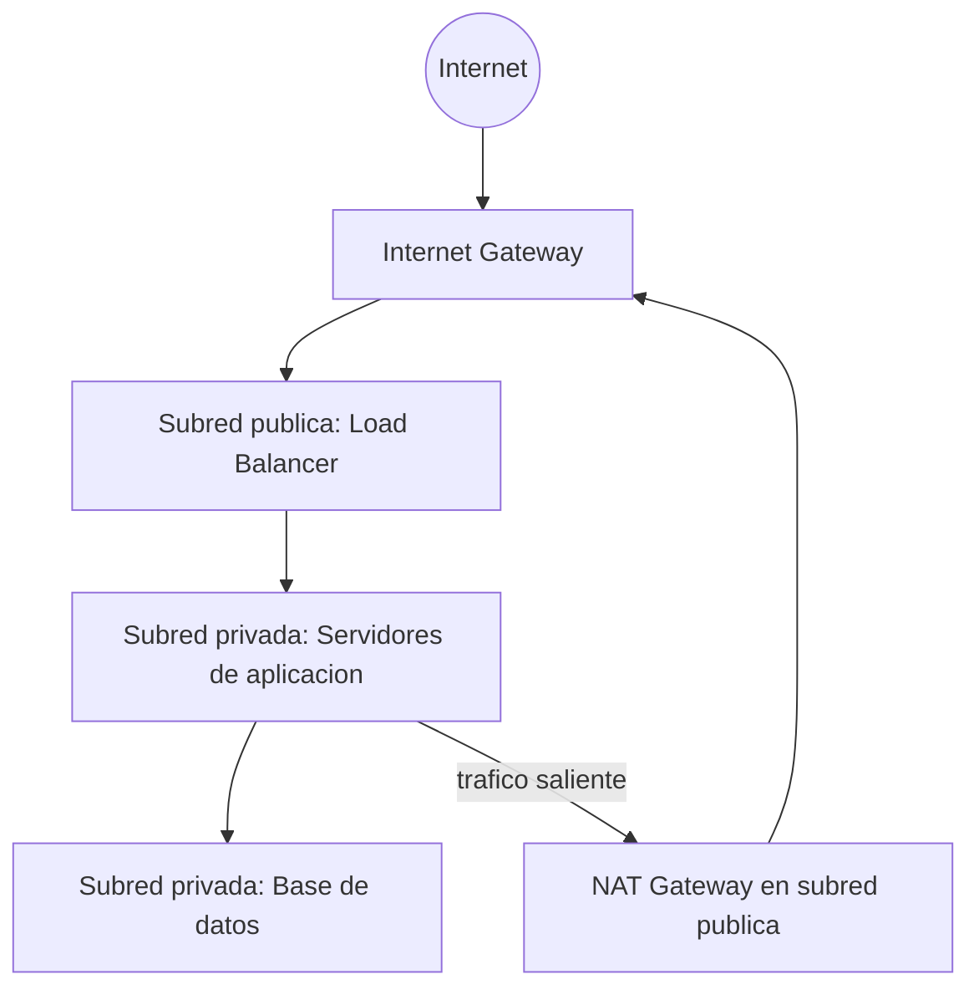
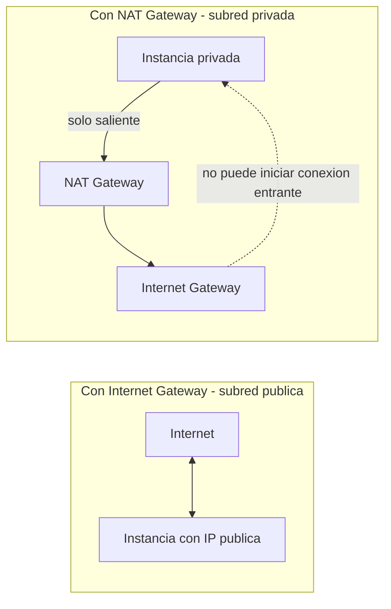
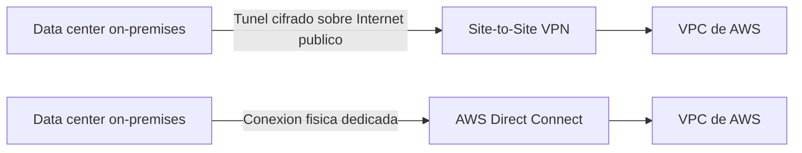
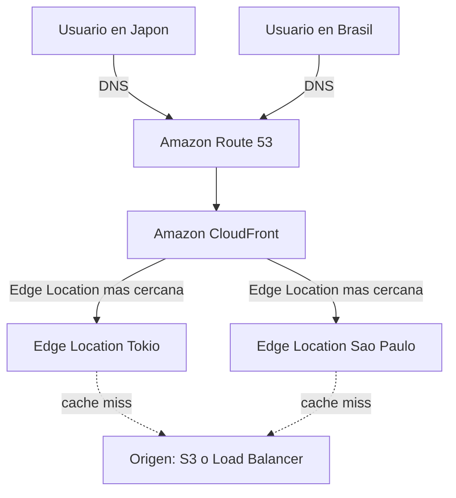

# AWS Certified Cloud Practitioner (CLF-C02)

**PARTE 7 — Networking**

*Este es, para muchos estudiantes, el capítulo más difícil de visualizar mentalmente sin diagramas. Tómate tu tiempo con cada uno de los diagramas Mermaid de este capítulo — dibujar la red ayuda más que memorizar definiciones sueltas.*

## 1. Objetivos del capítulo

### ¿Qué aprenderé?

- Qué es una VPC y cómo se estructura en subredes, tablas de rutas y gateways.
- La diferencia real entre una subred pública y una privada.
- Cómo funcionan el Internet Gateway y el NAT Gateway, y cuándo se necesita cada uno.
- Cuándo usar Site-to-Site VPN frente a AWS Direct Connect para conectividad híbrida.
- La diferencia entre Security Groups y Network ACLs (retomando y profundizando lo visto en la Parte 4).
- Qué son Route 53 y CloudFront, y cómo se complementan.

### ¿Por qué es importante?

El networking es la 'plomería' invisible que conecta todos los demás servicios entre sí y con el mundo exterior. Sin entender VPC, es imposible entender por qué una base de datos 'no es accesible desde internet' o por qué una instancia privada 'sí puede' descargar actualizaciones. Este capítulo conecta conceptualmente casi todo lo visto hasta ahora.

### ¿Cómo aparece en el examen?

El dominio de networking suele presentarse con escenarios de arquitectura: 'una aplicación de tres capas necesita X — ¿qué componente de red falta o está mal configurado?'. También son comunes las preguntas que piden distinguir VPN de Direct Connect según los requisitos de latencia/consistencia, y las que retoman Security Groups vs NACL con más profundidad que en el dominio de cómputo.

## 2. Teoría

### 2.1 Amazon VPC (Virtual Private Cloud)

Una VPC es tu propia red virtual privada y aislada dentro de AWS, dentro de una Región específica. Al crear una VPC, defines un rango de direcciones IP (usando notación CIDR, por ejemplo 10.0.0.0/16), y dentro de ese rango creas subredes más pequeñas, cada una viviendo en una Availability Zone específica de esa Región.

> **Analogía:** Si AWS es una ciudad enorme, tu VPC es el terreno privado que compraste dentro de ella, con sus propios muros. Las subredes son los distintos edificios dentro de ese terreno, y tú decides cuáles tienen puerta directa a la calle (públicas) y cuáles no (privadas).

### 2.2 Subredes públicas vs privadas

Una subred, por sí misma, no es 'pública' ni 'privada' por ninguna propiedad especial marcada en su creación — lo que la hace pública o privada es su tabla de rutas (route table). Una subred es pública si su tabla de rutas contiene una ruta que envía el tráfico destinado a internet (0.0.0.0/0) hacia un Internet Gateway. Si esa ruta no existe, la subred es privada.

La práctica estándar en una arquitectura de tres capas es: subred(es) pública(s) para recursos que deben ser accesibles desde internet (como un Load Balancer), y subred(es) privada(s) para recursos que NO deben serlo directamente (como servidores de aplicación internos y, especialmente, bases de datos).

### 2.3 Route Tables (tablas de rutas)

Cada subred está asociada a una tabla de rutas, que define hacia dónde se envía el tráfico según su dirección IP de destino. Toda VPC tiene una 'main route table' por defecto (que permite tráfico dentro de la propia VPC), y se pueden crear tablas de rutas personalizadas adicionales para controlar el enrutamiento de subredes específicas (por ejemplo, añadiendo la ruta hacia el Internet Gateway solo en las tablas de las subredes que deban ser públicas).

### 2.4 Internet Gateway (IGW)

El Internet Gateway es un componente que se adjunta a la VPC completa (uno por VPC) y permite la comunicación bidireccional entre recursos con IP pública dentro de subredes públicas e internet. Sin un IGW adjunto a la VPC (y sin la ruta correspondiente en la tabla de rutas de la subred), ningún recurso puede comunicarse directamente con internet, sin importar si tiene una IP pública asignada.

### 2.5 NAT Gateway

El NAT Gateway (Network Address Translation) resuelve un problema específico: permitir que instancias en subredes PRIVADAS inicien conexiones SALIENTES hacia internet (por ejemplo, para descargar actualizaciones de software), sin permitir que conexiones iniciadas desde internet lleguen directamente a esas instancias privadas. El NAT Gateway se despliega en una subred pública (porque él sí necesita comunicarse con el IGW), y las subredes privadas dirigen su tráfico saliente hacia internet a través de él, mediante la ruta correspondiente en su tabla de rutas.

> **Diferencia clave IGW vs NAT Gateway:** El Internet Gateway permite tráfico bidireccional completo (entrante Y saliente) para recursos en subredes públicas. El NAT Gateway solo permite tráfico saliente iniciado desde dentro (subredes privadas), bloqueando conexiones entrantes no solicitadas desde internet.

### 2.6 Conectividad híbrida: VPN vs Direct Connect

#### AWS Site-to-Site VPN

Establece un túnel cifrado (IPsec) entre el entorno on-premises y la VPC de AWS, usando internet público como medio de transporte. Es relativamente rápida de configurar (horas) y más económica, pero su latencia y ancho de banda dependen de la calidad de la conexión a internet subyacente, por lo que son menos predecibles.

#### AWS Direct Connect

Establece una conexión de red física y dedicada entre el data center del cliente y la infraestructura de AWS, sin pasar por internet público. Ofrece ancho de banda más consistente, menor latencia y mayor seguridad, pero requiere más tiempo de aprovisionamiento (semanas) y mayor inversión, siendo más adecuada para cargas de trabajo críticas de alto volumen y sostenidas en el tiempo.

Es común combinar ambas: usar Direct Connect como conexión primaria de alto rendimiento, y Site-to-Site VPN como respaldo (failover) en caso de que la conexión dedicada falle.

### 2.7 Security Groups vs Network ACL (profundización)

Ya vimos Security Groups en la Parte 4; ahora los contrastamos formalmente con las Network ACL, porque el examen los compara con frecuencia:

| Característica | Security Group | Network ACL |
| --- | --- | --- |
| Nivel de aplicación | Instancia (interfaz de red / ENI) | Subred |
| Estado de la conexión | Stateful (respuesta automática permitida) | Stateless (reglas explícitas entrada Y salida) |
| Tipos de regla | Solo Allow | Allow y Deny |
| Orden de evaluación | Se evalúan todas, de forma aditiva | Se evalúa en orden numérico, gana la primera coincidencia |
| Alcance por defecto | Deniega todo el tráfico entrante por defecto | Permite todo el tráfico por defecto (NACL default de la VPC) |

### 2.8 Amazon Route 53

Route 53 es el servicio de DNS (Domain Name System) de AWS: traduce nombres de dominio legibles por humanos (como www.miempresa.com) hacia direcciones IP o hacia recursos de AWS (mediante 'alias records', como un Load Balancer o una distribución de CloudFront). Además de resolución DNS estándar, ofrece registro de dominios, políticas de enrutamiento avanzadas (por latencia, geolocalización, ponderado, failover) y verificaciones de salud (health checks) que pueden usarse para dirigir tráfico automáticamente lejos de un endpoint que no responde.

### 2.9 Amazon CloudFront

CloudFront es la red de entrega de contenido (CDN) de AWS: distribuye copias en caché de tu contenido (imágenes, videos, archivos estáticos, APIs) a través de la extensa red de Edge Locations de AWS distribuidas globalmente, sirviendo a cada usuario desde el punto de presencia más cercano geográficamente. Esto reduce la latencia percibida, reduce la carga sobre el servidor de origen (que puede ser S3, un Load Balancer, o incluso un servidor fuera de AWS), y en muchos casos reduce también el costo de transferencia de datos.

## 3. Ejemplos

### Ejemplo empresarial

Un banco despliega su aplicación de banca en línea con los servidores web en subredes públicas detrás de un Load Balancer, la capa de aplicación en subredes privadas (accesible solo desde el Load Balancer), y la base de datos en subredes privadas aún más restringidas (accesibles solo desde la capa de aplicación), usando NAT Gateway para que esas capas privadas puedan descargar parches de seguridad sin ser accesibles desde internet.

### Ejemplo de startup

Una startup con oficinas remotas en tres países usa AWS Site-to-Site VPN para conectar rápidamente sus VPCs con las redes locales de cada oficina, evitando el costo y tiempo de aprovisionamiento de Direct Connect mientras el volumen de tráfico corporativo aún es manejable.

### Ejemplo personal

Un desarrollador que despliega su blog personal en S3 configura Amazon CloudFront delante del bucket para servir el sitio con baja latencia a visitantes de cualquier país, y usa Route 53 para apuntar su dominio personal hacia esa distribución de CloudFront.

### Caso real de defensa en profundidad

Una empresa de salud protege los servidores que almacenan historiales médicos con un Security Group que solo permite tráfico desde la capa de aplicación en el puerto de base de datos específico, y además una Network ACL a nivel de subred que deniega explícitamente cualquier tráfico desde rangos de IP fuera de la red corporativa conocida, como capa adicional de protección ante un posible error de configuración en los Security Groups.

## 4. Diagramas

Diagramas en formato Mermaid — pégalos en mermaid.live o cualquier visor compatible para verlos renderizados. Este capítulo se beneficia especialmente de dibujarlos a mano una vez tú mismo.

### 4.1 Arquitectura de tres capas dentro de una VPC

### 4.2 Internet Gateway vs NAT Gateway

### 4.3 VPN vs Direct Connect

### 4.4 CloudFront + Route 53 sirviendo contenido global

## 5. Laboratorios

### Laboratorio 1: Crear una VPC con subred pública y privada

Costo: la creación de una VPC, subredes, tablas de rutas e Internet Gateway es gratuita. El único costo posible en este laboratorio vendría de un NAT Gateway si lo dejas corriendo (aproximadamente $0.045/hora + cargos por datos procesados en us-east-1) — lo eliminamos al final.

1. Ve a la consola de VPC → Create VPC. Elige 'VPC and more' (el asistente crea automáticamente subredes, tablas de rutas e IGW).
2. Define un nombre (ej. 'mi-vpc-lab'), un bloque CIDR IPv4 (ej. 10.0.0.0/16), 2 Availability Zones, 1 subred pública y 1 subred privada por AZ (2 públicas y 2 privadas en total).
3. En 'NAT gateways', selecciona 'In 1 AZ' para minimizar el costo del laboratorio (en producción real se recomienda 1 NAT Gateway por AZ para alta disponibilidad).
4. Crea la VPC y espera a que todos los recursos (subredes, route tables, IGW, NAT Gateway) se aprovisionen.
5. Ve a 'Route tables' y examina la tabla asociada a una subred pública: deberías ver una ruta '0.0.0.0/0 → igw-xxxx'.
6. Examina la tabla asociada a una subred privada: deberías ver una ruta '0.0.0.0/0 → nat-xxxx' en vez de una ruta directa al IGW.
7. (Opcional) Lanza una instancia EC2 t2.micro en la subred privada sin IP pública, conéctate vía Session Manager, y verifica que puedes hacer 'ping' o 'curl' hacia internet (saliente, gracias al NAT) pero que la instancia no tiene ninguna IP pública alcanzable desde fuera.
> **Cómo eliminar los recursos:** El NAT Gateway es el componente que genera costo por hora — elimínalo primero desde VPC → NAT Gateways → Delete. Después puedes eliminar la VPC completa desde 'Your VPCs' → Actions → Delete VPC, lo cual elimina en cascada las subredes, tablas de rutas e IGW asociados.

### Laboratorio 2: Configurar una distribución CloudFront básica delante de un bucket S3

Costo: la capa gratuita de CloudFront incluye 1 TB de transferencia de datos saliente y 10,000,000 de solicitudes HTTP/HTTPS por mes durante los primeros 12 meses, suficiente para este laboratorio sin generar costo.

8. Si no tienes uno, crea un bucket S3 y sube un archivo HTML simple (ej. 'index.html' con contenido de prueba).
9. Ve a la consola de CloudFront → Create distribution.
10. En 'Origin domain', selecciona tu bucket S3 de la lista.
11. Para este laboratorio simple, usa 'Origin access control settings (recommended)' para que CloudFront acceda al bucket de forma segura sin necesidad de hacerlo público (la consola te guía para actualizar la policy del bucket automáticamente).
12. Deja el resto de configuraciones por defecto y crea la distribución.
13. Espera unos minutos a que el estado cambie a 'Deployed' (la propagación a todas las Edge Locations puede tardar hasta 15-20 minutos).
14. Copia el 'Distribution domain name' (algo como d1234abcd.cloudfront.net) y visítalo en tu navegador, añadiendo '/index.html' — deberías ver tu archivo servido a través de CloudFront.
> **Cómo eliminar los recursos:** Ve a CloudFront → tu distribución → Disable (debe deshabilitarse antes de poder eliminarse, este paso puede tardar varios minutos). Una vez deshabilitada, selecciónala y elige Delete. Elimina también el bucket S3 de prueba si ya no lo necesitas.

## 6. Errores comunes

- Pensar que asignar una IP pública a una instancia la hace automáticamente accesible desde internet — también se necesita un Internet Gateway adjunto a la VPC Y una ruta hacia él en la tabla de rutas de esa subred.
- Confundir el propósito del NAT Gateway (solo tráfico saliente desde subredes privadas) con el del Internet Gateway (tráfico bidireccional para subredes públicas).
- Colocar una base de datos de producción en una subred pública 'para simplificar', exponiendo innecesariamente la superficie de ataque.
- Olvidar que las reglas de una Network ACL se evalúan en orden numérico y se detiene en la primera coincidencia — un error común es poner una regla 'Deny' con un número más alto que una regla 'Allow' que ya cubre ese tráfico, haciendo que el Deny nunca se aplique.
- Elegir Site-to-Site VPN para una carga de trabajo que requiere latencia consistente y alto volumen sostenido, cuando Direct Connect sería la opción técnicamente más adecuada a largo plazo.
- Dejar un NAT Gateway de laboratorio corriendo después de terminar la práctica — a diferencia de muchos otros recursos de red (VPC, subredes, route tables, IGW), el NAT Gateway sí genera un costo por hora activa.

## 7. Comparaciones

### NAT Gateway vs Internet Gateway

Internet Gateway = tráfico bidireccional completo para subredes públicas (uno por VPC). NAT Gateway = solo tráfico saliente iniciado desde subredes privadas, sin permitir conexiones entrantes no solicitadas (se ubica en una subred pública, pero sirve a las privadas).

### Security Groups vs NACL

Ver tabla completa en la sección 2.7. En resumen: Security Group = instancia, stateful, solo Allow. NACL = subred, stateless, Allow y Deny, evaluación por orden numérico.

### CloudFront vs Route 53

Son complementarios, no alternativas: Route 53 resuelve nombres de dominio hacia direcciones IP o recursos de AWS (incluyendo, frecuentemente, una distribución de CloudFront); CloudFront entrega y cachea el contenido en sí desde Edge Locations cercanas al usuario. Es común usar Route 53 para apuntar tu dominio hacia tu distribución de CloudFront.

### VPN vs Direct Connect

VPN = rápida de implementar, más económica, latencia/ancho de banda variables (depende de internet público). Direct Connect = conexión física dedicada, mayor consistencia y menor latencia, más cara y con mayor tiempo de aprovisionamiento — a menudo se combinan, usando VPN como respaldo de Direct Connect.

## 8. Preguntas tipo examen

20 preguntas de opción múltiple, mismo estilo y dificultad que el examen oficial CLF-C02.

**Pregunta 1.** ¿Qué es una Amazon VPC (Virtual Private Cloud)?

A) Un tipo de instancia EC2 optimizada para redes

**B)** **Una red virtual aislada y lógicamente separada dentro de AWS, donde el cliente controla el direccionamiento IP, subredes, tablas de rutas y configuración de red**

C) Un servicio de DNS

D) Un firewall físico dedicado

**Respuesta correcta: B.** 

*Una VPC es una red virtual privada, aislada lógicamente del resto de AWS, dentro de la cual el cliente tiene control total sobre el rango de direcciones IP, la creación de subredes, tablas de rutas, gateways y configuración de seguridad de red.*

**Pregunta 2.** ¿Cuál es la diferencia principal entre una subred pública y una subred privada dentro de una VPC?

A) No hay diferencia real entre ambas

**B)** **Una subred pública tiene una ruta hacia un Internet Gateway, permitiendo comunicación directa con internet; una subred privada no tiene esa ruta directa**

C) Las subredes privadas no pueden contener instancias EC2

D) Las subredes públicas son siempre más grandes en tamaño de IP

**Respuesta correcta: B.** 

*Lo que hace 'pública' a una subred es que su tabla de rutas incluye una ruta hacia un Internet Gateway (0.0.0.0/0 → IGW), permitiendo que los recursos con IP pública en ella se comuniquen directamente con internet. Una subred privada carece de esa ruta directa hacia un IGW.*

**Pregunta 3.** ¿Qué componente de una VPC permite la comunicación bidireccional entre instancias dentro de una subred pública e internet?

A) NAT Gateway

**B)** **Internet Gateway (IGW)**

C) VPN Gateway

D) Direct Connect

**Respuesta correcta: B.** 

*El Internet Gateway es el componente que se adjunta a una VPC para permitir comunicación bidireccional entre recursos con IP pública dentro de la VPC e internet. Sin un IGW adjunto y una ruta hacia él, ninguna subred puede considerarse verdaderamente 'pública'.*

**Pregunta 4.** Una instancia EC2 en una subred privada necesita descargar actualizaciones de software desde internet, pero no debe ser accesible directamente desde internet. ¿Qué componente de red permite esto?

A) Internet Gateway directamente en la subred privada

**B)** **NAT Gateway ubicado en una subred pública, con una ruta desde la subred privada hacia él**

C) Un Security Group adicional

D) Direct Connect

**Respuesta correcta: B.** 

*Un NAT Gateway, ubicado en una subred pública, permite que instancias en subredes privadas inicien conexiones salientes hacia internet (por ejemplo, para descargar actualizaciones), mientras impide que conexiones iniciadas desde internet lleguen directamente a esas instancias privadas.*

**Pregunta 5.** Una empresa necesita conectar su data center on-premises con su VPC de AWS de forma rápida y económica, aceptando cierta variabilidad en la latencia, usando internet como medio de transporte cifrado. ¿Qué servicio es el más adecuado?

A) AWS Direct Connect

**B)** **Site-to-Site VPN**

C) AWS Snowball

D) Amazon CloudFront

**Respuesta correcta: B.** 

*AWS Site-to-Site VPN establece una conexión cifrada (IPsec) entre el data center on-premises y la VPC de AWS a través de internet público, siendo una opción más rápida de implementar y más económica que Direct Connect, aunque con latencia y ancho de banda menos predecibles al depender de internet.*

**Pregunta 6.** Una empresa requiere una conexión de red dedicada y privada entre su data center y AWS, con ancho de banda consistente y menor latencia que una conexión a través de internet público, para cargas de trabajo críticas de alto volumen. ¿Qué servicio es el más adecuado?

A) Site-to-Site VPN exclusivamente

**B)** **AWS Direct Connect**

C) Amazon Route 53

D) AWS WAF

**Respuesta correcta: B.** 

*AWS Direct Connect establece una conexión de red física y dedicada entre el entorno on-premises del cliente y AWS, sin pasar por internet público, ofreciendo ancho de banda más consistente, menor latencia y mayor seguridad para cargas de trabajo críticas de alto volumen.*

**Pregunta 7.** ¿Cuál es la diferencia principal entre un Security Group y una Network ACL (NACL) en cuanto al estado de las conexiones?

A) Ambos son stateful

**B)** **El Security Group es stateful (el tráfico de respuesta se permite automáticamente); la NACL es stateless (se deben definir reglas explícitas para el tráfico entrante Y saliente por separado)**

C) Ambos son stateless

D) La NACL es stateful y el Security Group es stateless

**Respuesta correcta: B.** 

*El Security Group es stateful: si permites tráfico entrante, la respuesta saliente se permite automáticamente sin regla adicional. La Network ACL es stateless: se deben definir reglas explícitas tanto para el tráfico entrante como para el saliente, ya que no se 'recuerda' el estado de la conexión.*

**Pregunta 8.** ¿A qué nivel de la arquitectura de red opera una Network ACL, a diferencia de un Security Group?

A) A nivel de instancia individual, igual que el Security Group

**B)** **A nivel de subred, controlando el tráfico que entra y sale de toda la subred**

C) A nivel de Región completa

D) A nivel de cuenta de AWS completa

**Respuesta correcta: B.** 

*La Network ACL opera a nivel de subred: sus reglas aplican a todo el tráfico que entra o sale de esa subred, actuando como una capa adicional de seguridad de red por encima (o como respaldo) de los Security Groups, que operan a nivel de instancia individual.*

**Pregunta 9.** ¿Qué es Amazon Route 53?

A) Un servicio de balanceo de carga exclusivamente

**B)** **Un servicio de DNS (Domain Name System) altamente disponible y escalable, que también ofrece registro de dominios y verificación de salud**

C) Un tipo de instancia EC2

D) Un firewall de aplicaciones web

**Respuesta correcta: B.** 

*Amazon Route 53 es el servicio de DNS de AWS: traduce nombres de dominio legibles (como www.ejemplo.com) a direcciones IP, además de ofrecer registro de dominios, políticas de enrutamiento avanzadas (como enrutamiento por latencia o geolocalización) y verificaciones de salud (health checks) de los recursos.*

**Pregunta 10.** ¿Qué es Amazon CloudFront y qué problema resuelve principalmente?

A) Un servicio de bases de datos distribuido

**B)** **Una red de entrega de contenido (CDN) que cachea contenido en Edge Locations cercanas a los usuarios finales, reduciendo la latencia de entrega**

C) Un servicio de backup automatizado

D) Un tipo de VPN

**Respuesta correcta: B.** 

*Amazon CloudFront es la CDN (Content Delivery Network) de AWS: distribuye copias en caché del contenido (imágenes, videos, archivos estáticos, e incluso contenido dinámico) a través de la red global de Edge Locations de AWS, sirviendo a cada usuario desde el punto más cercano geográficamente para reducir la latencia.*

**Pregunta 11.** Una arquitectura de tres capas (three-tier) típica coloca los servidores web en subredes públicas y la base de datos en subredes privadas. ¿Por qué se recomienda esta separación?

A) Es simplemente una convención sin ningún beneficio real de seguridad

**B)** **Reduce la superficie de ataque: la base de datos, que contiene los datos más sensibles, no es directamente alcanzable desde internet, solo desde la capa de aplicación autorizada**

C) Las subredes privadas son más baratas que las públicas

D) Es un requisito técnico obligatorio de AWS que no se puede evitar

**Respuesta correcta: B.** 

*Colocar la base de datos en una subred privada (sin ruta directa a un Internet Gateway) reduce significativamente la superficie de ataque: nadie desde internet puede intentar conectarse directamente a la base de datos, solo la capa de aplicación (que sí puede validarse y protegerse específicamente) tiene esa vía de acceso.*

**Pregunta 12.** ¿Qué elemento de una VPC define hacia dónde se dirige el tráfico de red según su IP de destino (por ejemplo, hacia el Internet Gateway, hacia un NAT Gateway, o dentro de la misma VPC)?

A) Security Group

**B)** **Route Table (tabla de rutas)**

C) Network ACL

D) AMI

**Respuesta correcta: B.** 

*La Route Table (tabla de rutas) de una subred define hacia dónde se dirige el tráfico según la IP de destino: una ruta '0.0.0.0/0 → Internet Gateway' hace que la subred sea pública, mientras que una ruta '0.0.0.0/0 → NAT Gateway' es típica de una subred privada que necesita salida a internet sin ser directamente accesible.*

**Pregunta 13.** Un usuario en Japón y un usuario en Brasil acceden al mismo sitio web servido a través de Amazon CloudFront. ¿Desde dónde recibe cada uno el contenido cacheado, en la mayoría de los casos?

A) Ambos reciben el contenido siempre desde el mismo servidor de origen en Estados Unidos

**B)** **Cada uno recibe el contenido desde la Edge Location de CloudFront geográficamente más cercana a su ubicación**

C) Solo el usuario de Brasil recibe contenido cacheado

D) CloudFront no distingue la ubicación geográfica de los usuarios

**Respuesta correcta: B.** 

*CloudFront enruta automáticamente a cada usuario hacia la Edge Location más cercana geográficamente (basándose en el DNS y la red Anycast de AWS), sirviendo el contenido cacheado localmente cuando está disponible, en vez de que todos los usuarios tengan que llegar hasta el servidor de origen.*

**Pregunta 14.** ¿Qué combinación de conceptos permite que una subred se considere 'privada' en una arquitectura estándar de AWS?

A) Tener una ruta directa hacia un Internet Gateway

**B)** **NO tener una ruta directa hacia un Internet Gateway en su tabla de rutas (aunque puede tener una ruta hacia un NAT Gateway para tráfico saliente)**

C) Estar ubicada fuera de cualquier Availability Zone

D) Tener un Security Group vacío

**Respuesta correcta: B.** 

*Una subred es 'privada' precisamente porque su tabla de rutas NO incluye una ruta directa hacia un Internet Gateway. Puede, sin embargo, tener una ruta hacia un NAT Gateway (ubicado en una subred pública) para permitir tráfico saliente hacia internet sin exponerse a conexiones entrantes directas.*

**Pregunta 15.** ¿Cuál de las siguientes afirmaciones sobre las Network ACL es correcta respecto al orden de evaluación de sus reglas?

**A)** **Las reglas de NACL se evalúan en orden numérico (de menor a mayor) y se aplica la primera regla que coincida**

B) Las reglas de NACL se evalúan en orden alfabético por nombre

C) Solo se evalúa la última regla de la lista

D) El orden de las reglas no importa en una NACL

**Respuesta correcta: A.** 

*A diferencia de los Security Groups (donde se evalúan todas las reglas de forma aditiva), las reglas de una Network ACL se evalúan en orden numérico ascendente, y se aplica la PRIMERA regla que coincida con el tráfico; las reglas posteriores con número más alto ya no se evalúan para ese tráfico específico.*

**Pregunta 16.** Una empresa gubernamental necesita conectividad privada, dedicada y de alto ancho de banda entre su centro de datos y AWS, sin pasar por internet público, para transferir grandes volúmenes de datos sensibles de forma consistente todos los días. ¿Qué opción es la más adecuada a largo plazo?

A) Site-to-Site VPN exclusivamente, por ser más simple de configurar

**B)** **AWS Direct Connect, por ofrecer una conexión física dedicada con mayor consistencia de ancho de banda y menor latencia**

C) Amazon CloudFront

D) AWS Snowball exclusivamente

**Respuesta correcta: B.** 

*Aunque Site-to-Site VPN es más rápida de implementar, para necesidades sostenidas de alto volumen, baja latencia consistente y mayor seguridad (al no depender de internet público), AWS Direct Connect es la opción recomendada a largo plazo para conectividad dedicada entre on-premises y AWS.*

**Pregunta 17.** ¿Qué servicio de AWS traduciría un nombre de dominio como 'www.miempresa.com' a la dirección IP del Load Balancer correspondiente?

A) Amazon CloudFront

**B)** **Amazon Route 53**

C) AWS Direct Connect

D) Amazon VPC

**Respuesta correcta: B.** 

*Amazon Route 53, como servicio de DNS de AWS, es responsable de resolver nombres de dominio hacia las direcciones IP (o alias hacia recursos de AWS como Load Balancers) correspondientes, permitiendo que los usuarios accedan a la aplicación usando un nombre legible en vez de una IP.*

**Pregunta 18.** ¿Qué combinación de Security Group y Network ACL representa el enfoque de 'defensa en profundidad' recomendado por AWS para proteger una subred con instancias EC2?

A) Usar solo Security Groups y dejar la NACL en su configuración por defecto (permitir todo)

**B)** **Usar Security Groups restrictivos a nivel de instancia Y una NACL adicional a nivel de subred como capa de seguridad complementaria**

C) Usar solo NACL y eliminar todos los Security Groups

D) No usar ninguno de los dos, confiando solo en IAM

**Respuesta correcta: B.** 

*La defensa en profundidad combina múltiples capas de seguridad: Security Groups restrictivos en cada instancia (mínimo privilegio a nivel de instancia) junto con Network ACL a nivel de subred como capa adicional, de forma que si una capa falla o se configura mal, la otra puede seguir ofreciendo protección.*

**Pregunta 19.** Una aplicación de video bajo demanda quiere reducir el costo de transferencia de datos y la latencia al servir millones de reproducciones de video a usuarios en todo el mundo desde un único bucket S3 de origen. ¿Qué servicio deberían colocar delante del bucket S3?

A) AWS Direct Connect

**B)** **Amazon CloudFront como CDN delante del bucket S3**

C) AWS Site-to-Site VPN

D) Amazon Route 53 exclusivamente sin CDN

**Respuesta correcta: B.** 

*Colocar Amazon CloudFront delante de un bucket S3 permite cachear el contenido de video en las Edge Locations cercanas a cada usuario, reduciendo tanto la latencia de reproducción como, frecuentemente, el costo de transferencia de datos comparado con servir cada reproducción directamente desde el bucket de origen.*

**Pregunta 20.** ¿Qué elemento de red permitiría que una instancia en una subred privada, sin IP pública, descargue un parche de seguridad desde internet, sin que ningún host externo pueda iniciar una conexión hacia esa instancia?

A) Internet Gateway conectado directamente a la subred privada

**B)** **Un NAT Gateway en una subred pública, referenciado en la tabla de rutas de la subred privada**

C) Una Network ACL con todas las reglas en 'Deny'

D) Ninguna combinación permite esto; las subredes privadas nunca pueden acceder a internet

**Respuesta correcta: B.** 

*Un NAT Gateway, desplegado en una subred pública, permite que instancias en subredes privadas inicien conexiones salientes hacia internet (como descargar parches), mientras que ningún host externo puede iniciar una conexión entrante hacia esas instancias privadas — el NAT solo traduce y permite tráfico en la dirección saliente iniciada desde dentro.*

## 9. Resumen

### Resumen ejecutivo

Una VPC es tu red privada dentro de AWS, dividida en subredes que son públicas o privadas según su tabla de rutas tenga (o no) una ruta hacia un Internet Gateway. El NAT Gateway permite tráfico saliente desde subredes privadas sin exponerlas a conexiones entrantes. Para conectividad híbrida, Site-to-Site VPN es rápida y económica pero variable, mientras que Direct Connect ofrece una conexión dedicada más consistente para cargas críticas. Security Groups (stateful, instancia, solo Allow) y Network ACL (stateless, subred, Allow/Deny) trabajan juntos como defensa en profundidad. Route 53 resuelve DNS; CloudFront entrega contenido cacheado desde Edge Locations cercanas al usuario — ambos se combinan frecuentemente.

### Conceptos clave (memorizar)

- **Subred pública = tiene ruta a un Internet Gateway. Subred privada = no la tiene.**
- **NAT Gateway = solo saliente desde subredes privadas. Internet Gateway = bidireccional para subredes públicas.**
- **VPN = rápida/económica/variable. Direct Connect = dedicada/consistente/más lenta de aprovisionar.**
- **Security Group = instancia, stateful, solo Allow. NACL = subred, stateless, Allow y Deny, orden numérico.**
- **Route 53 = DNS. CloudFront = CDN (entrega de contenido cacheado). Se combinan, no compiten.**

### Lo que normalmente pregunta AWS

Escenarios de arquitectura de tres capas donde debes identificar qué componente falta o está mal configurado (falta de IGW, falta de NAT, subred incorrecta para la base de datos), y escenarios de conectividad híbrida donde debes elegir entre VPN y Direct Connect según los requisitos de latencia, consistencia y presupuesto descritos.

## Recursos externos para este capítulo

### Documentación oficial

- Amazon VPC User Guide — docs.aws.amazon.com/vpc
- AWS Site-to-Site VPN — docs.aws.amazon.com/vpn
- AWS Direct Connect — docs.aws.amazon.com/directconnect
- Amazon Route 53 Developer Guide — docs.aws.amazon.com/route53
- Amazon CloudFront Developer Guide — docs.aws.amazon.com/cloudfront
- Comparación de Security Groups y NACL — sección 'Compare security groups and network ACLs' de la documentación de VPC

### Videos recomendados

- AWS Skill Builder: módulo de Networking dentro de 'Cloud Practitioner Essentials'.
- Andrew Brown / freeCodeCamp: 'VPC desde cero', muy recomendado para visualizar la arquitectura por primera vez.
- Adrian Cantrill: 'Networking fundamentals', profundiza más allá del nivel CLF-C02, útil para consolidar antes de Solutions Architect.

### Laboratorios adicionales

- AWS Skill Builder Labs: 'Build a VPC and Launch a Web Server' (laboratorio guiado oficial muy alineado con este capítulo).
- AWS Workshops: 'Amazon VPC Workshop' (buscar en aws.amazon.com/workshops).