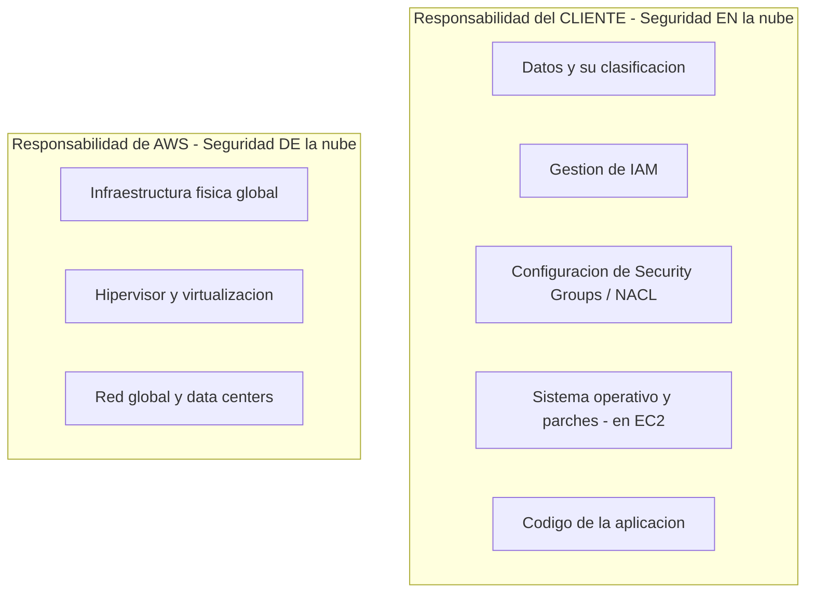
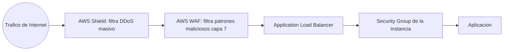
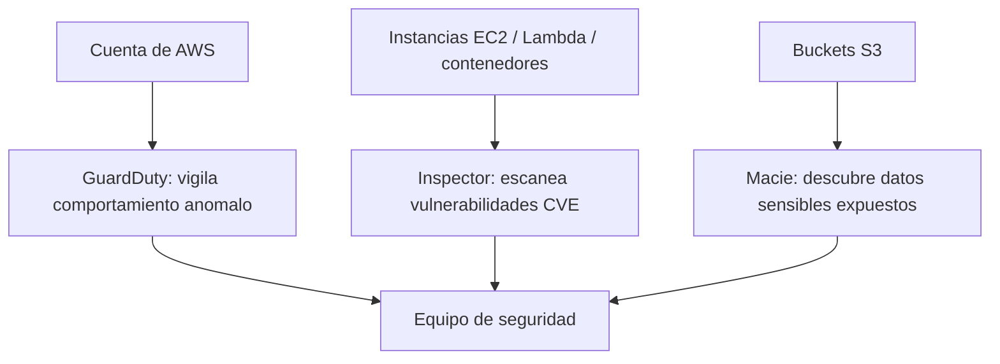
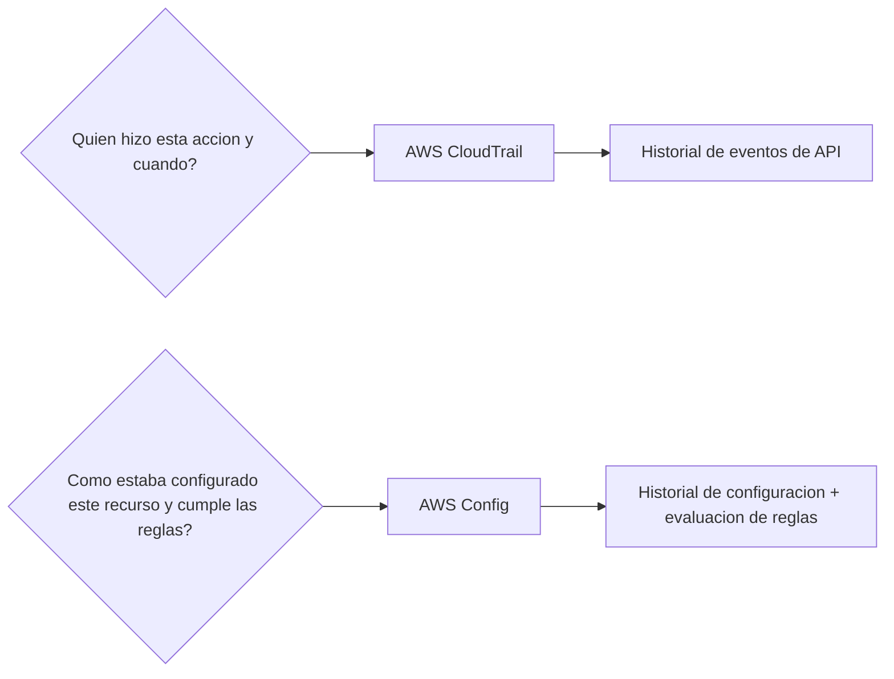

# AWS Certified Cloud Practitioner (CLF-C02)

**PARTE 8 — Seguridad**

*El dominio 'Security and Compliance' es, junto con Cloud Concepts, uno de los más grandes del examen. Este capítulo, sumado a IAM (Parte 3), cubre la columna vertebral de seguridad de todo el curso.*

## 1. Objetivos del capítulo

### ¿Qué aprenderé?

- El Modelo de Responsabilidad Compartida y cómo se desplaza según el tipo de servicio.
- Cómo AWS KMS y Secrets Manager protegen claves de cifrado y credenciales sensibles.
- Qué es AWS Certificate Manager y para qué sirve.
- Cómo Shield y WAF protegen contra ataques DDoS y ataques a nivel de aplicación respectivamente.
- Cómo GuardDuty, Inspector y Macie detectan amenazas, vulnerabilidades y datos sensibles expuestos.
- Cómo CloudTrail y Config permiten auditoría y cumplimiento normativo continuo.

### ¿Por qué es importante?

La seguridad en la nube no es 'un servicio que se activa', sino un conjunto de capas y responsabilidades bien definidas. Entender exactamente qué asegura AWS y qué debes asegurar tú es la base de cualquier arquitectura responsable, y es el tema individual más grande del examen CLF-C02.

### ¿Cómo aparece en el examen?

El dominio 'Security and Compliance' representa una porción muy significativa del examen. Espera preguntas directas sobre el Modelo de Responsabilidad Compartida (quién es responsable de qué en distintos servicios), y preguntas de escenario donde debes elegir el servicio de seguridad correcto entre varias opciones parecidas (por ejemplo, GuardDuty vs Inspector vs Macie, o CloudTrail vs Config).

## 2. Teoría

### 2.1 El Modelo de Responsabilidad Compartida

Este es probablemente el concepto de seguridad más preguntado en todo el examen. AWS lo resume en dos frases: AWS es responsable de la seguridad DE la nube; el cliente es responsable de la seguridad EN la nube.

- Responsabilidad de AWS ('DE la nube'): la infraestructura física global (data centers, hardware, energía, refrigeración), la virtualización (hipervisor), y la red global subyacente.
- Responsabilidad del cliente ('EN la nube'): la configuración de IAM, el cifrado de los datos (activarlo y gestionarlo), la configuración de red (Security Groups, NACL), el sistema operativo y parches (en servicios IaaS como EC2), y la seguridad del código de la aplicación.
> **La línea se desplaza según el servicio:** Cuanto más administrado es un servicio, más responsabilidad asume AWS. En EC2 (IaaS), el cliente administra el sistema operativo y sus parches. En RDS (administrado), AWS administra el parcheo del motor de base de datos. En Lambda (serverless), AWS administra prácticamente todo el entorno de ejecución, y el cliente solo es responsable de su código y de la configuración de IAM/datos.

### 2.2 AWS KMS (Key Management Service)

KMS permite crear y controlar claves criptográficas (KMS keys) usadas para cifrar datos en reposo en múltiples servicios de AWS (S3, EBS, RDS, DynamoDB, entre otros). Se integra con IAM para definir exactamente quién puede usar cada clave para cifrar o descifrar datos, y mantiene un registro de auditoría de su uso a través de CloudTrail. AWS ofrece tanto claves administradas por AWS (gratuitas, gestión automática) como claves administradas por el cliente (mayor control, con costo asociado).

### 2.3 AWS Secrets Manager

Secrets Manager centraliza el almacenamiento seguro de secretos como contraseñas de bases de datos, API keys y tokens, evitando la práctica insegura de escribirlos directamente en el código o en archivos de configuración. Una de sus funciones más valiosas es la rotación automática de secretos según un calendario definido, integrándose de forma nativa con servicios como RDS para actualizar la contraseña tanto en la base de datos como en el secreto almacenado, sin intervención manual.

### 2.4 AWS Certificate Manager (ACM)

ACM simplifica el ciclo de vida completo de los certificados SSL/TLS: aprovisionamiento, gestión y renovación. Los certificados públicos usados junto con servicios integrados de AWS (CloudFront, Elastic Load Balancer, API Gateway) no tienen costo adicional, y ACM se encarga de la renovación automática antes de que expiren, evitando el riesgo de interrupciones por certificados vencidos que se gestionaban manualmente en el pasado.

### 2.5 AWS Shield y AWS WAF: protección de red y de aplicación

#### AWS Shield

Protege contra ataques de Denegación de Servicio Distribuido (DDoS), que buscan saturar un servicio con tráfico masivo para hacerlo inaccesible. Shield Standard se activa automáticamente y sin costo adicional para todos los clientes de AWS. Shield Advanced, con costo adicional, ofrece protección contra ataques más sofisticados, visibilidad detallada en tiempo real, y acceso al equipo especializado de respuesta a DDoS de AWS (DRT).

#### AWS WAF (Web Application Firewall)

Opera en la capa de aplicación (capa 7), permitiendo crear reglas que filtran tráfico HTTP/HTTPS según patrones específicos: bloquear inyección SQL, cross-site scripting (XSS), limitar peticiones por IP (rate limiting), o filtrar según geolocalización. Se despliega delante de recursos como CloudFront, Application Load Balancer o API Gateway.

> **Shield vs WAF:** Shield protege contra volumen masivo de tráfico malicioso (DDoS, capas de red/transporte). WAF protege contra patrones de ataque específicos dentro del tráfico HTTP legítimo en apariencia (capa de aplicación). Se complementan, no compiten.

### 2.6 GuardDuty, Inspector y Macie: detección inteligente

#### Amazon GuardDuty

Servicio de detección de amenazas que monitorea continuamente fuentes de datos como CloudTrail, VPC Flow Logs y logs de DNS, usando machine learning e inteligencia de amenazas para detectar actividad anómala o maliciosa (por ejemplo, una instancia comunicándose con infraestructura de malware conocida, o patrones de acceso inusuales a la cuenta). No requiere desplegar ningún agente adicional.

#### Amazon Inspector

Realiza evaluaciones automatizadas de vulnerabilidades de seguridad conocidas (CVEs) en instancias EC2, imágenes de contenedores en Amazon ECR y funciones Lambda, además de evaluar desviaciones de mejores prácticas de configuración de red. Es una herramienta proactiva de escaneo, a diferencia de GuardDuty, que es más reactiva/de monitoreo continuo de comportamiento.

#### Amazon Macie

Usa machine learning y coincidencia de patrones para descubrir y clasificar automáticamente datos sensibles almacenados en Amazon S3 (información de identificación personal, datos financieros, credenciales expuestas accidentalmente), y alerta sobre buckets con configuraciones de seguridad inadecuadas dado el tipo de datos que contienen.

| Servicio | ¿Qué detecta/evalúa? | ¿Sobre qué recursos? |
| --- | --- | --- |
| GuardDuty | Actividad maliciosa/anómala (comportamiento) | Toda la cuenta: CloudTrail, VPC Flow Logs, DNS |
| Inspector | Vulnerabilidades conocidas (CVEs) | EC2, imágenes de contenedores (ECR), Lambda |
| Macie | Datos sensibles expuestos o mal protegidos | Buckets de Amazon S3 |

### 2.7 AWS CloudTrail y AWS Config: auditoría y cumplimiento

#### AWS CloudTrail

Registra un historial detallado de TODAS las llamadas a la API realizadas en la cuenta: quién (usuario o rol de IAM) hizo qué acción, cuándo, desde qué dirección IP, y con qué parámetros. Es la herramienta fundamental para investigación de incidentes de seguridad, auditoría y cumplimiento normativo, respondiendo a la pregunta '¿quién hizo esto y cuándo?'.

#### AWS Config

Evalúa y registra continuamente el estado de CONFIGURACIÓN de los recursos de AWS a lo largo del tiempo, permitiendo definir reglas de cumplimiento (por ejemplo, 'todo bucket S3 debe tener cifrado activado', 'todo volumen EBS debe estar cifrado') que se verifican automáticamente. Responde a la pregunta '¿cómo estaba configurado este recurso, y ha cumplido las reglas de forma continua?'.

> **CloudTrail vs Config, la diferencia que más confunde:** CloudTrail = actividad (quién hizo qué acción). Config = configuración (cómo está/estuvo configurado un recurso, y si cumple reglas). Ambos son complementarios en una investigación de seguridad completa.

## 3. Ejemplos

### Ejemplo empresarial

Un banco usa AWS Config para verificar continuamente que todos sus volúmenes EBS y buckets S3 tengan cifrado activado (requisito regulatorio), CloudTrail para poder responder ante cualquier auditoría exactamente quién accedió a qué recurso y cuándo, y GuardDuty para detectar cualquier actividad anómala en tiempo real dentro de su cuenta de producción.

### Ejemplo de startup

Una startup de fintech usa AWS Secrets Manager para almacenar las credenciales de su base de datos con rotación automática cada 30 días, y AWS WAF delante de su API Gateway para bloquear automáticamente patrones comunes de inyección SQL detectados en las peticiones de los usuarios.

### Ejemplo personal

Un desarrollador que aloja su portafolio en S3 detrás de CloudFront usa AWS Certificate Manager para obtener un certificado SSL/TLS gratuito para su dominio personal, asegurando que los visitantes accedan siempre por HTTPS sin advertencias del navegador.

### Caso real de Macie

Una empresa de salud ejecuta un escaneo con Amazon Macie sobre todos sus buckets S3 y descubre que un bucket usado años atrás para pruebas contenía archivos con números de historia clínica sin cifrar y con acceso más amplio del debido, permitiendo corregir la exposición antes de que se convirtiera en un incidente de cumplimiento normativo (HIPAA).

## 4. Diagramas

Diagramas en formato Mermaid — pégalos en mermaid.live o cualquier visor compatible para verlos renderizados.

### 4.1 Modelo de Responsabilidad Compartida

### 4.2 Capas de defensa: Shield, WAF y Security Groups juntos

### 4.3 Detección: GuardDuty + Inspector + Macie trabajando juntos

### 4.4 CloudTrail vs Config: dos preguntas distintas

## 5. Laboratorios

### Laboratorio 1: Activar AWS CloudTrail y revisar el historial de eventos

Costo: CloudTrail incluye un 'trail' de eventos de administración gratuito por cuenta (historial de los últimos 90 días visible desde 'Event history' sin necesidad de crear un trail); crear un trail adicional con almacenamiento en S3 tiene un costo mínimo de almacenamiento.

1. Ve a la consola de CloudTrail → Event history.
2. Observa el historial de eventos ya registrado automáticamente en los últimos 90 días (esto está activo por defecto en toda cuenta de AWS, sin configuración adicional).
3. Filtra por 'Event name' y busca eventos como 'ConsoleLogin' para ver cuándo y desde qué IP iniciaste sesión.
4. Filtra por 'CreateUser' o 'CreateBucket' si realizaste alguno de esos laboratorios anteriores, y observa el detalle completo del evento (usuario, IP, parámetros usados).
5. (Opcional, genera un costo mínimo) Ve a 'Trails' → 'Create trail' para crear un trail persistente que almacene los eventos en un bucket S3 más allá de los 90 días por defecto, útil para retención a largo plazo.
> **Cómo evitar costos:** El 'Event history' de 90 días es gratuito y no requiere ninguna acción. Si creaste un trail adicional con almacenamiento en S3, elimínalo desde 'Trails' → selecciona el trail → Delete, y elimina también el bucket S3 asociado si ya no lo necesitas.

### Laboratorio 2: Activar Amazon GuardDuty y explorar hallazgos

Costo: GuardDuty ofrece una prueba gratuita de 30 días al activarse por primera vez en una cuenta; después de la prueba, el costo depende del volumen de datos analizados (típicamente unos pocos dólares al mes para cuentas pequeñas de laboratorio).

6. Ve a la consola de GuardDuty → si es la primera vez, haz clic en 'Get started' → 'Enable GuardDuty'.
7. Espera unos minutos mientras GuardDuty comienza a analizar los logs disponibles de tu cuenta (CloudTrail, VPC Flow Logs, DNS).
8. Ve a 'Findings' (hallazgos) — en una cuenta de laboratorio nueva, es normal no tener hallazgos reales todavía.
9. Para ver cómo luce un hallazgo real sin esperar a un evento real, ve a 'Settings' → busca la opción de generar 'Sample findings' (hallazgos de muestra), que crea hallazgos ficticios de ejemplo para que explores la interfaz.
10. Revisa el detalle de un hallazgo de muestra: observa la severidad, el tipo de hallazgo, y los recursos afectados de ejemplo.
> **Cómo evitar costos:** Si activaste GuardDuty solo para este laboratorio, ve a 'Settings' → 'Disable GuardDuty' al terminar, especialmente después de que expire la prueba gratuita de 30 días, para evitar cargos continuos en una cuenta de práctica.

## 6. Errores comunes

- Pensar que AWS es responsable de configurar tus Security Groups o cifrar tus datos por ti — eso es responsabilidad del cliente ('seguridad EN la nube'), sin importar cuán administrado sea el servicio.
- Confundir CloudTrail (quién hizo qué acción) con AWS Config (cómo está configurado un recurso y si cumple reglas) — son complementarios, no intercambiables.
- Confundir GuardDuty (detección de comportamiento anómalo/amenazas) con Inspector (escaneo proactivo de vulnerabilidades conocidas) — GuardDuty vigila continuamente; Inspector escanea recursos específicos en busca de CVEs.
- Pensar que AWS Shield Standard requiere activación o configuración manual — está activo automáticamente y sin costo para todos los clientes desde el primer día.
- Usar WAF esperando que proteja contra ataques DDoS volumétricos, o usar Shield esperando que filtre inyección SQL — cada uno protege una capa distinta (Shield = red/DDoS, WAF = aplicación/patrones maliciosos).
- Dejar credenciales de base de datos escritas directamente en el código en vez de usar Secrets Manager, perdiendo además la posibilidad de rotación automática.

## 7. Comparaciones

### GuardDuty vs Inspector vs Macie

Ver tabla completa en la sección 2.6. En una frase: GuardDuty vigila comportamiento anómalo en toda la cuenta; Inspector escanea vulnerabilidades conocidas en cómputo (EC2/contenedores/Lambda); Macie encuentra datos sensibles mal protegidos en S3.

### CloudTrail vs Config

CloudTrail = actividad (quién, qué, cuándo). Config = configuración en el tiempo y cumplimiento de reglas (cómo estaba configurado, ¿cumple la política?).

### Shield vs WAF

Shield = protección contra DDoS (volumen masivo, capas de red/transporte). WAF = protección contra patrones de ataque específicos en tráfico HTTP/HTTPS (capa de aplicación, capa 7).

### KMS vs Secrets Manager

KMS gestiona claves criptográficas usadas para cifrar/descifrar datos en otros servicios. Secrets Manager gestiona secretos completos (como una contraseña o API key) con capacidad de rotación automática — Secrets Manager, de hecho, usa KMS por debajo para cifrar los secretos que almacena.

## 8. Preguntas tipo examen

20 preguntas de opción múltiple, mismo estilo y dificultad que el examen oficial CLF-C02.

**Pregunta 1.** Según el Modelo de Responsabilidad Compartida de AWS, ¿de quién es la responsabilidad de aplicar los parches del hipervisor y la infraestructura física de los data centers?

A) Del cliente

**B)** **De AWS (seguridad DE la nube)**

C) Es una responsabilidad compartida al 50/50 en todos los casos

D) De un proveedor externo contratado por el cliente

**Respuesta correcta: B.** 

*AWS es responsable de la 'seguridad DE la nube': la infraestructura física, el hipervisor, la red global, y los data centers. Esto incluye aplicar parches a nivel de infraestructura subyacente que el cliente nunca ve ni administra directamente.*

**Pregunta 2.** En el Modelo de Responsabilidad Compartida, ¿quién es responsable de configurar correctamente las políticas de IAM y los Security Groups de una aplicación desplegada en EC2?

A) AWS exclusivamente

**B)** **El cliente (seguridad EN la nube)**

C) Ninguno de los dos, es automático

D) Depende del plan de soporte contratado

**Respuesta correcta: B.** 

*El cliente es responsable de la 'seguridad EN la nube': configurar correctamente IAM, Security Groups, cifrado de datos, gestión de sistemas operativos (en el caso de EC2) y del código de la aplicación. AWS no puede saber qué permisos necesita exactamente tu aplicación.*

**Pregunta 3.** ¿Qué es AWS KMS (Key Management Service)?

A) Un servicio de monitoreo de logs

**B)** **Un servicio administrado para crear y controlar las claves criptográficas usadas para cifrar datos en distintos servicios de AWS**

C) Un firewall de aplicaciones web

D) Un servicio exclusivo de backup

**Respuesta correcta: B.** 

*AWS KMS permite crear, administrar y controlar el acceso a claves criptográficas (KMS keys) usadas para cifrar datos en reposo en servicios como S3, EBS, RDS, entre otros, integrándose con IAM para controlar quién puede usar cada clave.*

**Pregunta 4.** ¿Qué problema resuelve AWS Secrets Manager?

A) Compilar código fuente de forma segura

**B)** **Almacenar, rotar y recuperar de forma segura credenciales sensibles como contraseñas de bases de datos, API keys y otros secretos, evitando que se hardcodeen en el código**

C) Cifrar el tráfico de red entre Availability Zones

D) Escanear vulnerabilidades en imágenes de contenedores

**Respuesta correcta: B.** 

*AWS Secrets Manager centraliza el almacenamiento seguro de secretos (contraseñas, API keys, tokens) y puede rotarlos automáticamente según un calendario, evitando la mala práctica de dejar credenciales escritas directamente en el código fuente o archivos de configuración.*

**Pregunta 5.** ¿Qué es AWS Certificate Manager (ACM)?

A) Un servicio para gestionar licencias de software de terceros

**B)** **Un servicio que permite aprovisionar, administrar y desplegar certificados SSL/TLS públicos y privados para usar con servicios de AWS como CloudFront o Elastic Load Balancer**

C) Un servicio exclusivo de firma de contratos digitales

D) Un tipo de instancia EC2 optimizada para criptografía

**Respuesta correcta: B.** 

*ACM simplifica la gestión de certificados SSL/TLS: permite aprovisionar certificados gratuitos (para uso con servicios integrados de AWS como CloudFront, ALB o API Gateway) y automatiza su renovación, evitando la gestión manual tradicional de certificados que solía requerir procesos externos.*

**Pregunta 6.** ¿Qué tipo de ataque está diseñado para mitigar principalmente AWS Shield?

A) Ataques de inyección SQL

**B)** **Ataques de Denegación de Servicio Distribuido (DDoS)**

C) Robo de credenciales por phishing

D) Fugas de datos por mala configuración de S3

**Respuesta correcta: B.** 

*AWS Shield está diseñado específicamente para proteger contra ataques DDoS (Distributed Denial of Service). AWS Shield Standard se activa automáticamente y sin costo adicional para todos los clientes; AWS Shield Advanced ofrece protección más avanzada y mitigación especializada, con costo adicional.*

**Pregunta 7.** ¿Qué servicio de AWS protegería una aplicación web contra ataques comunes de inyección SQL y cross-site scripting (XSS) a nivel de capa de aplicación (capa 7)?

A) AWS Shield exclusivamente

**B)** **AWS WAF (Web Application Firewall)**

C) Amazon GuardDuty

D) AWS Config

**Respuesta correcta: B.** 

*AWS WAF opera en la capa de aplicación (capa 7) y permite crear reglas para filtrar tráfico HTTP/HTTPS malicioso, incluyendo protección contra patrones comunes de ataque como inyección SQL y XSS, a diferencia de Shield que se enfoca en ataques DDoS a nivel de red/transporte.*

**Pregunta 8.** ¿Qué es Amazon GuardDuty?

A) Un firewall de aplicaciones web

**B)** **Un servicio de detección de amenazas que monitorea continuamente la cuenta de AWS en busca de actividad maliciosa o no autorizada, usando machine learning y fuentes de inteligencia de amenazas**

C) Un servicio de cifrado de datos en reposo

D) Un servicio de backup automatizado

**Respuesta correcta: B.** 

*Amazon GuardDuty analiza continuamente fuentes de datos como CloudTrail, logs de VPC Flow y logs de DNS, usando machine learning e inteligencia de amenazas para detectar actividad potencialmente maliciosa (como comportamiento inusual de una instancia comprometida o intentos de acceso no autorizados) sin requerir que el cliente despliegue ningún agente.*

**Pregunta 9.** ¿Qué evalúa principalmente Amazon Inspector?

A) El cumplimiento de políticas de facturación

**B)** **Vulnerabilidades de seguridad y desviaciones de mejores prácticas en instancias EC2, imágenes de contenedores y funciones Lambda**

C) El tráfico DDoS entrante

D) Los registros de auditoría de acciones de usuarios de IAM

**Respuesta correcta: B.** 

*Amazon Inspector realiza evaluaciones automatizadas de vulnerabilidades de seguridad, escaneando instancias EC2, imágenes de contenedores en Amazon ECR y funciones Lambda en busca de vulnerabilidades conocidas (CVEs) y desviaciones de mejores prácticas de seguridad de red.*

**Pregunta 10.** Una empresa necesita identificar automáticamente si tiene información sensible (como números de tarjetas de crédito o datos personales) almacenada sin protección adecuada en sus buckets de S3. ¿Qué servicio de AWS está diseñado específicamente para esto?

**A)** **Amazon Macie**

B) AWS Config

C) Amazon Inspector

D) AWS Shield

**Respuesta correcta: A.** 

*Amazon Macie usa machine learning y coincidencia de patrones para descubrir, clasificar y proteger automáticamente datos sensibles almacenados en Amazon S3, como información de identificación personal (PII) o datos financieros, alertando sobre buckets con configuraciones de seguridad inadecuadas para el tipo de dato que contienen.*

**Pregunta 11.** ¿Qué servicio de AWS registra un historial detallado de TODAS las llamadas a la API realizadas en una cuenta de AWS, incluyendo quién hizo qué, cuándo y desde dónde?

A) Amazon CloudWatch

**B)** **AWS CloudTrail**

C) AWS Config

D) Amazon GuardDuty

**Respuesta correcta: B.** 

*AWS CloudTrail registra un historial de eventos de todas las llamadas a la API en la cuenta (realizadas desde la consola, CLI, SDK, o por otros servicios de AWS), incluyendo el usuario o rol que las realizó, la hora, y los parámetros usados — fundamental para auditoría, investigación de incidentes y cumplimiento normativo.*

**Pregunta 12.** ¿Qué servicio de AWS evalúa continuamente si la configuración de tus recursos cumple con reglas definidas (por ejemplo, 'todos los buckets S3 deben tener cifrado activado'), y registra el historial de cambios de configuración a lo largo del tiempo?

A) AWS CloudTrail

**B)** **AWS Config**

C) AWS Trusted Advisor

D) Amazon Inspector

**Respuesta correcta: B.** 

*AWS Config evalúa y registra continuamente la configuración de los recursos de AWS, permitiendo definir reglas de cumplimiento (compliance rules) que verifican automáticamente si los recursos cumplen con las políticas deseadas, y mantiene un historial de cómo ha cambiado la configuración de cada recurso a lo largo del tiempo.*

**Pregunta 13.** ¿Cuál es la diferencia principal entre AWS CloudTrail y AWS Config?

A) Son el mismo servicio con nombres distintos

**B)** **CloudTrail registra QUIÉN hizo QUÉ acción (llamadas a la API); Config registra el ESTADO de configuración de los recursos a lo largo del tiempo y evalúa cumplimiento contra reglas**

C) Config solo funciona con S3; CloudTrail funciona con todos los servicios

D) CloudTrail es de pago; Config es completamente gratuito en todos los casos

**Respuesta correcta: B.** 

*CloudTrail se enfoca en el registro de actividad (quién llamó a qué API, cuándo, con qué parámetros). AWS Config se enfoca en el estado de configuración de los recursos en el tiempo y en evaluar si esa configuración cumple con reglas definidas — son complementarios, no alternativas.*

**Pregunta 14.** Una aplicación web en AWS necesita servir contenido mediante HTTPS con un certificado SSL/TLS válido, integrado directamente con su Application Load Balancer, sin costo adicional por el certificado en sí. ¿Qué servicio deberían usar?

A) AWS KMS

**B)** **AWS Certificate Manager (ACM)**

C) AWS Secrets Manager

D) Amazon Macie

**Respuesta correcta: B.** 

*AWS Certificate Manager permite aprovisionar certificados SSL/TLS públicos sin costo adicional cuando se usan con servicios integrados de AWS como Application Load Balancer, CloudFront o API Gateway, además de gestionar automáticamente su renovación.*

**Pregunta 15.** ¿Qué combinación de servicios de seguridad de AWS te ayudaría a: (1) detectar actividad maliciosa en tu cuenta, y (2) escanear vulnerabilidades conocidas en tus instancias EC2?

A) AWS Config y AWS CloudTrail

**B)** **Amazon GuardDuty y Amazon Inspector**

C) AWS Shield y AWS WAF

D) AWS KMS y AWS Secrets Manager

**Respuesta correcta: B.** 

*Amazon GuardDuty detecta actividad maliciosa o anómala en la cuenta (comportamiento, no vulnerabilidades específicas); Amazon Inspector escanea activamente instancias EC2, contenedores y Lambda en busca de vulnerabilidades conocidas (CVEs). Juntos cubren detección de amenazas activas y evaluación proactiva de vulnerabilidades.*

**Pregunta 16.** Una empresa quiere rotar automáticamente, cada 30 días, la contraseña de su base de datos RDS sin tener que actualizar manualmente el código de la aplicación cada vez. ¿Qué servicio de AWS resuelve esto de forma nativa?

**A)** **AWS Secrets Manager, con rotación automática configurada**

B) AWS KMS exclusivamente

C) Amazon Macie

D) AWS Shield

**Respuesta correcta: A.** 

*AWS Secrets Manager permite configurar rotación automática de secretos según un calendario definido (por ejemplo, cada 30 días), integrándose con RDS para actualizar la contraseña tanto en la base de datos como en el secreto almacenado, sin que la aplicación necesite cambios manuales si consulta el secreto dinámicamente.*

**Pregunta 17.** ¿Qué elemento del Modelo de Responsabilidad Compartida cambia según el tipo de servicio que se use (por ejemplo, EC2 tipo IaaS vs un servicio totalmente administrado como Lambda)?

A) Nada cambia nunca, la división es siempre exactamente la misma

**B)** **La línea divisoria se desplaza: en servicios más administrados (como Lambda o RDS), AWS asume más responsabilidades operativas (como parchear el sistema operativo subyacente) que en servicios IaaS como EC2**

C) AWS siempre es responsable de todo, sin importar el servicio

D) El cliente siempre es responsable de todo, sin importar el servicio

**Respuesta correcta: B.** 

*El Modelo de Responsabilidad Compartida no es estático: cuanto más administrado es un servicio (por ejemplo, Lambda o RDS frente a EC2 puro), más responsabilidades operativas asume AWS (como parches del sistema operativo subyacente), mientras el cliente sigue siendo siempre responsable de la configuración de sus datos, IAM y la lógica de su aplicación.*

**Pregunta 18.** ¿Qué servicio de AWS ayudaría a demostrar, durante una auditoría regulatoria, que un bucket S3 específico tuvo cifrado activado de forma continua durante los últimos 6 meses, y en qué momento (si acaso) se desactivó?

A) Amazon GuardDuty

**B)** **AWS Config, revisando el historial de configuración del recurso**

C) AWS Shield

D) Amazon Macie exclusivamente

**Respuesta correcta: B.** 

*AWS Config mantiene un historial detallado de cómo ha cambiado la configuración de un recurso específico a lo largo del tiempo, permitiendo responder exactamente a preguntas de auditoría como '¿estuvo el cifrado activado continuamente, y si no, cuándo cambió?'.*

**Pregunta 19.** Un equipo de seguridad recibe una alerta indicando que una instancia EC2 dentro de su cuenta está comunicándose con una dirección IP conocida por distribuir malware. ¿Qué servicio de AWS generó probablemente esta alerta?

A) AWS Config

**B)** **Amazon GuardDuty**

C) AWS Certificate Manager

D) AWS Secrets Manager

**Respuesta correcta: B.** 

*Amazon GuardDuty usa inteligencia de amenazas (incluyendo listas de IPs maliciosas conocidas) y machine learning para detectar comunicación sospechosa desde recursos de la cuenta, como una instancia EC2 comunicándose con infraestructura de comando y control de malware conocida.*

**Pregunta 20.** ¿Cuál de las siguientes afirmaciones describe mejor la relación entre AWS Shield Standard y AWS Shield Advanced?

A) Son el mismo servicio, con nombres distintos según la Región

**B)** **Shield Standard se activa automáticamente sin costo para todos los clientes con protección básica contra DDoS; Shield Advanced ofrece protección más sofisticada, con costo adicional, e incluye acceso a un equipo de respuesta especializado**

C) Shield Advanced es gratuito y Shield Standard tiene costo

D) Shield Standard solo protege bases de datos, no aplicaciones web

**Respuesta correcta: B.** 

*AWS Shield Standard viene activado automáticamente y sin costo adicional para todos los clientes de AWS, ofreciendo protección básica contra los ataques DDoS más comunes. AWS Shield Advanced, con costo adicional, ofrece protección más avanzada contra ataques sofisticados, visibilidad detallada, y acceso al AWS DDoS Response Team (DRT).*

## 9. Resumen

### Resumen ejecutivo

El Modelo de Responsabilidad Compartida divide la seguridad entre AWS (seguridad DE la nube: infraestructura física, hipervisor, red global) y el cliente (seguridad EN la nube: IAM, cifrado, configuración de red, sistema operativo en IaaS, código de aplicación), y esa línea se desplaza según cuán administrado sea el servicio. KMS y Secrets Manager protegen claves y credenciales. ACM gestiona certificados SSL/TLS. Shield protege contra DDoS y WAF contra ataques de capa de aplicación. GuardDuty, Inspector y Macie ofrecen detección inteligente de amenazas, vulnerabilidades y datos sensibles expuestos respectivamente. CloudTrail registra actividad; Config registra y evalúa configuración — juntos son la base de la auditoría y el cumplimiento normativo en AWS.

### Conceptos clave (memorizar)

- **AWS = seguridad DE la nube (infraestructura). Cliente = seguridad EN la nube (datos, IAM, configuración).**
- **Shield = DDoS (red). WAF = ataques de aplicación (capa 7). Se complementan.**
- **GuardDuty = comportamiento anómalo. Inspector = vulnerabilidades CVE. Macie = datos sensibles en S3.**
- **CloudTrail = quién hizo qué. Config = cómo está configurado y si cumple reglas.**
- **KMS = claves de cifrado. Secrets Manager = secretos completos con rotación automática.**

### Lo que normalmente pregunta AWS

Preguntas directas sobre qué es responsabilidad de AWS vs del cliente según el servicio descrito, y escenarios donde debes elegir el servicio de seguridad correcto entre opciones parecidas (GuardDuty vs Inspector vs Macie; CloudTrail vs Config; Shield vs WAF).

## Recursos externos para este capítulo

### Documentación oficial

- AWS Shared Responsibility Model — aws.amazon.com/compliance/shared-responsibility-model
- AWS Security Best Practices whitepaper
- AWS KMS Developer Guide — docs.aws.amazon.com/kms
- AWS Secrets Manager User Guide — docs.aws.amazon.com/secretsmanager
- Amazon GuardDuty User Guide — docs.aws.amazon.com/guardduty
- AWS Config Developer Guide — docs.aws.amazon.com/config
- AWS CloudTrail User Guide — docs.aws.amazon.com/cloudtrail

### Videos recomendados

- AWS Skill Builder: módulo de Security dentro de 'Cloud Practitioner Essentials'.
- Stephane Maarek: sección de seguridad de su curso CLF-C02, con comparativas detalladas de GuardDuty/Inspector/Macie.
- AWS re:Invent: charlas sobre el Modelo de Responsabilidad Compartida y mejores prácticas de seguridad.

### Laboratorios adicionales

- AWS Skill Builder Labs: 'Introduction to AWS Identity and Access Management' y módulos de seguridad relacionados.
- AWS Well-Architected Labs: pilar de seguridad, ejercicios de CloudTrail y Config.