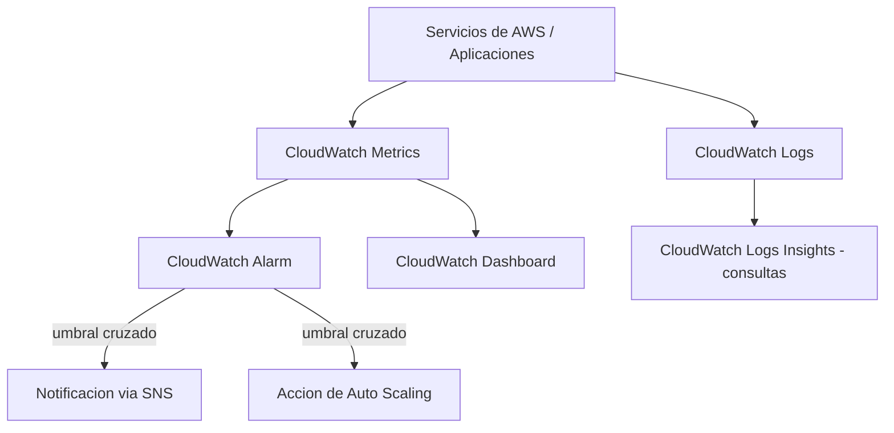
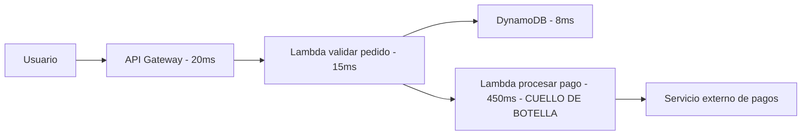
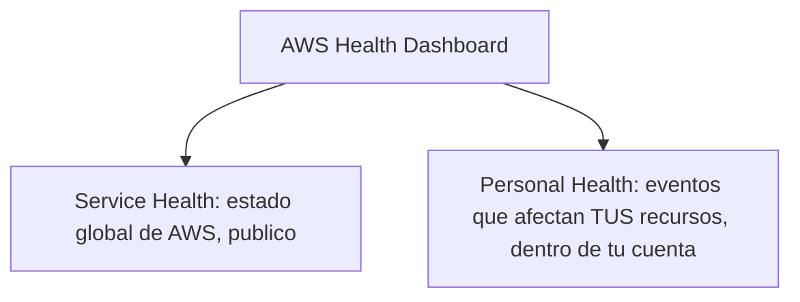
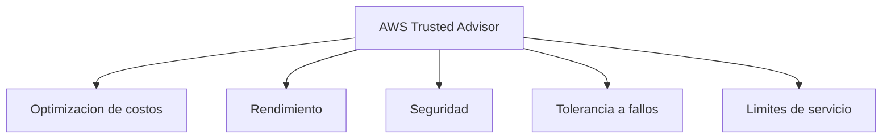

# AWS Certified Cloud Practitioner (CLF-C02)

**PARTE 9 — Observabilidad**

*Un capítulo más corto que los anteriores, pero no menos importante: sin observabilidad, no sabes si tu arquitectura realmente está funcionando bien, ni por qué falló cuando algo sale mal.*

## 1. Objetivos del capítulo

### ¿Qué aprenderé?

- Qué es Amazon CloudWatch y sus componentes principales: métricas, logs, alarmas y dashboards.
- Qué es AWS X-Ray y cuándo se necesita frente a CloudWatch.
- Qué es el AWS Health Dashboard y qué información específica ofrece.
- Qué es AWS Trusted Advisor y sus cinco categorías de recomendaciones.

### ¿Por qué es importante?

Desplegar infraestructura es solo la mitad del trabajo; saber si esa infraestructura está sana, detectar problemas antes de que afecten a los usuarios, y diagnosticar la causa raíz cuando algo falla, es la otra mitad. Estos cuatro servicios cubren monitoreo (CloudWatch), diagnóstico distribuido (X-Ray), estado de la plataforma (Health Dashboard) y buenas prácticas (Trusted Advisor).

### ¿Cómo aparece en el examen?

Aunque es un dominio más pequeño que Seguridad o Cómputo, es habitual encontrar 2-4 preguntas que piden distinguir CloudWatch de X-Ray (agregado vs trazabilidad individual), o Trusted Advisor del Health Dashboard (recomendaciones de buenas prácticas vs estado operativo real de la plataforma).

## 2. Teoría

### 2.1 Amazon CloudWatch

CloudWatch es el servicio central de monitoreo y observabilidad de AWS. Recopila tres tipos principales de datos:

- Métricas: valores numéricos a lo largo del tiempo (ej. CPUUtilization, número de peticiones, latencia). Los servicios de AWS publican métricas 'estándar' automáticamente; el cliente también puede publicar métricas personalizadas (custom metrics) desde su propio código.
- Logs (CloudWatch Logs): registros de texto generados por aplicaciones, funciones Lambda, instancias EC2 (vía el CloudWatch Agent) y otros servicios, organizados en grupos y flujos de log, consultables con CloudWatch Logs Insights.
- Eventos/Alarmas: CloudWatch Alarms vigilan una métrica y disparan una acción automática (notificación SNS, escalado automático, o acciones directas sobre una instancia EC2) cuando esa métrica cruza un umbral definido durante un periodo determinado.
CloudWatch Dashboards permite combinar múltiples métricas de distintos servicios en un panel visual único, útil para tener una vista operativa consolidada de una aplicación completa.

### 2.2 AWS X-Ray

Mientras CloudWatch da una vista agregada del comportamiento de la infraestructura (cuánta CPU se usó en promedio, cuántos errores hubo en total), X-Ray responde una pregunta distinta y más específica: '¿por dónde pasó ESTA solicitud individual, y en qué punto exacto se generó el retraso o el error?'.

X-Ray genera 'traces' (trazas) que representan el recorrido completo de una solicitud a través de los distintos servicios de una arquitectura distribuida (por ejemplo: API Gateway → Lambda → DynamoDB → otra Lambda), mostrando visualmente cuánto tiempo tomó cada segmento del recorrido. Esto es extremadamente valioso en arquitecturas de microservicios, donde un problema de latencia puede originarse en cualquiera de varios componentes, y sería muy difícil de aislar solo con métricas agregadas.

> **CloudWatch vs X-Ray, la diferencia clave:** CloudWatch = vista agregada de infraestructura y aplicación en el tiempo. X-Ray = trazabilidad detallada del recorrido de solicitudes individuales a través de servicios distribuidos. Se usan juntos, no en lugar del otro.

### 2.3 AWS Health Dashboard

El AWS Health Dashboard tiene dos vistas complementarias:

- Service Health (antes 'AWS Service Health Dashboard'): muestra el estado operativo general de todos los servicios de AWS a nivel global, disponible públicamente para cualquiera, sin necesidad de iniciar sesión.
- Your account's Health / Personal Health Dashboard: una vista personalizada, dentro de tu cuenta, que muestra eventos y notificaciones que afectan ESPECÍFICAMENTE a tus propios recursos (por ejemplo, mantenimiento programado en la AZ donde corre una de tus instancias, o degradación detectada en un recurso tuyo).
Esta distinción es importante para el examen: 'Service Health' es información general de la plataforma; 'Personal Health' es información filtrada y relevante específicamente para los recursos de tu cuenta.

### 2.4 AWS Trusted Advisor

Trusted Advisor analiza automáticamente la configuración de tu cuenta de AWS y ofrece recomendaciones accionables organizadas en cinco categorías:

1. Cost Optimization (optimización de costos): identifica recursos subutilizados o mal dimensionados que podrían reducirse o eliminarse.
2. Performance (rendimiento): identifica configuraciones que podrían estar limitando el rendimiento, como límites de servicio cercanos a su capacidad.
3. Security (seguridad): identifica configuraciones de riesgo, como buckets S3 con acceso público no intencionado, o MFA no activado en el usuario root.
4. Fault Tolerance (tolerancia a fallos): identifica configuraciones que podrían comprometer la disponibilidad, como falta de backups o de configuración Multi-AZ.
5. Service Limits (límites de servicio): compara el uso actual de recursos contra los límites (quotas) establecidos por AWS, alertando antes de que se conviertan en un bloqueo operativo.
El nivel de acceso a Trusted Advisor depende del plan de soporte contratado: el plan Basic Support (gratuito) da acceso solo a un subconjunto limitado de verificaciones; el conjunto completo de las cinco categorías requiere un plan Business o Enterprise Support.

## 3. Ejemplos

### Ejemplo empresarial

Un banco configura una CloudWatch Dashboard consolidada que muestra en tiempo real la latencia, el número de errores 5xx, y el uso de CPU de todos sus microservicios críticos, con alarmas que notifican automáticamente al equipo de guardia vía SNS cuando la tasa de error supera el 1% durante más de 5 minutos.

### Ejemplo de startup

Una startup con una arquitectura de microservicios en Lambda usa AWS X-Ray para descubrir que el 80% de la latencia percibida por sus usuarios en el checkout no venía de su propio código, sino de una llamada lenta a un servicio externo de procesamiento de pagos — algo que las métricas agregadas de CloudWatch no habían dejado claro por sí solas.

### Ejemplo personal

Un desarrollador que administra su propia cuenta de AWS revisa mensualmente Trusted Advisor (en su plan Basic, con las verificaciones disponibles de forma gratuita) para asegurarse de que no tiene Elastic IPs sin usar generando cargos innecesarios ni el MFA del usuario root desactivado.

### Caso real del Health Dashboard

Durante una interrupción reportada de un servicio de AWS en una Región específica, un equipo de operaciones consulta primero la vista 'Service Health' del AWS Health Dashboard para confirmar si el problema es de AWS a nivel de plataforma, y después la vista 'Personal Health' para ver si esa interrupción está afectando específicamente a alguno de sus recursos desplegados.

## 4. Diagramas

Diagramas en formato Mermaid — pégalos en mermaid.live o cualquier visor compatible para verlos renderizados.

### 4.1 Componentes de CloudWatch

### 4.2 X-Ray rastreando una solicitud distribuida

### 4.3 Health Dashboard: dos vistas

### 4.4 Las cinco categorías de Trusted Advisor

## 5. Laboratorios

### Laboratorio 1: Crear una CloudWatch Alarm sobre una instancia EC2

Costo: las primeras 10 alarmas de CloudWatch están incluidas en la capa gratuita; usar una instancia t2.micro/t3.micro Free Tier existente no genera costo adicional para este laboratorio.

6. Si no tienes una instancia EC2 corriendo, lanza una siguiendo el laboratorio de la Parte 4.
7. Ve a la consola de CloudWatch → Alarms → Create alarm.
8. Selecciona 'Select metric' → EC2 → Per-Instance Metrics → busca tu instancia y selecciona 'CPUUtilization'.
9. Define la condición: por ejemplo, 'Greater than 70' durante '1 out of 1' periodo de 5 minutos.
10. En 'Configure actions', crea un nuevo tópico SNS (ej. 'alertas-cpu') e ingresa tu correo electrónico para recibir la notificación.
11. Confirma la suscripción SNS desde el correo que recibirás (paso obligatorio, si no confirmas, no recibirás notificaciones).
12. Nombra la alarma (ej. 'CPU-Alta-MiInstancia') y créala.
13. (Opcional, para ver la alarma dispararse) Conéctate a la instancia y ejecuta una carga de CPU artificial, por ejemplo con 'stress' o un bucle simple en bash, y observa cómo la alarma cambia de estado 'OK' a 'ALARM' en la consola.
> **Cómo eliminar los recursos:** Ve a CloudWatch → Alarms → selecciona tu alarma → Actions → Delete. Elimina también el tópico SNS desde la consola de SNS si no lo necesitas para otros laboratorios. Recuerda terminar la instancia EC2 si ya no la necesitas (ver Parte 4).

### Laboratorio 2: Explorar AWS Trusted Advisor y el AWS Health Dashboard

Costo: $0 — ambos son herramientas de solo lectura/exploración, no crean recursos facturables.

14. Ve a la consola de Trusted Advisor.
15. Explora las verificaciones disponibles en tu plan de soporte (en Basic Support verás un subconjunto limitado, principalmente de seguridad y límites de servicio).
16. Revisa la categoría de seguridad: es común ver una alerta si el MFA del usuario root aún no está activado (si ya lo activaste en la Parte 1, deberías ver esa verificación en verde).
17. Revisa la categoría de límites de servicio y observa qué porcentaje de tu cuota estás usando en servicios como VPCs o Elastic IPs.
18. Ahora ve a la consola de AWS Health Dashboard.
19. Revisa la vista 'Service Health' — deberías ver el estado operativo actual de todos los servicios de AWS por Región.
20. Revisa la vista de tu cuenta ('Your account health' o similar) para ver si existe algún evento relevante para tus propios recursos actuales.
> **Nota:** Este laboratorio es puramente de exploración — no hay recursos que crear ni eliminar.

## 6. Errores comunes

- Confundir CloudWatch (vista agregada de métricas/logs) con X-Ray (trazabilidad detallada de solicitudes individuales) — son complementarios, no sustitutos entre sí.
- Esperar que el plan Basic Support (gratuito) dé acceso al conjunto completo de verificaciones de Trusted Advisor — solo un subconjunto está disponible sin un plan de soporte de pago.
- Confundir 'Service Health' (estado general de AWS, público) con 'Personal Health' (eventos específicos de tu cuenta) dentro del Health Dashboard.
- Olvidar confirmar la suscripción de correo electrónico en SNS al crear una alarma con notificación — sin esa confirmación, la alarma se disparará pero nunca llegará la notificación.
- Configurar alarmas con umbrales poco realistas (demasiado sensibles o demasiado laxos), generando fatiga de alertas o, en el otro extremo, no detectando problemas reales a tiempo.

## 7. Comparaciones

### CloudWatch vs X-Ray

CloudWatch = métricas y logs agregados de infraestructura y aplicación a lo largo del tiempo. X-Ray = trazabilidad detallada del recorrido de una solicitud individual a través de una arquitectura distribuida, ideal para diagnosticar dónde se origina la latencia o el error en microservicios.

### Trusted Advisor vs Health Dashboard

Trusted Advisor = recomendaciones de buenas prácticas sobre TU configuración (¿está bien configurado?). Health Dashboard = estado operativo real de la plataforma AWS y de eventos que afectan a tus recursos (¿hay un problema ocurriendo ahora mismo?).

## 8. Preguntas tipo examen

20 preguntas de opción múltiple, mismo estilo y dificultad que el examen oficial CLF-C02.

**Pregunta 1.** ¿Qué es Amazon CloudWatch?

A) Un servicio de backup automatizado

**B)** **Un servicio de monitoreo que recopila métricas, logs y eventos de los recursos de AWS, permitiendo visualizarlos, crear alarmas y automatizar respuestas**

C) Un firewall de aplicaciones web

D) Un servicio exclusivo de facturación

**Respuesta correcta: B.** 

*Amazon CloudWatch es el servicio central de observabilidad de AWS: recopila métricas (como uso de CPU), logs (registros de aplicación) y eventos de prácticamente todos los servicios de AWS, permitiendo visualizarlos en dashboards, definir alarmas que disparan acciones automáticas, y correlacionar el comportamiento del sistema.*

**Pregunta 2.** ¿Qué es una CloudWatch Alarm y para qué se usa típicamente?

A) Un tipo de instancia EC2

**B)** **Un mecanismo que monitorea una métrica y ejecuta una acción automática (como notificar por SNS o disparar Auto Scaling) cuando esa métrica cruza un umbral definido**

C) Un servicio de almacenamiento de logs exclusivamente

D) Un reporte mensual de facturación

**Respuesta correcta: B.** 

*Una CloudWatch Alarm vigila una métrica específica (por ejemplo, el uso de CPU de una instancia) y, cuando esa métrica cruza un umbral definido durante un periodo determinado, dispara una acción automática, como enviar una notificación vía Amazon SNS o activar una política de Auto Scaling.*

**Pregunta 3.** ¿Qué almacena CloudWatch Logs?

A) Únicamente métricas numéricas de CPU

**B)** **Registros de eventos (logs) generados por aplicaciones, servicios de AWS y sistemas operativos, organizados en grupos y flujos de log**

C) Solo información de facturación

D) Imágenes de máquinas virtuales (AMIs)

**Respuesta correcta: B.** 

*CloudWatch Logs centraliza el almacenamiento de registros (logs) generados por aplicaciones, funciones Lambda, instancias EC2 (mediante el CloudWatch Agent) y muchos otros servicios de AWS, organizados en 'log groups' y 'log streams', permitiendo búsqueda y análisis centralizado.*

**Pregunta 4.** Una aplicación distribuida en microservicios experimenta lentitud intermitente, y el equipo necesita identificar exactamente en qué servicio específico de la cadena de llamadas se origina el retraso. ¿Qué servicio de AWS está diseñado específicamente para este tipo de diagnóstico?

A) Amazon CloudWatch exclusivamente

**B)** **AWS X-Ray**

C) AWS Trusted Advisor

D) AWS Health Dashboard

**Respuesta correcta: B.** 

*AWS X-Ray permite rastrear (trace) solicitudes a medida que viajan a través de una aplicación distribuida de múltiples servicios/microservicios, mostrando visualmente en qué componente específico de la cadena se genera la latencia o el error, algo mucho más difícil de diagnosticar solo con métricas agregadas de CloudWatch.*

**Pregunta 5.** ¿Qué es AWS Trusted Advisor?

**A)** **Una herramienta que analiza tu cuenta de AWS y ofrece recomendaciones personalizadas en categorías como optimización de costos, rendimiento, seguridad, tolerancia a fallos y límites de servicio**

B) Un servicio de soporte técnico exclusivo por chat en vivo

C) Un tipo de instancia EC2 optimizada

D) Un servicio de rastreo distribuido de solicitudes

**Respuesta correcta: A.** 

*AWS Trusted Advisor analiza automáticamente la configuración de tu cuenta y ofrece recomendaciones accionables en cinco categorías principales: optimización de costos, rendimiento, seguridad, tolerancia a fallos, y límites de servicio (service limits), ayudando a identificar oportunidades de mejora sin necesidad de una auditoría manual completa.*

**Pregunta 6.** ¿Qué es el AWS Health Dashboard (anteriormente conocido como Service Health Dashboard / Personal Health Dashboard)?

A) Un dashboard de métricas de una sola aplicación específica del cliente

**B)** **Un panel que informa sobre el estado operativo de los servicios de AWS a nivel global, y también sobre eventos que afectan específicamente a los recursos de tu cuenta**

C) Un servicio de facturación detallada

D) Una herramienta exclusiva de optimización de costos

**Respuesta correcta: B.** 

*El AWS Health Dashboard tiene dos vistas: el estado general de los servicios de AWS a nivel global (Service Health), y una vista personalizada (Personal Health) que muestra eventos y notificaciones específicas que afectan a los recursos de tu propia cuenta, como mantenimiento programado o problemas detectados en tus instancias.*

**Pregunta 7.** ¿Cuál de los siguientes NO es uno de los cinco pilares de recomendaciones que ofrece AWS Trusted Advisor?

A) Optimización de costos

B) Rendimiento

C) Seguridad

**D)** **Diseño gráfico de interfaces de usuario**

**Respuesta correcta: D.** 

*Los cinco pilares de Trusted Advisor son: optimización de costos, rendimiento, seguridad, tolerancia a fallos y límites de servicio. El diseño gráfico de interfaces de usuario no es una categoría que evalúe Trusted Advisor, es un distractor fuera de contexto.*

**Pregunta 8.** ¿Qué diferencia principal existe entre las métricas 'estándar' de CloudWatch y las 'métricas personalizadas' (custom metrics)?

A) No hay diferencia, ambas son idénticas en costo y origen

**B)** **Las métricas estándar son publicadas automáticamente por los servicios de AWS; las métricas personalizadas son publicadas explícitamente por el cliente (por ejemplo, desde el código de su aplicación) usando la API de CloudWatch**

C) Las métricas personalizadas solo pueden verse por soporte de AWS, no por el cliente

D) Las métricas estándar requieren instalar un agente obligatoriamente

**Respuesta correcta: B.** 

*Las métricas estándar (como CPUUtilization de EC2) son publicadas automáticamente por los propios servicios de AWS sin configuración adicional. Las métricas personalizadas son enviadas explícitamente por el cliente (por ejemplo, número de usuarios activos en la aplicación) usando la API PutMetricData de CloudWatch, para monitorear aspectos específicos del negocio no cubiertos por las métricas por defecto.*

**Pregunta 9.** Un equipo de DevOps quiere que, automáticamente, se envíe una notificación por correo electrónico al equipo de guardia cuando el uso de CPU de una instancia EC2 crítica supere el 90% durante 5 minutos consecutivos. ¿Qué combinación de servicios resuelve esto?

A) AWS X-Ray exclusivamente

**B)** **Una CloudWatch Alarm sobre la métrica de CPU, con una acción configurada hacia un tópico de Amazon SNS**

C) AWS Trusted Advisor exclusivamente

D) AWS Health Dashboard exclusivamente

**Respuesta correcta: B.** 

*Este es el patrón estándar de alertamiento en AWS: se crea una CloudWatch Alarm que vigila la métrica CPUUtilization con el umbral y periodo definidos, y se configura para disparar una notificación a través de un tópico de Amazon SNS, que a su vez puede enviar el correo electrónico al equipo de guardia.*

**Pregunta 10.** ¿Qué nivel de soporte de AWS es necesario para acceder a TODAS las verificaciones de Trusted Advisor, incluidas las de seguridad y límites de servicio de forma completa?

A) El plan Basic Support (gratuito) ya incluye acceso completo a todas las verificaciones

**B)** **Los planes Business o Enterprise Support (de pago) desbloquean el conjunto completo de verificaciones; Basic Support solo incluye un subconjunto limitado**

C) Ningún plan de soporte incluye Trusted Advisor

D) Solo se puede acceder a Trusted Advisor mediante un ticket manual de soporte

**Respuesta correcta: B.** 

*El plan Basic Support (gratuito) da acceso solo a un subconjunto limitado de verificaciones de Trusted Advisor (principalmente algunas de seguridad y límites de servicio). El conjunto completo de las cinco categorías de recomendaciones requiere un plan de soporte Business o Enterprise.*

**Pregunta 11.** ¿Qué tipo de dato registra AWS X-Ray para cada solicitud que atraviesa una aplicación distribuida?

A) Solo el costo asociado a la solicitud

**B)** **Un 'trace' (traza) que muestra el recorrido completo de la solicitud a través de los distintos servicios/componentes, incluyendo tiempos de cada segmento**

C) Únicamente el nombre de usuario de IAM que hizo la solicitud

D) Solo si la solicitud fue exitosa o fallida, sin ningún otro detalle

**Respuesta correcta: B.** 

*X-Ray genera 'traces' que representan el recorrido completo de una solicitud a través de los distintos servicios y componentes de una aplicación distribuida, registrando segmentos con tiempos de cada etapa, lo que permite identificar visualmente en qué punto específico se genera un cuello de botella o un error.*

**Pregunta 12.** Una empresa quiere revisar de forma proactiva si tiene instancias EC2 subutilizadas que podrían reducirse de tamaño para ahorrar costos, sin tener que analizar manualmente cada instancia. ¿Qué herramienta de AWS le ayudaría directamente con esta recomendación?

A) AWS X-Ray

**B)** **AWS Trusted Advisor, en su categoría de optimización de costos**

C) AWS Health Dashboard

D) Amazon CloudWatch Logs exclusivamente

**Respuesta correcta: B.** 

*Trusted Advisor, en su categoría de optimización de costos, analiza automáticamente el uso de recursos como instancias EC2 y puede señalar instancias con bajo uso de CPU/red sostenido, recomendando redimensionarlas o detenerlas para reducir gastos innecesarios.*

**Pregunta 13.** ¿Qué te permitiría saber el AWS Health Dashboard que Trusted Advisor NO cubre directamente?

A) Recomendaciones de optimización de costos

**B)** **Si un evento operativo específico de AWS (como mantenimiento programado en una AZ, o una degradación de servicio) está afectando o va a afectar a los recursos específicos de TU cuenta**

C) Verificaciones de seguridad de configuración de IAM

D) Límites de servicio de tu cuenta

**Respuesta correcta: B.** 

*El AWS Health Dashboard (vista personalizada) te informa sobre eventos operativos reales de la infraestructura de AWS que afectan específicamente a tus recursos (como mantenimiento programado o degradaciones detectadas), algo distinto de las recomendaciones de buenas prácticas y configuración que ofrece Trusted Advisor.*

**Pregunta 14.** ¿Qué componente de CloudWatch permite crear paneles visuales personalizados combinando múltiples métricas de distintos servicios en una sola vista?

A) CloudWatch Logs Insights

**B)** **CloudWatch Dashboards**

C) CloudWatch Alarms

D) CloudWatch Events exclusivamente

**Respuesta correcta: B.** 

*CloudWatch Dashboards permite crear paneles visuales personalizados donde se combinan gráficas de múltiples métricas (de EC2, RDS, Lambda, métricas personalizadas, etc.) en una sola vista consolidada, útil para monitoreo operativo centralizado de una aplicación completa.*

**Pregunta 15.** Un desarrollador quiere consultar y filtrar rápidamente millones de líneas de logs de una función Lambda usando un lenguaje de consulta similar a SQL, sin descargar manualmente los archivos de log. ¿Qué herramienta de CloudWatch le ayudaría?

A) CloudWatch Alarms

**B)** **CloudWatch Logs Insights**

C) AWS X-Ray exclusivamente

D) AWS Trusted Advisor

**Respuesta correcta: B.** 

*CloudWatch Logs Insights permite escribir consultas interactivas (con un lenguaje de consulta propio, similar en espíritu a SQL) sobre grandes volúmenes de logs almacenados en CloudWatch Logs, filtrando, agregando y analizando resultados sin necesidad de descargar o procesar los archivos manualmente.*

**Pregunta 16.** ¿Cuál de las siguientes combinaciones describe mejor la relación entre CloudWatch y X-Ray?

A) Son el mismo servicio con nombres distintos

**B)** **CloudWatch se enfoca en métricas y logs agregados de infraestructura y aplicaciones; X-Ray se enfoca en el rastreo detallado del recorrido de solicitudes individuales a través de servicios distribuidos**

C) X-Ray reemplaza completamente a CloudWatch en aplicaciones modernas

D) CloudWatch solo funciona con EC2; X-Ray solo funciona con Lambda

**Respuesta correcta: B.** 

*CloudWatch y X-Ray son complementarios: CloudWatch ofrece una vista agregada de métricas y logs de infraestructura y aplicación (¿cuánta CPU se usó?, ¿cuántos errores hubo?), mientras que X-Ray ofrece trazabilidad detallada del recorrido específico de cada solicitud individual a través de una arquitectura distribuida (¿en qué microservicio específico se generó la lentitud de ESTA solicitud?).*

**Pregunta 17.** Una startup en su plan de soporte Basic (gratuito) quiere saber si algún servicio de AWS a nivel global está experimentando una interrupción reportada por AWS en este momento. ¿Dónde debería consultarlo?

A) AWS Trusted Advisor exclusivamente (requiere plan de pago)

**B)** **AWS Health Dashboard, en su vista de Service Health (disponible para todos los clientes sin importar el plan de soporte)**

C) AWS X-Ray

D) Amazon CloudWatch Logs exclusivamente

**Respuesta correcta: B.** 

*La vista de 'Service Health' del AWS Health Dashboard, que muestra el estado operativo general de los servicios de AWS a nivel global, está disponible públicamente para cualquier cliente sin importar su plan de soporte, a diferencia de algunas verificaciones completas de Trusted Advisor que requieren planes de pago.*

**Pregunta 18.** ¿Qué acción NO es una acción típica que se puede configurar para que dispare una CloudWatch Alarm?

A) Enviar una notificación a un tópico de Amazon SNS

B) Disparar una política de Auto Scaling para añadir o quitar instancias

C) Detener, terminar, reiniciar o recuperar automáticamente una instancia EC2

**D)** **Aprobar automáticamente solicitudes de acceso de nuevos usuarios IAM**

**Respuesta correcta: D.** 

*Las CloudWatch Alarms pueden disparar notificaciones SNS, acciones de Auto Scaling, o acciones directas sobre instancias EC2 (detener, terminar, reiniciar, recuperar). Aprobar solicitudes de acceso de usuarios IAM no es una acción que CloudWatch Alarms controle; eso pertenece al dominio de IAM/gestión de accesos.*

**Pregunta 19.** Un equipo de arquitectura está revisando si su cuenta de AWS se acerca a algún límite de servicio (por ejemplo, número máximo de VPCs permitidas por Región) antes de que eso bloquee un proyecto de expansión. ¿Qué herramienta consultarían primero?

A) AWS X-Ray

**B)** **AWS Trusted Advisor, categoría de límites de servicio (Service Limits)**

C) CloudWatch Logs Insights

D) AWS Health Dashboard exclusivamente

**Respuesta correcta: B.** 

*Trusted Advisor incluye una categoría específica de 'Service Limits' que compara el uso actual de recursos de la cuenta contra los límites (quotas) establecidos por AWS para cada servicio, alertando quando el uso se acerca a esos límites antes de que se conviertan en un bloqueo operativo.*

**Pregunta 20.** ¿Qué diferencia hay entre las métricas de CloudWatch con resolución 'estándar' (1 minuto) y resolución 'de alta frecuencia' (high-resolution, hasta 1 segundo)?

A) No existe tal diferencia, todas las métricas de CloudWatch usan la misma resolución obligatoriamente

**B)** **Las métricas de alta resolución permiten detectar cambios más rápidos y granulares en el comportamiento de un recurso, a cambio de mayor costo de almacenamiento de esos puntos de datos adicionales**

C) Las métricas de alta resolución solo están disponibles para Amazon S3

D) La resolución de las métricas no afecta el costo de CloudWatch

**Respuesta correcta: B.** 

*CloudWatch permite publicar métricas con resolución estándar (agregadas cada 1 minuto) o de alta resolución (hasta cada 1 segundo), siendo esta última útil para detectar cambios muy rápidos en el comportamiento de un sistema, a cambio de un mayor costo por la mayor cantidad de puntos de datos almacenados.*

## 9. Resumen

### Resumen ejecutivo

Amazon CloudWatch centraliza métricas, logs y alarmas, ofreciendo una vista agregada del comportamiento de la infraestructura y las aplicaciones, con capacidad de disparar acciones automáticas al cruzar umbrales. AWS X-Ray complementa esa vista con trazabilidad detallada del recorrido de solicitudes individuales a través de arquitecturas distribuidas, ideal para diagnosticar problemas de latencia en microservicios. El AWS Health Dashboard informa sobre el estado operativo de la plataforma AWS (Service Health, público) y sobre eventos específicos que afectan tu cuenta (Personal Health). AWS Trusted Advisor analiza tu configuración y ofrece recomendaciones en cinco categorías: costos, rendimiento, seguridad, tolerancia a fallos y límites de servicio, con acceso completo condicionado al plan de soporte contratado.

### Conceptos clave (memorizar)

- **CloudWatch = agregado (métricas, logs, alarmas). X-Ray = detallado (trazas de solicitudes individuales).**
- **CloudWatch Alarm puede disparar: notificación SNS, Auto Scaling, o acciones sobre EC2.**
- **Health Dashboard: Service Health (público, global) vs Personal Health (tu cuenta específica).**
- **Trusted Advisor: 5 categorías — costos, rendimiento, seguridad, tolerancia a fallos, límites de servicio.**
- **Basic Support = Trusted Advisor limitado. Business/Enterprise Support = acceso completo.**

### Lo que normalmente pregunta AWS

Escenarios que piden distinguir CloudWatch de X-Ray según si se necesita una vista agregada o trazabilidad de solicitudes individuales, y escenarios que piden distinguir Trusted Advisor (recomendaciones de configuración) del Health Dashboard (estado operativo real de la plataforma).

## Recursos externos para este capítulo

### Documentación oficial

- Amazon CloudWatch User Guide — docs.aws.amazon.com/cloudwatch
- AWS X-Ray Developer Guide — docs.aws.amazon.com/xray
- AWS Health Dashboard — health.aws.amazon.com
- AWS Trusted Advisor — aws.amazon.com/premiumsupport/technology/trusted-advisor

### Videos recomendados

- AWS Skill Builder: módulo de Monitoring dentro de 'Cloud Practitioner Essentials'.
- Stephane Maarek: sección de CloudWatch y X-Ray de su curso CLF-C02.
- AWS re:Invent: charlas sobre observabilidad y mejores prácticas de monitoreo en AWS.

### Laboratorios adicionales

- AWS Skill Builder Labs: 'Introduction to Amazon CloudWatch'.
- AWS Workshops: 'Observability Workshop' (buscar en aws.amazon.com/workshops).