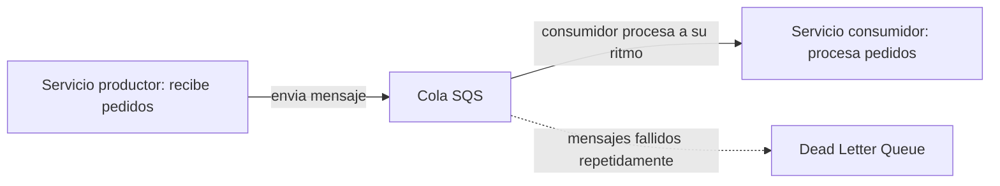
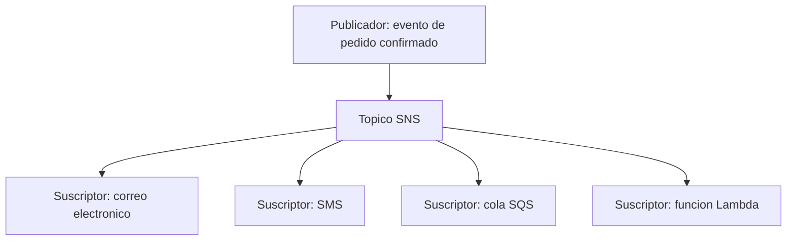
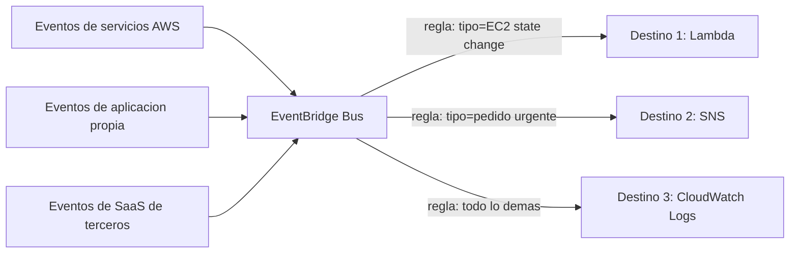
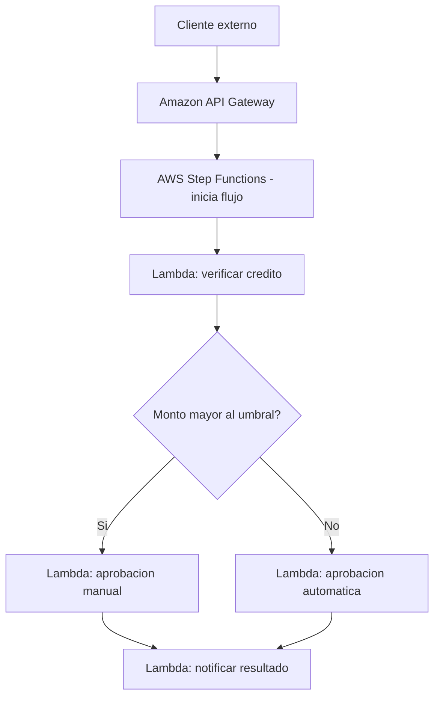

# AWS Certified Cloud Practitioner (CLF-C02)

**PARTE 10 — Integración**

*Este capítulo cubre cómo los distintos componentes de una arquitectura moderna se 'hablan' entre sí sin quedar rígidamente acoplados — la diferencia entre una arquitectura frágil y una resiliente casi siempre está aquí.*

## 1. Objetivos del capítulo

### ¿Qué aprenderé?

- Qué es Amazon SQS y cómo desacopla componentes mediante colas de mensajes.
- Qué es Amazon SNS y el patrón de publicación/suscripción (pub/sub).
- Qué es Amazon EventBridge y en qué se diferencia de SNS.
- Qué es AWS Step Functions y cuándo orquestar flujos de trabajo con él.
- Qué es Amazon API Gateway y su rol en arquitecturas serverless.

### ¿Por qué es importante?

Las arquitecturas modernas en la nube rara vez son un solo componente monolítico; son conjuntos de servicios que se comunican entre sí. Estos servicios de integración son el 'pegamento' que permite que esa comunicación sea resiliente (no se pierden mensajes si algo falla temporalmente) y desacoplada (un componente no depende de que otro esté disponible en el instante exacto).

### ¿Cómo aparece en el examen?

Es habitual encontrar preguntas que piden distinguir SQS de SNS según si el mensaje debe ir a UN consumidor o a MÚLTIPLES suscriptores simultáneamente, y preguntas que describen la necesidad de orquestar varios pasos con lógica condicional, esperando que identifiques Step Functions como la respuesta.

## 2. Teoría

### 2.1 ¿Por qué desacoplar componentes?

En una arquitectura 'fuertemente acoplada' (tightly coupled), un componente A llama directamente a un componente B y espera su respuesta inmediata. Si B está caído, saturado, o lento, A se ve afectado directamente — el fallo se propaga. En una arquitectura 'desacoplada' (decoupled), A coloca un mensaje en un intermediario (una cola o un bus de eventos) y continúa su trabajo; B procesa ese mensaje cuando puede, sin que A tenga que esperar ni verse afectado por la disponibilidad momentánea de B.

> **Analogía:** Una llamada telefónica es acoplamiento fuerte: si la otra persona no contesta, la comunicación falla en ese instante. Un mensaje de voz (o de texto) es desacoplamiento: lo dejas, y la otra persona lo escucha cuando puede, sin que tu comunicación 'falle' por eso.

### 2.2 Amazon SQS (Simple Queue Service)

SQS es un servicio de colas de mensajes totalmente administrado. Un componente productor envía mensajes a la cola; uno o más componentes consumidores los reciben y procesan, eliminándolos de la cola una vez procesados exitosamente. SQS actúa como un buffer que absorbe picos de carga y protege al consumidor de ser saturado directamente.

Un concepto clave es el visibility timeout: cuando un consumidor recibe un mensaje, este NO se elimina inmediatamente, sino que se oculta temporalmente a otros consumidores durante un periodo configurable. Si el consumidor no confirma el procesamiento exitoso (eliminando el mensaje) dentro de ese periodo, el mensaje vuelve a estar disponible para ser procesado de nuevo — esto protege contra la pérdida de mensajes si un consumidor falla a mitad de procesamiento.

Existen dos tipos de colas: SQS Standard (máximo throughput, entrega 'at-least-once', sin garantía estricta de orden) y SQS FIFO (First-In-First-Out, garantiza orden estricto y entrega 'exactly-once' dentro de un grupo de mensajes, a cambio de menor throughput máximo).

Una Dead Letter Queue (DLQ) es una cola secundaria configurable hacia donde se envían automáticamente los mensajes que fallan su procesamiento repetidamente (tras un número definido de intentos), evitando que mensajes 'envenenados' bloqueen indefinidamente el procesamiento normal.

### 2.3 Amazon SNS (Simple Notification Service)

SNS implementa el patrón de publicación/suscripción (pub/sub): un productor publica un mensaje en un 'tópico', y ese mensaje se entrega automáticamente a TODOS los suscriptores de ese tópico de forma simultánea. Los suscriptores pueden ser de tipos muy distintos: direcciones de correo electrónico, números SMS, colas SQS, funciones Lambda, endpoints HTTP/HTTPS, entre otros.

Este patrón es ideal para el escenario de 'fan-out': un único evento que debe notificarse o procesarse por múltiples sistemas distintos simultáneamente, sin que el productor tenga que conocer ni gestionar cada destino individualmente — solo publica una vez en el tópico.

### 2.4 Amazon EventBridge

EventBridge es un bus de eventos serverless más moderno y flexible que SNS en cuanto a capacidades de enrutamiento. Permite recibir eventos de tres tipos de fuentes: servicios nativos de AWS (como cambios de estado de una instancia EC2, o un objeto subido a S3), aplicaciones propias del cliente (eventos personalizados), y aplicaciones SaaS de terceros integradas.

Su característica distintiva frente a SNS es el enrutamiento basado en reglas (rules) que examinan el contenido y la estructura del propio evento (event pattern matching), permitiendo dirigir distintos tipos de eventos hacia distintos destinos de forma mucho más granular y sin necesidad de que cada consumidor reciba TODO lo publicado en un tópico.

### 2.5 AWS Step Functions

Step Functions permite orquestar flujos de trabajo de múltiples pasos como una máquina de estados (state machine), coordinando la ejecución secuencial o condicional de funciones Lambda y otros servicios de AWS. Ofrece manejo nativo de reintentos configurables, captura y manejo de errores por paso, ramificación condicional (if/else lógico entre pasos), y ejecución en paralelo de ramas independientes.

Su gran ventaja es sacar la lógica de 'qué paso sigue a cuál, y qué hacer si falla' del código de la aplicación, representándola de forma visual y declarativa, lo cual mejora enormemente la observabilidad: se puede ver exactamente en qué paso se encuentra (o se quedó atascada) cada ejecución específica del flujo.

### 2.6 Amazon API Gateway

API Gateway es el servicio para crear, publicar y administrar APIs (REST, HTTP o WebSocket) que exponen funcionalidad hacia clientes externos (aplicaciones web, móviles, u otros sistemas). Gestiona aspectos operativos como: autenticación y autorización (integrándose con IAM, Cognito, o autorizadores personalizados), throttling (limitación de tasa de peticiones para proteger el backend), validación de peticiones, versionado de la API, y monitoreo integrado con CloudWatch.

En una arquitectura serverless típica, API Gateway recibe las peticiones HTTP externas y las enruta hacia funciones Lambda que contienen la lógica de negocio real, formando el patrón 'API Gateway + Lambda' extremadamente común en aplicaciones modernas sin servidores que administrar.

| Servicio | Patrón principal | Caso de uso típico |
| --- | --- | --- |
| SQS | Colas (punto a punto, típicamente un consumidor) | Desacoplar productor y consumidor, absorber picos de carga |
| SNS | Publicación/suscripción (fan-out a múltiples destinos) | Notificar simultáneamente a varios sistemas distintos |
| EventBridge | Bus de eventos con enrutamiento por reglas | Integrar múltiples fuentes (AWS, propias, SaaS) con filtrado fino |
| Step Functions | Orquestación de flujos de trabajo (máquina de estados) | Procesos de negocio de múltiples pasos con lógica condicional |
| API Gateway | Puerta de entrada HTTP/REST/WebSocket | Exponer APIs hacia clientes externos, frecuentemente con Lambda |

## 3. Ejemplos

### Ejemplo empresarial

Un banco usa Step Functions para orquestar el proceso completo de apertura de una cuenta nueva: verificación de identidad, revisión de listas de sanciones, aprobación automática o escalado a revisión manual según el riesgo detectado, y notificación final al cliente — todo visualizado como una máquina de estados donde el equipo de cumplimiento puede ver exactamente en qué etapa está cada solicitud.

### Ejemplo de startup

Una startup de delivery usa SQS para desacoplar el servicio que recibe pedidos (que debe responder rápido al cliente) del servicio que asigna repartidores (que puede tardar unos segundos más en procesar sin afectar la experiencia del cliente), evitando que un pico de pedidos sature directamente el proceso de asignación.

### Ejemplo personal

Un desarrollador que construye una API personal para su aplicación de notas usa API Gateway delante de una función Lambda, aprovechando el throttling automático para protegerse de un posible abuso de su API pública sin tener que implementar esa lógica de límites manualmente.

### Caso real de EventBridge

Una empresa de logística conecta EventBridge con su proveedor SaaS de gestión de flotas: cuando un vehículo reporta una desviación de ruta significativa (evento del SaaS de terceros), una regla de EventBridge enruta ese evento específico hacia una función Lambda que notifica al despachador, mientras otros tipos de eventos del mismo proveedor se enrutan hacia un almacén de datos para análisis histórico — todo desde el mismo bus de eventos, con reglas de filtrado distintas.

## 4. Diagramas

Diagramas en formato Mermaid — pégalos en mermaid.live o cualquier visor compatible para verlos renderizados.

### 4.1 SQS: desacoplamiento productor-consumidor



### 4.2 SNS: patron fan-out a multiples suscriptores



### 4.3 EventBridge: enrutamiento basado en reglas



### 4.4 Step Functions + API Gateway + Lambda: arquitectura serverless completa



## 5. Laboratorios

### Laboratorio 1: Crear una cola SQS y un tópico SNS con suscripción cruzada

Costo: la capa siempre gratuita de SQS incluye 1 millón de solicitudes mensuales; la de SNS incluye 1 millón de publicaciones mensuales — este laboratorio no debería generar ningún costo.

1. Ve a la consola de Amazon SQS → Create queue.
2. Elige tipo 'Standard', nómbrala (ej. 'cola-pedidos'), y déjala con configuración por defecto.
3. Créala y copia su ARN (lo necesitarás en el siguiente paso).
4. Ve a la consola de Amazon SNS → Topics → Create topic.
5. Elige tipo 'Standard', nómbralo (ej. 'notificaciones-pedidos'), y créalo.
6. Dentro del tópico, ve a 'Create subscription'. Elige protocolo 'Email', ingresa tu correo, y crea la suscripción.
7. Confirma la suscripción desde el correo que recibirás.
8. Crea una segunda suscripción al mismo tópico, esta vez con protocolo 'Amazon SQS', seleccionando la cola que creaste en el paso 1.
9. Ve a tu tópico SNS → 'Publish message', escribe un mensaje de prueba (ej. 'Pedido #1001 confirmado') y publícalo.
10. Verifica que recibiste el correo electrónico, y ve a tu cola SQS → 'Send and receive messages' → 'Poll for messages' para confirmar que el mismo mensaje también llegó a la cola — habrás comprobado el patrón fan-out de SNS en acción.
> **Cómo eliminar los recursos:** Elimina primero las suscripciones desde SNS → Subscriptions, después el tópico SNS, y finalmente la cola SQS desde su consola respectiva. Ninguno de estos recursos genera costo mientras no se supere la capa gratuita, pero es buena práctica limpiar el entorno de laboratorio.

### Laboratorio 2: Crear una máquina de estados simple con AWS Step Functions

Costo: la capa siempre gratuita de Step Functions incluye 4,000 transiciones de estado gratuitas por mes (flujo Standard), suficiente para este laboratorio de práctica.

11. Ve a la consola de Step Functions → Create state machine.
12. Elige 'Write your workflow in code' y el tipo 'Standard'.
13. Reemplaza la definición de ejemplo con una máquina de estados simple de dos pasos secuenciales, usando el editor visual para verificar que el flujo se dibuja como esperas:
```json
{
  "Comment": "Flujo simple de aprobacion",
  "StartAt": "VerificarMonto",
  "States": {
    "VerificarMonto": {
      "Type": "Choice",
      "Choices": [
        {
          "Variable": "$.monto",
          "NumericGreaterThan": 1000,
          "Next": "RequiereAprobacionManual"
        }
      ],
      "Default": "AprobacionAutomatica"
    },
    "RequiereAprobacionManual": { "Type": "Pass", "End": true },
    "AprobacionAutomatica": { "Type": "Pass", "End": true }
  }
}
```

14. Nombra la máquina de estados (ej. 'flujo-aprobacion-simple') y créala (puedes usar un rol de IAM nuevo generado automáticamente por el asistente).
15. Una vez creada, ve a 'Start execution', e ingresa un input de prueba: { "monto": 1500 }
16. Observa en el diagrama visual cómo la ejecución sigue la rama 'RequiereAprobacionManual', ya que el monto supera 1000.
17. Repite la ejecución con { "monto": 500 } y observa cómo esta vez sigue la rama 'AprobacionAutomatica'.
> **Cómo eliminar los recursos:** Ve a Step Functions → State machines → selecciona la tuya → Delete. Este recurso no genera costo continuo mientras no se ejecute, pero es buena práctica eliminarlo si no lo seguirás usando.

## 6. Errores comunes

- Confundir SQS (un mensaje, típicamente un consumidor) con SNS (un mensaje, múltiples suscriptores simultáneos) — son patrones de mensajería fundamentalmente distintos.
- Elegir SNS cuando en realidad se necesita procesar cada mensaje una sola vez de forma controlada, con posibilidad de reintentos y sin que se pierda si el consumidor falla — ese es el terreno de SQS, no de SNS por sí solo.
- Construir lógica de orquestación compleja (múltiples pasos, reintentos, ramificaciones) directamente dentro del código de una función Lambda 'controladora', en vez de usar Step Functions, perdiendo observabilidad y mantenibilidad.
- Olvidar configurar una Dead Letter Queue en colas SQS críticas, permitiendo que mensajes 'envenenados' se reintenten indefinidamente sin resolución ni visibilidad del problema.
- No confirmar la suscripción de correo electrónico en SNS, y luego pensar que el servicio 'no funciona' cuando en realidad el mensaje nunca pudo entregarse a esa suscripción no confirmada.
- Exponer una API directamente desde Lambda (Function URLs) para casos que en realidad se beneficiarían de las funcionalidades de gestión de API Gateway (throttling, autenticación centralizada, versionado) en producción.

## 7. Comparaciones

### SQS vs SNS

SQS = colas, un mensaje esperando ser consumido (típicamente por un consumidor), ideal para desacoplar y procesar a ritmo propio. SNS = publicación/suscripción, un mensaje entregado a MÚLTIPLES suscriptores simultáneamente (fan-out). Es común combinarlos: SNS publica, y uno de sus suscriptores es precisamente una cola SQS.

### SNS vs EventBridge

Ambos distribuyen eventos/mensajes a múltiples destinos, pero EventBridge ofrece enrutamiento mucho más granular basado en el contenido del evento (event pattern matching) y soporta de forma nativa múltiples fuentes, incluyendo SaaS de terceros — SNS es más simple y directo cuando el fan-out no necesita ese nivel de filtrado.

### Step Functions vs orquestación manual en Lambda

Step Functions externaliza la lógica de 'qué sigue, cómo reintentar, cómo manejar errores' fuera del código, con visualización nativa del estado de cada ejecución. Orquestar manualmente dentro de una Lambda funciona para casos muy simples, pero se vuelve difícil de mantener y observar a medida que el flujo crece en complejidad.

## 8. Preguntas tipo examen

20 preguntas de opción múltiple, mismo estilo y dificultad que el examen oficial CLF-C02.

**Pregunta 1.** Una aplicación de procesamiento de pedidos quiere desacoplar el servicio que recibe pedidos del servicio que los procesa, de forma que si el procesador está temporalmente saturado o caído, los pedidos no se pierdan y se procesen tan pronto como esté disponible de nuevo. ¿Qué servicio de AWS resuelve esto directamente?

A) Amazon SNS

**B)** **Amazon SQS**

C) AWS Step Functions

D) Amazon API Gateway

**Respuesta correcta: B.** 

*Amazon SQS (Simple Queue Service) es un servicio de colas de mensajes que permite desacoplar componentes: el productor coloca mensajes en la cola y el consumidor los procesa a su propio ritmo, actuando como buffer que evita la pérdida de mensajes si el consumidor está temporalmente no disponible o saturado.*

**Pregunta 2.** ¿Cuál es la diferencia fundamental entre Amazon SQS y Amazon SNS en cuanto al patrón de mensajería?

A) Son el mismo servicio con nombres distintos

**B)** **SQS es un modelo de colas (un mensaje es consumido típicamente por un solo consumidor, punto a punto); SNS es un modelo de publicación/suscripción (un mensaje se entrega a MÚLTIPLES suscriptores simultáneamente)**

C) SNS solo funciona con Lambda; SQS solo funciona con EC2

D) SQS es de pago; SNS es siempre gratuito

**Respuesta correcta: B.** 

*SQS implementa el patrón de colas (queue): los mensajes esperan en la cola hasta ser consumidos, típicamente por un solo consumidor (o un grupo de consumidores compitiendo por el mensaje). SNS implementa el patrón publicación/suscripción (pub/sub): un mensaje publicado se entrega automáticamente a TODOS los suscriptores del tópico (email, SQS, Lambda, SMS, etc.) simultáneamente.*

**Pregunta 3.** Una empresa necesita notificar simultáneamente a tres sistemas distintos (un correo al equipo de soporte, una función Lambda que actualiza un dashboard, y una cola SQS para procesamiento posterior) cada vez que ocurre un evento específico. ¿Qué servicio de AWS es el más adecuado para distribuir ese único evento a los tres destinos?

A) Amazon SQS exclusivamente

**B)** **Amazon SNS, publicando el evento a un tópico con los tres suscriptores configurados**

C) AWS Step Functions exclusivamente

D) Amazon Route 53

**Respuesta correcta: B.** 

*Amazon SNS está diseñado exactamente para este patrón de 'fan-out': un único mensaje publicado en un tópico se entrega automáticamente a todos los suscriptores configurados (que pueden ser de tipos distintos: email, SMS, SQS, Lambda, HTTP/HTTPS), sin que el productor del mensaje tenga que conocer ni gestionar cada destino individualmente.*

**Pregunta 4.** ¿Qué es Amazon EventBridge?

A) Un servicio de colas de mensajes simple

**B)** **Un bus de eventos serverless que permite conectar aplicaciones usando datos de eventos desde fuentes de AWS, aplicaciones propias del cliente, y aplicaciones SaaS de terceros, con capacidad de enrutamiento basado en reglas**

C) Un servicio exclusivo de bases de datos

D) Un tipo de instancia EC2

**Respuesta correcta: B.** 

*Amazon EventBridge es un bus de eventos serverless que permite recibir eventos de múltiples fuentes (servicios de AWS, aplicaciones propias, integraciones SaaS de terceros) y enrutarlos automáticamente hacia distintos destinos según reglas basadas en el contenido del evento, con un modelo más flexible y rico en filtrado que SNS.*

**Pregunta 5.** Una aplicación necesita orquestar un flujo de trabajo de varios pasos (validar pago, reservar inventario, notificar al almacén, enviar confirmación), donde cada paso depende del resultado del anterior y se necesita manejar reintentos y errores de forma visual y estructurada. ¿Qué servicio de AWS es el más adecuado?

A) Amazon SQS

**B)** **AWS Step Functions**

C) Amazon SNS

D) Amazon Route 53

**Respuesta correcta: B.** 

*AWS Step Functions permite orquestar flujos de trabajo de múltiples pasos (state machines) de forma visual, coordinando llamadas a funciones Lambda u otros servicios de AWS, con manejo nativo de reintentos, captura de errores y ramificación condicional entre pasos, ideal para procesos de negocio con múltiples etapas dependientes.*

**Pregunta 6.** ¿Qué es Amazon API Gateway?

A) Un servicio de bases de datos NoSQL

**B)** **Un servicio totalmente administrado para crear, publicar, mantener, monitorear y proteger APIs REST, HTTP y WebSocket a cualquier escala**

C) Un tipo de Load Balancer exclusivo para tráfico interno

D) Un servicio de almacenamiento de objetos

**Respuesta correcta: B.** 

*Amazon API Gateway permite crear y exponer APIs (REST, HTTP o WebSocket) que actúan como 'puerta de entrada' hacia el backend de una aplicación (frecuentemente funciones Lambda), gestionando autenticación, limitación de tasa (throttling), versionado, y monitoreo, sin que el desarrollador tenga que construir esa infraestructura de API manualmente.*

**Pregunta 7.** Una arquitectura serverless típica combina API Gateway con AWS Lambda. ¿Qué rol cumple API Gateway en esa combinación?

A) Ejecuta el código de negocio de la aplicación

**B)** **Actúa como la puerta de entrada HTTP que recibe las peticiones de los clientes y las enruta hacia la función Lambda correspondiente, gestionando autenticación y límites de tasa**

C) Almacena los datos de la aplicación de forma persistente

D) Reemplaza la necesidad de usar IAM

**Respuesta correcta: B.** 

*En una arquitectura serverless típica, API Gateway recibe las peticiones HTTP de los clientes externos, gestiona aspectos como autenticación, autorización, limitación de tasa (throttling) y validación de peticiones, y las enruta hacia la función Lambda (u otro backend) correspondiente, que contiene la lógica de negocio real.*

**Pregunta 8.** ¿Qué característica de Amazon SQS ayuda a evitar que un mensaje se pierda si el consumidor falla justo después de recibirlo pero antes de procesarlo completamente?

A) El mensaje se elimina automáticamente e irrecuperablemente al ser recibido

**B)** **El periodo de visibilidad (visibility timeout): el mensaje se oculta temporalmente a otros consumidores tras ser recibido, pero vuelve a estar disponible en la cola si no se elimina explícitamente dentro de ese periodo**

C) SQS reenvía automáticamente el mensaje por correo electrónico como respaldo

D) No existe ningún mecanismo de este tipo en SQS

**Respuesta correcta: B.** 

*Cuando un consumidor recibe un mensaje de SQS, este se oculta temporalmente (visibility timeout) para otros consumidores, pero NO se elimina de la cola. Si el consumidor no confirma explícitamente el procesamiento exitoso (eliminando el mensaje) dentro de ese periodo, el mensaje vuelve a estar visible y disponible para ser procesado nuevamente, evitando pérdida de datos ante fallos del consumidor.*

**Pregunta 9.** ¿Qué es una Dead Letter Queue (DLQ) en el contexto de Amazon SQS?

A) Una cola que elimina automáticamente todos los mensajes tras 1 hora

**B)** **Una cola secundaria hacia donde se envían automáticamente los mensajes que han fallado su procesamiento repetidamente, para su análisis posterior sin bloquear la cola principal**

C) Un tipo de instancia EC2

D) Un sinónimo de Amazon SNS

**Respuesta correcta: B.** 

*Una Dead Letter Queue es una cola SQS secundaria configurada para recibir automáticamente mensajes que no pudieron procesarse exitosamente después de un número definido de intentos, permitiendo aislar y analizar esos mensajes problemáticos sin que bloqueen indefinidamente el procesamiento normal de la cola principal.*

**Pregunta 10.** Una empresa quiere reaccionar automáticamente cada vez que se crea una nueva instancia EC2 en su cuenta, sin importar si esa instancia fue creada manualmente, por un script, o por Auto Scaling, y enrutar ese evento según reglas de negocio hacia distintos destinos. ¿Qué servicio encaja mejor con este requisito de enrutamiento flexible basado en el contenido del evento?

A) Amazon SQS exclusivamente

**B)** **Amazon EventBridge, usando una regla que capture eventos de EC2 y los enrute según su contenido**

C) AWS Step Functions exclusivamente

D) Amazon Route 53

**Respuesta correcta: B.** 

*Amazon EventBridge está diseñado para capturar eventos de servicios de AWS (incluyendo eventos de ciclo de vida de recursos como la creación de una instancia EC2) y enrutarlos según reglas basadas en el contenido y estructura del evento hacia múltiples destinos posibles, con mayor flexibilidad de filtrado que SNS.*

**Pregunta 11.** ¿Cuál de las siguientes NO es una fuente típica de eventos que puede recibir Amazon EventBridge?

A) Servicios nativos de AWS (como EC2, S3)

B) Aplicaciones propias del cliente, mediante eventos personalizados

C) Aplicaciones SaaS de terceros integradas como fuentes de eventos

**D)** **Únicamente eventos generados manualmente por soporte de AWS**

**Respuesta correcta: D.** 

*EventBridge puede recibir eventos de servicios de AWS, de aplicaciones propias del cliente (eventos personalizados), y de aplicaciones SaaS de terceros integradas (como Zendesk o Shopify, entre otras integraciones disponibles). No existe un mecanismo de 'eventos generados manualmente por soporte de AWS' como fuente formal.*

**Pregunta 12.** ¿Qué ventaja ofrece AWS Step Functions frente a coordinar manualmente una secuencia de invocaciones de Lambda escribiendo el código de orquestación dentro de una única función Lambda 'controladora'?

A) Step Functions es siempre más económico en cualquier escenario, sin excepción

**B)** **Step Functions ofrece una representación visual del flujo, manejo nativo de reintentos y captura de errores por paso, y evita construir y mantener lógica de orquestación compleja dentro del código de una sola función**

C) Step Functions elimina la necesidad de usar Lambda por completo

D) No existe ninguna ventaja real

**Respuesta correcta: B.** 

*AWS Step Functions externaliza la lógica de orquestación (qué paso sigue a cuál, cómo reintentar, cómo manejar errores) fuera del código de negocio, representándola visualmente como una máquina de estados, lo cual mejora la mantenibilidad y observabilidad frente a construir esa lógica de coordinación manualmente dentro de una función Lambda 'controladora' monolítica.*

**Pregunta 13.** Una aplicación pública necesita proteger su API contra un cliente que envía peticiones excesivamente rápido, degradando el servicio para otros usuarios. ¿Qué funcionalidad de Amazon API Gateway ayuda a mitigar esto?

A) Versionado de API exclusivamente

**B)** **Throttling (limitación de tasa de peticiones), configurable a nivel de cuenta, API o cliente individual**

C) Amazon SNS integrado

D) AWS Step Functions

**Respuesta correcta: B.** 

*API Gateway permite configurar throttling (límites de tasa de peticiones por segundo, con ráfagas permitidas) a distintos niveles, protegiendo el backend de la aplicación contra un volumen excesivo de peticiones de un cliente específico o del tráfico agregado total.*

**Pregunta 14.** ¿Qué tipo de arquitectura describe mejor una aplicación que usa SQS entre un servicio productor y un servicio consumidor, en vez de que el productor llame directamente al consumidor?

A) Arquitectura fuertemente acoplada (tightly coupled)

**B)** **Arquitectura desacoplada (decoupled), donde los componentes no dependen de la disponibilidad inmediata del otro para funcionar**

C) Arquitectura monolítica

D) Arquitectura sin estado exclusivamente para bases de datos

**Respuesta correcta: B.** 

*Usar una cola de mensajes como SQS entre dos componentes es el patrón clásico de desacoplamiento (decoupling): el productor no necesita que el consumidor esté disponible en el momento exacto de enviar el mensaje, y el consumidor procesa a su propio ritmo, mejorando la resiliencia general del sistema ante picos de carga o fallos temporales de cualquiera de los dos lados.*

**Pregunta 15.** Una aplicación de e-commerce quiere enviar una notificación por SMS al cliente Y simultáneamente encolar el pedido para su procesamiento en backend, a partir de un único evento de 'pedido confirmado'. ¿Qué combinación de servicios de integración resolvería esto de forma nativa?

**A)** **Un tópico de Amazon SNS con dos suscriptores: un número de SMS y una cola SQS**

B) Solamente Amazon SQS, sin ningún otro servicio

C) AWS Step Functions exclusivamente, sin SNS ni SQS

D) Amazon Route 53 exclusivamente

**Respuesta correcta: A.** 

*Un tópico SNS puede tener múltiples tipos de suscriptores simultáneamente: en este caso, un suscriptor SMS (para notificar al cliente) y un suscriptor SQS (para encolar el procesamiento del pedido), logrando el patrón de 'fan-out' de un único evento hacia múltiples destinos con un solo mensaje publicado.*

**Pregunta 16.** ¿Qué sucede con un mensaje en una cola SQS estándar (no FIFO) en cuanto al orden de entrega y la posibilidad de duplicados?

A) Garantiza orden estricto y entrega exactamente una vez, siempre

**B)** **No garantiza un orden estricto de entrega, y es posible (aunque poco frecuente) que un mensaje se entregue más de una vez (at-least-once delivery)**

C) Elimina automáticamente los mensajes duplicados sin configuración adicional

D) Solo permite un mensaje en la cola a la vez

**Respuesta correcta: B.** 

*Las colas SQS estándar ofrecen entrega 'at-least-once' (al menos una vez), lo que significa que en casos poco frecuentes un mensaje podría entregarse más de una vez, y no garantizan un orden estricto de entrega. Para esos requisitos más estrictos, existen las colas SQS FIFO (First-In-First-Out), que sí garantizan orden y entrega exactamente una vez dentro de un mismo grupo de mensajes.*

**Pregunta 17.** ¿Qué combinación de servicios describe una arquitectura serverless típica para exponer una API pública que ejecuta lógica de negocio sin servidores?

**A)** **Amazon API Gateway recibiendo peticiones HTTP y enrutándolas hacia funciones AWS Lambda**

B) Amazon EC2 exclusivamente, sin ningún otro servicio

C) Amazon Redshift conectado directamente a internet

D) AWS Direct Connect exclusivamente

**Respuesta correcta: A.** 

*La combinación API Gateway + Lambda es la arquitectura serverless de referencia más citada para exponer APIs: API Gateway gestiona la capa HTTP (autenticación, throttling, enrutamiento) y Lambda ejecuta la lógica de negocio sin necesidad de servidores administrados por el cliente.*

**Pregunta 18.** Un proceso de aprobación de préstamos bancarios involucra varios pasos secuenciales con posibles ramificaciones (verificación de crédito, aprobación manual si el monto supera cierto umbral, notificación final), y el equipo quiere poder visualizar en qué paso exacto se encuentra cada solicitud en curso. ¿Qué servicio de AWS ofrece esa visualización nativa del estado del flujo?

A) Amazon SQS

**B)** **AWS Step Functions, con su representación visual de la máquina de estados**

C) Amazon SNS

D) Amazon CloudFront

**Respuesta correcta: B.** 

*AWS Step Functions no solo orquesta el flujo de trabajo, sino que ofrece una representación visual de la máquina de estados donde se puede ver en tiempo real en qué paso específico se encuentra una ejecución particular, junto con el historial completo de cada transición, entrada y salida de cada paso.*

**Pregunta 19.** ¿Cuál de las siguientes NO es una razón típica para elegir Amazon EventBridge sobre Amazon SNS en un escenario de integración de eventos?

A) Se necesita filtrar y enrutar eventos según reglas complejas basadas en el contenido del evento

B) Se necesita integrar eventos provenientes de aplicaciones SaaS de terceros de forma nativa

**C)** **Se necesita almacenar archivos de gran tamaño como parte del evento, sin ningún límite práctico de tamaño**

D) Se necesita un bus de eventos centralizado que conecte múltiples fuentes con múltiples destinos de forma desacoplada

**Respuesta correcta: C.** 

*Ni EventBridge ni SNS están diseñados para almacenar archivos de gran tamaño dentro del propio mensaje/evento — ambos tienen límites de tamaño de payload relativamente pequeños, y para archivos grandes se usaría S3 con una referencia (URL) dentro del evento, no el evento mismo como contenedor del archivo.*

## 9. Resumen

### Resumen ejecutivo

Los servicios de integración permiten construir arquitecturas desacopladas y resilientes: SQS ofrece colas de mensajes para desacoplar productor y consumidor (con visibility timeout y Dead Letter Queues para robustez), SNS distribuye un mensaje a múltiples suscriptores simultáneamente (fan-out), EventBridge ofrece un bus de eventos con enrutamiento flexible basado en reglas y soporte para fuentes SaaS de terceros, Step Functions orquesta flujos de trabajo de múltiples pasos con manejo nativo de errores y reintentos, y API Gateway expone APIs gestionadas hacia clientes externos, frecuentemente combinado con Lambda en arquitecturas serverless.

### Conceptos clave (memorizar)

- **SQS = colas, típicamente un consumidor. SNS = pub/sub, múltiples suscriptores simultáneos (fan-out).**
- **Visibility timeout en SQS protege contra pérdida de mensajes si el consumidor falla a mitad de proceso.**
- **EventBridge = enrutamiento flexible basado en reglas + fuentes SaaS de terceros, más rico que SNS.**
- **Step Functions = orquestación visual de flujos multi-paso, con reintentos y manejo de errores nativo.**
- **API Gateway + Lambda = patrón de referencia para APIs serverless (auth, throttling, enrutamiento).**

### Lo que normalmente pregunta AWS

Escenarios que describen si un mensaje debe ir a un solo consumidor (SQS) o a múltiples destinos simultáneos (SNS/EventBridge), y escenarios de procesos de negocio de múltiples pasos con lógica condicional, esperando que identifiques Step Functions como la solución de orquestación adecuada.

## Recursos externos para este capítulo

### Documentación oficial

- Amazon SQS Developer Guide — docs.aws.amazon.com/sqs
- Amazon SNS Developer Guide — docs.aws.amazon.com/sns
- Amazon EventBridge User Guide — docs.aws.amazon.com/eventbridge
- AWS Step Functions Developer Guide — docs.aws.amazon.com/step-functions
- Amazon API Gateway Developer Guide — docs.aws.amazon.com/apigateway

### Videos recomendados

- AWS Skill Builder: módulo de Application Integration dentro de 'Cloud Practitioner Essentials'.
- Stephane Maarek: sección de SQS/SNS/EventBridge/Step Functions de su curso CLF-C02, con comparativas muy claras.
- AWS re:Invent: charlas sobre patrones de arquitectura desacoplada (buscar 'event-driven architecture').

### Laboratorios adicionales

- AWS Skill Builder Labs: 'Getting Started with Amazon SQS' y 'Getting Started with AWS Step Functions'.
- AWS Workshops: 'Serverless Patterns Workshop' (buscar en aws.amazon.com/workshops).