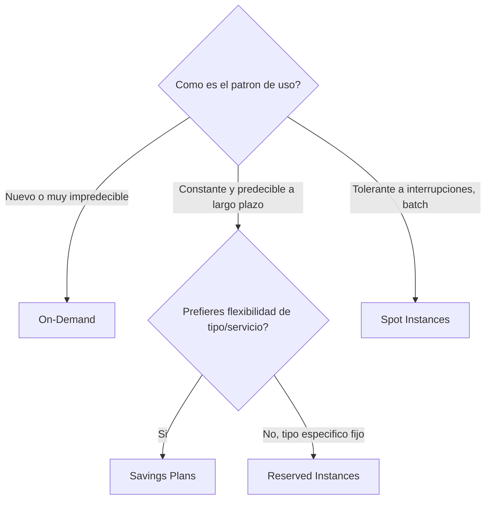
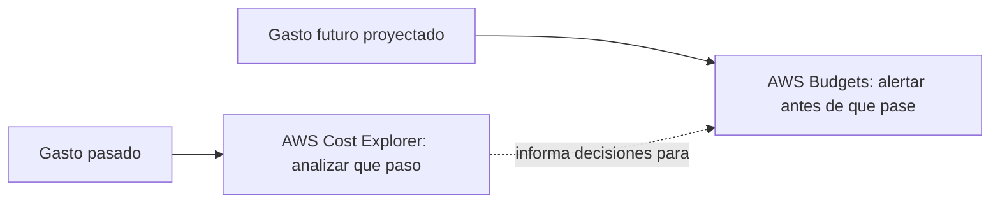
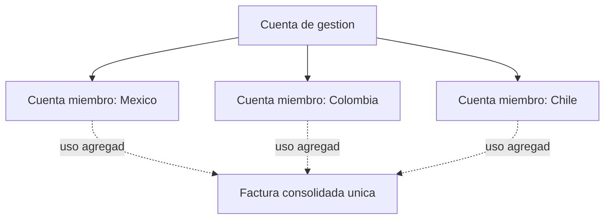
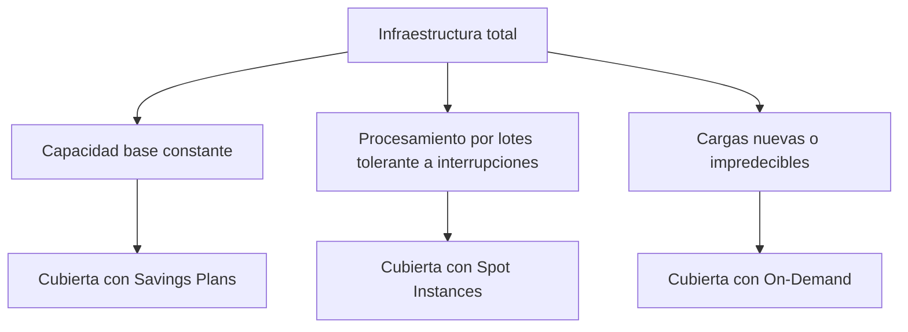

# AWS Certified Cloud Practitioner (CLF-C02)

**PARTE 11 — Costos**

*Este es, en espíritu, el capítulo más 'Cloud Practitioner' de todo el curso: el examen fue diseñado originalmente pensando en roles no técnicos (ventas, finanzas, gestión de proyectos), y el dominio de costos y facturación refleja eso directamente.*

## 1. Objetivos del capítulo

### ¿Qué aprenderé?

- Los fundamentos del modelo de precios de AWS: cómputo, almacenamiento y transferencia de datos.
- Cómo usar AWS Cost Explorer y AWS Budgets para monitorear y controlar el gasto.
- Las opciones de precio de cómputo: On-Demand, Reserved Instances, Savings Plans y Spot Instances.
- Qué es AWS Organizations y cómo la facturación consolidada beneficia a empresas con múltiples cuentas.
- Estrategias prácticas de optimización de costos (rightsizing, eliminación de recursos ociosos, elección del modelo de precios correcto).

### ¿Por qué es importante?

Entender el modelo de costos de AWS no es solo relevante para el examen: es una habilidad de negocio real, aplicable el mismo día que empieces a trabajar con AWS. Muchas historias de 'facturas sorpresa' de AWS provienen precisamente de no entender estos conceptos básicos (transferencia de datos saliente, recursos olvidados encendidos, elegir el modelo de precios equivocado).

### ¿Cómo aparece en el examen?

El dominio 'Billing and Pricing' es uno de los cuatro dominios oficiales del examen CLF-C02. Espera preguntas sobre qué herramienta usar para cada necesidad (Cost Explorer para análisis histórico, Budgets para alertas proactivas), y escenarios que piden elegir el modelo de precios de cómputo correcto (On-Demand, Reserved/Savings Plans, o Spot) según el patrón de uso descrito.

## 2. Teoría

### 2.1 Los fundamentos del modelo de precios de AWS

AWS resume su filosofía de precios en tres dimensiones principales que aplican, con variaciones, a la mayoría de los servicios:

- Cómputo: se paga por el tiempo de uso (por hora o segundo en EC2/RDS, por invocación y duración en Lambda), según el servicio y tipo de recurso elegido.
- Almacenamiento: se paga por la cantidad de datos almacenados (por GB al mes), variando según el servicio y la clase de almacenamiento elegida (ver Parte 5 para las clases de S3).
- Transferencia de datos: la transferencia de datos ENTRANTE hacia AWS es gratuita en la gran mayoría de los casos; la transferencia SALIENTE hacia internet sí tiene costo (con una capa gratuita limitada), y la transferencia ENTRE Availability Zones o Regiones distintas también puede tener costo, dependiendo del servicio.
> **La sorpresa más común de facturas iniciales:** Muchos principiantes asumen que 'la transferencia de datos es gratis' porque la ENTRANTE lo es. La transferencia SALIENTE hacia internet tiene costo y puede acumularse rápidamente en aplicaciones con mucho tráfico de salida (por ejemplo, servir muchos archivos grandes directamente desde EC2 sin CloudFront).

### 2.2 AWS Cost Explorer

Cost Explorer es la herramienta de análisis y visualización de gasto histórico de AWS. Permite ver tendencias de gasto y uso a lo largo del tiempo, filtrar y agrupar por servicio, cuenta (en una organización), Región, tipo de instancia, o etiquetas (cost allocation tags) previamente configuradas, y generar pronósticos de gasto futuro basados en el historial reciente. Es la herramienta correcta para responder preguntas del tipo '¿en qué gastamos más el mes pasado?' o '¿cómo ha evolucionado nuestro gasto en RDS en los últimos 6 meses?'.

### 2.3 AWS Budgets

Mientras Cost Explorer es principalmente retrospectivo (analiza lo que ya ocurrió), AWS Budgets es proactivo: permite definir un presupuesto (de costo, de uso, o de cobertura/utilización de Reserved Instances y Savings Plans) y configurar alertas automáticas cuando el gasto real O el gasto PROYECTADO (forecasted, basado en la tendencia del periodo actual) se acerca o supera ese umbral, permitiendo actuar antes de que el problema ya haya ocurrido por completo.

### 2.4 Modelos de precios de cómputo en EC2

Ya se introdujeron brevemente en la Parte 4; aquí se profundiza con la lógica de decisión completa:

#### On-Demand

Pagas por hora o segundo, sin ningún compromiso previo. Máxima flexibilidad, mayor costo unitario. Ideal para cargas de trabajo nuevas, impredecibles, o de corta duración donde no tiene sentido comprometerse por adelantado.

#### Reserved Instances (RI)

Comprometes el uso de un tipo de instancia específico (con ciertos atributos como familia, Región) durante 1 o 3 años, a cambio de un descuento significativo (hasta ~72% frente a On-Demand según el compromiso y el pago elegido). Existen opciones de pago: All Upfront (mayor descuento), Partial Upfront, y No Upfront (menor descuento, pero sin pago inicial).

#### Savings Plans

Comprometes un monto de gasto constante por hora ($/hora) durante 1 o 3 años, a cambio de un descuento similar al de las Reserved Instances, pero con mucha más flexibilidad: el descuento se aplica automáticamente al uso real, sin atarse rígidamente a un tipo de instancia específico. Existen Compute Savings Plans (los más flexibles, aplican a EC2 de cualquier familia/Región, Fargate y Lambda) y EC2 Instance Savings Plans (más específicos a una familia de instancia dentro de una Región, con mayor descuento a cambio de menos flexibilidad).

#### Spot Instances

Usas capacidad de cómputo no utilizada de AWS con descuentos de hasta 90% frente a On-Demand, a cambio de que AWS pueda interrumpir la instancia con un aviso de solo 2 minutos cuando necesita recuperar esa capacidad. Ideal para cargas de trabajo tolerantes a interrupciones: procesamiento por lotes, renderizado, análisis de big data con checkpoints, pruebas, entre otros.

| Modelo | Descuento típico vs On-Demand | Compromiso | Ideal para |
| --- | --- | --- | --- |
| On-Demand | Ninguno (precio base) | Ninguno | Cargas nuevas, impredecibles, corta duración |
| Reserved Instances | Hasta ~72% | 1 o 3 años, tipo específico | Uso constante y predecible a largo plazo |
| Savings Plans | Similar a RI, más flexible | 1 o 3 años, monto $/hora | Uso constante, con flexibilidad de tipo/servicio |
| Spot Instances | Hasta 90% | Ninguno, pero interrumpible | Tolerante a interrupciones, procesamiento por lotes |

### 2.5 AWS Organizations y facturación consolidada

AWS Organizations permite gestionar de forma centralizada múltiples cuentas de AWS bajo una estructura jerárquica (una cuenta de gestión/'management account' y cuentas miembro organizadas opcionalmente en unidades organizativas). Ofrece dos beneficios principales relevantes para este capítulo:

- Facturación consolidada (consolidated billing): todas las cuentas miembro facturan bajo la cuenta de gestión, generando una única factura consolidada, y el uso agregado de todas las cuentas se combina para alcanzar más rápido los umbrales de descuento por volumen (por ejemplo, en los niveles de precio escalonado de S3) y para compartir el beneficio de Reserved Instances y Savings Plans entre cuentas.
- Service Control Policies (SCPs): políticas que definen los permisos MÁXIMOS que las cuentas miembro pueden tener, permitiendo aplicar barreras de gobernanza centralizadas (por ejemplo, prohibir el uso de ciertas Regiones o servicios en toda la organización), independientemente de lo que digan las policies de IAM dentro de cada cuenta individual.

### 2.6 Estrategias de optimización de costos

AWS agrupa las estrategias de optimización de costos en varias prácticas complementarias:

1. Rightsizing: ajustar el tipo y tamaño de los recursos a la demanda real observada (ni sobre ni subdimensionado), usando datos históricos de utilización (por ejemplo, de CloudWatch o de las recomendaciones de Trusted Advisor).
2. Eliminar recursos ociosos: identificar y eliminar instancias detenidas pero con volúmenes EBS asociados aún facturando, Elastic IPs no asociadas, snapshots antiguos innecesarios, entre otros recursos 'olvidados'.
3. Elegir el modelo de precios correcto: combinar Reserved Instances/Savings Plans para la capacidad base predecible, con Spot para cargas tolerantes a interrupciones, y On-Demand solo para lo verdaderamente variable o nuevo.
4. Aprovechar clases de almacenamiento y lifecycle policies (ver Parte 5) para no pagar tarifas de acceso frecuente por datos que rara vez se consultan.
5. Usar herramientas de monitoreo activo: Cost Explorer, Budgets, y Trusted Advisor (categoría de optimización de costos) de forma recurrente, no solo una vez.

## 3. Ejemplos

### Ejemplo empresarial

Un banco con 15 cuentas de AWS (una por país donde opera) usa AWS Organizations con facturación consolidada para simplificar su contabilidad financiera y alcanzar más rápido los descuentos por volumen agregado en S3, mientras aplica Service Control Policies que prohíben a cualquier cuenta miembro desplegar recursos fuera de las tres Regiones aprobadas por su equipo de cumplimiento normativo.

### Ejemplo de startup

Una startup con presupuesto ajustado configura una alerta en AWS Budgets para recibir un correo si el gasto proyectado del mes va a superar $300, y revisa semanalmente Trusted Advisor para detectar instancias EC2 subutilizadas o Elastic IPs olvidadas sin asociar, evitando sorpresas en la factura mensual.

### Ejemplo personal

Un desarrollador que corre laboratorios de práctica de AWS (como los de esta misma guía) configura un presupuesto de $5 en AWS Budgets desde el primer día de su cuenta, como red de seguridad simple contra el riesgo de olvidar apagar un recurso de laboratorio.

### Caso real de Savings Plans + Spot combinados

Una empresa de análisis de datos cubre el 60% de su capacidad de cómputo constante (los servidores que siempre están corriendo) con Compute Savings Plans a 1 año, y usa instancias Spot para el 40% restante correspondiente a trabajos de procesamiento por lotes que se ejecutan de noche y pueden reintentarse si se interrumpen, logrando un ahorro combinado significativo frente a usar únicamente On-Demand para toda su infraestructura.

## 4. Diagramas

Diagramas en formato Mermaid — pégalos en mermaid.live o cualquier visor compatible para verlos renderizados.

### 4.1 Árbol de decisión: qué modelo de precios de cómputo elegir

### 4.2 Cost Explorer vs Budgets: retrospectivo vs proactivo

### 4.3 AWS Organizations: facturación consolidada

### 4.4 Estrategia combinada de optimización de costos

## 5. Laboratorios

### Laboratorio 1: Explorar AWS Cost Explorer y crear un presupuesto en AWS Budgets

Costo: ambas herramientas son gratuitas de usar (AWS Budgets permite hasta 2 presupuestos gratuitos por cuenta; Cost Explorer no tiene costo por consultarlo, aunque históricamente tuvo un pequeño cargo por acceso a la API que ya no aplica al uso estándar desde la consola).

6. Ve a la consola de Billing and Cost Management → Cost Explorer.
7. Si es la primera vez, actívalo (puede tardar hasta 24 horas en poblarse con datos si es una cuenta muy nueva).
8. Explora el gráfico de gasto de los últimos meses, y prueba agrupar (Group by) por 'Service' para ver en qué servicios has gastado más durante tus laboratorios de este curso.
9. Cambia el filtro de fecha para ver el gasto diario de la semana en curso.
10. Ve ahora a 'Budgets' (dentro de la misma sección de Billing) → Create budget.
11. Elige 'Cost budget', un tipo simple basado en gasto mensual.
12. Define un monto (ej. $5, apropiado para una cuenta de laboratorio de práctica) y periodo mensual.
13. Configura una alerta al 80% del gasto real y otra al 100% del gasto proyectado, ingresando tu correo electrónico.
14. Crea el presupuesto y espera la confirmación.
> **Nota:** Este laboratorio no genera ningún costo directo por sí mismo — Cost Explorer y hasta 2 presupuestos de Budgets son gratuitos. Es una excelente práctica dejar este presupuesto activo de forma permanente en cualquier cuenta de AWS, incluso después de terminar el curso.

### Laboratorio 2: Simular el costo de distintas opciones de precio con el Pricing Calculator

Costo: $0 — el Pricing Calculator es una herramienta de simulación pública, no requiere ni crea recursos reales.

15. Ve a calculator.aws (puede usarse sin iniciar sesión en una cuenta de AWS).
16. Crea una nueva estimación y añade el servicio 'Amazon EC2'.
17. Configura una instancia m5.large en us-east-1, corriendo 730 horas al mes (equivalente a 24/7), con precio 'On-Demand'. Anota el costo mensual estimado.
18. Cambia la opción de precio a 'Reserved' con un compromiso de 1 año, 'All Upfront', y compara el costo mensual equivalente resultante frente al de On-Demand.
19. Repite el ejercicio cambiando a un compromiso de 3 años, y observa cómo el descuento aumenta.
20. (Opcional) Añade también una estimación con Savings Plans para la misma instancia, y compara los tres escenarios en una tabla propia: On-Demand, Reserved 1 año, Reserved 3 años.
> **Nota:** Este laboratorio es puramente de simulación, ideal para entender de forma tangible cuánto se puede ahorrar según el modelo de precios elegido antes de comprometerse con cualquier opción en una cuenta real.

## 6. Errores comunes

- Asumir que toda la transferencia de datos en AWS es gratuita — solo la ENTRANTE lo es en la mayoría de los casos; la SALIENTE hacia internet tiene costo.
- Confundir Cost Explorer (análisis retrospectivo de gasto ya ocurrido) con Budgets (alertas proactivas antes/durante que el gasto ocurra) — resuelven necesidades complementarias, no la misma.
- Elegir Reserved Instances o Savings Plans para cargas de trabajo nuevas o muy impredecibles, comprometiéndose sin suficiente certeza del patrón de uso real.
- Usar instancias Spot para cargas de trabajo de producción crítica que no toleran ninguna interrupción inesperada.
- Dejar recursos de laboratorio o de pruebas corriendo indefinidamente (instancias EC2, volúmenes EBS huérfanos, Elastic IPs sin asociar) sin revisión periódica.
- No aprovechar AWS Organizations con facturación consolidada cuando se tienen múltiples cuentas, perdiendo la oportunidad de descuentos por volumen agregado.

## 7. Comparaciones

### Reserved Instances vs Savings Plans

RI = compromiso más rígido (tipo de instancia y otros atributos específicos), descuento comparable. Savings Plans = compromiso de monto de gasto ($/hora), aplicado de forma más flexible al uso real, sin atarse tan rígidamente a un tipo de instancia — generalmente la opción más recomendada actualmente por AWS para nuevos compromisos, salvo casos muy específicos.

### Cost Explorer vs Budgets

Cost Explorer = mirar hacia atrás (¿qué pasó?), con capacidad de pronóstico. Budgets = mirar hacia adelante con alertas activas (avísame ANTES de que se supere un umbral).

### On-Demand vs Spot

On-Demand = máxima flexibilidad y previsibilidad, sin descuento. Spot = máximo descuento posible, a cambio de aceptar interrupciones con poco aviso — la decisión depende exclusivamente de si la carga de trabajo tolera esas interrupciones o no.

## 8. Preguntas tipo examen

20 preguntas de opción múltiple, mismo estilo y dificultad que el examen oficial CLF-C02.

**Pregunta 1.** ¿Cuáles son los tres pilares fundamentales del modelo de precios de AWS?

A) Cómputo, almacenamiento y soporte técnico

**B)** **Pagas por cómputo, pagas por almacenamiento, y pagas por transferencia de datos saliente (data transfer OUT)**

C) Solo el costo de las licencias de software

D) Un precio fijo mensual único para toda la cuenta

**Respuesta correcta: B.** 

*AWS resume su modelo de precios en tres dimensiones principales: cómputo (por hora/segundo/invocación según el servicio), almacenamiento (por GB almacenado), y transferencia de datos saliente hacia internet (data transfer OUT); la transferencia de datos ENTRANTE hacia AWS es gratuita en la gran mayoría de los casos.*

**Pregunta 2.** ¿Qué herramienta de AWS te permite visualizar y analizar tus patrones de gasto histórico, con la posibilidad de filtrar por servicio, cuenta o etiqueta (tag)?

A) AWS Budgets

**B)** **AWS Cost Explorer**

C) AWS Organizations

D) Savings Plans

**Respuesta correcta: B.** 

*AWS Cost Explorer permite visualizar, analizar y explorar tus patrones de gasto y uso a lo largo del tiempo, con filtros por servicio, cuenta, Región, etiqueta, y otras dimensiones, además de ofrecer pronósticos de gasto futuro basados en tu historial.*

**Pregunta 3.** ¿Qué servicio de AWS te permite definir un umbral de gasto y recibir una alerta automática (por ejemplo, por correo) cuando tu gasto real o proyectado se acerca o supera ese umbral?

A) AWS Cost Explorer

**B)** **AWS Budgets**

C) AWS Organizations

D) Reserved Instances

**Respuesta correcta: B.** 

*AWS Budgets permite crear presupuestos personalizados (de costo, uso, o cobertura de Reserved Instances/Savings Plans) y configurar alertas automáticas cuando el gasto real o el pronosticado se acerca o supera el umbral definido, ayudando a evitar sorpresas en la factura.*

**Pregunta 4.** Una empresa se compromete a usar una cantidad constante de gasto en cómputo por hora (por ejemplo, $10/hora) durante 1 año, a cambio de un descuento significativo, manteniendo flexibilidad para cambiar el tipo de instancia, sistema operativo o Región usada dentro de ese compromiso. ¿Qué modelo de precios de AWS describe esto?

A) Reserved Instances tradicionales

**B)** **Savings Plans**

C) Instancias Spot

D) AWS Free Tier

**Respuesta correcta: B.** 

*Los Savings Plans ofrecen descuentos significativos a cambio de un compromiso de gasto constante ($/hora) durante 1 o 3 años, con mayor flexibilidad que las Reserved Instances tradicionales, ya que el descuento se aplica automáticamente sin importar el tipo de instancia específico, sistema operativo, o incluso, en el caso de Compute Savings Plans, la Región o el servicio de cómputo usado (EC2, Fargate, Lambda).*

**Pregunta 5.** ¿Qué caracteriza a las instancias Spot de EC2 en cuanto a precio y disponibilidad?

A) Precio fijo garantizado de por vida, sin posibilidad de interrupción

**B)** **Descuentos significativos (hasta 90% frente a On-Demand) sobre capacidad no utilizada de AWS, con la posibilidad de que AWS interrumpa la instancia con poco aviso cuando necesita esa capacidad de vuelta**

C) Requieren un compromiso obligatorio de 3 años

D) Solo pueden usarse para bases de datos de producción crítica

**Respuesta correcta: B.** 

*Las instancias Spot permiten aprovechar capacidad de cómputo no utilizada de AWS con descuentos de hasta 90% frente a instancias On-Demand, a cambio de que AWS pueda interrumpirlas con un aviso de solo 2 minutos cuando necesita recuperar esa capacidad, por lo que son ideales para cargas de trabajo tolerantes a interrupciones.*

**Pregunta 6.** Una empresa sabe con certeza que necesitará una instancia de base de datos específica funcionando de forma constante durante los próximos 3 años, y quiere el máximo descuento posible por ese compromiso a largo plazo. ¿Qué opción de precios sería la más económica en este escenario específico?

A) Instancias On-Demand

B) Instancias Spot

**C)** **Reserved Instances a 3 años (o Savings Plans a 3 años) con pago por adelantado**

D) AWS Free Tier exclusivamente

**Respuesta correcta: C.** 

*Para cargas de trabajo con uso constante y predecible a largo plazo, comprometerse con Reserved Instances o Savings Plans a 3 años (especialmente con pago total por adelantado) ofrece el mayor descuento posible frente a On-Demand, ya que el compromiso a más largo plazo y el pago anticipado maximizan el ahorro.*

**Pregunta 7.** ¿Qué es AWS Organizations?

A) Un servicio de gestión de proyectos de equipo

**B)** **Un servicio que permite gestionar y consolidar de forma centralizada múltiples cuentas de AWS, incluyendo facturación consolidada y políticas de control (SCPs)**

C) Un tipo de instancia EC2 optimizada para grandes empresas

D) Un servicio exclusivo de Recursos Humanos

**Respuesta correcta: B.** 

*AWS Organizations permite crear y gestionar de forma centralizada múltiples cuentas de AWS bajo una estructura organizacional, con facturación consolidada (todas las cuentas facturan bajo una cuenta de pago central, a menudo con mejores descuentos por volumen agregado) y políticas de control de servicios (Service Control Policies) que restringen qué acciones pueden realizar las cuentas miembro.*

**Pregunta 8.** ¿Qué beneficio de facturación ofrece principalmente la facturación consolidada (consolidated billing) de AWS Organizations?

A) Elimina completamente la necesidad de pagar por cualquier servicio de AWS

**B)** **Combina el uso de todas las cuentas miembro para calcular descuentos por volumen de forma agregada, y genera una sola factura consolidada para toda la organización**

C) Solo funciona con instancias Spot

D) Requiere que todas las cuentas usen exactamente los mismos servicios

**Respuesta correcta: B.** 

*La facturación consolidada agrega el uso de todas las cuentas miembro de la organización para calcular descuentos por volumen (por ejemplo, alcanzando más rápido los umbrales de descuento escalonado de S3), y produce una única factura consolidada, simplificando la administración financiera de múltiples cuentas.*

**Pregunta 9.** ¿Cuál de las siguientes es una estrategia típica de optimización de costos recomendada por AWS?

A) Mantener siempre instancias On-Demand del mayor tamaño posible 'por si acaso'

**B)** **Redimensionar (rightsizing) instancias subutilizadas, eliminar recursos no utilizados, y usar el modelo de precios adecuado (Reserved/Savings Plans para cargas constantes, Spot para tolerantes a interrupciones)**

C) Deshabilitar todas las alarmas de CloudWatch para reducir costos de monitoreo

D) Usar siempre la Región más cara disponible

**Respuesta correcta: B.** 

*La optimización de costos en AWS combina varias prácticas: 'rightsizing' (ajustar el tamaño de los recursos a la demanda real), eliminar recursos ociosos o no utilizados, y elegir el modelo de precios de cómputo correcto según el patrón de uso (constante vs interrumpible vs esporádico) de cada carga de trabajo.*

**Pregunta 10.** ¿Qué herramienta de AWS ofrece recomendaciones específicas de optimización de costos, como identificar instancias EC2 subutilizadas que podrían reducirse de tamaño?

A) AWS Budgets exclusivamente

**B)** **AWS Trusted Advisor, en su categoría de optimización de costos**

C) AWS Organizations exclusivamente

D) Amazon CloudFront

**Respuesta correcta: B.** 

*AWS Trusted Advisor, en su categoría de Cost Optimization, analiza el uso real de recursos (como el promedio de utilización de CPU de instancias EC2) y recomienda acciones específicas como redimensionar o detener instancias subutilizadas, ayudando a identificar oportunidades concretas de ahorro (ver también Parte 9).*

**Pregunta 11.** Una startup con presupuesto ajustado quiere asegurarse de recibir una notificación automática si su gasto mensual proyectado en AWS va a superar los $500, antes de que eso ocurra. ¿Qué servicio configurarían?

A) AWS Cost Explorer exclusivamente, sin ninguna alerta automática

**B)** **AWS Budgets, creando un presupuesto de costo con una alerta basada en el gasto proyectado (forecasted)**

C) AWS Organizations

D) Reserved Instances

**Respuesta correcta: B.** 

*AWS Budgets permite crear un presupuesto con un umbral definido (ej. $500) y configurar alertas que se disparan no solo cuando el gasto REAL lo supera, sino también cuando el gasto PROYECTADO (forecasted, basado en la tendencia actual del mes) indica que se va a superar ese umbral antes de fin de mes, permitiendo actuar de forma preventiva.*

**Pregunta 12.** ¿Cuál de las siguientes cargas de trabajo es la MENOS adecuada para ejecutarse sobre instancias Spot?

A) Procesamiento de renderizado de video que puede pausarse y reanudarse sin problema

B) Un trabajo de análisis de big data tolerante a interrupciones con checkpoints frecuentes

**C)** **Una base de datos de producción crítica que no puede tolerar ninguna interrupción inesperada**

D) Pruebas de carga (load testing) de corta duración

**Respuesta correcta: C.** 

*Las instancias Spot pueden ser interrumpidas por AWS con solo 2 minutos de aviso cuando la capacidad se necesita de vuelta, por lo que son inadecuadas para cargas de trabajo que no toleran interrupciones inesperadas, como una base de datos de producción crítica que debe estar disponible de forma constante.*

**Pregunta 13.** ¿Qué diferencia principal existe entre Reserved Instances y Savings Plans en cuanto a la flexibilidad del compromiso?

A) Son exactamente lo mismo con distinto nombre

**B)** **Reserved Instances comprometen un tipo de instancia específico en una Región específica; Savings Plans comprometen un monto de gasto por hora, aplicable de forma más flexible a distintos tipos de instancia, Región (en el caso de Compute Savings Plans) o incluso servicio de cómputo**

C) Savings Plans solo pueden usarse con Amazon RDS

D) Reserved Instances no ofrecen ningún descuento frente a On-Demand

**Respuesta correcta: B.** 

*Reserved Instances requieren comprometerse con parámetros más específicos (familia de instancia, en ocasiones Región u otros atributos, según el tipo de RI). Savings Plans comprometen un monto de gasto constante ($/hora), aplicándose automáticamente y de forma más flexible sobre el uso real, sin atarse rígidamente a un tipo de instancia específico (especialmente los Compute Savings Plans, los más flexibles).*

**Pregunta 14.** Una empresa multinacional con 20 cuentas de AWS distintas (una por país/división) quiere simplificar la gestión de la facturación y aplicar restricciones de seguridad comunes (como prohibir el uso de ciertas Regiones) a todas las cuentas desde un punto central. ¿Qué servicio de AWS resuelve ambas necesidades?

A) AWS Budgets exclusivamente

**B)** **AWS Organizations, con facturación consolidada y Service Control Policies (SCPs)**

C) AWS Cost Explorer exclusivamente

D) Reserved Instances

**Respuesta correcta: B.** 

*AWS Organizations resuelve ambos requisitos simultáneamente: la facturación consolidada centraliza y simplifica la gestión financiera de las 20 cuentas, mientras que las Service Control Policies (SCPs) permiten aplicar restricciones de gobernanza (como prohibir ciertas Regiones o servicios) de forma centralizada a todas las cuentas miembro.*

**Pregunta 15.** ¿Qué recurso de AWS es completamente gratuito de crear, sin importar cuántos se creen, aunque las acciones que realiza SÍ puedan generar costos en otros servicios?

A) Instancias EC2

**B)** **Usuarios, grupos, roles y policies de IAM**

C) Volúmenes EBS

D) Bases de datos RDS

**Respuesta correcta: B.** 

*IAM (usuarios, grupos, roles, policies) es completamente gratuito en sí mismo, sin importar cuántos se creen. Sin embargo, las ACCIONES que esas identidades realicen (como lanzar una instancia EC2 o crear un volumen EBS) sí pueden generar costos en los servicios correspondientes.*

**Pregunta 16.** ¿Qué elemento del modelo de precios de AWS suele sorprender más a los principiantes al recibir su primera factura, por no haberlo considerado explícitamente al diseñar su arquitectura?

A) El costo de crear usuarios IAM

**B)** **El costo de la transferencia de datos SALIENTE (data transfer OUT) hacia internet, que a menudo no es tan visible como el costo de cómputo o almacenamiento**

C) El costo del usuario root

D) El costo de las Availability Zones adicionales

**Respuesta correcta: B.** 

*La transferencia de datos ENTRANTE hacia AWS es gratuita en la gran mayoría de los casos, lo cual lleva a muchos principiantes a asumir erróneamente que toda la transferencia de datos es gratuita. La transferencia de datos SALIENTE hacia internet sí tiene costo (con una capa gratuita limitada), y puede acumularse significativamente en aplicaciones con alto volumen de tráfico saliente, siendo una sorpresa común en facturas iniciales.*

**Pregunta 17.** ¿Qué acción de optimización de costos describe mejor el concepto de 'rightsizing'?

A) Aumentar siempre el tamaño de todas las instancias para tener margen de sobra

**B)** **Ajustar el tipo y tamaño de una instancia (u otro recurso) para que coincida con la demanda real observada, ni sobredimensionado ni subdimensionado**

C) Eliminar completamente todas las instancias de la cuenta

D) Cambiar únicamente de Región sin analizar el uso real

**Respuesta correcta: B.** 

*'Rightsizing' es el proceso de analizar el uso real de un recurso (por ejemplo, el promedio histórico de utilización de CPU y memoria de una instancia EC2) y ajustar su tipo/tamaño para que coincida con esa demanda real, evitando tanto el sobreaprovisionamiento (pagar de más por capacidad no usada) como el subaprovisionamiento (riesgo de rendimiento insuficiente).*

**Pregunta 18.** Una empresa quiere combinar lo mejor de dos mundos: un compromiso base de Savings Plans para cubrir su carga de trabajo constante y predecible, y complementarlo con instancias Spot para picos de procesamiento no crítico y tolerante a interrupciones. ¿Qué principio de optimización de costos ilustra esta combinación?

A) Usar un único modelo de precios para toda la infraestructura sin excepción

**B)** **Adaptar el modelo de precios de cómputo a las características específicas de cada carga de trabajo dentro de la misma cuenta, en vez de aplicar un enfoque único para todo**

C) Evitar por completo el uso de instancias Spot en cualquier escenario

D) Usar exclusivamente instancias On-Demand para simplificar la facturación

**Respuesta correcta: B.** 

*Una estrategia de optimización de costos madura no usa un único modelo de precios para todo, sino que combina Savings Plans/Reserved Instances para la capacidad base predecible, On-Demand para picos moderados, y Spot para cargas tolerantes a interrupciones, adaptando el modelo de precios a las características reales de cada carga de trabajo específica.*

**Pregunta 19.** ¿Qué es AWS Free Tier y qué tipos de ofertas incluye?

A) Un descuento permanente del 50% en todos los servicios de AWS

**B)** **Un conjunto de ofertas gratuitas para nuevos usuarios, que incluye ofertas de 12 meses gratis (con límites de uso), ofertas 'siempre gratis' dentro de ciertos límites, y pruebas gratuitas de corta duración para servicios específicos**

C) Un servicio exclusivo de soporte técnico gratuito ilimitado

D) Solo aplica a Amazon S3

**Respuesta correcta: B.** 

*AWS Free Tier combina tres tipos de ofertas: '12 months free' (ciertos servicios con límites de uso gratuitos durante el primer año, como 750 horas/mes de EC2 t2.micro/t3.micro), 'Always free' (límites gratuitos permanentes en ciertos servicios, como Lambda), y 'Trials' (pruebas gratuitas de corta duración para servicios específicos, con sus propios términos).*

**Pregunta 20.** ¿Qué reporte o herramienta usarías para responder a la pregunta '¿cuánto gastamos exactamente en el servicio de EC2 durante el último trimestre, desglosado por equipo usando etiquetas (tags)'?

A) AWS Organizations exclusivamente, sin ninguna otra herramienta

**B)** **AWS Cost Explorer, filtrando por servicio (EC2) y agrupando por la etiqueta (tag) correspondiente**

C) AWS Shield

D) Amazon GuardDuty

**Respuesta correcta: B.** 

*AWS Cost Explorer permite filtrar el análisis de gasto por servicio específico (EC2) y por un rango de fechas (el último trimestre), y agrupar los resultados por dimensiones como etiquetas (tags) asignadas a los recursos, siempre que esas etiquetas se hayan configurado como 'cost allocation tags' previamente.*

## 9. Resumen

### Resumen ejecutivo

El modelo de precios de AWS se basa en cómputo, almacenamiento y transferencia de datos (la saliente hacia internet tiene costo, la entrante generalmente no). Cost Explorer analiza el gasto histórico; Budgets alerta proactivamente sobre gasto real o proyectado. Para cómputo, existen cuatro modelos de precio: On-Demand (flexible, sin descuento), Reserved Instances (compromiso rígido, gran descuento), Savings Plans (compromiso de gasto, más flexible) y Spot (máximo descuento, interrumpible). AWS Organizations permite facturación consolidada entre múltiples cuentas y gobernanza centralizada vía Service Control Policies. La optimización de costos combina rightsizing, eliminación de recursos ociosos, elección del modelo de precios correcto por carga de trabajo, y monitoreo activo continuo.

### Conceptos clave (memorizar)

- **Transferencia ENTRANTE = generalmente gratis. Transferencia SALIENTE hacia internet = tiene costo.**
- **Cost Explorer = retrospectivo/análisis. Budgets = proactivo/alertas antes de superar un umbral.**
- **On-Demand (sin compromiso) < Reserved/Savings Plans (compromiso, gran descuento) — Spot (máximo descuento, interrumpible).**
- **Savings Plans = más flexible que Reserved Instances (compromiso de $/hora, no de tipo específico).**
- **AWS Organizations = facturación consolidada + Service Control Policies (gobernanza centralizada).**

### Lo que normalmente pregunta AWS

Escenarios que describen un patrón de uso de cómputo (constante/predecible, nuevo/impredecible, tolerante a interrupciones) esperando que elijas el modelo de precios correcto, y preguntas directas sobre cuándo usar Cost Explorer vs Budgets, o sobre los beneficios de la facturación consolidada de AWS Organizations.

## Recursos externos para este capítulo

### Documentación oficial

- AWS Pricing Overview — aws.amazon.com/pricing
- AWS Cost Explorer User Guide — docs.aws.amazon.com/cost-management/latest/userguide/ce-what-is.html
- AWS Budgets User Guide — docs.aws.amazon.com/cost-management/latest/userguide/budgets-managing-costs.html
- Savings Plans User Guide — docs.aws.amazon.com/savingsplans
- AWS Organizations User Guide — docs.aws.amazon.com/organizations
- AWS Pricing Calculator — calculator.aws

### Videos recomendados

- AWS Skill Builder: módulo de Billing and Pricing dentro de 'Cloud Practitioner Essentials'.
- Stephane Maarek: sección de precios/Savings Plans/RI de su curso CLF-C02, con ejemplos numéricos detallados.
- Digital Cloud Training: comparativas de modelos de precio de EC2.

### Laboratorios adicionales

- AWS Skill Builder Labs: módulos de 'Billing and Cost Management'.
- AWS Well-Architected Labs: pilar de optimización de costos, ejercicios de rightsizing.