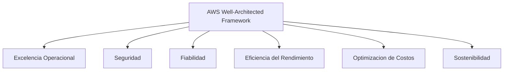
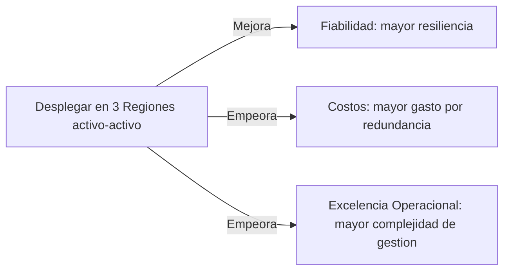
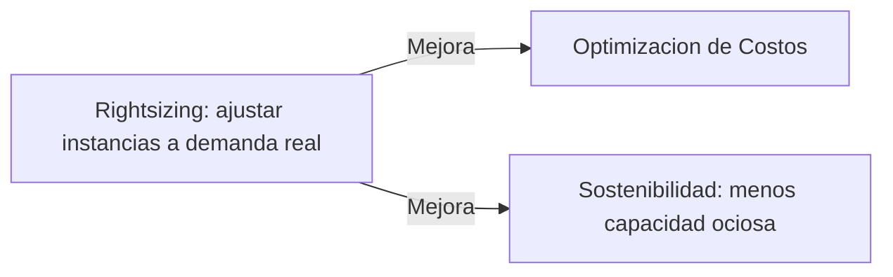
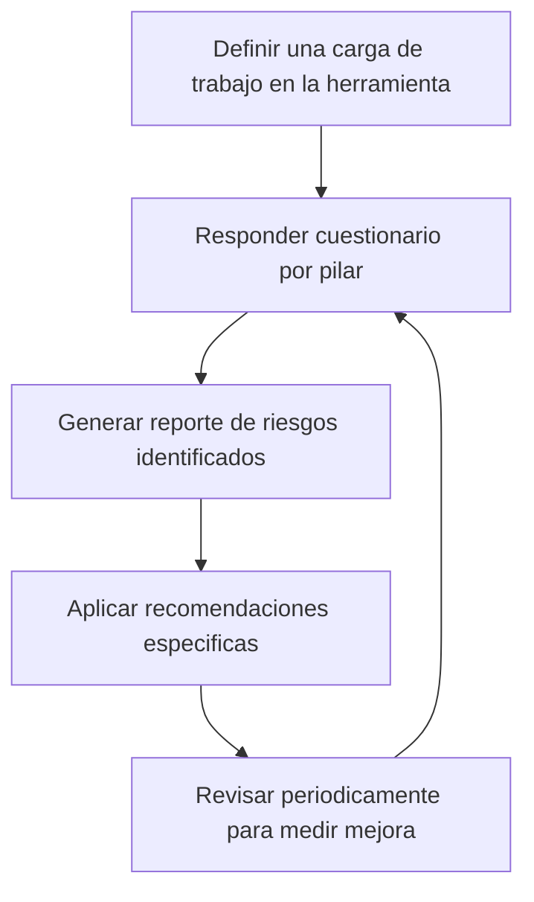

# AWS Certified Cloud Practitioner (CLF-C02)

**PARTE 12 — AWS Well-Architected Framework**

*Este capítulo es distinto a los anteriores: no presenta un servicio nuevo, sino una forma de PENSAR sobre todos los servicios que ya viste. Es, en cierto sentido, el capítulo que amarra todo el curso.*

## 1. Objetivos del capítulo

### ¿Qué aprenderé?

- Qué es el AWS Well-Architected Framework y para qué sirve como herramienta de diseño.
- Los seis pilares completos: Excelencia Operacional, Seguridad, Fiabilidad, Eficiencia del Rendimiento, Optimización de Costos y Sostenibilidad.
- Cómo los pilares se relacionan entre sí y generan trade-offs conscientes en decisiones de arquitectura reales.
- Qué es el AWS Well-Architected Tool y cómo se usa para evaluar una carga de trabajo.

### ¿Por qué es importante?

El Well-Architected Framework no es un servicio más de AWS: es la lente conceptual con la que AWS espera que evalúes CUALQUIER decisión de arquitectura. Prácticamente todo lo que viste en capítulos anteriores (Multi-AZ, IAM de mínimo privilegio, Reserved Instances, Auto Scaling) es una implementación concreta de alguno de estos seis pilares. Entender el framework te da un lenguaje común para justificar decisiones de diseño, algo muy valorado en certificaciones posteriores como Solutions Architect.

### ¿Cómo aparece en el examen?

El examen suele presentar una descripción de una práctica o decisión de arquitectura (por ejemplo, 'la empresa activa backups automáticos y prueba su plan de recuperación regularmente') y pide identificar a qué pilar corresponde principalmente. También pueden aparecer preguntas sobre el propósito general del framework o sobre el AWS Well-Architected Tool.

## 2. Teoría

### 2.1 ¿Qué es el AWS Well-Architected Framework?

El Well-Architected Framework es un conjunto de principios y mejores prácticas, documentado por AWS a partir de la experiencia de miles de arquitecturas reales de clientes, organizado en seis pilares. No es un servicio que se 'activa', sino una guía conceptual (con un whitepaper oficial extenso) para evaluar si una carga de trabajo está bien diseñada, y una herramienta gratuita (AWS Well-Architected Tool) para aplicar esa evaluación de forma estructurada a una arquitectura real.

Cada pilar plantea, en esencia, una pregunta fundamental sobre la arquitectura, y ofrece principios de diseño y mejores prácticas para responderla de forma sólida.

### 2.2 Pilar 1: Excelencia Operacional (Operational Excellence)

Pregunta central: '¿Podemos ejecutar y monitorear sistemas para entregar valor de negocio, y mejorar continuamente nuestros procesos?'

- Realizar operaciones como código (automatización de infraestructura y despliegues, por ejemplo con CloudFormation, ver Parte 13).
- Hacer cambios pequeños, frecuentes y reversibles, en vez de despliegues grandes y arriesgados.
- Anticipar fallos y practicar la respuesta a incidentes (simulacros, 'game days').
- Aprender de todos los eventos operativos y fallos, documentando lecciones aprendidas.

### 2.3 Pilar 2: Seguridad (Security)

Pregunta central: '¿Estamos protegiendo la información, los sistemas y los activos mientras entregamos valor de negocio?'

- Implementar un modelo de identidad sólido (IAM, mínimo privilegio, MFA — ver Parte 3).
- Habilitar trazabilidad completa de todas las acciones (CloudTrail — ver Parte 8).
- Aplicar seguridad en todas las capas (defensa en profundidad: red, aplicación, sistema operativo, datos).
- Automatizar las mejores prácticas de seguridad y proteger los datos en tránsito y en reposo (cifrado, KMS).
- Prepararse para eventos de seguridad con planes de respuesta a incidentes.

### 2.4 Pilar 3: Fiabilidad (Reliability)

Pregunta central: '¿Puede el sistema recuperarse de fallos e interrupciones, y satisfacer la demanda de forma consistente?'

- Probar automáticamente los procedimientos de recuperación (en vez de esperar a un fallo real para descubrir si funcionan).
- Recuperarse automáticamente ante fallos (Auto Scaling reemplazando instancias no saludables, Multi-AZ con failover automático — ver Partes 1, 4 y 6).
- Escalar horizontalmente para aumentar la disponibilidad agregada del sistema completo.
- Dejar de adivinar la capacidad necesaria, usando elasticidad para ajustarse a la demanda real.
- Gestionar el cambio mediante automatización, reduciendo el riesgo de error humano en configuraciones críticas.

### 2.5 Pilar 4: Eficiencia del Rendimiento (Performance Efficiency)

Pregunta central: '¿Estamos usando los recursos de cómputo de la forma más eficiente posible para cumplir los requisitos, incluso a medida que cambian la demanda y la tecnología?'

- Democratizar tecnologías avanzadas (usar servicios administrados en vez de construir todo desde cero, por ejemplo bases de datos o machine learning administrados).
- Desplegar en múltiples Regiones en minutos cuando la latencia global lo requiere (ver Parte 2).
- Usar arquitecturas serverless para eliminar la carga operativa de administrar servidores cuando sea apropiado.
- Experimentar más a menudo, aprovechando la facilidad de probar distintas configuraciones en la nube frente a on-premises.
- Considerar la afinidad mecánica: elegir el tipo de recurso (tipo de instancia, clase de almacenamiento, tipo de base de datos) que mejor se alinee con el patrón de la carga de trabajo específica.

### 2.6 Pilar 5: Optimización de Costos (Cost Optimization)

Pregunta central: '¿Estamos evitando gastos innecesarios y obteniendo el máximo valor de negocio del dinero invertido?' (se profundizó extensamente en la Parte 11)

- Implementar gestión financiera de la nube (cultura de responsabilidad sobre el gasto, no solo del equipo de finanzas).
- Adoptar un modelo de consumo (pagar solo por lo que se usa, elasticidad).
- Medir la eficiencia general (relacionar el gasto con el valor de negocio generado, no solo mirar el número absoluto).
- Dejar de gastar dinero en tareas operativas pesadas sin valor diferencial (undifferentiated heavy lifting, ver Parte 1).
- Analizar y atribuir el gasto (cost allocation tags, Cost Explorer — ver Parte 11).

### 2.7 Pilar 6: Sostenibilidad (Sustainability)

Pregunta central: '¿Estamos minimizando el impacto ambiental de ejecutar nuestras cargas de trabajo en la nube?' Este es el pilar más reciente, añadido a los cinco originales.

- Entender el impacto ambiental de la carga de trabajo y establecer objetivos de mejora.
- Maximizar la utilización de los recursos aprovisionados, evitando capacidad ociosa (relacionado directamente con Optimización de Costos).
- Anticipar y adoptar nuevas ofertas de hardware y software más eficientes cuando estén disponibles.
- Usar servicios administrados, que a menudo comparten infraestructura entre múltiples clientes de forma más eficiente que instancias dedicadas subutilizadas.
- Reducir el impacto de subidas (downstream) considerando el consumo de recursos del lado del cliente (por ejemplo, optimizando el tamaño de assets web).
> **Los pilares no son compartimentos aislados:** Muchas decisiones de arquitectura impactan varios pilares a la vez, a veces en la misma dirección (rightsizing mejora Costos Y Sostenibilidad simultáneamente) y a veces en tensión (más redundancia mejora Fiabilidad pero incrementa Costos). El framework no exige maximizar los seis al 100%, sino tomar decisiones conscientes sobre esos trade-offs según el contexto real del negocio.

### 2.8 AWS Well-Architected Tool

Es un servicio gratuito disponible en la consola de AWS que guía al usuario a través de un cuestionario estructurado, organizado por los seis pilares, aplicado a una carga de trabajo específica que se documenta dentro de la herramienta. Al completar el cuestionario, genera un reporte de riesgos identificados (clasificados por severidad) junto con recomendaciones específicas y enlaces a la documentación relevante para abordarlos, permitiendo repetir la evaluación periódicamente para medir mejora a lo largo del tiempo.

## 3. Ejemplos

### Ejemplo empresarial

Un banco usa el AWS Well-Architected Tool para evaluar formalmente su plataforma de banca en línea antes de un lanzamiento importante, identificando como riesgo de alta severidad la falta de pruebas periódicas de su plan de recuperación ante desastres (pilar de Fiabilidad), y como riesgo medio la ausencia de cost allocation tags que dificultan atribuir el gasto por equipo (pilar de Optimización de Costos).

### Ejemplo de startup

Una startup en fase de validación de producto decide conscientemente priorizar el pilar de Excelencia Operacional (desplegar rápido, iterar rápido) sobre el pilar de Fiabilidad máxima (múltiples Regiones redundantes), documentando esa decisión como un trade-off temporal a revisar una vez el producto tenga tracción real de usuarios.

### Ejemplo personal

Un estudiante que practica para la certificación aplica mentalmente el pilar de Seguridad a cada laboratorio de este curso (activando MFA, usando IAM Roles en vez de access keys embebidas, restringiendo Security Groups), internalizando el framework como hábito desde el aprendizaje, no solo como teoría de examen.

### Caso real de trade-off entre pilares

Una empresa de e-commerce decide NO desplegar su base de datos en configuración Multi-Región activa-activa (que maximizaría Fiabilidad) porque el costo adicional y la complejidad operativa no se justifican frente al riesgo real de su negocio, optando en cambio por Multi-AZ dentro de una sola Región con un plan de DR probado — una decisión consciente que prioriza el balance entre Fiabilidad, Costos y Excelencia Operacional en vez de maximizar un solo pilar de forma aislada.

## 4. Diagramas

Diagramas en formato Mermaid — pégalos en mermaid.live o cualquier visor compatible para verlos renderizados.

### 4.1 Los seis pilares del Well-Architected Framework

### 4.2 Ejemplo de trade-off entre pilares

### 4.3 Ejemplo de sinergia entre pilares

### 4.4 Flujo de uso del AWS Well-Architected Tool

## 5. Laboratorios

### Laboratorio 1: Realizar una evaluación con AWS Well-Architected Tool

Costo: $0 — el AWS Well-Architected Tool es completamente gratuito de usar.

1. Ve a la consola de AWS Well-Architected Tool.
2. Haz clic en 'Define workload' y describe una carga de trabajo ficticia (puede ser una arquitectura simple que ya practicaste en capítulos anteriores, como 'aplicación web con EC2, RDS y S3').
3. Completa los datos básicos: nombre, descripción, entorno (producción o pre-producción), y Regiones donde se despliega.
4. Selecciona el 'lens' (lente) por defecto, 'AWS Well-Architected Framework', que incluye los seis pilares.
5. Comienza el cuestionario, respondiendo honestamente sobre esa arquitectura ficticia (por ejemplo: '¿tienes un plan de recuperación ante desastres probado?', '¿usas IAM Roles en vez de access keys embebidas?').
6. Completa al menos las preguntas del pilar de Seguridad y del pilar de Fiabilidad.
7. Ve a 'Milestones' → 'Save milestone' para guardar un punto de referencia de esta evaluación.
8. Revisa el reporte generado, observando cómo cada riesgo identificado enlaza a documentación específica de AWS para resolverlo.
> **Nota:** Este laboratorio es puramente de exploración conceptual — no crea ni modifica ningún recurso real de tu cuenta, solo documenta y evalúa una carga de trabajo (real o ficticia) que tú describes.

### Laboratorio 2: Auditoría personal aplicando los seis pilares a tus propios laboratorios previos

Costo: $0 — es un ejercicio de revisión, no de creación de recursos.

9. Revisa tu cuenta de AWS usada durante este curso.
10. Para el pilar de Seguridad: confirma que el usuario root tiene MFA activado (Parte 1/3), y que no quedan access keys de IAM Users sin usar.
11. Para el pilar de Fiabilidad: revisa si alguna de las arquitecturas que practicaste (por ejemplo, el laboratorio de ASG+ELB de la Parte 4) usó más de una Availability Zone.
12. Para el pilar de Optimización de Costos: ve a EC2 → Instances y confirma que no quedan instancias corriendo de laboratorios anteriores; revisa también Volumes por volúmenes EBS huérfanos.
13. Para el pilar de Excelencia Operacional: reflexiona si alguno de tus laboratorios se podría haber automatizado en vez de hacerse manualmente clic a clic (esto se retomará con CloudFormation en la Parte 13).
14. Documenta en un archivo de texto simple tus hallazgos personales, como práctica de pensar 'en modo Well-Architected' sobre trabajo real que ya hiciste.
> **Nota:** Este ejercicio de auto-auditoría es opcional pero muy recomendado — internalizar el hábito de revisar tu propia infraestructura contra los seis pilares es más valioso a largo plazo que memorizar sus nombres.

## 6. Errores comunes

- Pensar que el Well-Architected Framework es 'un servicio que se activa' — es un conjunto de principios de diseño, materializado prácticamente en el AWS Well-Architected Tool, no en un servicio de infraestructura.
- Memorizar los nombres de los seis pilares sin entender la pregunta central que cada uno responde, lo cual falla ante preguntas de escenario del examen que no mencionan el nombre del pilar explícitamente.
- Creer que hay que maximizar los seis pilares simultáneamente al 100% en cualquier arquitectura — el framework reconoce trade-offs y decisiones conscientes según el contexto de negocio.
- Olvidar que Sostenibilidad es el sexto pilar más reciente — algunas fuentes de estudio desactualizadas o exámenes de práctica antiguos aún mencionan solo cinco pilares.
- Confundir 'Fiabilidad' (capacidad de recuperación y disponibilidad del sistema) con 'Seguridad' (protección de datos y control de acceso) — son pilares distintos, aunque ambos contribuyen a la robustez general del sistema.

## 7. Comparaciones

### Fiabilidad vs Seguridad

Fiabilidad = ¿el sistema sigue funcionando y se recupera de fallos? (disponibilidad, resiliencia). Seguridad = ¿los datos y accesos están protegidos correctamente? (confidencialidad, integridad, control de acceso). Un sistema puede ser muy fiable (nunca se cae) pero inseguro (datos expuestos), o muy seguro pero poco fiable (se cae con frecuencia) — son dimensiones independientes.

### Optimización de Costos vs Sostenibilidad

Con frecuencia se alinean (rightsizing beneficia a ambos), pero no son idénticos: una decisión podría reducir costos sin mejorar sostenibilidad (por ejemplo, negociar un descuento comercial) o mejorar sostenibilidad sin reducir costos significativamente (elegir una Región con más energía renovable si el costo es similar).

## 8. Preguntas tipo examen

20 preguntas de opción múltiple, mismo estilo y dificultad que el examen oficial CLF-C02.

**Pregunta 1.** ¿Cuántos pilares componen el AWS Well-Architected Framework en su versión actual?

A) Cuatro

B) Cinco

**C)** **Seis**

D) Ocho

**Respuesta correcta: C.** 

*El AWS Well-Architected Framework se compone de seis pilares: Excelencia Operacional, Seguridad, Fiabilidad, Eficiencia del Rendimiento, Optimización de Costos, y Sostenibilidad (este último añadido más recientemente a los cinco pilares originales).*

**Pregunta 2.** ¿Qué pilar del Well-Architected Framework se enfoca en la capacidad de ejecutar y monitorear sistemas para entregar valor de negocio, y en mejorar continuamente los procesos y procedimientos de soporte?

A) Seguridad

**B)** **Excelencia Operacional (Operational Excellence)**

C) Sostenibilidad

D) Eficiencia del Rendimiento

**Respuesta correcta: B.** 

*El pilar de Excelencia Operacional se centra en ejecutar y monitorear sistemas para entregar valor de negocio, y en mejorar continuamente los procesos y procedimientos de soporte, incluyendo prácticas como automatizar cambios, responder a eventos, y definir estándares para gestionar operaciones diarias.*

**Pregunta 3.** ¿Qué pilar del Well-Architected Framework aborda la protección de la información, los sistemas y los activos, aplicando el principio de mínimo privilegio y trazabilidad de acciones?

A) Fiabilidad

**B)** **Seguridad (Security)**

C) Optimización de costos

D) Excelencia operacional

**Respuesta correcta: B.** 

*El pilar de Seguridad se enfoca en proteger la información, los sistemas y los activos mediante evaluaciones de riesgo y estrategias de mitigación, incluyendo la aplicación del principio de mínimo privilegio (ver Parte 3), trazabilidad completa de acciones (CloudTrail), y protección de datos en tránsito y en reposo.*

**Pregunta 4.** ¿Qué pilar del Well-Architected Framework se enfoca en la capacidad de un sistema de recuperarse de interrupciones de infraestructura o servicio, adquirir dinámicamente recursos, y mitigar problemas como errores de configuración o de red?

**A)** **Fiabilidad (Reliability)**

B) Sostenibilidad

C) Excelencia operacional

D) Seguridad

**Respuesta correcta: A.** 

*El pilar de Fiabilidad abarca la capacidad de un sistema de recuperarse de fallos e interrupciones, escalar dinámicamente para satisfacer la demanda, y mitigar problemas como errores de configuración transitorios o de red, incluyendo conceptos como alta disponibilidad, tolerancia a fallos y recuperación ante desastres (ver Parte 1).*

**Pregunta 5.** ¿Qué pilar del Well-Architected Framework se centra en usar los recursos de cómputo de forma eficiente para satisfacer los requisitos del sistema, y en mantener esa eficiencia a medida que cambian la demanda y las tecnologías disponibles?

**A)** **Eficiencia del Rendimiento (Performance Efficiency)**

B) Optimización de costos

C) Seguridad

D) Fiabilidad

**Respuesta correcta: A.** 

*El pilar de Eficiencia del Rendimiento se enfoca en usar los recursos de cómputo de forma eficiente para cumplir los requisitos del sistema, y en mantener esa eficiencia conforme cambian la demanda del negocio y la evolución de las tecnologías disponibles, incluyendo la selección del tipo de recurso más adecuado (por ejemplo, elegir el tipo de instancia EC2 o el modelo de base de datos correctos).*

**Pregunta 6.** ¿Qué pilar del Well-Architected Framework se enfoca en evitar gastos innecesarios y en obtener el mayor valor de negocio del dinero invertido en la nube?

A) Sostenibilidad

**B)** **Optimización de Costos (Cost Optimization)**

C) Fiabilidad

D) Excelencia operacional

**Respuesta correcta: B.** 

*El pilar de Optimización de Costos se enfoca en evitar gastos innecesarios y en maximizar el valor de negocio obtenido por cada dólar invertido en la nube, incluyendo prácticas como rightsizing, elección del modelo de precios correcto (ver Parte 11), y eliminación de recursos no utilizados.*

**Pregunta 7.** ¿Qué pilar del Well-Architected Framework, añadido más recientemente a los cinco originales, se enfoca en minimizar el impacto ambiental de ejecutar cargas de trabajo en la nube?

**A)** **Sostenibilidad (Sustainability)**

B) Seguridad

C) Fiabilidad

D) Excelencia operacional

**Respuesta correcta: A.** 

*El pilar de Sostenibilidad se enfoca en minimizar el impacto ambiental de las cargas de trabajo en la nube, incluyendo prácticas como maximizar la utilización de los recursos aprovisionados, usar tipos de instancia más eficientes energéticamente, y aprovechar la escala y eficiencia de la infraestructura de AWS frente a operar centros de datos propios.*

**Pregunta 8.** Una empresa automatiza sus despliegues usando pipelines de CI/CD, documenta sus procedimientos operativos estándar, y realiza revisiones periódicas ('game days') simulando fallos para mejorar su capacidad de respuesta ante incidentes. ¿Qué pilar del Well-Architected Framework ilustran mejor estas prácticas?

A) Optimización de costos

**B)** **Excelencia Operacional**

C) Sostenibilidad

D) Seguridad

**Respuesta correcta: B.** 

*Automatizar cambios mediante pipelines, documentar procedimientos operativos estándar, y practicar la respuesta a fallos mediante ejercicios simulados ('game days') son prácticas centrales del pilar de Excelencia Operacional, enfocado en mejorar continuamente los procesos que soportan la operación del sistema.*

**Pregunta 9.** Una aplicación aplica cifrado en tránsito (TLS) y en reposo (KMS) a todos sus datos, sigue el principio de mínimo privilegio en sus roles de IAM, y mantiene un registro completo de auditoría con CloudTrail. ¿Qué pilar del Well-Architected Framework describe mejor este conjunto de prácticas?

A) Fiabilidad

**B)** **Seguridad**

C) Eficiencia del rendimiento

D) Sostenibilidad

**Respuesta correcta: B.** 

*Cifrado de datos en tránsito y en reposo, principio de mínimo privilegio en IAM, y trazabilidad completa mediante CloudTrail son prácticas fundamentales del pilar de Seguridad del Well-Architected Framework.*

**Pregunta 10.** Una aplicación está desplegada en múltiples Availability Zones con Auto Scaling, realiza backups automáticos regulares, y tiene un plan de recuperación ante desastres probado periódicamente en una Región secundaria. ¿Qué pilar ilustran mejor estas decisiones de diseño?

**A)** **Fiabilidad**

B) Optimización de costos exclusivamente

C) Sostenibilidad exclusivamente

D) Excelencia operacional exclusivamente

**Respuesta correcta: A.** 

*Múltiples AZ, Auto Scaling, backups regulares y un plan de recuperación ante desastres probado son elementos centrales del pilar de Fiabilidad, enfocado en la capacidad del sistema de recuperarse de fallos y mantenerse disponible ante interrupciones.*

**Pregunta 11.** Un equipo realiza pruebas de carga periódicas para validar que su arquitectura sigue cumpliendo los requisitos de rendimiento a medida que crece el tráfico, y evalúa regularmente si existen tipos de instancia más nuevos y eficientes disponibles para su carga de trabajo. ¿Qué pilar describen mejor estas prácticas?

**A)** **Eficiencia del Rendimiento**

B) Seguridad

C) Optimización de costos exclusivamente, sin relación con rendimiento

D) Sostenibilidad exclusivamente

**Respuesta correcta: A.** 

*Realizar pruebas de carga para validar el cumplimiento de requisitos de rendimiento, y evaluar continuamente si existen mejores opciones tecnológicas disponibles (nuevos tipos de instancia, por ejemplo) son prácticas centrales del pilar de Eficiencia del Rendimiento, que busca usar los recursos de forma eficiente incluso cuando cambian la demanda y la tecnología disponible.*

**Pregunta 12.** Un equipo revisa mensualmente sus recomendaciones de Trusted Advisor, elimina recursos no utilizados, y ajusta el tamaño de sus instancias según patrones de uso reales observados en CloudWatch. ¿Qué pilar del Well-Architected Framework describen mejor estas acciones?

**A)** **Optimización de Costos**

B) Fiabilidad exclusivamente

C) Seguridad exclusivamente

D) Sostenibilidad exclusivamente, sin relación con costos

**Respuesta correcta: A.** 

*Revisar recomendaciones de costos, eliminar recursos no utilizados, y hacer rightsizing basado en patrones reales de uso son prácticas centrales del pilar de Optimización de Costos, orientado a evitar gastos innecesarios y maximizar el valor obtenido de la inversión en la nube.*

**Pregunta 13.** Una empresa decide migrar sus cargas de trabajo esporádicas de servidores EC2 siempre encendidos hacia AWS Lambda, reduciendo el tiempo de cómputo ocioso y, como consecuencia, tanto el costo como el consumo energético asociado. ¿Qué DOS pilares del Well-Architected Framework se benefician simultáneamente de esta decisión?

A) Seguridad y Fiabilidad exclusivamente

**B)** **Optimización de Costos y Sostenibilidad**

C) Excelencia Operacional exclusivamente

D) Eficiencia del rendimiento exclusivamente, sin relación con costos ni sostenibilidad

**Respuesta correcta: B.** 

*Migrar de servidores siempre encendidos hacia un modelo serverless que solo consume recursos cuando se ejecuta reduce tanto el gasto (Optimización de Costos) como el consumo energético asociado a capacidad ociosa (Sostenibilidad) — es un buen ejemplo de cómo los pilares del framework no son compartimentos aislados, sino que las decisiones de arquitectura suelen impactar a varios simultáneamente.*

**Pregunta 14.** ¿Qué herramienta gratuita de AWS permite realizar una revisión estructurada de una carga de trabajo específica contra los seis pilares del Well-Architected Framework, generando un reporte de riesgos identificados y recomendaciones?

A) AWS Trusted Advisor exclusivamente

**B)** **AWS Well-Architected Tool**

C) Amazon Inspector

D) AWS Config exclusivamente

**Respuesta correcta: B.** 

*El AWS Well-Architected Tool es un servicio gratuito que guía al usuario a través de un cuestionario estructurado basado en los seis pilares del framework, identificando riesgos en la arquitectura actual y ofreciendo recomendaciones específicas y enlaces a documentación relevante para abordarlos.*

**Pregunta 15.** Una empresa evalúa reducir el tamaño de sus componentes de infraestructura al mínimo necesario para cumplir los requisitos de negocio, evitando sobreaprovisionar 'por si acaso', como parte de su estrategia para reducir tanto costos como huella ambiental. ¿A qué principio de diseño del Well-Architected Framework corresponde esto más directamente?

**A)** **Un principio compartido entre Optimización de Costos y Sostenibilidad: maximizar la utilización y evitar el desperdicio de recursos aprovisionados**

B) Un principio exclusivo de Seguridad

C) Un principio exclusivo de Fiabilidad, sin relación con costos

D) No corresponde a ningún principio formal del framework

**Respuesta correcta: A.** 

*Evitar el sobreaprovisionamiento y maximizar la utilización real de los recursos es un principio que atraviesa tanto el pilar de Optimización de Costos (menos recursos pagados innecesariamente) como el de Sostenibilidad (menos energía consumida por capacidad ociosa), ilustrando de nuevo la interconexión entre pilares.*

**Pregunta 16.** ¿Qué principio de diseño del pilar de Fiabilidad sugiere probar procedimientos de recuperación mediante fallos simulados en lugar de esperar a que ocurra un fallo real para descubrir si el plan de recuperación funciona?

**A)** **Automatizar la recuperación ante fallos y probarla mediante simulacros (como 'game days' o chaos engineering)**

B) Usar siempre la instancia EC2 más grande disponible

C) Evitar cualquier tipo de automatización

D) Desactivar los backups para simplificar la arquitectura

**Respuesta correcta: A.** 

*El pilar de Fiabilidad recomienda probar los procedimientos de recuperación de forma proactiva mediante simulacros controlados (fallos inyectados intencionalmente, práctica conocida como chaos engineering, o ejercicios de 'game days'), en vez de descubrir fallas en el plan de recuperación durante un incidente real.*

**Pregunta 17.** Un arquitecto está diseñando una nueva carga de trabajo y se pregunta: '¿cómo sabré si algo va mal, y podré responder rápidamente si ocurre?'. ¿A qué pilar del Well-Architected Framework corresponde principalmente esta pregunta?

**A)** **Excelencia Operacional, especialmente en cuanto a monitoreo y respuesta a eventos**

B) Sostenibilidad exclusivamente

C) Optimización de costos exclusivamente

D) Eficiencia del rendimiento exclusivamente

**Respuesta correcta: A.** 

*La capacidad de monitorear sistemas para detectar problemas y responder rápidamente a eventos operativos es una preocupación central del pilar de Excelencia Operacional, que abarca todo el ciclo de vida operativo: planificar, ejecutar, monitorear y mejorar continuamente.*

**Pregunta 18.** ¿Cuál de las siguientes afirmaciones describe correctamente la relación entre los seis pilares del Well-Architected Framework?

A) Son completamente independientes entre sí y nunca se relacionan en las decisiones de arquitectura reales

**B)** **Con frecuencia existen trade-offs entre pilares (por ejemplo, mayor fiabilidad mediante redundancia puede aumentar el costo), y las decisiones de arquitectura deben balancear conscientemente estos pilares según las prioridades del negocio**

C) Solo el pilar de Seguridad importa realmente; los demás son opcionales

D) Los seis pilares deben maximizarse simultáneamente al 100% en cualquier carga de trabajo, sin excepción

**Respuesta correcta: B.** 

*En la práctica, los pilares frecuentemente presentan trade-offs entre sí: por ejemplo, aumentar la fiabilidad mediante redundancia en múltiples AZ o Regiones normalmente incrementa el costo. El Well-Architected Framework no exige maximizar los seis simultáneamente, sino tomar decisiones conscientes e informadas sobre qué pilares priorizar según el contexto y las prioridades reales de cada carga de trabajo.*

**Pregunta 19.** ¿Qué recomienda el pilar de Sostenibilidad respecto a la elección de la Región de AWS para desplegar una carga de trabajo, cuando el requisito de latencia lo permite?

A) Elegir siempre la Región más cara disponible

**B)** **Considerar Regiones donde la infraestructura de AWS use una mayor proporción de energía renovable, cuando otros requisitos (latencia, cumplimiento, costo) lo permitan**

C) La elección de Región nunca tiene relación con la sostenibilidad

D) Elegir siempre la Región con más Availability Zones, sin importar otros factores

**Respuesta correcta: B.** 

*El pilar de Sostenibilidad sugiere considerar, entre otros factores (siempre que cumplimiento normativo, latencia y costo lo permitan), Regiones donde AWS reporta una mayor proporción de energía renovable en su matriz energética, como parte de una estrategia consciente de reducir el impacto ambiental de la carga de trabajo.*

**Pregunta 20.** Una startup en etapa muy temprana decide priorizar la velocidad de lanzamiento al mercado (time-to-market) sobre una arquitectura de fiabilidad máxima con múltiples Regiones redundantes, planeando invertir en mayor redundancia una vez validado el producto. ¿Es esta decisión coherente con la filosofía del Well-Architected Framework?

A) No, el framework exige implementar el máximo nivel de los seis pilares desde el día uno sin excepción

**B)** **Sí, el framework reconoce que las decisiones de arquitectura implican trade-offs conscientes según el contexto de negocio, y una startup en validación temprana puede priorizar razonablemente velocidad sobre fiabilidad máxima, revisando esa decisión a medida que el negocio madura**

C) No, esta decisión viola directamente el pilar de Seguridad

D) El framework no tiene ninguna opinión sobre priorización de pilares según etapa de negocio

**Respuesta correcta: B.** 

*El Well-Architected Framework no prescribe una única 'arquitectura correcta' universal, sino un marco para tomar decisiones conscientes e informadas sobre trade-offs. Una startup en validación temprana priorizando velocidad de lanzamiento sobre fiabilidad máxima, con planes explícitos de revisar esa decisión más adelante, es un ejemplo legítimo de aplicar el framework de forma pragmática según el contexto real del negocio.*

## 9. Resumen

### Resumen ejecutivo

El AWS Well-Architected Framework organiza las mejores prácticas de arquitectura en seis pilares: Excelencia Operacional (ejecutar, monitorear y mejorar procesos), Seguridad (proteger información y sistemas con mínimo privilegio y trazabilidad), Fiabilidad (recuperarse de fallos y satisfacer la demanda), Eficiencia del Rendimiento (usar recursos de forma eficiente ante demanda y tecnología cambiantes), Optimización de Costos (evitar gasto innecesario, maximizar valor) y Sostenibilidad (minimizar impacto ambiental). Los pilares no son aislados: generan sinergias (rightsizing mejora costos y sostenibilidad a la vez) y trade-offs (más fiabilidad suele costar más) que se deben balancear conscientemente según el contexto de negocio. El AWS Well-Architected Tool, gratuito, permite evaluar formalmente una carga de trabajo contra los seis pilares.

### Conceptos clave (memorizar)

- **6 pilares: Excelencia Operacional, Seguridad, Fiabilidad, Eficiencia del Rendimiento, Optimización de Costos, Sostenibilidad.**
- **Fiabilidad = recuperación/disponibilidad. Seguridad = protección/control de acceso. No son lo mismo.**
- **Sostenibilidad es el pilar más reciente (antes eran 5).**
- **Los pilares generan trade-offs conscientes, no se maximizan todos al 100% simultáneamente.**
- **AWS Well-Architected Tool = gratuito, cuestionario estructurado por pilar, genera reporte de riesgos.**

### Lo que normalmente pregunta AWS

Escenarios que describen una práctica de arquitectura específica (backups probados, cifrado en reposo, rightsizing, automatización de despliegues) esperando que identifiques a qué pilar corresponde principalmente, sin que el escenario mencione el nombre del pilar de forma explícita.

## Recursos externos para este capítulo

### Documentación oficial

- AWS Well-Architected Framework whitepaper — wa.aws.amazon.com
- AWS Well-Architected Tool — docs.aws.amazon.com/wellarchitected
- AWS Well-Architected Labs — wellarchitectedlabs.com (ejercicios prácticos organizados por pilar)
- Whitepapers individuales por pilar (Operational Excellence, Security, Reliability, Performance Efficiency, Cost Optimization, Sustainability) — disponibles en aws.amazon.com/architecture/well-architected

### Videos recomendados

- AWS Skill Builder: módulo de Well-Architected Framework dentro de 'Cloud Practitioner Essentials'.
- AWS re:Invent: charlas anuales dedicadas específicamente al Well-Architected Framework y sus actualizaciones.
- Stephane Maarek / Adrian Cantrill: secciones dedicadas a los seis pilares en sus cursos CLF-C02.

### Laboratorios adicionales

- AWS Well-Architected Labs (wellarchitectedlabs.com): laboratorios prácticos organizados exactamente por cada uno de los seis pilares, de nivel 100 (introductorio) a 300 (avanzado).