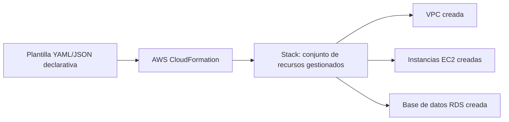
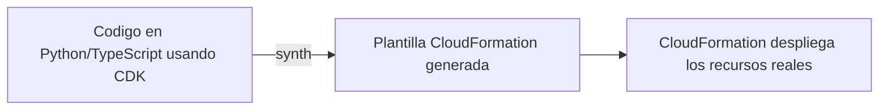
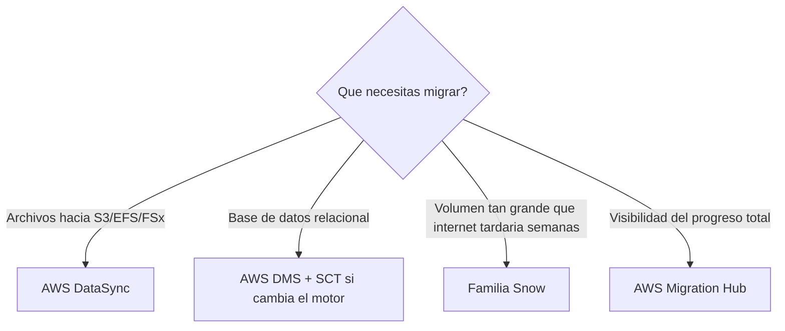
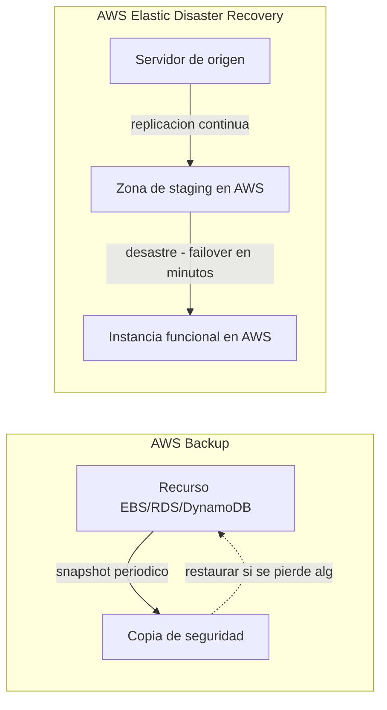

# AWS Certified Cloud Practitioner (CLF-C02)

**PARTE 13 — Servicios Adicionales Importantes para el Examen**

*El capítulo final de contenido nuevo: servicios de automatización, gobernanza y migración que completan el panorama que el examen espera que conozcas, aunque su profundidad requerida sea menor que la de los capítulos centrales.*

## 1. Objetivos del capítulo

### ¿Qué aprenderé?

- Qué es Infrastructure as Code y cómo lo implementan CloudFormation y CDK.
- Cómo AWS Organizations y Control Tower ayudan a gobernar múltiples cuentas de AWS.
- Qué es AWS Backup y cómo centraliza la gestión de copias de seguridad.
- Las herramientas de migración: Migration Hub, DMS, DataSync y la familia Snow.
- Qué es AWS Elastic Disaster Recovery y cuándo se necesita.

### ¿Por qué es importante?

Estos servicios no suelen ser el centro de una arquitectura, pero aparecen constantemente en escenarios reales de migración, gobernanza y automatización — precisamente los momentos en que una organización pasa de 'probar AWS' a 'operar AWS a escala'. El examen los incluye porque reflejan decisiones que un Cloud Practitioner necesita reconocer, aunque no vaya a implementarlas él mismo en el día a día.

### ¿Cómo aparece en el examen?

Suelen aparecer como preguntas de reconocimiento de servicio: un escenario describe una necesidad específica (migrar datos masivos, automatizar el aprovisionamiento de infraestructura, replicar servidores para DR) y debes identificar cuál de estos servicios encaja, frecuentemente entre opciones que sistemáticamente confunden migración de archivos con migración de bases de datos, o backup con disaster recovery.

## 2. Teoría

### 2.1 AWS CloudFormation e Infrastructure as Code

CloudFormation permite describir la infraestructura deseada en archivos de texto declarativos (plantillas en formato JSON o YAML): qué instancias EC2, qué VPC, qué bases de datos, con qué configuración exacta. Al 'desplegar' una plantilla, CloudFormation crea (o actualiza, o elimina) automáticamente todos los recursos descritos, en el orden correcto según sus dependencias, tratando el conjunto como una unidad llamada 'stack'.

El beneficio central es Infrastructure as Code: la infraestructura se vuelve versionable (en Git, como cualquier código), revisable (pull requests), reutilizable (la misma plantilla despliega un entorno de desarrollo idéntico a producción) y reproducible (recrear un entorno completo de forma consistente, sin depender de pasos manuales propensos a error humano).

### 2.2 AWS Cloud Development Kit (CDK)

CDK permite definir esa misma infraestructura usando lenguajes de programación de propósito general (TypeScript, Python, Java, C#, Go) en vez de YAML/JSON directamente, aprovechando bucles, condicionales, funciones y clases reutilizables del lenguaje elegido. El código escrito con CDK se 'sintetiza' internamente en plantillas estándar de CloudFormation, que es quien realmente aprovisiona los recursos — CDK es una capa de abstracción sobre CloudFormation, no un reemplazo de su motor de despliegue.

### 2.3 AWS Organizations y AWS Control Tower

AWS Organizations (ver también Parte 11) permite gestionar múltiples cuentas de AWS de forma centralizada, con facturación consolidada y Service Control Policies. AWS Control Tower se construye ENCIMA de Organizations, automatizando la creación de una 'zona de aterrizaje' (landing zone) multi-cuenta con buenas prácticas de gobernanza preconfiguradas desde el inicio (guardrails de seguridad, estructura de cuentas recomendada), simplificando enormemente el proceso de crear nuevas cuentas que ya cumplen con esas políticas desde el primer día, en vez de configurar cada barrera de gobernanza manualmente.

### 2.4 AWS Backup

Antes de AWS Backup, proteger los datos de una arquitectura significaba configurar snapshots o backups de forma independiente en cada servicio (snapshots de EBS, backups automáticos de RDS, exports de DynamoDB, etc.), cada uno con su propia interfaz y configuración. AWS Backup centraliza esa gestión: se definen políticas de backup (frecuencia, ventana horaria, periodo de retención) una sola vez, y se aplican consistentemente a través de múltiples tipos de recursos compatibles (EBS, RDS, DynamoDB, EFS, FSx, y más), desde una única consola.

### 2.5 Herramientas de migración: Migration Hub, DMS y DataSync

#### AWS Migration Hub

Ofrece un panel centralizado para rastrear el progreso de migraciones de aplicaciones hacia AWS, especialmente útil en proyectos grandes con muchos servidores/aplicaciones y múltiples herramientas de migración involucradas, consolidando el estado de avance de cada componente en un solo lugar.

#### AWS Database Migration Service (DMS)

Migra bases de datos hacia AWS (o entre servicios de AWS), manteniendo la base de datos de origen operativa durante el proceso (minimizando el tiempo de inactividad de la aplicación). Soporta migraciones homogéneas (mismo motor) y heterogéneas (motores distintos, por ejemplo Oracle a Aurora PostgreSQL). En migraciones heterogéneas, se combina con AWS Schema Conversion Tool (SCT), que convierte el esquema y código de la base de datos (procedimientos almacenados, vistas) a la sintaxis del motor de destino — DMS mueve los DATOS, SCT convierte el ESQUEMA/CÓDIGO.

#### AWS DataSync

Automatiza y acelera la transferencia y sincronización de datos de ARCHIVOS (no bases de datos relacionales) entre sistemas de almacenamiento on-premises (NFS/SMB) u otras nubes, y servicios de almacenamiento de AWS (S3, EFS, FSx), incluyendo validación de integridad y programación de sincronizaciones recurrentes.

### 2.6 La familia Snow: transferencia física de datos masivos

Cuando el volumen de datos a transferir es tan grande que incluso una buena conexión a internet tardaría semanas o meses, AWS ofrece dispositivos físicos que se envían al cliente para cargar los datos localmente y enviarlos de vuelta a AWS:

- AWS Snowball: dispositivo físico robusto para transferencia masiva de datos (decenas de terabytes por dispositivo), evitando el cuello de botella de la conexión a internet.
- AWS Snowball Edge: añade capacidad de cómputo local al dispositivo (puede correr instancias EC2 o funciones Lambda directamente en él), útil para procesar datos en el borde (edge computing) en ubicaciones con conectividad limitada o inexistente, además de transferir datos.
- AWS Snowmobile: para volúmenes verdaderamente masivos (hasta exabytes), un contenedor de transporte completo (literalmente transportado en camión) para centros de datos enteros que necesitan migrar hacia AWS.

### 2.7 AWS Elastic Disaster Recovery (DRS)

DRS replica continuamente servidores (físicos, virtuales, o de otras nubes) hacia una zona de staging de bajo costo en AWS. En caso de un desastre en el entorno de origen, permite lanzar instancias completamente funcionales en AWS en cuestión de minutos, minimizando tanto el RTO (Recovery Time Objective, tiempo hasta la recuperación) como el RPO (Recovery Point Objective, cantidad de datos que se podrían perder desde el último punto replicado).

> **DRS vs Backup, la diferencia clave:** AWS Backup protege datos mediante copias periódicas (snapshots) para restaurar si algo se pierde o corrompe. AWS Elastic Disaster Recovery replica servidores COMPLETOS de forma continua para poder levantarlos funcionando en AWS ante un desastre del entorno de origen completo — resuelven problemas relacionados pero distintos.

| Servicio | Qué mueve/protege | Caso de uso principal |
| --- | --- | --- |
| CloudFormation / CDK | Definiciones de infraestructura (código) | Aprovisionar infraestructura de forma repetible y versionada |
| Control Tower | Estructura de gobernanza multi-cuenta | Crear cuentas nuevas con buenas prácticas preconfiguradas |
| AWS Backup | Copias de seguridad de recursos existentes | Centralizar backups de EBS, RDS, DynamoDB, EFS, etc. |
| Migration Hub | Visibilidad del progreso de migración | Rastrear una migración grande con múltiples herramientas |
| DMS (+ SCT) | Datos (y esquema, con SCT) de bases de datos | Migrar bases de datos, incluso entre motores distintos |
| DataSync | Archivos entre almacenamiento on-premises y AWS | Sincronizar/migrar grandes volúmenes de archivos |
| Familia Snow | Datos masivos vía dispositivo físico | Transferencias tan grandes que internet tardaría semanas |
| Elastic DR | Servidores completos, replicados continuamente | Recuperación ante desastres con RTO/RPO mínimos |

## 3. Ejemplos

### Ejemplo empresarial

Un banco que opera en 8 países usa AWS Control Tower para crear cada nueva cuenta de país con las mismas barreras de seguridad y estructura de red preconfiguradas desde el primer día, y usa AWS CloudFormation para desplegar exactamente la misma arquitectura base de red y seguridad en cada una de esas cuentas, garantizando consistencia entre países.

### Ejemplo de startup

Una startup que crece rápido adopta AWS CDK en TypeScript para definir toda su infraestructura como código desde el principio, aprovechando que su equipo de desarrollo ya domina TypeScript, evitando la curva de aprendizaje adicional de escribir YAML de CloudFormation directamente.

### Ejemplo personal

Un desarrollador que gestiona los laboratorios de este mismo curso decide, al llegar a este capítulo, reescribir la VPC del laboratorio de la Parte 7 como una plantilla simple de CloudFormation, para poder recrearla y eliminarla de forma consistente cada vez que practique, en vez de repetir manualmente los mismos clics.

### Caso real de migración combinada

Una empresa de manufactura migra su ERP: usa AWS Snowball para transferir 150 TB de archivos históricos de planos y documentos técnicos, AWS DMS junto con SCT para migrar su base de datos SQL Server hacia Amazon RDS for SQL Server (migración homogénea, sin necesidad de convertir esquema), y AWS Migration Hub para dar seguimiento centralizado a ambos frentes del proyecto ante la dirección de la empresa.

## 4. Diagramas

Diagramas en formato Mermaid — pégalos en mermaid.live o cualquier visor compatible para verlos renderizados.

### 4.1 CloudFormation: de plantilla a infraestructura real



### 4.2 CDK sobre CloudFormation



### 4.3 Herramientas de migración según el tipo de dato



### 4.4 Backup vs Disaster Recovery



## 5. Laboratorios

### Laboratorio 1: Desplegar un stack simple con AWS CloudFormation

Costo: cubierto por Free Tier si usas una instancia t2.micro/t3.micro; CloudFormation en sí no tiene costo adicional por usarlo, solo pagas por los recursos que crea.

1. Ve a la consola de CloudFormation → Create stack → With new resources.
2. Elige 'Create template in Designer' o simplemente pega la siguiente plantilla YAML mínima en la opción de editor de texto:
```
AWSTemplateFormatVersion: '2010-09-09'
Description: Bucket S3 simple de laboratorio
Resources:
  MiBucketLab:
    Type: AWS::S3::Bucket
    Properties:
      BucketName: !Sub 'mi-bucket-cfn-lab-${AWS::AccountId}'
Outputs:
  NombreBucket:
    Value: !Ref MiBucketLab
```

3. Sube esta plantilla como archivo, o pégala directamente en el editor según la opción que elegiste.
4. Nombra el stack (ej. 'mi-primer-stack') y avanza por las opciones por defecto.
5. Revisa el resumen y haz clic en 'Submit' para crear el stack.
6. Observa la pestaña 'Events' mientras CloudFormation crea el recurso, y espera a que el estado cambie a 'CREATE_COMPLETE'.
7. Ve a la pestaña 'Resources' para confirmar que el bucket S3 fue creado, y a 'Outputs' para ver el nombre exacto generado.
> **Cómo eliminar los recursos:** Ve a CloudFormation → Stacks → selecciona tu stack → Delete. Esto elimina automáticamente TODOS los recursos que el stack creó (en este caso, el bucket S3), de forma mucho más simple que eliminarlos uno por uno manualmente — esta es precisamente una de las grandes ventajas de Infrastructure as Code.

### Laboratorio 2: Explorar AWS Backup configurando un plan de backup simple

Costo: el almacenamiento de backups tiene un costo por GB (similar al de S3), pero para un recurso pequeño de laboratorio el costo es mínimo (fracciones de centavo); AWS Backup en sí no tiene costo adicional por usar la consola.

8. Si no tienes un recurso compatible activo, crea un volumen EBS pequeño de prueba (ver laboratorio de la Parte 5) o usa una tabla DynamoDB existente de un laboratorio anterior.
9. Ve a la consola de AWS Backup → Backup plans → Create Backup plan.
10. Elige 'Start with a template' y selecciona un template simple como 'Daily-35day-Retention'.
11. Revisa la configuración generada: frecuencia diaria, ventana horaria, y 35 días de retención por defecto (puedes ajustar la retención a un valor más corto para el laboratorio, como 7 días).
12. Crea el plan de backup.
13. Ve a 'Resource assignments' dentro del plan → Assign resources, y selecciona el recurso de prueba (tu volumen EBS o tabla DynamoDB) para asignarlo a este plan.
14. (Opcional) Ve a 'Backup vaults' → tu vault por defecto → 'Create on-demand backup' para forzar un backup inmediato de prueba, en vez de esperar a la próxima ejecución programada.
> **Cómo eliminar los recursos:** Elimina los backups creados desde 'Backup vaults' → selecciona el vault → elimina los recovery points individuales, después elimina el plan de backup desde 'Backup plans', y finalmente elimina el recurso de prueba original (volumen EBS o tabla DynamoDB) si ya no lo necesitas.

## 6. Errores comunes

- Confundir AWS Backup (copias de seguridad periódicas de recursos, para restaurar si se pierde algo) con AWS Elastic Disaster Recovery (replicación continua de servidores completos, para conmutar en caso de desastre del entorno de origen).
- Confundir AWS DataSync (transferencia de ARCHIVOS) con AWS DMS (migración de BASES DE DATOS relacionales) — son servicios para tipos de datos fundamentalmente distintos.
- Elegir la familia Snow para volúmenes pequeños de datos donde una transferencia normal por internet sería más rápida y simple — Snow tiene sentido quando el volumen es tan grande que la transferencia por red tardaría semanas o meses.
- Pensar que AWS CDK reemplaza a CloudFormation — CDK es una capa de abstracción que GENERA plantillas de CloudFormation, el motor de despliegue subyacente sigue siendo CloudFormation.
- Olvidar que Control Tower se construye SOBRE AWS Organizations, no es un servicio completamente independiente de gestión multi-cuenta.
- No eliminar un stack completo de CloudFormation después de un laboratorio (dejando recursos huérfanos), cuando eliminar el stack elimina automáticamente todos sus recursos asociados de forma limpia.

## 7. Comparaciones

### CloudFormation vs CDK

CloudFormation = declarativo, YAML/JSON directo, sin lógica de programación. CDK = imperativo/programático, usa lenguajes de propósito general con bucles/condicionales/abstracciones, pero sintetiza hacia CloudFormation como motor de despliegue final — no son alternativas excluyentes, CDK se apoya en CloudFormation.

### AWS Backup vs Elastic Disaster Recovery

Backup = copias periódicas de recursos individuales, para restaurar datos perdidos o corruptos. DRS = replicación continua de servidores completos, para conmutar rápidamente ante un desastre que afecta al entorno de origen completo. Backup responde '¿perdí este dato, puedo recuperarlo?'; DRS responde '¿mi sitio completo cayó, puedo seguir operando desde AWS ya mismo?'.

### DataSync vs DMS vs familia Snow

DataSync = archivos, transferencia por red, on-premises ↔ AWS. DMS (+SCT) = bases de datos relacionales, con la fuente permaneciendo operativa durante la migración. Familia Snow = cualquier tipo de dato, pero transferido físicamente cuando el volumen hace inviable la transferencia por red.

## 8. Preguntas tipo examen

20 preguntas de opción múltiple, mismo estilo y dificultad que el examen oficial CLF-C02.

**Pregunta 1.** ¿Qué es AWS CloudFormation?

A) Un servicio de monitoreo de infraestructura

**B)** **Un servicio que permite definir y aprovisionar infraestructura de AWS de forma declarativa usando archivos de texto (JSON o YAML), tratando la infraestructura como código**

C) Un tipo de instancia EC2

D) Un servicio exclusivo de backup

**Respuesta correcta: B.** 

*AWS CloudFormation permite describir la infraestructura deseada (instancias EC2, VPCs, bases de datos, etc.) en archivos de texto declarativos (plantillas en JSON o YAML), y luego aprovisiona y gestiona esos recursos automáticamente, permitiendo versionar, reutilizar y reproducir infraestructura de forma consistente (Infrastructure as Code).*

**Pregunta 2.** ¿Qué es el AWS Cloud Development Kit (CDK)?

A) Un servicio de bases de datos NoSQL

**B)** **Un framework que permite definir infraestructura de AWS usando lenguajes de programación de propósito general (como Python, TypeScript o Java), que luego se sintetiza en plantillas de CloudFormation**

C) Un tipo de instancia EC2 optimizada para desarrollo

D) Un servicio exclusivo de testing de software

**Respuesta correcta: B.** 

*AWS CDK permite a los desarrolladores definir infraestructura usando lenguajes de programación familiares (Python, TypeScript, Java, C#, entre otros) en vez de JSON/YAML puro, aprovechando bucles, condicionales y abstracciones reutilizables del lenguaje; internamente, el CDK sintetiza esas definiciones en plantillas estándar de CloudFormation para el aprovisionamiento real.*

**Pregunta 3.** Una empresa con docenas de cuentas de AWS quiere establecer una zona de aterrizaje (landing zone) con buenas prácticas de gobernanza preconfiguradas desde el inicio, simplificando la creación de nuevas cuentas que ya cumplan con esas políticas. ¿Qué servicio de AWS está diseñado específicamente para esto?

**A)** **AWS Control Tower**

B) AWS CloudFormation exclusivamente

C) AWS Backup

D) AWS DataSync

**Respuesta correcta: A.** 

*AWS Control Tower automatiza la configuración de una zona de aterrizaje (landing zone) multi-cuenta con buenas prácticas de gobernanza preconfiguradas, simplificando la creación de nuevas cuentas de AWS que ya cumplen con las políticas y barreras de seguridad (guardrails) definidas centralmente, construido sobre AWS Organizations.*

**Pregunta 4.** ¿Qué problema resuelve AWS Backup?

**A)** **Centralizar y automatizar la gestión de copias de seguridad (backups) de múltiples servicios de AWS (EBS, RDS, DynamoDB, EFS, entre otros) desde un único lugar, con políticas de retención definidas centralmente**

B) Migrar bases de datos entre distintos motores

C) Transferir grandes volúmenes de datos físicamente mediante dispositivos

D) Orquestar despliegues de infraestructura como código

**Respuesta correcta: A.** 

*AWS Backup centraliza y automatiza la gestión de copias de seguridad de múltiples servicios de AWS (en vez de configurar snapshots por separado en cada servicio), permitiendo definir políticas de backup (frecuencia, retención) de forma centralizada y aplicarlas consistentemente a través de distintos tipos de recursos.*

**Pregunta 5.** Una empresa está evaluando qué aplicaciones y servidores on-premises son candidatos adecuados para migrar a la nube, y necesita una herramienta que le ayude a rastrear el progreso de una migración a gran escala con muchos servidores. ¿Qué servicio de AWS está diseñado para este propósito?

**A)** **AWS Migration Hub**

B) AWS Snowball

C) Amazon Neptune

D) AWS Shield

**Respuesta correcta: A.** 

*AWS Migration Hub ofrece un lugar centralizado para rastrear el progreso de migraciones de aplicaciones hacia AWS a través de múltiples herramientas de migración y ubicaciones, dando visibilidad consolidada del estado de cada servidor o aplicación durante un proyecto de migración a gran escala.*

**Pregunta 6.** ¿Qué es AWS Database Migration Service (DMS)?

A) Un servicio de backup exclusivo para RDS

**B)** **Un servicio que ayuda a migrar bases de datos hacia AWS de forma segura, permitiendo incluso migrar entre motores de base de datos distintos, con la base de datos de origen permaneciendo operativa durante la migración**

C) Un tipo de instancia EC2 optimizada para bases de datos

D) Un servicio de análisis de datos

**Respuesta correcta: B.** 

*AWS DMS facilita la migración de bases de datos hacia AWS (o entre servicios de AWS), soportando tanto migraciones homogéneas (mismo motor, por ejemplo Oracle a Oracle) como heterogéneas (motores distintos, por ejemplo Oracle a Aurora PostgreSQL, usando además AWS Schema Conversion Tool), manteniendo la base de datos de origen operativa y sincronizada durante el proceso.*

**Pregunta 7.** ¿Qué problema resuelve AWS DataSync?

**A)** **Migrar y sincronizar grandes volúmenes de datos entre sistemas de almacenamiento on-premises (o de otras nubes) y servicios de almacenamiento de AWS, de forma rápida y automatizada**

B) Migrar bases de datos relacionales entre motores distintos

C) Orquestar despliegues de infraestructura como código

D) Centralizar la gestión de backups de múltiples servicios

**Respuesta correcta: A.** 

*AWS DataSync automatiza y acelera la transferencia de datos entre sistemas de almacenamiento locales (NFS, SMB) o de otras nubes, y los servicios de almacenamiento de AWS (S3, EFS, FSx), gestionando la sincronización, validación de integridad de los datos, y programación de transferencias recurrentes.*

**Pregunta 8.** Una empresa necesita transferir 200 TB de datos históricos desde su data center hacia AWS, y su conexión a internet disponible tardaría varias semanas en completar esa transferencia. ¿Qué servicio de la familia Snow es el más adecuado para este volumen específico?

A) AWS DataSync exclusivamente, sin usar ningún dispositivo físico

**B)** **AWS Snowball (o Snowball Edge, según el volumen y necesidad de cómputo local)**

C) AWS Database Migration Service

D) AWS Migration Hub exclusivamente

**Respuesta correcta: B.** 

*AWS Snowball es un dispositivo físico de transferencia masiva de datos que AWS envía al cliente: se cargan los datos localmente (evitando el cuello de botella de una conexión de internet lenta) y se envía de vuelta a AWS para su ingesta. Para volúmenes aún mayores existe AWS Snowmobile (un contenedor completo transportado en camión), y para necesidades de cómputo en el borde además de transferencia, Snowball Edge.*

**Pregunta 9.** ¿Qué distingue a AWS Snowball Edge de un dispositivo AWS Snowball estándar?

A) No hay diferencia real entre ambos

**B)** **Snowball Edge añade capacidad de cómputo local (puede correr instancias EC2 o funciones Lambda directamente en el dispositivo) además de la transferencia de datos, útil para procesar datos en ubicaciones con conectividad limitada**

C) Snowball Edge solo puede usarse para bases de datos

D) Snowball Edge es exclusivamente para transferencias menores a 1 GB

**Respuesta correcta: B.** 

*AWS Snowball Edge añade capacidad de cómputo local al dispositivo (puede ejecutar instancias EC2 o funciones Lambda directamente en el propio dispositivo), útil en escenarios donde se necesita procesar datos en el borde (edge computing) en ubicaciones remotas con conectividad limitada o inexistente, además de la transferencia física de datos.*

**Pregunta 10.** ¿Qué servicio de AWS proporciona recuperación ante desastres (disaster recovery) para servidores físicos, virtuales o en la nube, replicando continuamente esos servidores hacia AWS para poder recuperarlos rápidamente en caso de un desastre?

**A)** **AWS Elastic Disaster Recovery (DRS)**

B) AWS Backup exclusivamente

C) AWS Snowball

D) AWS Migration Hub

**Respuesta correcta: A.** 

*AWS Elastic Disaster Recovery (DRS) replica continuamente servidores (físicos, virtuales, o de otras nubes) hacia una zona de staging de bajo costo en AWS, permitiendo lanzar instancias completamente funcionales en AWS en minutos en caso de un desastre en el entorno de origen, minimizando el tiempo de recuperación (RTO) y la pérdida de datos (RPO).*

**Pregunta 11.** ¿Qué ventaja ofrece AWS CDK frente a escribir plantillas de CloudFormation directamente en YAML o JSON para infraestructura compleja?

A) CDK elimina completamente la necesidad de CloudFormation

**B)** **CDK permite usar lenguajes de programación de propósito general con bucles, condicionales, funciones reutilizables y tipado, facilitando la construcción de infraestructura compleja y reutilizable, que luego se sintetiza en CloudFormation**

C) CDK solo funciona para bases de datos

D) CDK es más lento que escribir YAML manualmente en cualquier escenario

**Respuesta correcta: B.** 

*CDK aprovecha las capacidades completas de un lenguaje de programación (bucles, condicionales, abstracciones, tipado estático en algunos lenguajes, testing) para definir infraestructura de forma más expresiva y reutilizable que escribir YAML/JSON plano, especialmente útil en infraestructuras grandes o repetitivas — pero sigue apoyándose en CloudFormation como motor de aprovisionamiento subyacente.*

**Pregunta 12.** Una organización usa AWS Control Tower para gestionar la creación de nuevas cuentas de AWS. ¿Qué servicio subyacente utiliza Control Tower para la gestión multi-cuenta y facturación consolidada?

**A)** **AWS Organizations**

B) AWS Backup

C) AWS Snowball

D) Amazon Route 53

**Respuesta correcta: A.** 

*AWS Control Tower se construye sobre AWS Organizations (ver Parte 11), añadiendo automatización adicional para el aprovisionamiento de cuentas con barreras de gobernanza (guardrails) preconfiguradas, pero la gestión multi-cuenta y facturación consolidada subyacente sigue siendo proporcionada por Organizations.*

**Pregunta 13.** ¿Qué diferencia principal existe entre AWS DMS y AWS SCT (Schema Conversion Tool), cuando se usan juntos en una migración heterogénea de base de datos (por ejemplo, de Oracle a Aurora PostgreSQL)?

A) Son el mismo servicio con nombres distintos

**B)** **SCT convierte el esquema y el código de la base de datos de origen (procedimientos almacenados, vistas) a la sintaxis del motor de destino; DMS migra y sincroniza los DATOS en sí desde el origen hacia el destino**

C) DMS convierte esquemas; SCT migra datos

D) Ninguno de los dos se usa para migraciones entre motores distintos

**Respuesta correcta: B.** 

*En una migración heterogénea (entre motores de base de datos distintos), AWS Schema Conversion Tool (SCT) se encarga de convertir el esquema, procedimientos almacenados y otros objetos de código de la base de datos de origen a la sintaxis compatible del motor de destino, mientras que AWS DMS se encarga de migrar y mantener sincronizados los DATOS reales entre el origen y el destino durante el proceso.*

**Pregunta 14.** ¿Qué tipo de recursos puede proteger AWS Backup de forma centralizada?

A) Únicamente instancias EC2, sin ningún otro servicio

**B)** **Múltiples tipos de recursos como volúmenes EBS, bases de datos RDS, tablas DynamoDB, sistemas de archivos EFS, y otros servicios compatibles, todo desde una consola centralizada**

C) Únicamente buckets de S3

D) Únicamente configuraciones de IAM

**Respuesta correcta: B.** 

*AWS Backup centraliza la gestión de copias de seguridad de múltiples tipos de recursos compatibles (EBS, RDS, DynamoDB, EFS, FSx, entre otros), evitando la necesidad de configurar snapshots o backups de forma separada e inconsistente en cada servicio individual.*

**Pregunta 15.** Una empresa está migrando una aplicación monolítica compleja y quiere primero entender qué componentes existen, sus dependencias, y el estado de avance de la migración de cada uno, consolidando información proveniente de distintas herramientas de migración usadas por diferentes equipos. ¿Qué servicio de AWS ofrece esa visibilidad centralizada?

**A)** **AWS Migration Hub**

B) AWS Elastic Disaster Recovery

C) AWS Snowmobile

D) Amazon Neptune

**Respuesta correcta: A.** 

*AWS Migration Hub está diseñado precisamente para dar visibilidad centralizada del progreso de migraciones complejas que involucran múltiples aplicaciones, servidores y equipos, consolidando el estado reportado por distintas herramientas de migración (como Application Discovery Service, DMS, y otras) en un único panel.*

**Pregunta 16.** ¿Cuál de los siguientes NO sería un caso de uso típico de AWS DataSync?

A) Migrar un gran volumen de archivos desde un servidor NFS on-premises hacia Amazon S3

B) Sincronizar de forma recurrente datos entre un sistema de archivos EFS y un almacenamiento on-premises para respaldo continuo

**C)** **Migrar el esquema y los datos de una base de datos Oracle hacia Amazon Aurora**

D) Transferir datos entre un bucket S3 y un sistema de archivos FSx for Windows

**Respuesta correcta: C.** 

*Migrar el esquema y los datos de una base de datos relacional (como Oracle hacia Aurora) es el caso de uso específico de AWS DMS (y AWS SCT para el esquema), no de AWS DataSync, que está enfocado en transferencia y sincronización de datos de sistemas de ARCHIVOS (NFS/SMB) hacia/entre servicios de almacenamiento de AWS, no en migración de bases de datos relacionales.*

**Pregunta 17.** ¿Qué beneficio clave ofrece 'Infrastructure as Code' (infraestructura como código), como la que permite CloudFormation, frente a crear recursos manualmente clic a clic en la consola?

A) Ningún beneficio real, ambos enfoques son equivalentes en la práctica

**B)** **Permite versionar, revisar, reutilizar y reproducir la infraestructura de forma consistente y automatizada, reduciendo errores humanos y facilitando la replicación de entornos idénticos**

C) Infrastructure as Code solo funciona para bases de datos

D) Elimina completamente la necesidad de entender los servicios de AWS subyacentes

**Respuesta correcta: B.** 

*Infrastructure as Code permite tratar las definiciones de infraestructura como cualquier otro código fuente: versionarlas en un repositorio, revisarlas mediante pull requests, reutilizarlas como plantillas para nuevos entornos, y reproducir exactamente el mismo entorno (desarrollo, staging, producción) de forma consistente, reduciendo significativamente el riesgo de errores humanos en configuraciones manuales repetitivas.*

**Pregunta 18.** Una empresa con un data center que sufre un desastre natural necesita conmutar sus servidores críticos hacia AWS en cuestión de minutos, con la menor pérdida de datos posible, habiendo preparado previamente la replicación continua de esos servidores. ¿Qué servicio de AWS está diseñado exactamente para este escenario?

**A)** **AWS Elastic Disaster Recovery (DRS)**

B) AWS Snowball

C) AWS CDK

D) AWS Migration Hub exclusivamente

**Respuesta correcta: A.** 

*AWS Elastic Disaster Recovery está diseñado exactamente para este escenario: replicación continua de servidores hacia AWS con anterioridad al desastre, permitiendo una conmutación (failover) rápida hacia instancias completamente funcionales en AWS en cuestión de minutos cuando ocurre el evento, minimizando tanto el tiempo de inactividad (RTO) como la pérdida de datos (RPO).*

**Pregunta 19.** ¿Qué combinación de servicios describiría mejor una estrategia de migración de una gran empresa que necesita: (1) mover 500 TB de archivos históricos, (2) migrar su base de datos Oracle a Aurora, y (3) tener visibilidad centralizada del progreso completo?

**A)** **AWS Snowball para los archivos, AWS DMS (con SCT) para la base de datos, y AWS Migration Hub para la visibilidad centralizada**

B) Usar únicamente AWS CloudFormation para todo el proceso

C) Usar únicamente AWS Backup para todo el proceso

D) Usar únicamente Amazon Route 53 para todo el proceso

**Respuesta correcta: A.** 

*Esta es una combinación realista y típica: AWS Snowball para la transferencia masiva de archivos históricos (evitando semanas de transferencia por internet), AWS DMS junto con AWS SCT para migrar la base de datos entre motores distintos, y AWS Migration Hub para consolidar y dar visibilidad centralizada del progreso de ambos frentes de migración simultáneamente.*

## 9. Resumen

### Resumen ejecutivo

CloudFormation permite definir infraestructura como código de forma declarativa (YAML/JSON); CDK añade una capa de lenguajes de programación sobre ese mismo motor. Control Tower automatiza la gobernanza multi-cuenta construyéndose sobre AWS Organizations. AWS Backup centraliza copias de seguridad de múltiples servicios. Para migraciones: Migration Hub da visibilidad centralizada, DMS (con SCT) migra bases de datos incluso entre motores distintos, DataSync sincroniza archivos, y la familia Snow transfiere físicamente volúmenes de datos demasiado grandes para la red. AWS Elastic Disaster Recovery replica servidores completos de forma continua para recuperación ante desastres con RTO/RPO mínimos, distinto de los backups periódicos de recursos individuales.

### Conceptos clave (memorizar)

- **CloudFormation = declarativo (YAML/JSON). CDK = programático, sintetiza hacia CloudFormation.**
- **Control Tower se construye SOBRE AWS Organizations, no la reemplaza.**
- **AWS Backup = copias periódicas de recursos. Elastic DR = replicación continua de servidores completos.**
- **DataSync = archivos. DMS(+SCT) = bases de datos (SCT convierte esquema, DMS mueve datos).**
- **Familia Snow = transferencia física cuando el volumen hace inviable la red (Snowball, Snowball Edge, Snowmobile).**

### Lo que normalmente pregunta AWS

Escenarios de migración que describen el tipo de dato (archivos vs bases de datos vs volumen masivo) esperando que elijas la herramienta correcta, y escenarios que piden distinguir un backup periódico de una estrategia de disaster recovery con replicación continua.

## Recursos externos para este capítulo

### Documentación oficial

- AWS CloudFormation User Guide — docs.aws.amazon.com/cloudformation
- AWS CDK Developer Guide — docs.aws.amazon.com/cdk
- AWS Control Tower User Guide — docs.aws.amazon.com/controltower
- AWS Backup Developer Guide — docs.aws.amazon.com/aws-backup
- AWS Database Migration Service — docs.aws.amazon.com/dms
- AWS DataSync User Guide — docs.aws.amazon.com/datasync
- AWS Snow Family — aws.amazon.com/snow
- AWS Elastic Disaster Recovery — docs.aws.amazon.com/drs

### Videos recomendados

- AWS Skill Builder: módulos de migración y de Infrastructure as Code dentro de 'Cloud Practitioner Essentials'.
- Stephane Maarek: secciones de CloudFormation, familia Snow y servicios de migración de su curso CLF-C02.
- AWS re:Invent: charlas sobre estrategias de migración a gran escala.

### Laboratorios adicionales

- AWS Skill Builder Labs: 'Introduction to AWS CloudFormation'.
- AWS Workshops: 'CDK Workshop' (cdkworkshop.com, oficial de AWS).